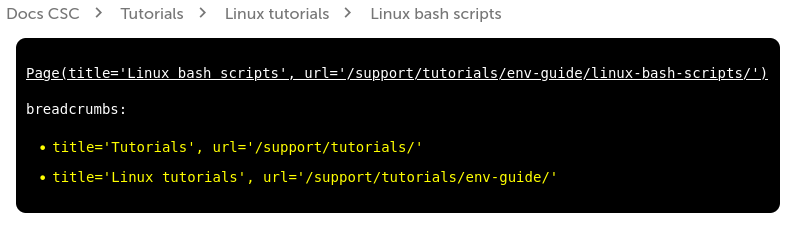

# Frequently asked questions

The [contributing guide](CONTRIBUTING.md) outlines the basic steps of starting contributing to Docs CSC through pull requests. This page highlights in more detail common questions and pitfalls you may encounter during the process.

- [Frequently asked questions](#frequently-asked-questions)
  - [How to include my new page in the navigation panel?](#how-to-include-my-new-page-in-the-navigation-panel)
    - [SectionPage](#sectionpage)
  - [How to add an image?](#how-to-add-an-image)
  - [How to embed an external video?](#how-to-embed-an-external-video)
  - [How to add links?](#how-to-add-links)
  - [My PR did not pass the tests, what to do?](#my-pr-did-not-pass-the-tests-what-to-do)
  - [How can I preview my edits?](#how-can-i-preview-my-edits)
    - [Using the preview feature for active branches hosted on Rahti](#using-the-preview-feature-for-active-branches-hosted-on-rahti)
    - [Locally using the MkDocs tool](#locally-using-the-mkdocs-tool)
      - [Tests](#tests)
      - [Scripts](#scripts)
      - [Breadcrumbs debugging](#breadcrumbs-debugging)
  - [How and who should I ask to review my PR?](#how-and-who-should-i-ask-to-review-my-pr)
  - [I was asked to review a PR, what should I do?](#i-was-asked-to-review-a-pr-what-should-i-do)
  - [When reviewing a PR, how to leave comments/suggest changes so that they appear as a diff in the conversation tab?](#when-reviewing-a-pr-how-to-leave-commentssuggest-changes-so-that-they-appear-as-a-diff-in-the-conversation-tab)
  - [How do I add an entry to the "What's new" section](#how-do-i-add-an-entry-to-the-whats-new-section)
  - [Which Markdown features/extensions are available?](#which-markdown-featuresextensions-are-available)
  - [How do I add definitions to the glossary / display definitions as tooltips?](#how-do-i-add-definitions-to-the-glossary--display-definitions-as-tooltips)
  - [How do I use the announcement bar?](#how-do-i-use-the-announcement-bar)
  - [How do I add a license tag to an application page?](#how-do-I-add-a-license-tag-to-an-application-page)
  - [How do I tag an application as available under a web interface?](#how-do-i-tag-an-application-as-available-under-a-web-interface)
  - [How do I make footnotes?](#how-do-i-make-footnotes)
  - [How do I improve search results?](#how-do-i-improve-search-results)


## How to include my new page in the navigation panel?

If you add a new page that you want to appear in the left-hand-side navigation panel, you need to edit the `mkdocs.yml` file in the root of the repository. Items appearing in the navigation panel are listed in this file as key/value pairs under the `nav:` key, for example:

```yaml
nav:
  - Home: index.md
  - Accounts:
    - accounts/index.md
    - Creating a new user account: accounts/how-to-create-new-user-account.md
    - Changing your password: accounts/how-to-change-password.md
     ...
```

To include your page in the navigation, add a new key/value pair corresponding to a title followed by the path to your file, for example `- My title: path/to/my-page.md`. Make sure that you include these under the correct section, i.e. mind the indentation. Also, don't refer to the same page twice in `mkdocs.yml` as this will break things (an exception to this are the [SectionPages](#sectionpage)).

If you intend to make substantial changes to the navigation menu, please communicate this for example in the RC-channel #docs.csc.fi and/or #research.csc.fi as big changes may break some links used elsewhere.

### SectionPage

The first item under 'Accounts' above is a so-called SectionPage. It is a hybrid of Section and
Page introduced by a plugin we use called
[mkdocs-section-index](https://github.com/oprypin/mkdocs-section-index)
that makes the sections in the navigation sidebar clickable. Every section should have a
SectionPage that acts as the index for the section. The breadcrumbs navigation on the top of every
page relies on the existence of a SectionPage. Without it, a level of navigation will be missing
its breadcrumb. (See [Breadcrumbs debugging](#breadcrumbs-debugging).) SectionPage for a section
is defined in [mkdocs.yml](mkdocs.yml):

```yaml
    - Section:                         # Section
      - path/to/file.md                # SectionPage
      - Page: path/to/another-file.md  # Page
```

If an existing page is selected as the SectionPage for a section like so,

```yaml
    - Section:
      - path/to/file.md
      - Page: path/to/file.md
```

the page in question will be opened and highlighted when clicking on the section name in the
sidebar.

## How to add an image?

* Add the image you want to include to the `/docs/img/` directory.
  * If the image is really large, publish it in Allas in the `docs-files` bucket: `a-publish my-image.png -b docs-files` (write access with project 2001659)
* Include the image in your page using the markdown syntax ``
* **Note the importance of alt-text and mouse-over (title) text! These are required to make the content accessible for all.**
* Alt-txt should not be too long (8+ words). If the alt-text cannot explain the information contained in the image, mention that the text below contains it.
* You can use the same text in alt-text and mouse-over text
* Images should be of high contrast and large enough font within them.

## How to embed an external video?

* You need to use the `<iframe>` HTML element, for example, `<iframe width="560" height="315" frameborder="0" srcdoc="https://www.youtube.com/embed/PrgMFna3DKw" title="Adding and removing project members" allow="autoplay; encrypted-media" allowfullscreen></iframe>`
* Note, a `www.youtube.com/embed/...` style URL is required to appropriately embed the video, the normal URL will not work. You can right-click the video in YouTube to copy the normal URL, then just add `/embed/`. It's also possible to right-click the video to copy the embed code directly, but it needs to be edited a bit before it can be used, see below.
  * Remove any remaining search parameters present in the URL. In the example above, if the embed URL was formed by editing `https://www.youtube.com/watch?v=PrgMFna3DKw`, the first parameter would be the video ID as the key=value pair `v=PrgMFna3DKw` and prefixed with a "`?`". Any remaining search parameters would be prefixed with a "`&`" and should be removed. For example `https://www.youtube.com/watch?v=PrgMFna3DKw&si=a-nasty-looking-tracking-identifier` would need to be trimmed down to `https://www.youtube.com/watch?v=PrgMFna3DKw` before replacing `watch?v=` with `embed/`.
  * Edit `width` and `height` to match the example above.
  * Use the `title` to describe the content of the video.
  * Use of `srcdoc` is also required instead of plain `src` to avoid cookies if consent has not been granted.

## How to add links?

Links are added using the markdown syntax `[This is my link text](link url or path)`. Whether to use a URL or path depends on if your link is *internal*, i.e. it points to another page within Docs CSC, or *external*. For internal links use relative paths, for example:

* Link pointing to file in same directory: `[Gromacs documentation](gromacs.md)`
* Link pointing to a certain section (anchor) in a page: `[Gromacs usage](gromacs.md#usage)`
* Link pointing to a file in another directory: `[Contact Service Desk](../support/contact.md)`, where the double dot `../` syntax means going up one level in the directory tree relative to the current directory. Then the path is followed to `support` and the contact page `contact.md`.
* **For internal links you need to include the file extension `.md` in the target**
* **Don't make internal links using a URL, `https://docs.csc.fi/...`**. Use URLs only in links pointing to an external target. 
* **Always add a descriptive link text to make the content accessible.** Plain URLs without link text are not acceptable! Screen readers will read it as h-t-t-p-s-colon-slash-slash...
  * `[Read more here](gromacs.md#usage)` is not accessible. `[Read more about Gromacs usage](gromacs.md#usage)` is better.
  * If, for some rare reason, writing a descriptive link text is not possible, you can use html and aria-label: `<a href="https://code.visualstudio.com" aria-label="This is readable by screen readers">Visual Studio Code</a>`. This label is read by the screen readers but is not visible to others.
* For external links, make sure to include a `target` attribute with the value `"_blank"` to open them in a new tab: `[example](https://example.com){ target="_blank" }`

Common issues:

* Incorrect number of double dots, i.e. going up too many or too few parent directories: `[Service Desk](../../support/contact.md)` vs. `[Service Desk](../support/contact.md)`.
* Including `/` between page and anchor
  * Correct: `[Gromacs usage](gromacs.md#usage)`
  * Incorrect: `[Gromacs usage](gromacs.md/#usage)`

## My PR did not pass the tests, what to do?

Tests are run to check, for example, that your pull request complies with the CSC Docs style guide and that there are no broken links. If any such errors are found in your commits, the tests will not pass and you need to figure out what went wrong:

1. Find out which tests did not pass under the notification `Some checks were not successful` in the Review-dialogue (marked with a red x and text `Failing after X - Build Failed`).
2. To the right of the failed test, click `Details`, which opens the `Checks` tab.
3. Under the `Build Failed` section, click the link at `The build failed` to open the Travis CI page with logged details on the build.
4. Scan through the Job log for any text marked in red. These are errors that the test found, and the reason for them is written before the red text. 
5. An example error is shown below. Here, the `link_check.py` test script was run to see whether any links were broken. The test found two broken section links and it tells you in which files and on which lines the errors are.

```console
$ python3 tests/python_link_tests/link_check.py
The section link namd.md#batch-script-example-for-mahti in file docs/apps/namd.md on line 33 is broken
The section link cp2k.md#example-batch-script-for-mahti-using-mixed-mpi-openmp-parallelization in file docs/apps/cp2k.md on line 81 is broken
No broken file links found
No hidden files found
The command "python3 tests/python_link_tests/link_check.py" exited with 1.
```

6. Fix the errors, commit and push the revised files to the same branch and the tests should now pass.

## How can I preview my edits?

You can preview how the Docs CSC page would look like with your changes included in two main ways:

### Using the preview feature for active branches hosted on Rahti

* A full preview for ongoing work is available for all branches: https://csc-guide-preview.rahtiapp.fi/origin/
* Select your branch from the list to get a preview of your version of Docs CSC
* Note, currently absolute internal links formatted as e.g. `/support/accessibility/` don't work in the preview, but they will work on docs.csc.fi.

### Locally using the MkDocs tool

* This user guide uses [MkDocs](https://www.mkdocs.org/) to generate documentation pages. You can install it on your local computer by following the instructions given in the [MkDocs documentation](https://www.mkdocs.org/user-guide/installation/), or with [Conda](https://docs.conda.io/en/latest/miniconda.html):

```bash
conda env create -f docs/support/tutorials/conda/conda-docs-env-1.2.yaml
conda activate docs-env
```

* You can start a preview web server from the command line while in the root of the project directory:

```bash
mkdocs serve
```

* This will start a web server on your computer listening on port 8000. Go to the url [http://127.0.0.1:8000/](http://127.0.0.1:8000/) or [http://localhost:8000/](http://localhost:8000/) with your browser to get a preview of the documentation.
* Note, some parts of the website will not be properly formatted in a local build, for example the What's new section, as there are some scripts that are automatically run only when the commits are pushed.
* To speed up the reloading of a page you've changed, start the MkDocs server with the `--dirtyreload` flag. (Mind the warning about "a 'dirty' build being performed" that will "likely lead to inaccurate navigation and other links [...]".):

```bash
mkdocs serve --dirtyreload
```

#### Tests

You can also run the tests locally with

```bash
bash tests/run_tests.sh
```

The tests depend on the Conda environment, so remember to activate it before running them.

#### Scripts

If you're adding entries to the _What's new_ or _Applications_ sections and want to check that they are generated correctly, you can run the scripts with

```bash
for s in scripts/*.sh; do bash $s; done
```

Keep in mind, though, that the tests are meant to be run _before_ the scripts, so make sure to restore any files the scripts edit/create before re-running the tests. (Or just ignore the new errors/warnings that resulted from running the scripts.)

Also, remember **not to commit the files generated by the scripts**!

#### Breadcrumbs debugging

A debugging view for the breadcrumbs navigation can be activated with an environment variable `DEBUG` set to `true`:

```bash
DEBUG=true mkdocs serve
```

A debugging view will then be rendered right under the breadcrumbs on every page.

For pages included in the `nav` structure, a breadcrumb is only rendered for ancestor sections where
`is_page=true`. These are the so-called [SectionPages](#sectionpage). The debugging view lists all of
the page's ancestor sections:


Pages that are not in the `nav`, such as pages under _FAQ_ and _Tutorials_, have their breadcrumbs
defined literally in [breadcrumbs.html](csc-overrides/partials/breadcrumbs.html). On these pages,
the debugging view lists the literal breadcrumbs:



## How and who should I ask to review my PR?

1. Ask someone (one or two persons) who knows the *content* of the work you have committed to review your pull request. This is done in your pull request view using the right-hand-side panel, under `Reviewers`. The panel will suggest a few names for you based on, for example, who has edited the same pages recently. To view more reviewer options, click the cogwheel in the upper right corner of the `Reviewers` panel. If you're still unsure who to pick, you can always drop a message in the Rocket Chat channel #docs.csc.fi. Always request someone to review your PR, otherwise there's a high chance that it will just linger around.
2. To help the reviewer to get started with going through your PR, you should leave a comment in the PR with a link to the preview page `https://csc-guide-preview.rahtiapp.fi/origin/your-branch/path/to/page/` with your additions/changes (edit `/your-branch/path/to/page/` as needed). Any other comments are of course also helpful for the reviewer to understand what you have done.
3. Once the reviewer has gone through your PR, they will request changes or approve the PR. Once approved, someone with merge permissions will merge your PR to the master branch. If the changes you have made are urgent, you can always ping the Rocket Chat channel #docs.csc.fi to expedite the merging of your PR.

## I was asked to review a PR, what should I do?

1. Read any comments left by the requestor. If you understand the content of the PR and have time, you're up for the task. Otherwise, communicate to the requestor that you're unable to review the PR so that they can request someone else.
2. Ensure that all tests have passed. If the tests are failing, notify the requestor. [See also above](FAQ.md#my-pr-did-not-pass-the-tests-what-to-do).
3. Check which files have been modified under tab `Files changed`. The panel shows the _diff_, i.e. which lines have been deleted and which have been added. Focus on these changes, but also look that the content looks good and is correct overall. Are there typos, is the text clear and concise, is the content accessible (see [Style Guide](STYLEGUIDE.md#accessibility))?
4. Go to the [Rahti preview page](https://csc-guide-preview.rahtiapp.fi/origin/) of the branch and check that the formatting of the page looks good. If the requestor has not left the preview link as a comment, select the branch from list. The name of the branch can be seen in the PR under the title (e.g. `username wants to merge N commits into master from name-of-branch`). It's important that you view the page in the preview because the preview feature of GitHub does not show all formatting correctly, e.g. indentation of bullet-point lists. Check that links work. Note that absolute internal links will not work in the preview, but work on docs.csc.fi.
5. If there are small errors, for example typos, you can correct these directly in the PR: In the `Files changed` tab go the file you want to correct, select `Edit file` (behind the three dots in the top right corner). *Commit the corrections to the same branch so that they get added to the PR!*
6. If there are substantial revisions that should be made, click the green `Review changes` button in the top right corner and select `Request changes`. You can also leave general feedback without explicit approval. It's a good idea to suggest changes so that they appear as a diff in the conversation tab, [see here](FAQ.md#when-reviewing-a-pr-how-to-leave-commentssuggest-changes-so-that-they-appear-as-a-diff-in-the-conversation-tab).
7. Once all corrections have been made, approve the changes (also behind the `Review changes` button). Someone with merge privileges will merge the PR into master.

## When reviewing a PR, how to leave comments/suggest changes so that they appear as a diff in the conversation tab?

It's good practice to leave comments/suggest changes to a PR so that they appear as a `diff` in the conversation tab. To do this,

1. In the `Files changed` tab, go to the line you want to edit and click the blue `+` sign. 
2. In the pop-up, write you're comment, or if you wan't to suggest changes, click the stacked `+-` icon in the top bar.
3. Write between the tics (including the word "suggestion") what you want to appear in the page.
4. If you want to remove a line, delete the content (leave the tics and the word suggestion)
5. If you want to edit multiple lines, click and drag the `+` sign to select all lines.
6. Once done, click `Add single comment`.

If you want to add changes suggested by a reviewer, go to the `files changed` tab, find the suggestions you want to add to your pull request and -if you have multiple suggestions to add - choose `add suggestion to batch`. Once you added all suggestions to the batch, you can find a `commit suggestions` button with the number of changes that will be committed under each added suggestion or in the top right of the `files changed` page. Once you click that, you can provide a commit message and commit all changes at once to your branch.

## How do I add an entry to the "What's new" section

A good way to highlight a new update is to add an entry to the What's new -section. Follow these steps:

1. **Do not** edit the `index.md` landing page or `whats-new.md` files. Instead go to `docs/support/wn/` and edit the file which applies best for your update
    * `apps-new.md` = New installed software or updated version
    * `comp-new.md` = Updates to the computing environment, e.g. SLURM updates, new/deprecated libraries, web interface..
    * `training-new.md` = New/updated tutorials or training materials published
    * If these categories do not match your update, you can add a new file with similar structure as the above ones. It is also a good idea to consult #docs.csc.fi RC channel first.
2. At the top of the file, add a new level 2 heading (##) for your update including a descriptive title followed by the current date.
   * For example, `## SoftwareX v1.2.3 installed on Puhti, 31.3.2022`
3. Under this heading, describe the update with a few sentences. Include links to appropriate pages elsewhere in docs, as well as external links to e.g. release notes/changelog if applicable.
4. Commit your changes and when the PR gets merged a script will automatically add your updates to the docs landing page.

## Which Markdown features/extensions are available?

Have a look at [the reference card](https://docs.csc.fi/ref).

## How do I add definitions to the glossary / display definitions as tooltips?

There are `.md` files that contain acronym-definition pairs in
[csc-overrides/assets/glossaries/](csc-overrides/assets/glossaries/). The pairs are in the format
`*[Acronym]: Definition`. The `Acronym` part is case-sensitive, so if you'd add the definition
`*[PCIe]: Peripheral Component Interconnect express`, instances of `PCIE` in the text would not get
the tooltip (in this case the definition is correct, so text would have to be corrected). If the
acronym you wish to define already exists, please use the following format to add an additional
definition: `*[DFT]: 1. Discrete Fourier Transform, 2. Density Functional Theory`. New
acronym-definition pairs may be added to an existing file, or a new file may be created within the
same directory. The new file must then be introduced in [mkdocs.yml](mkdocs.yml). An example is
found in [the reference card](https://docs.csc.fi/ref#glossary).

The glossary is also viewable as a page at [docs.csc.fi/glossary](https://docs.csc.fi/glossary/).

## How do I use the announcement bar?

The content inside the yellow announcement bar at the top of the page is controlled by editing the file
[csc-overrides/partials/announcement.html](csc-overrides/partials/announcement.html). The bar's
visibility, in turn, is controlled by changing the value `true|false` of `extra: announcement_visible` in
[mkdocs.yml](mkdocs.yml). At the moment, the only content confirmed to work are HTML `<p>` and `<a>`.

## How do I add a license tag to an application page?

The license tag is added inside a YAML front matter. The first lines in the Markdown file should be
the front matter. Please note the enclosing dashes. A template for the front matter is

```yaml
---
tags:
  - <license>
---
```

where `<license>` is one of the predefined license categories: `Academic`, `Free`, `Non-commercial` or
`Other`; case sensitive, without the angle brackets.

The application will then be included on the Applications by license page automatically.

## How do I tag an application as available under a web interface?

As with [adding a license tag](#how-do-I-add-a-license-tag-to-an-application-page), an application
can be tagged as available in a particular web interface. The application will then be listed under
that web interface on the _Applications by availability_ page. The tags for web interfaces that an
application is available on are added under the `system` key in the front matter.

```yaml
---
system:
  - www-<system1>
  - www-<system2>
---
```

where `<system1>` or `<system2>` is one of the systems where a web interface is available, for
example (prefixed with `www-`) `mahti` or `puhti`.

As a temporary workaround, to prevent an application getting listed under a system for merely
mentioning the system, edit the [skip_system.txt](scripts/skip_system.txt) file.

```text
Workaround:

...

SKIP_<system1> application.md
SKIP_<system2> application.md
```

where `<system1>` and `<system2>` are as above.

## How do I add footnotes?

Usage of the footnotes feature is described
[here](https://squidfunk.github.io/mkdocs-material/reference/footnotes/#usage).

## How do I improve search results?

You can boost a page to be on top of the results by adding the following lines at the top of the Markdown file:
```yaml
---
search:
  boost: 2
---

# Document title
...
```
Start with low values.  
More information [here](https://squidfunk.github.io/mkdocs-material/setup/setting-up-site-search/#rank-up)
