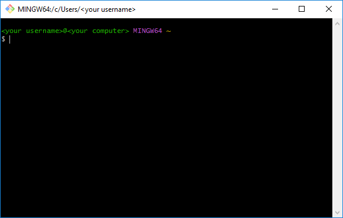

# Getting started on contributing to Docs CSC using a local development server

The procedure described in this file aims to set up the necessary tools on Windows without the need for a system administrator account. However, the [simple Git workflow example](#a-simple-git-workflow-example) that follows the Windows-specific instructions doesn't make any particular assumptions on the operating system used. The two alternative paths for command-line and graphical interfaces are marked **Option A &ndash; CLI** and **Option B &ndash; GUI**, respectively. The GUI path should work with only minor deviation on a Mac.

> [!IMPORTANT]
> While these instructions are meant to provide a way for installing everything as user installations, i.e. without touching any system files or the like, **please consult your local IT support first**, for there may be a preferred way of installing some or all of the following software. Some of it may even come pre-installed on your machine.


## Workflow

### Set up a development environment

This only needs to be done once:

1. [Install the tools](#setting-up-a-development-environment-step-1)
1. [Clone the repository](#obtaining-a-local-copy-ie-cloning-the-repository)
1. [Install the dependencies](#setting-up-a-development-environment--step-2-installing-the-dependencies)


### Working on your contribution

The main workflow once everything is installed:

1. [Start a local development server](#previewing-your-changes-locally)
1. [Create a branch for your work](#creating-a-new-branch-for-your-work)
1. [**Stage** the changes you've made](#staging-your-changes)
1. [**Commit** the staged changes](#committing-the-staged-changes)
1. [**Push** the commits to the remote repository](#pushing-the-commits-to-github)
1. [Open a pull request](#opening-a-pull-request)
1. [Check the test results](#checking-the-status-of-the-tests)


### If something goes wrong

Here's a relevant _xkcd_:


The part about memorizing some shell commands is what this tutorial is about (**Option A &ndash; CLI**, at least). If you run into a problem with Git, you really _can_ just

  1. copy the files you've worked on into some _other folder_ (`git status` to see which files, or just copy everything)
  1. delete the repository folder
  1. clone the repository anew and
  1. copy your work from the _other folder_ into the newly cloned folder

Remember to **think** before doing something destructive like deleting (or "restoring" unstaged changes). Git can't help you recover anything it doesn't know about and 'letting Git know about stuff' is basically what 'using Git' means.


## Setting up a development environment &mdash; Step 1: Installing the tools

### Visual Studio Code (VS Code)

This is only necessary for **Option B &ndash; GUI**, but may also be used with **Option A &ndash; CLI**.

> [!NOTE]
> - For "Free/Libre Open Source Software Binaries of VS Code" with telemetry disabled, have a look at [_VS Codium_](https://vscodium.com).
> - For information on telemetry data collection in _Visual Studio Code_, please see [Visual Studio Code Telemetry](https://code.visualstudio.com/docs/getstarted/telemetry).


#### Tasks

VS Code _Tasks_ provide a way to run the **Option A &ndash; CLI** commands by using a graphical menu. Tasks for e.g. creating/updating the Conda environment or starting the development server have been pre-defined in the VS Code workspace (available after cloning the repository).

<details>
<summary>Using Tasks (click to expand)</summary>

Tasks can be found in VS Code (there are multiple ways)

- by selecting _Terminal -> Run task..._ from the menu bar.
- or from _Quick Open_, accessed by either
    * using the keyboard shortcut _Ctrl+P_
    * selecting _Go -> Go to file..._ from the menu bar
    * or by clicking the search field up top if the appropriate title bar style is enabled

  and typing "task" followed by a space


</details>


#### Installation

<details>
<summary>Installing Visual Studio Code on Windows (click to expand)</summary>

0. (Check if already installed or if another method is preferred in your organization)
1. Download the 'User Installer" from [the Download page](https://code.visualstudio.com/Download)
1. Once the download has completed, click the downloaded executable file on the browser's downloaded files list (there might be a warning about running the file, just proceed). Alternatively, open the File Explorer, navigate to Downloads and double click on the downloaded executable to launch the installer.
1. Advance the installer through the following steps:

    - License Agreement
    - Select Additional Tasks
        + Pick whatever you like, leave as-is if unsure.

    Click "Install" and after the installation has completed, if you leave "Launch Visual Studio Code" checked when clicking "Finish", VS Code will be launched.


##### Extensions (optional)

The Docs repository also comes with some pre-defined _Workspace Settings_ for VS Code. Some of these settings are for configuring optional extensions for VS Code. If you feel that the extensions are not relevant for your use-case, feel free to skip the installations. In any case, you can do it later.


###### Extension: _YAML_

[YAML at Visual Studio Marketplace](https://marketplace.visualstudio.com/items?itemName=redhat.vscode-yaml)

_Material for MkDocs_ provides a YAML schema for validation and auto-complete in _mkdocs.yml_. This could come in handy if you intend to e.g. edit the Docs CSC left-hand navigation menu. To install the _YAML_ extension,

1. Select _View -> Extensions_ from the menu bar or click on _Extensions_ icon in the activity bar to the left of the side bar.
1. Search for "yaml".
1. In the list of search results, click on the little "Install" button next to the _YAML_ extension that has _Red Hat_ (might be _redhat_ in VS Codium) as its publisher.


###### Extension: _Better Jinja_

[Better Jinja at Visual Studio Marketplace](https://marketplace.visualstudio.com/items?itemName=samuelcolvin.jinjahtml)

If you intend to edit or define some Jinja templates, the extension _Better Jinja_ provides syntax highlighting and code snippets. To install it,

1. Select _View -> Extensions_ from the menu bar or click on _Extensions_ icon in the activity bar to the left of the side bar.
1. Search for "jinja".
1. In the list of search results, click on the little "Install" button next to the _Better Jinja_ extension.

</details>


### Conda

A Python program called _MkDocs_ is used to generate the Docs CSC website from documentation files written in a markup language called _Markdown_. To run a local development server for an instant preview of your work, MkDocs and all the software it depends on&mdash;all the way to Python itself&mdash;needs to be available on your computer. This is conveniently accomplished with a package and environment management system called _Conda_.


#### Installation

Installation instructions are provided for Windows, macOS and Linux [here](https://docs.conda.io/projects/miniconda/en/latest/miniconda-install.html).

<details>
<summary>Installing Conda on Windows (click to expand)</summary>

1. Download a minimal installer for Conda, called _Miniconda_, from [docs.conda.io/projects/miniconda/en/latest/](https://docs.conda.io/projects/miniconda/en/latest/#latest-miniconda-installer-links) by clicking the hyperlink "Miniconda3 Windows 64-bit".

    

1. Once the download has completed, click the downloaded executable file on the browser's downloaded files list (there might be a warning about running the file, just proceed). Alternatively, open the File Explorer, navigate to Downloads and double click on the downloaded executable to launch the installer.

    A security warning dialog will most likely pop up (if not, just proceed with the installation) asking for confirmation on running the file. Confirm that the digital signature of the file is OK on the _Digital Signature Details_ opened by clicking the publisher name on the warning dialog.

    

    Then, only if so, click "Run" to start the installer (the version number py_something.something will look different to what's pictured here).

    

1. Advance the installer through the following steps:

    - License Agreement
    - Select Installation Type
        + Select "Just Me"
    - Choose Install Location
        + Install to `C:\Users\<your username>\AppData\Local\miniconda3` (should be filled in by default).
    - Advanced Installation Options
        + Leave "Create start menu shortcuts (supported packages only)".
        + Do _not_ check "Add Miniconda3 to my PATH environment variable".
        + If you have Python installed through some other means and would like to keep that as the default on your system, uncheck "Register Miniconda3 as my default Python 3.xx".
        + Check "Clear the package cache upon completion".

    Click "Install" and, after it's completed, click "Next". Then, unless you'd like to have the corresponding web pages opened for you ([this](https://conda.io/projects/conda/en/latest/user-guide/getting-started.html) and [this](https://www.anaconda.com/installation-success?source=installer), respectively), uncheck "Getting started with Conda" and "Welcome to Anaconda" before clicking "Finish".

</details>


### Git

In order to "clone" the Docs CSC repository from (and later, to "push" your work back to) GitHub onto your computer, a tool called _Git_ is needed. As an alternative to the command-line tool, GitHub provides their own graphical program called _GitHub Desktop_.


#### Documentation

Documentation on Git, with a reference manual, videos and an external links section is available at [www.git-scm.com/doc](https://www.git-scm.com/doc). The Git commands introduced in this tutorial come with a link to the corresponding page of the reference manual.

**Option B &ndash; GUI:** [GitHub Desktop documentation](https://docs.github.com/en/desktop)

<details>
<summary>Option A &ndash; CLI: Git from the command-line (click to expand)</summary>

#### Git for Windows

For Windows, there exists a port of Git called _Git for Windows_.


##### Installation

1. Download the latest version of Git for Windows from [gitforwindows.org](https://gitforwindows.org/) by clicking the large button labeled "Download" on the front page.

    

1. Once the download has completed, navigate to Downloads using the File Explorer. Double click on the downloaded executable, again (if the warning pops up) confirming that the digital signature is OK, and click "Run".

    

1. Advance the installer through the following steps:

    - Information
    - Select Destination Location
        + Install to `C:\Users\<your username>\AppData\Local\Programs\Git` (should be filled in by default).
    - Select Components
        + No need to change anything.
    - Select Start Menu Folder
        + You can leave it as `Git`.
    - Choosing the default editor used by Git
        + If unsure, you can select "Use Notepad as Git's default editor" (don't accidentally select "Notepad++"). In any case, you can change it later.
    - Adjusting the name of the initial branch in new repositories
        + No need to change this.
    - Adjusting your PATH environment
        + Select "Use Git from Git Bash only".
    - Choosing the SSH executable
        + Select "Use bundled OpenSSH".
    - Choosing HTTPS transport backend
        + Select "Use the OpenSSL library".
    - Configuring the line ending conversions
        + Select "Checkout Windows-style, commit Unix-style line endings".
    - Configuring the terminal emulator to use with Git Bash
        + Select "Use MinTTY (the default terminal of MSYS2)".
    - Choose the default behaviour of \`git pull\`
        + Default is fine.
    - Choose a credential helper
        + Select "None". We're going to set up SSH keys in a moment.
    - Configuring extra options
        + No changes needed.
    - Configuring experimental options
        + Leave everything unchecked.

    Click "Install" and after the installation has completed, uncheck "View Release Notes", then click "Finish".


##### Git Bash

You can find a shortcut for Git Bash in the Start menu. If you don't see it under Recently added, simply start typing `git bash` and sooner or later Windows will find it for you.



Before we proceed further with setting up the tools, there are just a few things to keep in mind when starting to learn the command-line after using only graphical interfaces.


###### Commands

In addition to the `git` command, just to illustrate some basic principles without going too much into detail, here are a few essential commands. Feel free to try them in Git Bash.

- `pwd`
  * Print working directory: Shows you your current location (the _folder_ AKA _directory_) in the file system.

- `ls`
  * List directory contents: View the contents of the current location.

Usually, the behaviour of a command can be altered in some way by giving it _options_. One useful option that almost all commands have is `--help`:

- `ls --help`
  * Let `ls` itself tell you how to use it.

As you can see from the output of `ls --help`, some options have a short and a long form. Long form is prefixed with `--` and short with `-`. When giving multiple options in one command, short form options can be grouped together. For example, `ls --all --human-readable --reverse` can be shortened to `ls -ahr` (though, short form is _not_ always the first letter of long, contrary to this example). Some options also take arguments: `ls --sort=size` (or `ls --sort size`).

Many commands need _operands_ to be useful, or to even do anything at all. Some commands will just tell you how to use them (as if given the `--help` option) if no operands are given. The command

- `cd`
  * Change directory: Navigate to another location in the file system.

_does_ work without operands (it navigates to the home directory), but it is commonly used with a path as its operand. Assuming the current location contains a directory named, say "example", this directory could then be navigated to using `cd example/`. Some locations can even be accessed with a shortcut:

- `.`
  * The current directory.

- `..`
  * The parent directory, i.e. the directory that contains the current directory.

- `~`
  * The (current user's) home directory.

As we'll see later, these aren't only used with `cd`, as in `cd ..` or `cd ~`.


###### Tab completion

If you've never used a command-line interface before, having to type everything letter-to-letter might seem tedious compared to clicking or tapping on things in a graphical user interface. Fortunately, something called _tab completion_ can be used to conveniently fill in commands, file or folder names, Git branch names and the like. There are differences on how it works exactly between different shells (like Bash, PowerShell, cmd and so on), but **all you need to remember** is, as the name of the concept suggests, the _tabulator_  AKA _tab_ key, usually marked on the keyboard with the word 'tab' or the symbol ↹.

This incredibly simple yet powerful concept is best explained by example, and in [an article on the subject](https://en.wikipedia.org/wiki/Command-line_completion), Wikipedia provides one (they call it "Command-line completion" and you can [skip straight to the example](https://en.wikipedia.org/wiki/Command-line_completion#Example)).


###### Command history

In addition to tab completion, the command history is among one of the most useful features of shells like Bash. Again, simple yet powerful:

- Browse through previously entered commands with the up and down arrow keys. (The trick is to insist on finding some command you remember using ages ago, when it would clearly be quicker to just type it again!)
- Search for matches in the command history with _Ctrl+R_. (_Ctrl+R_ again to browse through matches.)

Many times you'll want to execute a command that is almost the same as a command in your history. You can, using the above methods, browse to the command in question and use it as a template for your new command.

- Move the cursor with the left and right arrow keys. (As you would in a graphical text editor.)
- Holding down _Ctrl_ will move the cursor over a whole _word_ instead of only a single character. (This also works with the _Delete_ key, but not _Backspace_.)
- _Ctrl+A_ moves the cursor to the beginning, _Ctrl+E_ to the end.


###### Clipboard copy/paste and keyboard shortcuts

If you're accustomed to using the clipboard with the keyboard shortcuts _Ctrl+C_ and _Ctrl+V_, remember that these won't work in Git Bash. The corresponding shortcuts in Git Bash are (by default) _Ctrl+Insert_ for copy and _Shift+Insert_ for paste. **If you accidentally input _Ctrl+V_ in Git Bash with the intention of pasting text from the clipboard, you should hit the backspace key a couple of times before using the correct shortcut!** _Ctrl+C_, on the other hand, will send a keyboard interrupt signal that is often used to stop a running program, for example, the MkDocs development server. You can access the context menu for clipboard copy and paste by clicking on the terminal with the right mouse button.

You can change the default behaviour by right-clicking on the title bar, selecting _Options..._ and then _Mouse_ in the left pane. There you can, e.g., set "Paste" to occur upon right-clicking on the terminal. Note that selecting any text in the terminal automatically copies it to the clipboard (this behaviour can be changed under _Selection_), so you do not actually need to rely on keyboard shortcuts or the context menu for copying/pasting.


Also, while some websites might show commands or snippets of code/script in a box with a button for copying the snippet onto the clipboard, **the result might not always be what the author of the tutorial intended**. A snippet with multiple lines can get copied as only a single long line, or a command that is intended to be edited first can get executed straight away when pasting. To avoid this, instead of clicking the button, it is recommended to select (highlight) the text and copy it using either _Ctrl+C_, the context menu accessed by right-clicking, or even by selecting _Edit -> Copy_ from the web browser's menu bar.

**Keyboard shortcuts in general may produce unexpected results** for users accustomed to graphical interfaces. Similarly to how _Shift_ modifies the behaviour of the keys to produce uppercase characters, _Ctrl_ has been used as a modifier key for sending _control characters_ to computer terminals in the past. You _have_ just installed a _terminal emulator_ called MinTTY to use with Git Bash. In the early days of computer technology, there was a physical terminal to interact with the computer. 


##### Setting up SSH authentication with GitHub

###### Storing your passphrase in KeePass 2

If you don't yet have a database for KeePass, you can create one by selecting _File -> New..._ and following the instructions there. To add a passphrase into your database, select _Entry -> Add entry..._ and input a "Title" (no need to input anything in the "User name" field). The "Password" field will hold your passphrase that KeePass has already automatically generated for you.

If you wish, you can try KeePass 2's password generator&ndash;accessed by clicking the button next to the "Repeat" field and selecting _Open Password Generator..._&ndash;for more options. Just remember to use _at least_ 20 characters. The 128 bits of entropy [recommended at SSH.com](https://www.ssh.com/academy/ssh/passphrase-generator#how-complex-does-a-passphrase-need-to-be?) isn't quite reached with the default setting (20 chars of A-Z or a-z), but it will certainly be over the 80 bits of entropy they state as the minimum. As the point of using a password manager like KeePass 2 is _not_ having to remember anything but the master password, why not go for something like the built-in profile "Hex Key - 256-Bit"?


To make it even easier to input the passphrase on Git Bash, you can edit the auto-type sequence on the Auto-type tab: select "Override default sequence" and remove the `{USERNAME}{TAB}` part, leaving only `{PASSWORD}{ENTER}` as the sequence.


After clicking "OK", the entry is added to your database. Remember to select _File -> Save_ to save the changes to disk.

It is important to have a backup copy of the database file (`.kdbx`)! The recommendation is to have one backup copy on a separate device (such as an external hard drive) and another off-premises (like a cloud file storage). Although, if the _only_ thing you have in the database is the passphrase and something goes wrong, you can just start over (see the note at [Adding an SSH key to your GitHub account](#adding-an-ssh-key-to-your-github-account)).


###### Generating an SSH key

We want to use the default location for SSH keys (`/c/Users/<your username>/.ssh`, AKA `~/.ssh`), but it doesn't exist yet. We'll create it with the command

```bash
mkdir ~/.ssh
```
Now, to generate an SSH key, run the command

```bash
ssh-keygen -t ed25519
```

and, when prompted for a "file in which to save the key", press _Enter_ without inputting anything to use the default location. You'll now be prompted to enter a passphrase. Open KeePass 2 (it is important to make sure Git Bash was the active window right before KeePass, i.e. pressing _Alt+Tab_ would switch to Git Bash) and highlight the entry holding the generated passphrase from before by clicking on it, select _Entry -> Perform Auto-type_ and KeePass will automatically switch to the previously active window, hopefully Git Bash, then "auto-type" the passphrase followed by the _Enter_ key. You're then prompted to repeat the passphrase, so switch straight back to KeePass and have it perform the auto-type again.

If everything worked, ssh-keygen will tell you (along with some other things) that

```text
Your identification has been saved in /c/Users/<your username>/.ssh/id_ed25519
Your public key has been saved in /c/Users/<your username>/.ssh/id_ed25519.pub
```

of which the latter contains your _public key_ we'll be adding to your GitHub account momentarily. The former contains the _private key_ which **should be kept secret at all times**.


###### Adding an SSH key to your GitHub account

For instructions on how to add the generated key&mdash;for authentication that is&mdash;to your GitHub account, see [instructions at GitHub Docs](https://docs.github.com/en/authentication/connecting-to-github-with-ssh/adding-a-new-ssh-key-to-your-github-account). Note that the instructions use the convention of prefixing commands with a `$` to denote a prompt. That is to be left out when copy-pasting the command since it's already there in Git Bash, waiting for your command.

We'll be testing the SSH connection to GitHub after we set up something called `ssh-agent`.

Note that if you lose your private key or the passphrase, you can just remove the public key from your GitHub account and start over by generating a new key pair (and a passphrase).


##### Setting up `ssh-agent` and Conda

Next, we'll set up `ssh-agent` so that you only need to input your passphrase when you open Git Bash. `ssh-agent` will then hold onto your passphrase for you for as long as it (`ssh-agent.exe`) is running. In addition, we need to set up Conda by running the `conda.sh` script from Conda's installation folder. If you didn't install Conda into the default folder, you need to edit the corresponding line. The following lines should go into a `.profile` file in the home folder. Now, run the command

```bash
notepad ~/.profile
```

clicking "Yes" if Notepad asks to create the file. Then, copy-paste the following lines (the part about auto-launching has been copied from [GitHub's tutorial](https://docs.github.com/en/authentication/connecting-to-github-with-ssh/working-with-ssh-key-passphrases#auto-launching-ssh-agent-on-git-for-windows)) into Notepad and save the file:

```bash
# Run Conda script

. ~/AppData/Local/miniconda3/etc/profile.d/conda.sh


# Auto-launching ssh-agent on Git for Windows

env=~/.ssh/agent.env

agent_load_env () { test -f "$env" && . "$env" >| /dev/null ; }

agent_start () {
    (umask 077; ssh-agent >| "$env")
    . "$env" >| /dev/null ; }

agent_load_env

# agent_run_state: 0=agent running w/ key; 1=agent w/o key; 2=agent not running
agent_run_state=$(ssh-add -l >| /dev/null 2>&1; echo $?)

if [ ! "$SSH_AUTH_SOCK" ] || [ $agent_run_state = 2 ]; then
    agent_start
    ssh-add
elif [ "$SSH_AUTH_SOCK" ] && [ $agent_run_state = 1 ]; then
    ssh-add
fi

unset env

```

It is a good practice to end text files with an empty line. Close Notepad to return to the prompt. You should now either "source" the file with the command

```bash
source ~/.profile
```

or close and then reopen Git Bash. `ssh-agent` will prompt for the passphrase, so have KeePass perform the auto-type again, just as before. If it worked, `ssh-agent` will inform you that

```text
Identity added: /c/Users/<your username>/.ssh/id_ed25519 (<your username>@<your computer>)
```

and will now remember the passphrase so you don't have to keep getting it from KeePass every time you connect to GitHub with SSH while using Git. If you want to make `ssh-agent` forget your passphrase, you can simply end the task (`ssh-agent.exe`) in Task Manager.

You should now confirm that Conda is working with the command

```bash
conda --version
```

that should output the version number. To test the SSH connection, follow the instructions on [another GitHub tutorial](https://docs.github.com/en/authentication/connecting-to-github-with-ssh/testing-your-ssh-connection).


##### Associating your commits with your GitHub account

Follow the instructions at GitHub Docs for

- [Setting your commit email address](https://docs.github.com/en/account-and-profile/setting-up-and-managing-your-personal-account-on-github/managing-email-preferences/setting-your-commit-email-address) and
- [Setting your username in Git](https://docs.github.com/en/get-started/getting-started-with-git/setting-your-username-in-git).

</details>


<details>
<summary>Option B &ndash; GUI: Graphical interface with GitHub Desktop (click to expand)</summary>

#### GitHub Desktop

>Note that, even though you want to use GitHub Desktop, it might prove beneficial to also have an installation of Git at hand (on Windows, that would be _Git for Windows_, introduced above). That way you can use the Git integration in VS Code and, when you ask for help and get offered a solution as an elaborate Git command, you have something to run it with. The section is quite long, but you only need to [install Git for Windows](#installation-2) and _maybe_ [set your email/username](#associating-your-commits-with-your-github-account). You can skip everything else. **It's certainly fine to proceed with GitHub Desktop only. You can always install Git later if you really need it, but just so you know: GitHub recommends using the included version of Git only through the GitHub Desktop application.**


##### Installation

Instructions for Windows and Mac are provided [here](https://docs.github.com/en/desktop/installing-and-authenticating-to-github-desktop/installing-github-desktop) and it is as simple as

1. Download an installer by visiting [desktop.github.com](https://desktop.github.com/) and clicking on "Download for Windows (64bit)".
1. Once the download has completed, click the downloaded executable file on the browser's downloaded files list (there might be a warning about running the file, just proceed). Alternatively, open the File Explorer, navigate to Downloads and double click on the downloaded executable to launch the installer.
1. GitHub Desktop should start automatically when the installation is complete. 


##### Signing in

Follow the instructions for [Authenticating to GitHub in GitHub Desktop](https://docs.github.com/en/desktop/installing-and-authenticating-to-github-desktop/authenticating-to-github-in-github-desktop) (the regular, non-Enterprise authentication).


##### External editor

_[Configuring a default editor in GitHub Desktop](https://docs.github.com/en/desktop/configuring-and-customizing-github-desktop/configuring-a-default-editor-in-github-desktop)_

If you're using, for example VS Code (or Codium), you can set it as the default editor. This allows you to quickly open the repository with VS Code by clicking a "Open in Visual Studio Code" button in the _Changes_ view of GitHub Desktop (another option would selecting _File -> Open Folder..._ in VS Code and looking for the cloned repository folder). There should be a link to the appropriate section for Options right under the text "Open the repository in your external editor" in the _Changes_ view (if not, select _File -> Options..._ and then _Integrations_ from the sidebar).

</details>


## Obtaining a local copy, i.e. _cloning_ the repository

<details>
<summary>Option A &ndash; CLI (click to expand)</summary>

Clone the Docs repository (if not cloned yet) with [git-clone](https://git-scm.com/docs/git-clone):

```bash
git clone git@github.com:CSCfi/csc-user-guide.git
```

Navigate to the folder (remember [tab completion](#tab-completion)):

```bash
cd csc-user-guide/
```

</details>


<details>
<summary>Option B &ndash; GUI (click to expand)</summary>

Instructions at GitHub Docs: _[Cloning and forking repositories from GitHub Desktop](https://docs.github.com/en/desktop/adding-and-cloning-repositories/cloning-and-forking-repositories-from-github-desktop)_

In GitHub Desktop,

1. Select _File -> Clone repository..._ from the menu bar.
1. Start typing `CSCfi/csc-user-guide` (or just `csc-user-guide`) into the filter field.
1. When it appears on the list, click on `CSCfi/csc-user-guide` to activate the entry.
1. Click _Clone_ to start.

Now you can select the _Repository -> Show in Explorer_ menu entry to browse the cloned repository files on your computer.

>You'll probably want to uncheck "Hide extensions for known file types" (and have File Explorer "Show hidden files, folders and drives" too, while you're at it) from the _Folder Options_, accessed by clicking the _Options_ button in the _View_ ribbon.
>
>

</details>


## Setting up a development environment &mdash; Step 2: Installing the dependencies

Now that you have cloned the repository, we can use the files it contains to prepare a virtual environment and install the needed software dependencies into it.


### Creating a virtual Python environment using Conda

<details>
<summary>Option A &ndash; CLI (click to expand)</summary>

Create the Conda environment (if not created yet):

```bash
conda env create -f development/conda-docs-base-latest.yaml
```

>if created before, add the `--force` flag:
>```bash
>conda env create --force -f development/conda-docs-base-latest.yaml
>```

Activate the environment:

```bash
conda activate docs-env
```

Install the Python requirements with Pip (when starting fresh):

```bash
pip install -r requirements.txt
```

>when updating, you may want to add the `--force-reinstall` flag:
>```bash
>pip install --force-reinstall -r requirements.txt
>```

The environment can be deactivated with

```bash
conda deactivate
```

</details>


<details>
<summary>Option B &ndash; GUI (click to expand)</summary>

Using VS Code, creating a virtual Conda environment is as simple as running the task **_Docs CSC: Create_** (see _Using Tasks_ under _[VS Code &ndash; Tasks](#tasks)_). A terminal panel will open showing you the progress on installing the dependencies. The environment is ready when the terminal instructs you to "press any key to close it", though you can leave it open if you like.

The virtual environment is now ready for installing the Python requirements for Docs CSC. Simply run the task **_Docs CSC: Install_**. Both creating the environment and installing the requirements need to be done only when starting fresh or when the dependencies/requirements have been changed, i.e. (for Conda dependencies) a new file named _conda-docs-base-something.something.yaml_ has appeared in the _development_ folder or (for Python requirements) the file _requirements.txt_ has been changed.

</details>


## Working on your contribution

That's it for setting up! All installations should now be done. Let's see if it'll run! From here on, the CLI and GUI paths shall be intertwined.

>The procedure for **Option B &ndash; GUI** can be found in a blockquote like this,

while **Option A &ndash; CLI** will be implicit.


### Previewing your changes locally

The main point of this tutorial is to be able to work on the files using the tools you prefer, and that by using a local preview server, you will immediately see your changes when you save a file you've edited. This happens quicker with the `--dirtyreload` option enabled, but is in any case quicker and more convenient than waiting for the Rahti preview to rebuild a branch.

>**Option B &ndash; GUI**: Run the task **_Docs CSC: Serve_**
> * See _Using Tasks_ under _[VS Code &ndash; Tasks](#tasks)_

Run the development server (with the Conda environment activated):

```bash
mkdocs serve
```

or

```bash
mkdocs serve --dirtyreload
```

>**Option B &ndash; GUI**: The task **_Docs CSC: Serve_**, for starting the development server, will ask whether you'd like to include e.g. the `--dirtyreload` flag.
> * See _Using Tasks_ under _[VS Code &ndash; Tasks](#tasks)_

It will take a moment for MkDocs to build and serve the site. If you wish to shut down the server (even when its building)&ndash;perhaps to restart it with `--dirtyreload` enabled&ndash;simply hit _Ctrl+C_.

>**Option B &ndash; GUI**: Click on the terminal panel to activate it before hitting _Ctrl+C_. You can also click the trashcan icon with the tooltip "Kill Terminal" to shut the server down.

When MkDocs tells you it is serving on an address, you can point a web browser to the address for a preview. The default is [127.0.0.1:8000](http://127.0.0.1:8000/) AKA [localhost:8000](http://localhost:8000/).

If you want to leave MkDocs running while continuing to work on the command-line, open a new Git Bash window and again navigate to the cloned folder:

```bash
cd csc-user-guide/
```


### Creating a new branch for your work

>**Option B &ndash; GUI**: See
>- _[Managing branches in GitHub Desktop](https://docs.github.com/en/desktop/making-changes-in-a-branch/managing-branches-in-github-desktop)_
>- [Pulling to your local branch from the remote](https://docs.github.com/en/desktop/working-with-your-remote-repository-on-github-or-github-enterprise/syncing-your-branch-in-github-desktop#pulling-to-your-local-branch-from-the-remote)

Check that you are on the _master_ branch using [git-status](https://git-scm.com/docs/git-status):

```console
$ git status
On branch master
Your branch is up to date with 'origin/master'.

nothing to commit, working tree clean
```

and `git switch master` if this is not the case. You'll be creating a new branch to work on and probably want to branch off of the very latest version of _master_, so check that your local branches are up to date using [git-fetch](https://git-scm.com/docs/git-fetch):

```bash
git fetch origin
```

The line "Your branch is up to date with 'origin/master'" after `git status` just means that Git isn't _aware_ of any new changes on the remote branch (called _origin_ by default). Now, after fetching, things might have changed:

```console
$ git status
On branch master
Your branch is behind 'origin/master' by 15000 commits, and can be fast-forwarded.
  (use "git pull" to update your local branch)

nothing to commit, working tree clean
```

Fast-forward the master branch to the latest commit with [git-pull](https://git-scm.com/docs/git-pull):

```bash
git pull origin master
```

Branch off of the latest commit on master using [git-switch](https://git-scm.com/docs/git-switch) (replace `my-branch-name`):

```bash
git switch --create my-branch-name
```


#### Forgot to make a new branch?

If you forgot to make a new branch before editing some files, and the files **you've edited** have

- **not** been changed by someone else **since you last pulled** from the remote, you can just fetch, pull and create a new branch.
- been changed on the remote, Git will not let you pull the changes, since your local changes to the files would be overwritten. You'll need to
    >**Option B &ndash; GUI**: See _[Stashing changes in GitHub Desktop](https://docs.github.com/en/desktop/making-changes-in-a-branch/stashing-changes-in-github-desktop)_
    * [git-stash](https://git-scm.com/docs/git-switch) your changes
        ```console
        $ git stash
        Saved working directory and index state blahblahblahblahblah
        ```

    * then, after pulling, pop your changes from the top of the stash
        ```console
        $ git stash pop
        Auto-merging docs/your-file.md
        On branch master
        Your branch is up to date with 'origin/master'.

        Changes not staged for commit:
        (use "git add <file>..." to update what will be committed)
        (use "git restore <file>..." to discard changes in working directory)
            modified:   docs/your-file.md

        no changes added to commit (use "git add" and/or "git commit -a")
        Dropped refs/stash@{0} (77c8f9c7dbab452d84ea8e573edf27954b8bce34)
        ```

    * create the new branch


## Getting your work back to the repository

>**Option B &ndash; GUI**: See _[Committing and reviewing changes to your project in GitHub Desktop](https://docs.github.com/en/desktop/making-changes-in-a-branch/committing-and-reviewing-changes-to-your-project-in-github-desktop)_.


### Staging your changes

>**Option B &ndash; GUI**: See _[Selecting changes to include in a commit](https://docs.github.com/en/desktop/making-changes-in-a-branch/committing-and-reviewing-changes-to-your-project-in-github-desktop#selecting-changes-to-include-in-a-commit)_

Selecting specific changes that you want to include in a so called _commit_ is done by staging.

Check which files you've changed, and that you are on the correct branch using [git-status](https://git-scm.com/docs/git-status):

```bash
git status
```

Check what you changed in the files using [git-diff](https://git-scm.com/docs/git-diff):

```bash
git diff
```

or, for a single file (replace `path/to/file`):

```bash
git diff path/to/file
```

For example, if you'd have changed the file you are reading right now, you'd see what you changed with

```bash
git diff GETIING_STARTED.md
```

The actual content is under the _docs_ folder, so `path/to/file` for, say, the _Linux basics for CSC_ tutorial would be `docs/support/tutorials/env-guide/index.md`.

If the so called _diff_ is long, it will be shown inside something called _less_. You can move up and down using arrow keys and _Page Up_ / _Page Down_. Hit _Q_ to quit less and return to the prompt.

Stage the changes you've made using [git-add](https://git-scm.com/docs/git-add):

```bash
git add .
```

or, just a single file (replace `path/to/file`):

```bash
git add path/to/file
```

If you staged something you didn't intend to, unstage a file (replace `path/to/file`) with [git-restore](https://git-scm.com/docs/git-restore):

```bash
git restore --staged path/to/file
```

Be careful with git-restore without the `--staged` option. It is used to restore _unstaged_ files to how they were before you changed them.


### Committing the staged changes

>**Option B &ndash; GUI**: See _[Write a commit message and push your changes](https://docs.github.com/en/desktop/making-changes-in-a-branch/committing-and-reviewing-changes-to-your-project-in-github-desktop#write-a-commit-message-and-push-your-changes)_

Check which changes you've staged with [git-status](https://git-scm.com/docs/git-status):

```bash
git status
```

Check what the staged changes were with [git-diff](https://git-scm.com/docs/git-diff):

```bash
git diff --staged
```

Commit the staged changes (replace `Why I made these changes`, but _do_ include the quotation marks) with [git-commit](https://git-scm.com/docs/git-commit):

```bash
git commit -m "Why I made these changes"
```

or, to write the commit message using the default editor:

```bash
git commit
```

then save the file, exit the editor and Git will read the commit message you typed into the file.

If you forget to give a message with the -m argument, you can enter it when the text editor opens to confirm the commit operation. 


### Pushing the commits to GitHub

>**Option B &ndash; GUI**: See _[Pushing changes to GitHub from GitHub Desktop](https://docs.github.com/en/desktop/making-changes-in-a-branch/pushing-changes-to-github-from-github-desktop)_

Check what happened to the branch with [git-log](https://git-scm.com/docs/git-log) (replace the `9` in `-9` to get more/less commits or remove `--oneline` to increase verbosity):

```bash
git log --oneline -9
```

Check the latest commit with [git-show](https://www.git-scm.com/docs/git-show):

```bash
git show HEAD
```

Again, if the diff is long it'll be shown with _less_, so move with arrow keys and _Page Up_ / _Page Down_, then _Q_ to quit.

Push your branch to GitHub (replace `my-branch-name`) with [git-push](https://git-scm.com/docs/git-push):

```bash
git push origin my-branch-name
```

### Opening a pull request

Instructions for creating a pull request can be found

- in [CONTRIBUTING.md](./CONTRIBUTING.md#making-pull-requests-in-the-web-gui)
- at _[GitHub Docs](https://docs.github.com/en/pull-requests/collaborating-with-pull-requests/proposing-changes-to-your-work-with-pull-requests/creating-a-pull-request)_


### Checking the status of the tests

Every time a push is made, _Travis CI_ will automatically run the tests defined in the _tests_ folder.

Look for your
  - [branch on Travis CI](https://app.travis-ci.com/github/CSCfi/csc-user-guide/branches) or create a pull request on GitHub and look for your
  - [pull request on Travis CI](https://app.travis-ci.com/github/CSCfi/csc-user-guide/pull_requests).

Note that local tests don't work in Git Bash without further configuration.
