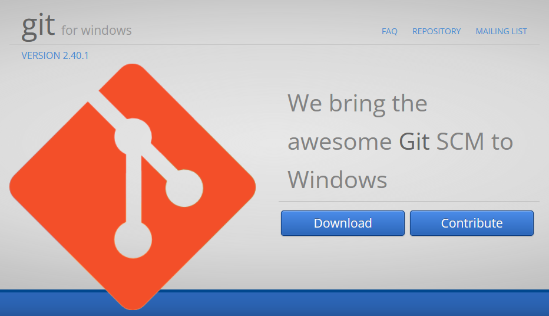

# Setting up a development environment on Windows

The procedure described in this file aims to set up the necessary tools on Windows to support [a basic command line workflow](CONTRIBUTING.md#making-pull-requests-on-the-command-line) without the need for a system administrator account.

## Git for Windows

In order to "clone" this repository from GitHub to your computer, a tool called _Git_ is needed. For Windows, there exists a port of Git called _Git for Windows_.

### Installation

We'll start by downloading the latest version of Git for Windows from [gitforwindows.org](https://gitforwindows.org/). There is a large button labeled "Download" on the front page.

Once the download is completed, open the File Explorer, navigate to Downloads and double click on the downloaded executable to launch the installer. A security warning dialog will most likely pop up asking for confirmation on running the file. Confirm that the name of the file in the dialog actually is the file downloaded in the previous step (the `.exe` part might be hidden depending on File Explorer settings) and only if so, click "Run".

Advance the installer through the following steps by clicking the "Next" button.

- Information
- Select Components
  + No need to change anything.
- Choosing the default editor used by Git
  + If unsure, you can select "Use Notepad as Git's default editor" (don't accidentally select "Notepad++").
- Adjusting the name of the initial branch in new repositories
  + No need to change this.
- Adjusting your PATH environment
  + Select "Use Git from Git Bash only".
- Choosing the SSH executable
  + Select "Use bundled OpenSSH".
- Choosing HTTPS transport backend
  + Select "Use the OpenSSL library".
- Configuring the line ending conversions
  + Select "Checkout Windows-style, commit Unix-style line endings".
- Configuring the terminal emulator to use with Git Bash
  + Select "Use MinTTY (the default terminal of MSYS2)".
- Choose the default behaviour of \`git pull\`