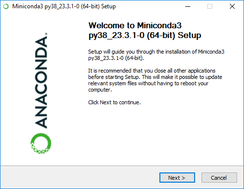
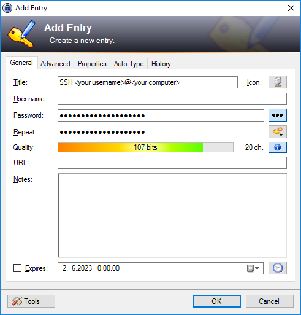

# Setting up a development environment on Windows

The procedure described in this file aims to set up the necessary tools on Windows to support [a basic command line workflow](CONTRIBUTING.md#making-pull-requests-on-the-command-line) without the need for a system administrator account.

**Before starting, make sure you have a secure place to store a passphrase for an SSH key you'll be creating. A password manager called _KeePass 2_ will be used for that in this tutorial.**


## Conda

A Python program called _MkDocs_ is used to generate the Docs CSC website from documentation files written in a markup language called _Markdown_. To run a local development server for an instant preview of your work, MkDocs and all the software it depends on&mdash;all the way to Python itself&mdash;needs to be available on your computer. This is conveniently accomplished with a package and environment management system called _Conda_.


### Installation

1. Download a minimal installer for Conda, called _Miniconda_, from [docs.conda.io/en/latest/miniconda.html](https://docs.conda.io/en/latest/miniconda.html). Scroll down to _Windows installers_ and on the row _Python 3.8_, click the hyperlink "Miniconda3 Windows 64-bit".

    

1. Once the download has completed, open the File Explorer, navigate to Downloads and double click on the downloaded executable to launch the installer.

    A security warning dialog will most likely pop up asking for confirmation on running the file. Confirm that the digital signature of the file is OK on the _Digital Signature Details_ opened by clicking the publisher name on the warning dialog.

    

    Then, only if so, click "Run" to start the installer.

    

1. Advance the installer through the following steps:

    - License Agreement
    - Select Installation Type
        + Select "Just Me"
    - Choose Install Location
        + Install to `C:\Users\<your username>\AppData\Local\miniconda3` (should be filled in by default).
    - Advanced Installation Options
        + Leave "Create start menu shortcuts (supported packages only)" checked if you like, but we aren't going to use them.
        + Do _not_ check "Add Miniconda3 to my PATH environment variable", we'll handle that in Git Bash.
        + If you have Python 3.8 installed through some other means and would like to keep that as the default on your system, uncheck "Register Miniconda3 as my default Python 3.8". For running MkDocs from Git Bash, this should have no effect.

    Click "Install" and after it's completed click "Next". Then, unless you'd like to have the corresponding web pages opened for you ([this](https://conda.io/projects/conda/en/latest/user-guide/getting-started.html) and [this](https://www.anaconda.com/installation-success?source=installer), respectively), uncheck "Getting started with Conda" and "Welcome to Anaconda" before clicking "Finish".

## Git for Windows

In order to "clone" the Docs CSC repository from (and later, to "push" your work back to) GitHub onto your computer, a tool called _Git_ is needed. For Windows, there exists a port of Git called _Git for Windows_.


### Installation

1. Download the latest version of Git for Windows from [gitforwindows.org](https://gitforwindows.org/) by clicking the large button labeled "Download" on the front page.

    

1. Once the download has completed, navigate to Downloads using the File Explorer. Double click on the downloaded executable, again confirming that the digital signature is OK, and click "Run".

    

1. Advance the installer through the following steps:.

    - Information
    - Select Destination Location
        + Install to `C:\Users\<your username>\AppData\Local\Programs\Git` (should be filled in by default).
    - Select Components
        + No need to change anything.
    - Select Start Menu Folder
        + You can leave it as `Git`.
    - Choosing the default editor used by Git
        + If unsure, you can select "Use Notepad as Git's default editor" (don't accidentally select "Notepad++"). In any case, you can change it later.
    - Adjusting the name of the initial branch in new repositories
        + No need to change this.
    - Adjusting your PATH environment
        + Select "Use Git from Git Bash only".
    - Choosing the SSH executable
        + Select "Use bundled OpenSSH".
    - Choosing HTTPS transport backend
        + Select "Use the OpenSSL library".
    - Configuring the line ending conversions
        + Select "Checkout Windows-style, commit Unix-style line endings".
    - Configuring the terminal emulator to use with Git Bash
        + Select "Use MinTTY (the default terminal of MSYS2)".
    - Choose the default behaviour of \`git pull\`
        + Default is fine.
    - Choose a credential helper
        + Select "None". We're going to set up SSH keys in a moment.
    - Configuring extra options
        + No changes needed.
    - Configuring experimental options
        + Leave everything unchecked.

    Click "Install" and after the installation has completed, uncheck "View Release Notes", then click "Finish".


### Git Bash

You can find a shortcut for Git Bash in the Start menu. If you don't see it under Recently added, simply start typing `git bash` and sooner or later Windows will find it for you.


#### Hotkeys

If you're used to using the clipboard with the hotkeys _Ctrl+C_ and _Ctrl+V_, these won't work in Git Bash. The corresponding hotkeys in Git Bash are _Ctrl+Insert_ for copy and _Shift+Insert_ for paste. **If you accidentally input _Ctrl+V_ in Git Bash with the intention of pasting text from the clipboard, you should hit the backspace key a couple of times before using the correct hotkey!** _Ctrl+C_, on the other hand, will send a keyboard interrupt signal that is often used to stop a running program, for example the MkDocs development server. You can access the context menu for clipboard copy and paste by clicking on Git Bash with the right mouse button.


#### Setting up SSH authentication with GitHub

##### Storing your passphrase in KeePass 2

If you don't yet have a database for KeePass, you can create one by selecting _File -> New..._ and following the instructions there. To add a passphrase into your database, select _Entry -> Add entry..._ and input a "Title" (no need to input anything in the "User name" field). The "Password" field will hold your passphrase that KeePass has automatically generated one for you.



To make it even easier to input the passphrase on Git Bash, you can edit the auto-type sequence on the Auto-type tab: select "Override default sequence" and remove the `{USERNAME}{TAB}` part, leaving only `{PASSWORD}{ENTER}` as the sequence.


After clicking "OK", the entry is added to your database. Remember to select _File -> Save_ to save the changes to disk.


##### Generating an SSH key

Git Bash should start in your home folder by default, but you can navigate there with the command `cd ~`, or just simply `cd`. We want to use the default location for SSH keys (`/c/Users/<your username>/.ssh`, AKA `~/.ssh`), but it doesn't exist yet. Input (remember the [note about hotkeys](#hotkeys) if copy-pasting) the command `mkdir .ssh` into Git Bash. Then, to generate an SSH key, input the command `ssh-keygen -t ed25519` and press _Enter_ without inputting anything when prompted for a "file in which to save the key" to use the default location. You'll now be prompted to enter a passphrase. Open KeePass 2 (it is important to make sure Git Bash was the active window right before KeePass, i.e. pressing _Alt+Tab_ would switch to Git Bash) and highlight the entry holding the generated passphrase from before by clicking on it, select _Entry -> Perform Auto-type_ and KeePass will automatically switch to the previously active window, hopefully Git Bash, then "auto-type" the passphrase followed by the _Enter_ key. You're then prompted to repeat the passphrase, so switch straight back to KeePass and have it perform the auto-type again.

If everything worked, ssh-keygen will tell you (along with some other things) that

```text
Your identification has been saved in /c/Users/<your username>/.ssh/id_ed25519
Your public key has been saved in /c/Users/<your username>/.ssh/id_ed25519.pub
```

of which the latter contains your _public key_ we'll be adding to your GitHub account momentarily. As a reminder, the former contains the _private key_ which should be kept secret at all times.


##### Adding an SSH key to GitHub account

For instructions on how to add the generated key&mdash;for authentication that is&mdash;to your GitHub account, see [instructions at GitHub Docs](https://docs.github.com/en/authentication/connecting-to-github-with-ssh/adding-a-new-ssh-key-to-your-github-account). Note that the instructions use the convention of prefixing commands with a `$` to denote a prompt. That is to be left out when copy-pasting the command since it's already there in Git Bash, waiting for your command. In fact, there is only the one command in step 1, so we can just copy it here: `clip < ~/.ssh/id_ed25519.pub`.

We'll be testing the SSH connection to GitHub after we set up something called `ssh-agent`.


#### Setting up `ssh-agent` and Conda

Next, we'll follow [GitHub's instructions to set up `ssh-agent`](https://docs.github.com/en/authentication/connecting-to-github-with-ssh/working-with-ssh-key-passphrases#auto-launching-ssh-agent-on-git-for-windows) so that you only need to input your passphrase when you open Git Bash. `ssh-agent` will then hold onto your passphrase for you for as long as it (`ssh-agent.exe`) is running. In addition, we need to set up Conda by running the `conda.sh` script from Conda's installation folder. If you didn't install Conda into the default folder, you need to edit the corresponding line. The following lines should go into a `.profile` file in the home folder. Now, input the command `notepad .profile`, click "Yes" if Notepad asks to create the file, copy-paste the following lines into the file and save it:

```bash
# Auto-launching ssh-agent on Git for Windows

env=~/.ssh/agent.env

agent_load_env () { test -f "$env" && . "$env" >| /dev/null ; }

agent_start () {
    (umask 077; ssh-agent >| "$env")
    . "$env" >| /dev/null ; }

agent_load_env

# agent_run_state: 0=agent running w/ key; 1=agent w/o key; 2=agent not running
agent_run_state=$(ssh-add -l >| /dev/null 2>&1; echo $?)

if [ ! "$SSH_AUTH_SOCK" ] || [ $agent_run_state = 2 ]; then
    agent_start
    ssh-add
elif [ "$SSH_AUTH_SOCK" ] && [ $agent_run_state = 1 ]; then
    ssh-add
fi

unset env


# Run Conda script

username=$(whoami)

. "/c/Users/$username/AppData/Local/miniconda3/etc/profile.d/conda.sh"

unset username

```

You should now either "source" the file with the command `source .profile` or close and then reopen Git Bash. `ssh-agent` will prompt for the passphrase, so have KeePass perform the auto-type again, just as before. If it worked, `ssh-agent` will inform you that

```text
Identity added: /c/Users/<your username>/.ssh/id_ed25519 (<your username>@<your computer>)
```

and will now remember the passphrase so you don't have to keep getting it from KeePass every time you connect to GitHub with SSH while using Git. If you want to make `ssh-agent` forget your passphrase, you can simply end the task (`ssh-agent.exe`) in Task Manager.

You should now confirm that Conda is working with the command `conda --version` that outputs the version number. And, that SSH authentication for GitHub is working by following the instructions on a [GitHub Docs article](https://docs.github.com/en/authentication/connecting-to-github-with-ssh/testing-your-ssh-connection) on the subject. Again, there's only a single command: `ssh -T git@github.com`.


## Docs CSC

### Cloning the repository

We're now ready to clone the repository onto your computer using Git. 
FIXME

### Creating Conda environment

FIXME


### MkDocs development server

FIXME


## Uninstallation

FIXME

- `C:\Users\<your username>\AppData\Local\miniconda3\Uninstall-Miniconda3.exe`
- `C:\Users\<your username>\AppData\Local\Programs\Gitunins000.exe`
