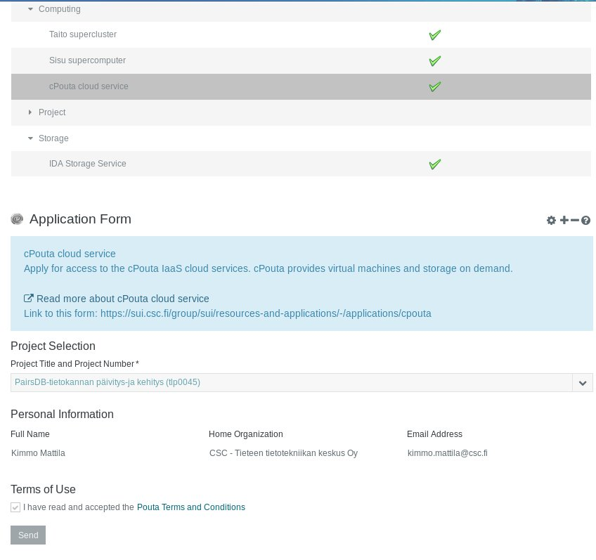

## Applying for Pouta access

To  apply for  access to  cPouta or  ePouta you  need to  have a  user
account and a computing project at CSC.  If you have a user account in
taito.csc.fi  or  sisu.csc.fi servers  you  already  have a  computing
project  at CSC  and Pouta  services will  utilize the  same computing
quota as Sisu and Taito.

!!! note
    If you don't have a computing project at CSC, you should apply for one
    and  add services  to  it,  as explained  on  the  [User Accounts and
    Projects] page.

The remaining steps are different for cPouta and ePouta clouds.

### For the cPouta service:

Once you have  a computing project at CSC, you  can use the *Resources
and Applications*  tool in *Scientist's  User Interface* to  apply for
cPouta access:

1.  Login to the [Scientist's User Interface] with your Haka account.
2.  In   the   *Scientist's   User  Interface*,   navigate   to   
    [Resources and Applications] (Please
    ensure you have applied for  computing project at CSC as discussed
    above before this step).
3.  In *Resources and Applications*,  navigate to *Computing* and from
    there to [cPouta cloud service]
4.  Use  *Project Selection tool*  to define  a project for  which you
    want to apply cPouta resources.
5.  Read and accept the *[Terms of Use]* and *send* the application.
6.  CSC will contact you when your application is accepted.

Please        contact       <a        href="mailto:servicedesk@csc.fi"
class="external-link">servicedesk@csc.fi</a> in    case    you    need
assistance.

**Figure** Applying  for cPouta  access with  the *Resources  and
Applications* tool.

### For the ePouta service

Unlike in  cPouta and other  typical IaaS clouds, virtual  machines in
ePouta don't  have access  to  the public  Internet. Instead,  virtual
machines  of  an  individual  customer  are  only  connected  to  that
customer's own network through either an OPN (Optical Private Network)
or  -  within   FUNET  and  European  academic  networks   -  an  MPLS
(Multiprotocol Label  Switching) connection. This means  that in order
to  access  your  virtual  machines,  you will  go  through  your  own
organization's network instead  of going over the  public Internet. To
get  started with  connecting your  network to  ePouta, please  send a
request to <servicedesk@csc.fi>.

**Figure** Connection between ePouta cloud VMs and Customer's home
network.

The above figure shows the connections  to virtual machines and to the
management interface in ePouta ("OpenStack").  As the image shows, the
network  of  the virtual  machines  running  in ePouta  is  completely
separate from the public Internet.

To create  the connection between  your site and ePouta,  some initial
information is required:

1.  A range of IP addresses  from which addresses will be allocated to
    virtual machines running in ePouta
2.  The IP address of the gateway in the subnet for this IP range
3.  The  IP addresses of  DNS servers that  should be used  by virtual
    machines and that are accessible from the subnet
4.  A  set of IP  addresses or narrow  ranges ("Admin machine"  in the
    image  above)  that  will  be allowed  to  access  the  management
    interfaces of ePouta ("OpenStack" in the image above)

During the process of setting up  the connection between your site and
ePouta, we will send you email asking you to provide this information.
If you later wish to e.g. add  more IP addresses to be whitelisted for
access   to   the   ePouta    interfaces,   please   send   email   to
<servicedesk@csc.fi>.

  [User Accounts and Projects]: https://research.csc.fi/accounts-and-projects
  [Scientist's User Interface]: https://sui.csc.fi
  [cPouta cloud service]: https://sui.csc.fi/group/sui/resources-and-applications/-/applications/cpouta/
  [Resources and Applications]: https://sui.csc.fi/group/sui/resources-and-applications/
  [Terms of Use]: https://research.csc.fi/pouta-user-policy
