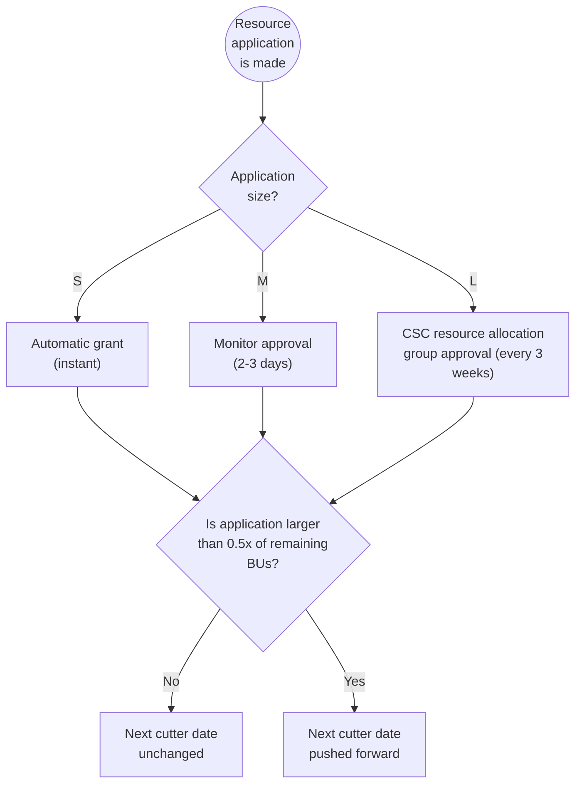

# Applying for billing units

If your project is running low on billing units, you're expected to apply for more. You need to estimate your consumption and submit your billing unit application in the [MyCSC](https://my.csc.fi) portal. Your application will be reviewed by the CSC resource allocation team and, depending on your resource needs, you'll be awarded appropriate resources.
Please note that having a negative billing unit balance will result in restrictions on our services.

Submit a resource application:

1. Login to [MyCSC](https://my.csc.fi).
2. Choose _Projects_ in the navigation menu on the left.
3. Choose a project.
4. Under _Resource Applications_, click _Apply for Resources_.
5. You review your current services and apply for new ones
6. Fill in the application and click _Apply_.
7. A link to the submitted application shows up under _Resource applications_,
   where you can view its details and status. You and your project manager will
   also receive email notifications about the submission.
8. When the application has been processed, you will receive another
   email to inform how many billing units have been granted.

!!! Note

    Academic projects are requested to fill in the science area,
    publications, project results etc. This information is used to evaluate
    your application and incomplete applications may be denied.

    All members of a project can submit billing unit applications.

Billing unit applications cannot be edited after submission, but you
can ask us to reject them, after which you can submit another
application. [See our contact details here](../support/contact.md).

