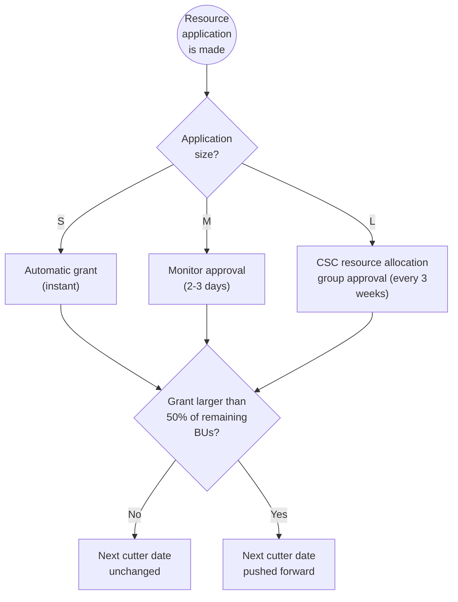

# Laskentayksiköiden hakeminen { #applying-for-billing-units }

Jos projektissasi on vähän laskentayksiköitä jäljellä, sinun odotetaan hakevan lisää. Sinun tulee arvioida kulutuksesi ja jättää laskentayksikköhakemus [MyCSC](https://my.csc.fi)-portaalissa. CSC:n resurssien allokointitiimi käsittelee hakemuksesi ja resurssitarpeesi mukaan sinulle myönnetään sopivat resurssit.
Huomaa, että negatiivinen laskentayksikkösaldo rajoittaa palvelujen käyttöä.

## Saatavilla olevat laskentayksikköpaketit { #available-billing-unit-packages }

Nämä ovat [MyCSC](https://my.csc.fi)-portaalissa saatavilla olevat laskentayksikköpaketit.

| Paketti   | CPU         | GPU         | Tallennus   | Pilvi       |
|:----------|:-----------:|:-----------:|:-----------:|------------:|
| Small (S) | 60 000      | 10 000      | 30 000      | 30 000      |
| Medium (M)| < 600 000   | < 100 000   | < 300 000   | < 300 000   |
| Large (L) | < 6 000 000 | < 1 000 000 | < 3 000 000 | < 3 000 000 |

## Resurssihakemuksen jättäminen { #how-to-submit-a-resource-application }

1. Kirjaudu sisään [MyCSC](https://my.csc.fi):hen.
2. Valitse vasemman reunan navigointivalikosta _Projects_.
3. Valitse projekti.
4. Kohdassa _Resource Applications_ napsauta _Apply for Resources_.
5. Tarkista nykyiset palvelusi ja hae uusia.
6. Täytä hakemus ja valitse _Apply_.
7. Lähetettyyn hakemukseen johtava linkki ilmestyy kohtaan _Resource applications_,
   jossa voit tarkastella sen tietoja ja tilaa. Sinä ja projektipäällikkösi saatte
   myös sähköposti-ilmoitukset lähetyksestä.
8. Kun hakemus on käsitelty, saat toisen sähköpostin, jossa kerrotaan,
   kuinka monta laskentayksikköä on myönnetty.

!!! Note

    Akatemisia projekteja pyydetään täyttämään tiedeala,
    julkaisut, projektin tulokset jne. Näitä tietoja käytetään
    hakemuksen arviointiin, ja puutteelliset hakemukset voidaan hylätä.

    Kaikki projektin jäsenet voivat jättää laskentayksikköhakemuksia.

Laskentayksikköhakemuksia ei voi muokata lähettämisen jälkeen, mutta
voit pyytää meitä hylkäämään ne, minkä jälkeen voit lähettää toisen
hakemuksen. [Katso yhteystietomme täältä](../support/contact.md).

## Laskentayksiköiden vähentäminen { #billing-unit-depreciation }

Lokakuusta 2025 alkaen käyttämättömiä laskentayksiköitä vähennetään, jos niitä ei käytetä. Parantaaksemme palveluiden käytön ennustettavuutta ja vähentääksemme käyttämättömiä resursseja akateemisten projektien laskentayksiköitä pienennetään määräajoin, jos niitä ei hyödynnetä. Tämä käytäntö ei kohdistu CSC:n kaupallisiin projekteihin.

Joka kuudes kuukausi, laskettuna viimeisestä laskentayksikkömyönnöstä, tarkistetaan käytettyjen ja käyttämättömien laskentayksiköiden määrä ja jos viimeisimmän myönnön jälkeisistä käytettävissä olleista laskentayksiköistä on käytetty alle 40 %, yksiköitä leikataan vastaavasti. Tavoitteena on kannustaa projekteja käyttämään myönnettyjä resurssejaan, joten projekteilta, jotka käyttävät laskentayksiköitä, ei leikata resursseja.

### Esimerkki laskentayksiköiden leikkauksesta { #billing-unit-depreciation-example }

Esimerkiksi, oletetaan, että projektilla on jäljellä 40 000 CPU-laskentayksikköä ja 25 000 GPU-laskentayksikköä, ja sille on myönnetty 60 000 CPU-laskentayksikköä ja 135 000 GPU-laskentayksikköä **maaliskuussa**, jolloin myönnön jälkeen käytettävissä on 100 000 CPU-laskentayksikköä ja 160 000 GPU-laskentayksikköä. Tällöin **syyskuussa** tarkistetaan, onko projekti käyttänyt **vähintään 40 %** näistä resursseista (eli 40 000 CPU BU:ta ja 64 000 GPU BU:ta). Jos ei, käyttämättömät BU:t leikataan niin, että 60 % resursseista jää jäljelle. **Seuraavan vuoden maaliskuussa** tarkistetaan, onko projekti käyttänyt **vähintään 80 %** resursseista (eli 80 000 CPU BU:ta ja 128 000 GPU BU:ta). Jos ei, resursseja leikataan vastaavasti. Jos projekti on käyttänyt enemmän kuin kynnysarvon, resursseja ei leikata.

Jos projektille myönnetään uusia resursseja, seuraavan leikkauksen ajastin voidaan nollata myönnön koosta riippuen. Alla olevasta kaaviosta näet, miten ajastin nollataan.

