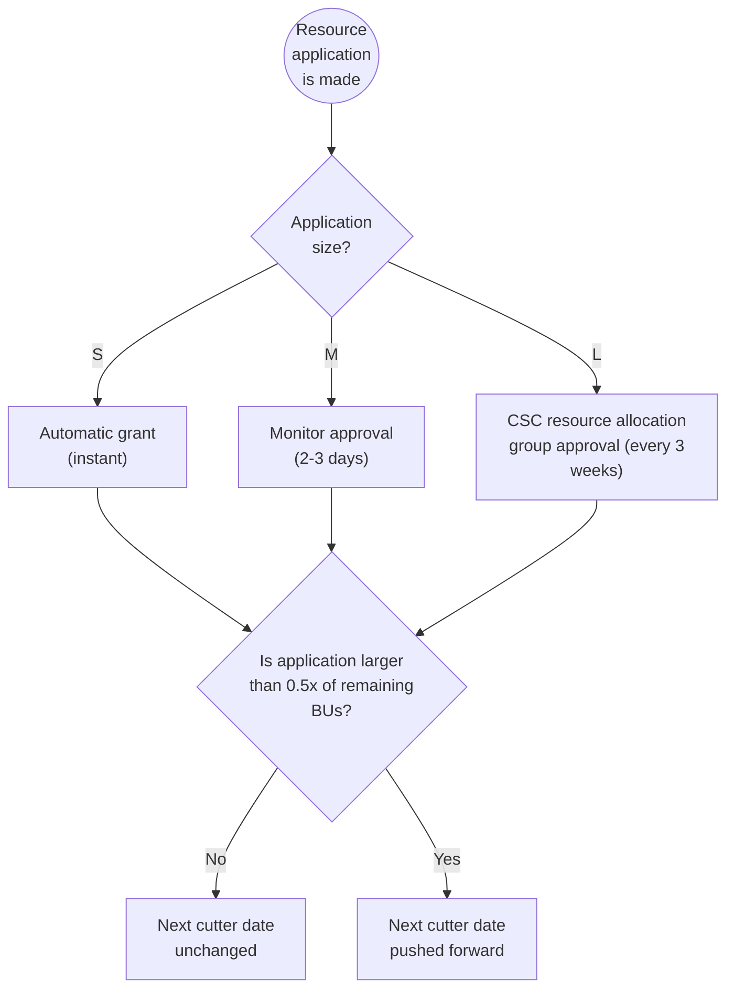

# Applying for billing units

If your project is running low on billing units, you're expected to apply for more. You need to estimate your consumption and submit your billing unit application in the [MyCSC](https://my.csc.fi) portal. Your application will be reviewed by the CSC resource allocation team and, depending on your resource needs, you'll be awarded appropriate resources.
Please note that having a negative billing unit balance will result in restrictions on our services.

Submit a resource application:

1. Login to [MyCSC](https://my.csc.fi).
2. Choose _Projects_ in the navigation menu on the left.
3. Choose a project.
4. Under _Resource Applications_, click _Apply for Resources_.
5. You review your current services and apply for new ones
6. Fill in the application and click _Apply_.
7. A link to the submitted application shows up under _Resource applications_,
   where you can view its details and status. You and your project manager will
   also receive email notifications about the submission.
8. When the application has been processed, you will receive another
   email to inform how many billing units have been granted.

!!! Note

    Academic projects are requested to fill in the science area,
    publications, project results etc. This information is used to evaluate
    your application and incomplete applications may be denied.

    All members of a project can submit billing unit applications.

Billing unit applications cannot be edited after submission, but you
can ask us to reject them, after which you can submit another
application. [See our contact details here](../support/contact.md).

## Billing unit deprecation

Starting from Autumn 2025, unused Billing Units will be deprecated if left unused. To improve the predictability of service usage and reduce unused resources, billing units for academic projects will be periodically reduced if not utilized. This policy does not target commercial CSC projects. Every six months, counted from the last Billing Unit grant, the amount of used and unused Billing Units is checked and, if less than 40% of the available Billing Units after the last grant have been used, the units are cut accordingly. The goal is to encourage projects to use their resource grants, so no resources are cut from projects using Billing Units.

### Billing unit deprecation example

As an example, if a project with 40,000 CPU Billing Units and 25,000 GPU billing units remaining has been granted 60,000 CPU Billing Units and 135,000 GPU Billing Units in March, the available Billing Units after the grant would be 100,000 CPU Billing Units and 160,000 GPU Billing Units. This means in September it is checked, if the project has used at least 40% of these (or 40,000 CPU BUs and 64,000 GPU BUs), and if not, the leftover BUs are cut so that 60% of the resources are left. Then in next year’s March, it is checked if the project has used 80% of the resources (so 80,000 CPU BUs and 128,000 GPU BUs) and again, if it has not, the resources are cut correspondingly. If the project has used more than the threshold, no resources are cut. If the project is granted new resources, the timer for the resource cuts is reset again. 

Please see the chart below how the resource timer is reset.

