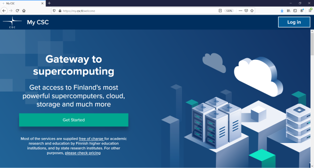

# How to change password

You can change your password in two ways: Using the current password or with a
password reset link ordered to your email. You can follow the instructions below or watch the guided video.

## Using current password

* Login to [MyCSC](http://my.csc.fi).

* Go to _My Profile_ and click _Change password_.

* Enter your current password and the new password twice. Click _Save_.

<figure class="video_container">
<iframe width="560" height="315" srcdoc="https://www.youtube.com/embed/i8Y98ANQh-Q" frameborder="0" allow="accelerometer; autoplay; encrypted-media; gyroscope; picture-in-picture" allowfullscreen></iframe>
</figure>

*****

## Using password reset link

* Go to [MyCSC](http://my.csc.fi). Click _Log in_.

* Choose _CSC login_.

* Click _Forgot your password?_

* Enter your CSC username and click _Next_. Instructions are sent to the email
   address associated with your CSC user account.

 
<figure class="video_container">
<iframe width="560" height="315" srcdoc="https://www.youtube.com/embed/2QH86rtI4FI" frameborder="0" allow="accelerometer; autoplay; encrypted-media; gyroscope; picture-in-picture" allowfullscreen></iframe>
</figure>   

## Password requirements

* Must contain at least 12 characters
* Must contain at least one lowercase letter (a–z)
* Must contain at least one uppercase letter (A–Z)
* Must contain at least one number (0–9)
* May contain special characters ( !#$%&()*+,-./:;=>?@[\\]^_{|}~)
* Learn what makes a strong password and don't use weak passwords
* Reusing the old password will not stop your account from expiring
* Never use the same password on multiple sites

