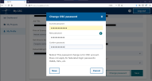

# How to change password

You can change your password in two ways: Using the current password or with a
password reset link ordered to your email.

## Using current password

1. Login to [MyCSC](http://my.csc.fi).
1. Go to _My Profile_ and click _Change password_.
1. Enter your current password and the new password twice. Click _Save_.

## Using password reset link

1. Go to [MyCSC](http://my.csc.fi). Click _Log in_.
1. Choose _CSC login_.
1. Click _Forgot your password?_
1. Enter your CSC username and click _Next_. Instructions are sent to the email
   address associated with your CSC user account.

## Password requirements

* Must contain at least 12 characters
* Must contain at least one lowercase letter (a–z)
* Must contain at least one uppercase letter (A–Z)
* Must contain at least one number (0–9)
* May contain special characters ( !#$%&()*+,-./:;=>?@[\\]^_{|}~)
* Learn what makes a strong password and don't use weak passwords
* Reusing the old password will not stop your account from expiring
* Never use the same password on multiple sites
