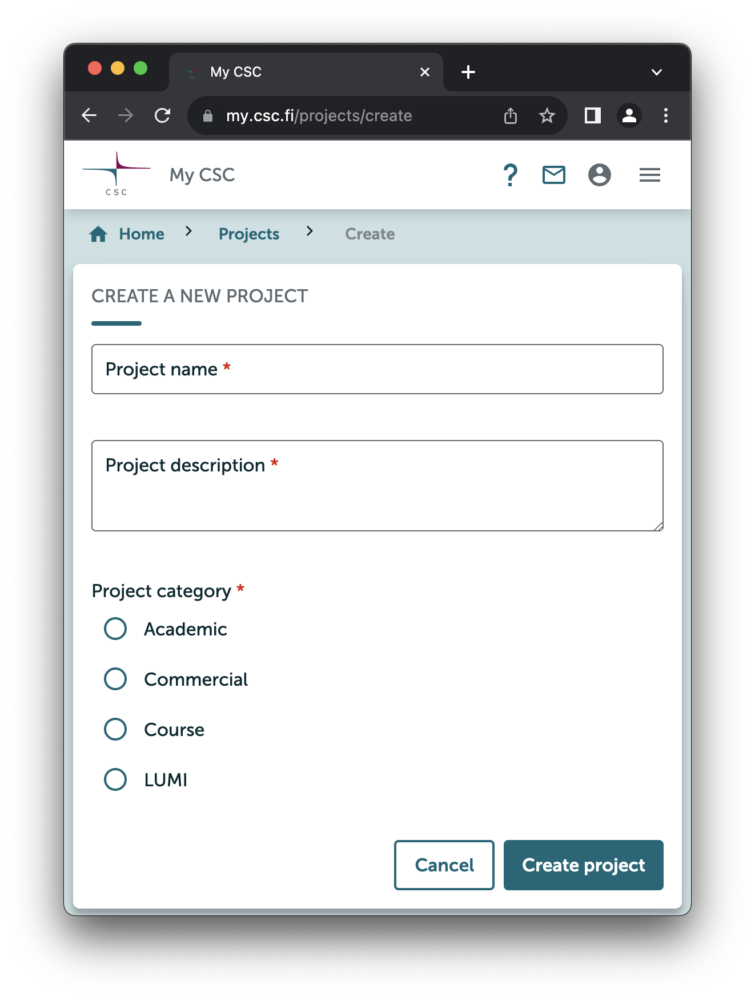

---
search:
  boost: 2
---

# Creating a new project

A [CSC user account](how-to-create-new-user-account.md#getting-an-account-with-haka-or-virtu) is required for creating new projects.

1. Login to [MyCSC](http://my.csc.fi/) with your CSC user account or Haka/Virtu account.
2. Choose **Projects** in the navigation menu on the left.
3. On the top of the page choose **+ New project**.
4. Fill in the **Project name** and **Project description.**
5. Choose the **Project category**. Available categories are:
	* [Academic](how-to-create-new-project.md#academic)
	* [Commercial](how-to-create-new-project.md#commercial)
	* [Course](how-to-create-new-project.md#course)
	* [LUMI](how-to-create-new-project.md#how-to-create-finnish-lumi-projects)

{width=400}
## Academic

Academic project category is reserved for [free-of-charge use cases](https://research.csc.fi/free-of-charge-use-cases){:target="_blank"} and they can be created only by members of Finnish higher education institutions, state research institutes and CSC.

!!! Note
    If you are an educator and need resources for a course, check out the [Course](how-to-create-new-project.md#course) project category. If you are a student, have a look at the [Student](how-to-create-new-project.md#student) project category.

6. Please select the **Field of Science** and **Sub Science Area** of the type of research being carried out in the project.
7. Select _Yes_ or _No_ according to whether personal data will be handled in your project. Read more about [handling personal data in your project](../accounts/when-your-project-handles-personal-data.md).
8. Please have a look at our terms and conditions and confirm your acceptance.
9. Click **Create project**.

Academic projects are usually valid for one year at a time, but they can be extended. To extend a project, please see page [How to manage your project](how-to-manage-your-project.md).

## Commercial

Commercial projects are currently only available through the Service Desk. Please [contact CSC Service Desk](../support/contact.md) for more information.

## Course

The course category is reserved for [free-of-charge](https://research.csc.fi/free-of-charge-use-cases){:target="_blank"} use cases. This category project is a fixed time (maximum of 6 months, non-extendable), fixed resource and is designed to deliver a course once. Re-delivering the course requires a new project. Please note, that all data is deleted at the end of the project.

6. Fill in the course dates and field of science. 
7. Please have a look at our terms and conditions and confirm your acceptance.
8. Click **Create project**.

The easiest way to add students to a course project is to use an [invitation link](how-to-add-members-to-project.md#using-invitation-link).

## How to create Finnish LUMI projects

LUMI projects are used to manage access to LUMI and the resources provided by it. LUMI projects are restricted to LUMI environment only (LUMI-C, LUMI-G etc.). Finnish LUMI projects are fixed in time and resources, and the total resources must be defined already in the project application.

A Finnish LUMI project can include one or several CSC user accounts and one CSC user account can be a member in several Finnish LUMI projects. Each LUMI project must have a Principal Investigator (i.e. Project Manager), who creates the project and applies for resources, manages the user accounts that belong to the project and is responsible of the resource usage. The LUMI Project Manager is typically a leader of a research team or other senior researcher. See more for [project manager prerequisites](https://research.csc.fi/en/prerequisites-for-a-project-manager).

LUMI services are free of charge for academic research for members of Finnish higher education institutions and state research institutes.

### Creating a LUMI project and applying for resources

6. Select **LUMI** from the Project category list.
7. Select LUMI **Access mode** (Regular, Benchmark, or Development)
8. Fill in the **resources**: CPU core hours, GPU hours, Storage hours, and all the **text fields** carefully below. If the data is incomplete or insufficient, the application will be rejected. For Regular Access applications, a list of prior publications and a proper research plan are required. For Benchmark Access, a plan of how the resources will be used for the benchmarks is required, and for Development Access a description of program codes, methods and development objectives is required.
9. Select the **Field of Science**, and fill in the **Keywords**.
10. Does your project handle personal data? Please note: **LUMI projects are not allowed to handle personal data at present**.
11. Tick the box I have read and accepted the LUMI General Terms of Use.
12. Click **Create project**.

Once you have created the project, [invite the project members](how-to-add-members-to-project.md). Your LUMI project application will be sent to the CSC Resource allocation administration to be processed. The CSC Resource allocation group has meetings [every three weeks](https://research.csc.fi/applying-for-computing-resources).

Please note that LUMI access is provided only with SSH keys, not with passwords. After you have received an acceptance confirmation email for your LUMI project request, please [upload your public SSH key to MyCSC according to the instructions](../computing/connecting/ssh-keys.md).

For further information on LUMI projects please visit [Users in Finland](https://www.lumi-supercomputer.eu/get-started-2021/users-in-finland/){:target="_blank"}

## Student

A student can be the project manager of the student project. Please read the [Getting started with the Student Project](../support/tutorials/student_quick.md) carefully and then you can continue with the instructions below.

The student category is reserved for [free-of-charge](https://research.csc.fi/free-of-charge-use-cases){:target="_blank"} use cases. This category project is a fixed time (maximum of 6 months, non-extendable), fixed resource and is designed to support student's work with higher educational institutes' courses and thesis work.

1. Login to [MyCSC](http://my.csc.fi/) with your CSC user account or Haka/Virtu account.
2. Choose **Projects** in the navigation menu on the left.
3. On the top of the page choose **+ New project**.
4. In **the name field**, enter a descriptive name for your project. This could be the name of the course or the topic of your thesis work, for example.
5. In **the description field**, please indicate whether this is a course-related project or a project related to your thesis work, for example.
6. Select **the end date** of the resource need or course, but no more than six months from the project creation date.
7. In **the comments field**, please fill in the university course code and title or name if available.
8. Fill in **the field of your studies** - or the closest approximation.
9. Please read our **terms and conditions** and confirm your acceptance.
10. Click **Create project**.

If you wish, you can add other members to your project. The easiest way to do so is to use an [invitation link](how-to-add-members-to-project.md#using-invitation-link).
