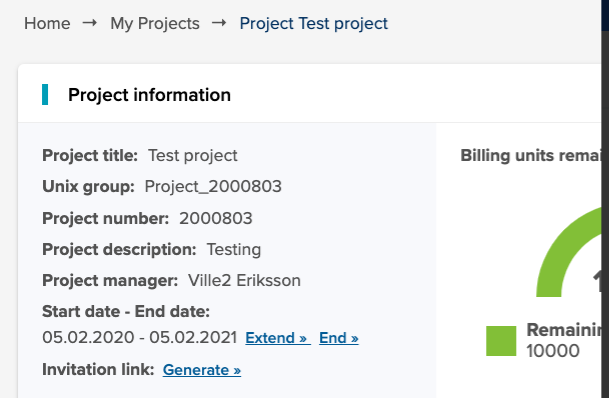
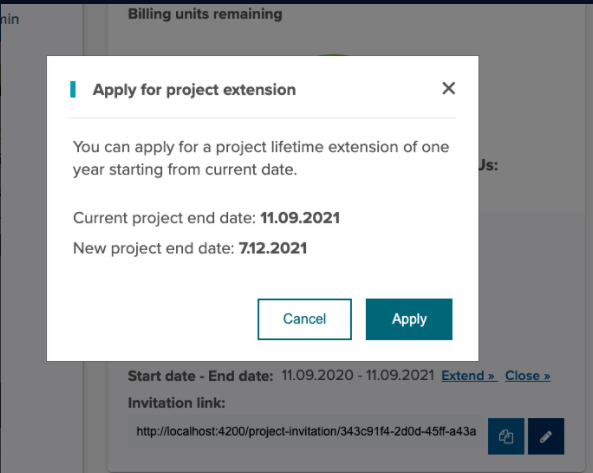

# How to manage your projects

## Project lifetime extension

You can apply for an initial project lifetime extension of one year. 

1. Login to [MyCSC](http://my.csc.fi).
1. Choose _My Projects_ in the navigation menu on the left.
1. Choose the project you want to extend
1. Click on the 'Extend' button
1. Accept the changes by clicking the 'Apply' button
1. Your project lifetime is now extended by one year.

 

