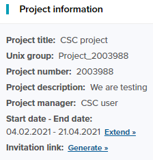
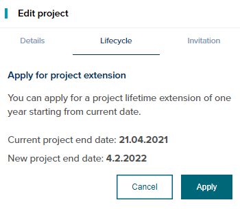

# How to manage your projects

CSC Project needs to be extended yearly.

* Project members receive reminders about the project expiration.
* The Project Manager can extend the project in [MyCSC](http://my.csc.fi)
* When granted new billing units (BU) project is extended automatically by a year.
* Projects that use Fairdata IDA will be extended automatically.

!!! Note 

    Project Manager’s CSC account inactivation closes the project for all project members.

* The Project Manager’s CSC account needs to be kept active by changing password yearly and keeping user information, such as the organisation email address, up to date and delegate the project manager role to someone else as needed.

Users are primarily responsible for [moving data](../data/moving/index.md) or deleting the project content themselves before the project is closed. 
If you're unsure about your CSC Project's or Account's status, please log in [MyCSC](http://my.csc.fi) to extend your project or change your account password.

## Project lifetime extension

You can apply for an initial project lifetime extension of one year.

1. Login to [MyCSC](http://my.csc.fi).
1. Choose _My Projects_ in the navigation menu on the left.
1. Choose the project you want to extend
1. Click on the 'Extend' button
1. Accept the changes by clicking the 'Apply' button
1. Your project lifetime is now extended by one year.

 

