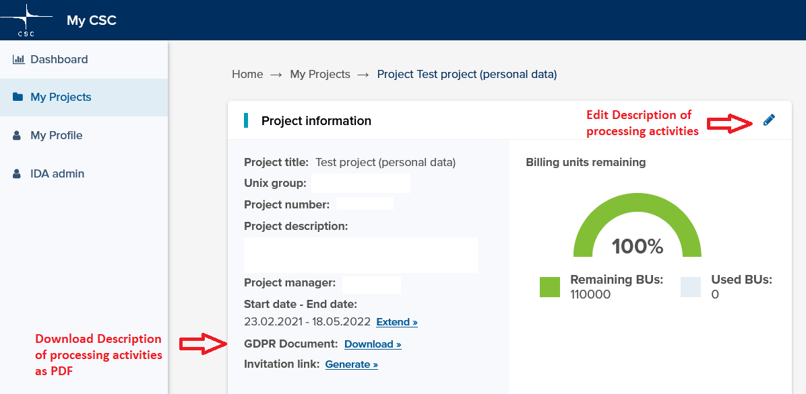

# When your project handles personal data

When you use CSC's services to process **personal data** in your research project you need to select "We handle personal data in this project" when 
creating a CSC project. 
[Read what is personal data from the office of the data protection ombudsman web pages](https://tietosuoja.fi/en/what-is-personal-data).
After this, you will be presented with a **Description of processing activities form** in MyCSC. 

With this form, you describe the personal data processing activities that CSC performs on your behalf as a processor of personal data, 
the types of personal data and the personal data to be processed. You also need to mark if you handle special categories of data. 
Read more about [sensitive data](https://research.csc.fi/definition-of-sensitive-data) and about 
[managing sensitive data](https://research.csc.fi/managing-sensitive-data) on Research.csc.fi website.

This form is attached your CSC project and serves as an instruction to the processing of personal data for CSC. 
If you do not know how to fill in the form, please contact the data protection officer in your organization. 
Note also, that you can always edit and refine this description on your project's information page in MyCSC by clicking the pen icon, 
if the processing of personal data changes over time in your research project, or download the description as a PDF (see screenshot below).

## Data processing agreement 
[The General Terms of Use for CSC's Services for Research and Education](https://research.csc.fi/general-terms-of-use) with 
[data processing agreement](https://research.csc.fi/data-processing-agreement) and the description of processing activities 
together with the other materials mentioned in the data processing agreement, 
constitute a legally binding data processing agreement for the purposes of the EU General Data Protection Regulation (2016/679, the “GDPR”). 
All of CSC's users accept the Data processing agreement together with the General Terms of Use for CSC's Services for Research and Education 
when registering as users.

In the GDPR definitions, processing essentially refers to anything you can possibly do with someone’s personal information: 
collecting it, storing it, destroying it, etc. GDPR compliance requires data controllers (in this case You as a CSC's service user) 
to sign a data processing agreement with any parties that act as data processors on their behalf 
(in this case CSC acts as a data processor on you behalf when You use our services).  

The new data processing agreement and the description of processing activities form are mandatory parts of contracting to use CSC’s 
Services for Research and Education, if personal data is processed. 

Please refer to:

- [The General Terms of Use for CSC's Services for Research and Education](https://research.csc.fi/general-terms-of-use)
- [The Data Processing Agreement](https://research.csc.fi/data-processing-agreement)
- [Service descriptions](https://research.csc.fi/en/service-catalog)
- [The CSC Data Policy](https://www.csc.fi/en/data-policy)

to find more detailed information on how we as data processor protect your personal data and you can assess the suitability of the service for the personal data processing activities you plan to do.

## Contact information of Finnish universities legal offices

| **University**  | **Contact information**  |
|---|---|
| Aalto University  | Data Protection Officer and Legal Counsel: Anni Tuomela  anni.tuomela@aalto.fi  tietosuojavastaava@aalto.fi  |
| LUT University  | Data Protection Officer: Anne Himanka  tietosuoja@lut.fi  0294462111  |
| University of Eastern Finland  | Data Protection Officer: Helena Eronen  helena.eronen@uef.fi  +358 50 576 0282  |
| University of Helsinki  | Legal Counsel, Data Protection Officer: Lotta Ylä-Sulkava  lotta.yla-sulkava@helsinki.fi  (tietosuoja@helsinki.fi)  0294140125  0503450107  |
| University of Jyväskylä  | Data Protection Officer: Riikka Valkonen  riikka.h.valkonen@jyu.fi  (tietosuoja@jyu.fi)  +358408053297  |
| University of Lapland  | Data Protection Officer: Jari Rantala  jari.rantala@ulapland.fi  (tietosuoja@ulapland.fi)  +358 40 547 2583  |
| University of Oulu  | Data Protection Officer: Jenny Mattila  jenny.mattila@oulu.fi  (dpo@oulu.fi)  +358294484061  |
| University of Tampere  | dpo@tuni.fi  |
| University of Turku  | Data Protection Officer, Legal Affairs: Onerva Steudle  onerva.steudle@utu.fi  (dpo@utu.fi)  +358 29 450 3009  +358 50 490 7736  |
| University of Vaasa  | tietosuojavastaava@uwasa.fi  |
