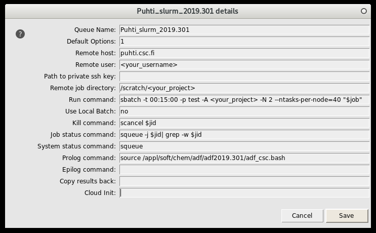

# AMS

The Amsterdam Modeling Suite offers DFT, semi-empirical, reactive force fields and fluid thermodynamics all with an integrated GUI, a powerful AMS driver and python scripting tool PLAMS. The main compute engines are ADF and BAND for electronic structure calculations (DFT), DFTB and MOPAC for more approximate methods to study larger systems.  

## Available

-   Puhti: AMS2021, ADF2021, BAND2021, DFTB2021, MOPAC2021, ReaxFF2021 , Version 2021.102
-   Mahti: AMS2021, ADF2021, BAND2021, DFTB2021, MOPAC2021, ReaxFF2021 , Version 2021.102

## License
-  The license entitles software usage by any academic researcher or student of an academic institute where "Academic" means "belonging to a degree-granting institute". 
-  The license does not include the right for employees of government labs or other non-academic non-profit research institutes to use the software. 
-  The license only allows non-profit non-commercial use. 
-  The license excludes all forms of contract research, royalty-bearing activities and other activities leading to monetary benefits.

## Usage

Initialise AMS:

```bash
module load ams/2021.102
```


**Example batch script for Puhti **

```
#!/bin/bash
#SBATCH --partition=test
#SBATCH --nodes=2
#SBATCH --ntasks-per-node=40      # MPI tasks per node
#SBATCH --account=yourproject     # insert here the project to be billed 
#SBATCH --time=00:10:00           # time as hh:mm:ss
#SBATCH --mem-per-cpu=1500        # requested memory per process in MB
module purge
module load ams/2021.102
export SCM_USE_LOCAL_IMPI=yes
export SCM_TMPDIR=$PWD

# Copy an example input file
cp -f $AMSHOME/examples/Benchmarks/ADF/Si35_TZ2P/Si35_TZ2P.inp .
"$AMSBIN/ams" < ./Si35_TZ2P.inp > ./Si35_TZ2P.log
```

!!! note
    Particularly some property calculations can be very disk I/O intensive. Such jobs benefit from using the [fast local storage (NVME)](../../computing/running/creating-job-scripts-puhti/#local-storage) on Puhti. Using local disk for such jobs will also reduce the load on the Lustre parallel file system.
 

   
**Example batch script for Puhti using local disk**

```
#!/bin/bash
#SBATCH --partition=large
#SBATCH --nodes=2
#SBATCH --ntasks-per-node=40      # MPI tasks per node
#SBATCH --account=yourproject     # insert here the project to be billed
#SBATCH --time=00:10:00           # time as hh:mm:ss
#SBATCH --mem-per-cpu=1500        # requested memory per process in MB
#SBATCH --gres=nvme:100           # requested local disk space in GB
module load ams/2021.102
export SCM_USE_LOCAL_IMPI=yes
export SCM_TMPDIR=$LOCAL_SCRATCH

# Copy an example input file
cp -f $AMSHOME/examples/Benchmarks/ADF/Si35_TZ2P/Si35_TZ2P.inp .
"$AMSBIN/ams" < ./Si35_TZ2P.inp > ./Si35_TZ2P.log
```

**Example batch script for Mahti**

```
#!/bin/bash
#SBATCH --partition=medium
#SBATCH --nodes=1
#SBATCH --ntasks-per-node=128 # MPI tasks per node
#SBATCH --account=yourproject # insert here the project to be billed
#SBATCH --time=00:20:00       # time as hh:mm:ss
module purge
module load ams/2021.102
export SCM_TMPDIR=$PWD

# Copy an example input file
cp -f $AMSHOME/examples/Benchmarks/ADF/Si35_TZ2P/Si35_TZ2P.inp .
"$AMSBIN/ams" < ./Si35_TZ2P.inp > ./Si35_TZ2P.log
```

### The AMS-GUIs

The Graphical User Interfaces (GUIs) that are installed on Puhti can be used via [NoMachine](nomachine.md).
Do a NoMachine login to Puhti and start an [interactive session](../computing/running/interactive-usage.md).
Move to a suitable scratch directory and load the ams module ```module load ams/2021.102```.
Start the input builder ```adfiput``` and construct your job. Once ready, submit the job to the batch queue (for settings, see the picture below).

 For an even better user experience it is also possible to install the GUIs on your own workstation. For details contact CSC [servicedesk@csc.fi](mailto:servicedesk@csc.fi) . In order to manage remote jobs you need to set up an ssh key pair between your workstation and Puhti,see [Setting up SSH keys](../../computing/connecting/#setting-up-ssh-keys).
For Windows users there is a [helpful video on how to do the setup](https://www.scm.com/wp-content/uploads/Videos/RemoteQueuesWithADFJobs.mp4).

Either using NoMachine or the local installation for building the job, the actual calculation should be done as batch jobs. 
Example queuing settings that can be used in the GUI:

The prolog line is:
 
```
source /appl/soft/chem/adf/ams2021.102/adf_csc.bash; export SCM_TMPDIR=$(mktemp -d /scratch/yourproject/$USER.XXXXXXXXX); export FORT_TMPDIR=$SCM_TMPDIR
```
!!! note
    Please change the emphasized *yourusername* and *yourproject* to correspond to yours.

## References

Depending on your usage, be careful to properly cite the AMS driver, used calculation engines as well as feature references. For details, see the [relevant documentation](https://www.scm.com/support/ ) 

## More information
-   [AMS2021 Support pages](https://www.scm.com/support/)
-   [Tutorials](https://www.scm.com/doc/Tutorials/index.html)
-   [Teaching materials](https://www.scm.com/support/adf-teaching-materials/)
-   [FAQ](https://www.scm.com/faq/)
-   [Newsletter](https://www.scm.com/newsletters/)
