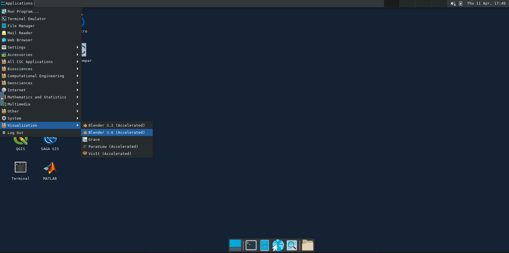

---
tags:
  - Free
---

# Blender

Blender is the free, open source 3D creation suite which supports a variety of graphical applications such as 3D pipeline—modeling, rigging, animation, simulation, rendering, compositing and motion tracking, even video editing and game creation. 

## Available

* **Puhti**: 3.2, 3.6

## License

* [GPL](https://download.blender.org/release/GPL3-license.txt)

## Usage

You need remote graphics to work with Blender. 

Launch an [web interface](https://docs.csc.fi/computing/webinterface/) for puhti

Select the [Accelerated visualization](https://docs.csc.fi/computing/webinterface/accelerated-visualization/) app from the web interface. Set the required resources.

Click "Launch Accelerated Visualization" button. This will open up a workspace on your browser. On the top left corner of your workspace, select 'Application finder' and search for 'blender'.
 

Select the Blender software version (3.2 or 3.6) and click "Launch" button. This will open (might take a few seconds) the Blender workspace.
 

## More information

* [Blender home page](https://www.blender.org/)
* [Blender video tutorials](https://docs.csc.fi/support/tutorials/blender-tutorial/)
* [Additional tutorials](https://www.youtube.com/results?search_query=%23b3d+tutorial&sp=EgIIBQ%253D%253D)
