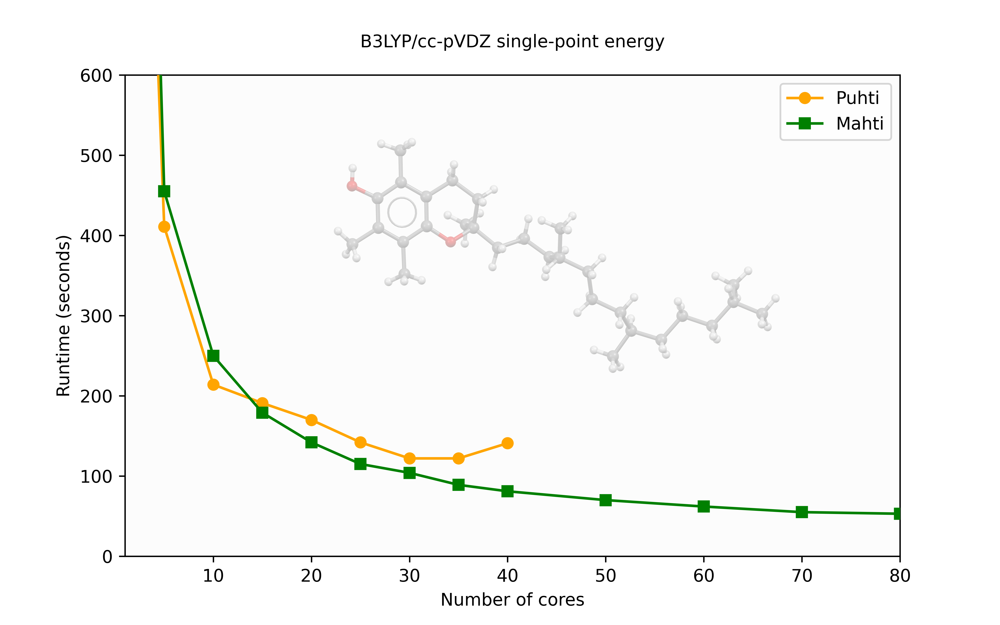
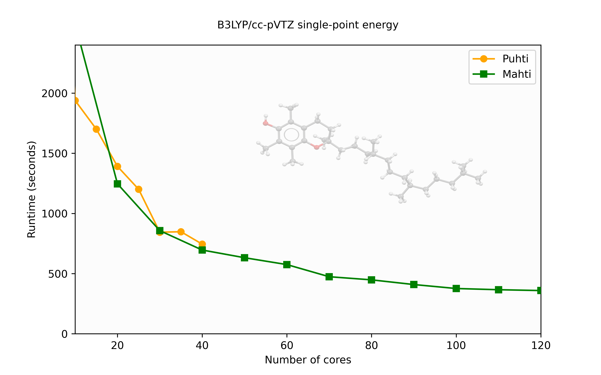
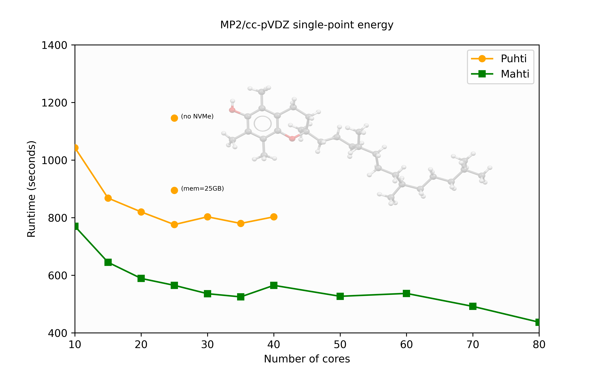

---
tags:
  - Other
---

# Gaussian

Gaussian is a versatile program package providing various capabilities for
electronic structure modeling.

## Available

- Puhti: `G16RevC.02`
- Mahti: `G16RevC.02`

## License

CSC has acquired a full commercial license for Gaussian. It is available to all
approved account holders, subject to license restrictions. To use Gaussian at
CSC, **your user ID must be added to the Gaussian user group.** Send a request
to the [CSC Service Desk](../support/contact.md).

## Usage

Initialize the Gaussian environment:

```bash
module load gaussian/G16RevC.02
```

Standard jobs are then conveniently submitted by using the `subg16` script:

```bash
subg16 hhh:mm:ss jobname <your project id> [NVMe disk]
```

where:

- `hhh:mm:ss` is the requested maximum wall time in hours, minutes and seconds.
- `jobname` is the name of the input file, excluding the `.com` extension.
- `[NVMe disk]` (optional) is the request for fast local NVMe disk in GB.

Run `subg16` without arguments to display more details.

## Performance considerations

For optimal performance of Gaussian jobs on CSC's servers, it is beneficial to
make some efficiency considerations. Some hints on how to estimate memory and
disk requirements can be found [here](http://gaussian.com/running/?tabid=3).
There is also a nice summary provided by
[NRIS on the topic](https://documentation.sigma2.no/software/application_guides/gaussian/gaussian_tuning.html).

Gaussian provides a large number of computational models, each with different
performance characteristics depending on available resources.

### Parallel calculations

The number of cores allocated for a job is set in the input file using the
`%NProcShared` flag.

In general, **the optimal number of cores is quite low**, so it is a good idea
to start with some test runs on a representative job using a small number of
cores, such as `%NProcShared=4`. Based on the test results, you can determine
the appropriate resources for actual production runs.

Increasing the number of cores does not always improve performance and may even
degrade it.

### Memory

Memory reservation in Gaussian is controlled using the `%Mem` flag in the input
file, where you specify the total amount of memory to be allocated for the
calculation.

For parallel jobs, Gaussian shares memory across multiple cores. Since much of
the data can be shared among threads, there is only a weak dependence of memory
usage on the number of cores. This means that increasing the number of cores
typically does not require a proportional increase in memory allocation.

The overall memory requirement depends on the method, basis set, and number of
cores. For more information, see
[Gaussian's official documentation](https://gaussian.com/techsupport/).

There are also some tools, like
[GaussMem](https://massimiliano-arca.itch.io/gaussmem), that can help estimate
memory needs.

!!! info "Note"
    On Mahti, each reserved CPU core is allocated **1.875 GiB of memory**. The
    only way to request more memory is to reserve additional cores. As a
    result, the optimal number of cores used by Gaussian may sometimes be lower
    than the number of reserved cores, depending on memory requirements.

### Using local disk (NVMe)

For disk I/O intensive jobs, such as highly correlated methods like **MP2**,
**CCSD(T)**, and property calculations like **vibrational frequency
calculations**, using the fast **NVMe local disk** on
[Puhti](../computing/running/creating-job-scripts-puhti.md#local-storage) or
[Mahti](../computing/running/creating-job-scripts-mahti.md#local-storage) can
significantly improve performance. Using local disk for such jobs will also
reduce the overall load on the Lustre parallel file system.

```bash
subg16 hhh:mm:ss jobname <your project id> [NVMe disk]
```

### Estimating optimal resources

Before running large-scale calculations, it's crucial to determine the **most
efficient** use of computational resources. Overallocating cores or memory can
lead to wasted resources and, in some cases, even slower performance.

#### **Step-by-Step Approach**

1. **Start small** – Begin with a test job using a modest number of cores
   (e.g., `%NProcShared=4`).
2. **Monitor performance** – After the job completes, use the `seff` command to
   check CPU utilization, memory efficiency, and job runtime.
3. **Gradually increase resources** – Double the core count in steps (e.g., 4 →
   8 → 16) and observe the impact on performance.
4. **Identify the efficiency plateau** – If the speedup gained by doubling the
   cores falls below 1.5, further increases are likely inefficient.
5. **Consider disk and memory needs** – Some methods (e.g., **MP2, CCSD(T),
   frequency calculations**) benefit more from sufficient memory and fast local
   disk (NVMe) than additional cores. Insufficient memory or slow disk I/O can
   cause bottlenecks and poor scaling.

Efficient resource allocation ensures faster runs, minimizes queuing times, and
avoids unnecessary system load.

### Performance example

Here, we provide a brief example of how different resource allocations affect
Gaussian's performance and what factors should be considered. We use
[α-Tocopherol](https://en.wikipedia.org/wiki/%CE%91-Tocopherol) (a type of
vitamin E) as the input structure. The input file is available at
[vitamin_e.com](https://a3s.fi/gaussian/vitamin_e.com).

The tests were conducted in a **production environment**, where job
interference may introduce performance fluctuations. Additionally, some
variability arises from the arbitrary placement of allocated cores within a
node. This internal hierarchy can influence performance.

First, we compare the runtime and scaling of a `b3lyp/cc-pVDZ, %mem=10GB, 10GB
NVMe` single-point calculation. This calculation requires only modest memory
and disk resources, so increasing them should not affect performance.



For this specific case, the scaling on Puhti starts to level off beyond 30
cores, while on Mahti, the scaling continues at a reasonable level up to about
80 cores.

If we perform the same calculation but increase the size of the basis set to
`b3lyp/cc-pVTZ`, the `%mem=10GB, 10GB NVMe` allocation is still sufficient for
all requirements.



For this larger calculation, the scaling on Puhti remains good up to a full
node. On Mahti, however, the scaling begins to level off around 100 cores.

For a wave function-based method like `MP2/cc-pVDZ, %mem=100GB, 200GB NVMe`,
both the reserved memory and the use of local disk (NVMe) have a significant
impact on performance, as shown in the following graph:



On Puhti, the speedup levels off at around 25 cores, while on Mahti, the
performance gain continues up to approximately 35 cores.

Tests on Puhti highlight the importance of allocating sufficient memory.
Additionally, the notable performance improvement from using local disk (NVMe)
over the standard scratch disk (about 30% faster!) indicates that local disk
should always be the preferred option for these types of calculations.

## References

- [How to cite Gaussian](http://gaussian.com/citation_b01/) in your
  publications.

## More information

- [Online Gaussian user reference](http://gaussian.com/man/)
- [Using Gabedit as GUI for Gaussian jobs on Puhti](../support/tutorials/gabedit_gaussian.md)
- [Farming Gaussian jobs with HyperQueue](https://csc-training.github.io/csc-env-eff/hands-on/throughput/gaussian_hq.html)
