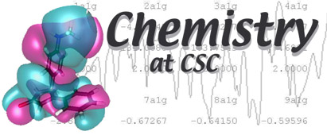

# Gaussian

## Gaussian is a versatile quantum chemistry program package

Initialise use on Taito like this:

```bash
$ module load gaussian/G16RevA.03
```

which will initialise the default module.

This will show all available versions:
```bash
$ module avail gaussian
```

!!! tip
    This is a tip of high importance

!!! warning
    This is a warning of high importance

!!! note
    This is a note of high importance
    
    With two lines

Testing reference style figure

![alt text][logo]

[logo]: ../images/chemistry-logo.jpg "Chemistry logo"

non reference style:

{ width=90% }

###Table for scaling performance

|||||||||
|--- |--- |--- |--- |--- |--- |--- |--- |
||(Node archictecture / Code optimization to)|cores|gmx 4.5.6|gmx 4.6.7|gmx 5.1.5|gmx 2016.5|gmx 2018.1|
|Taito|Hsw/Hsw|48|-|-|45.505|48.407|49.369|
|Taito|Hsw/Snb|48|21.523|21.9|38.953|40.987|41.318|
|Taito|Snb/Snb|48|20.694|20.513|28.559|34.958|39.906|
|Sisu|Hsw/Hsw|48|-|30.104|39.935|48.979|49.624|
|Sisu|Hsw/Hsw|96|-|62.499|80.769|86.638|96.194|
|Taito-gpu|k80:1/Hsw|6|-|-|-|23.964|27.18|
|Taito-gpu|p100:1/Hsw|7|-|-|-|31.703|55.041|
|Taito-gpu|p100:4/Hsw|28|-|-|-|-|62.868|

## Example batch script

```
#!/bin/bash -l
#SBATCH -t 00:30:00
#SBATCH -p parallel
#SBATCH --constraint=snb
#SBATCH --ntasks-per-node=16
#SBATCH --nodes=8
#SBATCH -J GMX
#SBATCH -o ogmx.%j
#SBATCH -e egmx.%j
#SBATCH --mem-per-cpu=512
#SBATCH --mail-type=END
##SBATCH --mail-user=your.email@your.domain  # edit the email and uncomment to get mail

# this script runs a 128 core (8 full Sandy Bridge nodes) gromacs job, requesting 30 minutes time

export OMP_NUM_THREADS=1

# module load gromacs-env/5.1.x-snb # change x to the latest version
# un/comment to use the older 5.1.x version
module load gromacs-env/2016.x-snb # change x to the latest version
```
