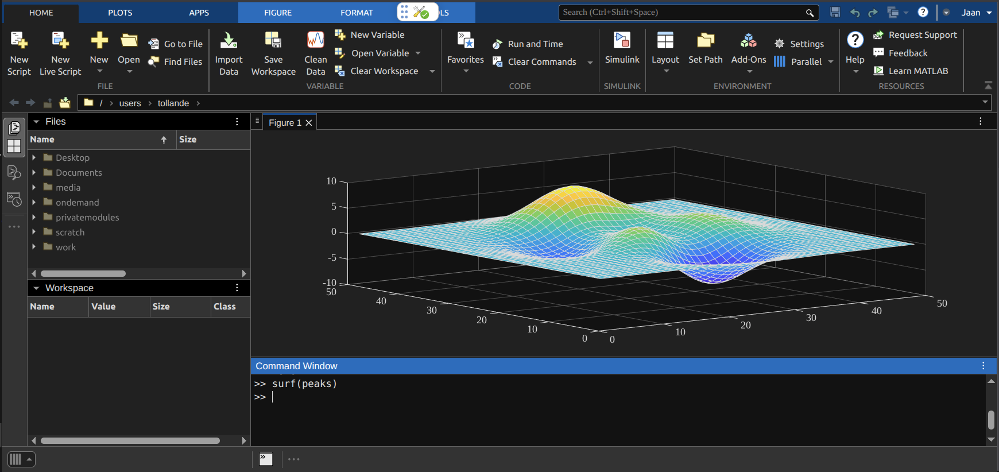
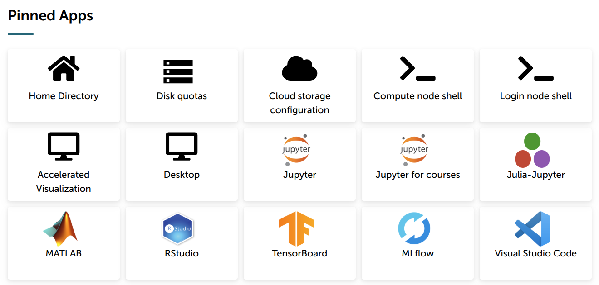
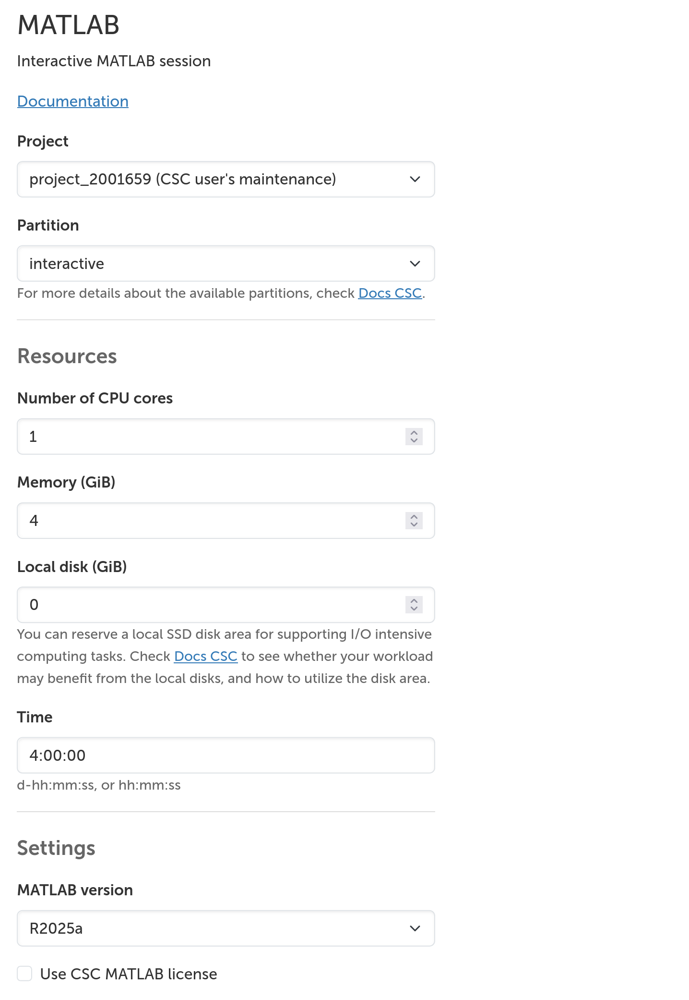
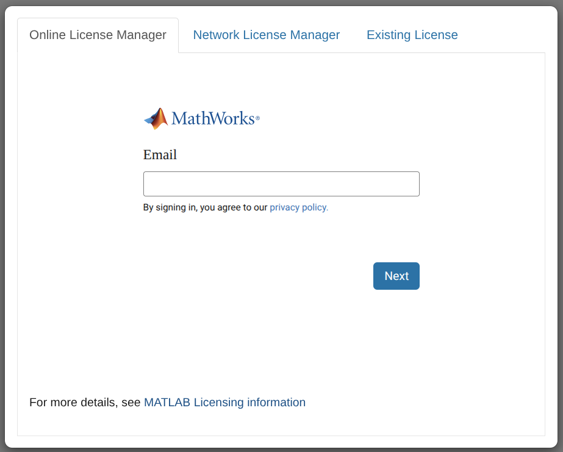

---
tags:
  - Academic
catalog:
  name: MATLAB
  description: High-level technical computing language
  license_type: Academic
  disciplines:
    - Mathematics and Statistics
  available_on:
    - web_interfaces:
        - LUMI
        - Puhti
    - LUMI
    - Puhti
---

# MATLAB

[MATLAB](https://mathworks.com/products/matlab.html) is a high-level technical computing language and interactive environment for algorithm development, data visualization, data analysis, and numeric computation.

[TOC]


## License

MATLAB is proprietary software that requires a valid license to use.
Additionally, each toolbox requires its own separate license for access to its functionality.

While MATLAB installations on the supercomputers include all available toolboxes, installation alone does not grant usage rights.
You must have a valid license for each specific toolbox you wish to use.

License options are covered in the following sections.


## Overview

We offer three ways to use MATLAB on CSC supercomputers. The best choice depends on your needs.

1. **MATLAB web application** is best for interactive use.
It works like the desktop version and lets you use your own license (home, individual, student, or campus-wide) with all your toolboxes.
You can also use a network license.
Available on Puhti, Mahti, and LUMI.

2. **MATLAB command line interface** is good for basic interactive and batch work.
Requires a network license.
Available on Puhti, Mahti, and LUMI.

3. **MATLAB parallel server** is best for batch computing.
You can send jobs from your local MATLAB to the supercomputer.
Your local toolboxes work on the supercomputer too.
The supercomputer workers use CSC's network license.
Available on Puhti only.

All options support MATLAB versions R2023b to R2025a.
The parallel server also supports older versions back to R2021a.

CSC provides the following licenses, shared between all users, for **academic** use:

=== "Puhti and Mahti"

    A network license `1766@license4.csc.fi` provides the following academic licenses for Puhti and Mahti: 5 MATLAB, 2 Parallel Computing Toolbox, 500 MATLAB Parallel Server.
    The academic license allows use only for affiliates, that is, staff and students, of Finnish higher education institutions.

=== "LUMI"

    A network license `1766@license10.csc.fi` provides the following academic licenses for LUMI: 25 MATLAB, 25 Simulink, 25 Control System Toolbox, 25 Curve Fitting Toolbox, 25 Deep Learning Toolbox, 25 Global Optimization Toolbox, 25 Image Processing Toolbox, 25 Optimization Toolbox, 25 Parallel Computing Toolbox, 25 Signal Processing Toolbox, 25 Statistics and Machine Learning Toolbox, 25 Wavelet Toolbox.
    The academic license allows use only for teaching and academic research at degree-granting institutes.

!!! info
    If you are a user from a commercial company or research institute, you must bring and use your own **commercial** license.
    Please [contact CSC Service Desk](../support/contact.md) for further instructions.


## MATLAB web application

{width=1000}

We recommend using the [web interface](../computing/webinterface/index.md) to use MATLAB interactively.

1. Start by logging into the web interface of the cluster you want to use: [www.puhti.csc.fi](https://www.puhti.csc.fi), [www.mahti.csc.fi](https://www.mahti.csc.fi) or [www.lumi.csc.fi](https://www.lumi.csc.fi).

2. Then press the MATLAB icon to choose the MATLAB web application.
    - {width=400}

3. In the submit form, select appropriate resources for your session.
We recommend at least 8 GB of memory before launching the MATLAB application.
The MATLAB web application by itself consumes around 4 GB of memory.
    - {width=400}

4. You will be presented with the MATLAB web application license GUI.
Select Online License Manager to log in with your MathWorks credentials.
If you don't have a MathWorks account, you need to [create a MathWorks account](https://www.mathworks.com/mwaccount/account/create) with your university's or organization's email address.
Alternatively, select Network License Manager to use a network license.
    - {width=400}

5. The MATLAB application takes a couple of minutes to load.
Then press Connect to MATLAB and the web application will open.

!!! error
    If you are trying to log in using MathWorks credentials, but the MATLAB license GUI automatically loads the CSC license server, you need to clear the cached credentials first.
    To do this:

    1. Open the **Login node shell** application in the web interface.
    2. Run the following command to remove the cached credentials:
       ```bash
       rm -rf "$HOME/.matlab/MWI"
       ```


## MATLAB command-line interface

=== "Puhti and Mahti"

    On Puhti and Mahti, we can load the MATLAB module as follows:

    ```bash
    module load matlab
    ```

=== "LUMI"

    On LUMI, we must add the module files under CSC's local directory to the module path before loading the module as follows:

    ```bash
    module use /appl/local/csc/modulefiles
    module load matlab
    ```

We can open the MATLAB command line interface as follows:

```bash
matlab -nodisplay
```

We can also run MATLAB scripts using the batch mode as follows:

```bash
matlab -batch <script>
```

You can use a different license by setting the following environment variable before starting MATLAB:

```bash
export MLM_LICENSE_FILE="port@mylicenseserver.com"
```


## Computational threads and parallel computing toolbox

MATLAB's linear algebra operations, element-wise operations on large arrays, and built-in mathematical operations have built-in threading, which is controlled by `maxNumCompThreads`.
MATLAB typically sets it automatically to the correct value, even in Slurm jobs.
You can compare the effects of setting one versus two threads for matrix multiplication by running the following MATLAB script:

```matlab title="compthreads.m"
A = rand(1000, 1000);

% One thread
maxNumCompThreads(1);
t0 = tic;
B = A*A;
t1 = toc(t0);

% Two threads
maxNumCompThreads(2);
t2 = tic;
C = A*A;
t3 = toc(t2);

% Compare times
fprintf("One thread : %d\nTwo threads: %d\n", t1, t3);
```

We can also parallelize code in MATLAB using the high-level constructs from the [Parallel Computing Toolbox](https://mathworks.com/help/parallel-computing/index.html).
Consider the following serial code that pauses for one second `n` times and measures the execution time:

```matlab title="funcSerial.m"
function t = funcSerial(n)
t0 = tic;
for idx = 1:n
    pause(1);
end
t = toc(t0);
end
```

The following serial execution should run for around two seconds:

```matlab
t_serial = funcSerial(2)
```

We can parallelize the function using the parallel for-loop construct, `parfor`, as follows:

```matlab title="funcParallel.m"
function t = funcParallel(n)
t0 = tic;
parfor idx = 1:n
    pause(1);
end
t = toc(t0);
end
```

To run parallel code, we need to create a parallel pool using processes or threads and then run the parallel code.
We can create a parallel pool using two processes and run the parallel code with the same argument as the serial version, but it should only take around one second:

```matlab title="funcProcesses.m"
function t = funcProcesses(n)
pool = parpool('Processes', n);
t = funcParallel(n);
delete(pool);
end
```

```matlab
t_processes = funcProcesses(2)
```

Here's the same using a parallel pool with threads:

```matlab title="funcThreads.m"
function t = funcThreads(n)
pool = parpool('Threads', n);
t = funcParallel(n);
delete(pool);
end
```

```matlab
t_threads = funcProcesses(2)
```

It is also possible to use GPUs in MATLAB, but only Nvidia GPUs are supported.
We can query the available GPU devices and perform computation on the GPU as follows:

```matlab title="funcGPU.m"
function C = funcGPU(n)
gpuDevice();
A_gpu = gpuArray(rand(n, n));
B_gpu = gpuArray(rand(n, n));
C_gpu = A_gpu * B_gpu;
C = gather(C_gpu);
end
```

Let's run the function:

```matlab
C = funcGPU(1000);
```


## MATLAB Parallel Server

### Local configuration

MATLAB Parallel Server (MPS) allows users to send batch jobs from MATLAB on the user's computer to the Puhti cluster's MATLAB workers.
Using MPS requires the following configuration on the user's computer: MATLAB installation with a supported MATLAB version, the Parallel Computing Toolbox, [SSH access](../computing/connecting/ssh-keys.md) to the Puhti cluster, and a user-side configuration.
Install the user-side configuration files by running the following MATLAB script:

```matlab title="mps_puhti.m"
% Define local MATLAB configuration directory.
if ispc()
    % Windows
    confroot = fullfile(getenv("APPDATA"), "Mathworks", "MATLAB");
elseif isunix() || ismac()
    % Unix (Linux) or MacOS
    confroot = fullfile(getenv("HOME"), ".matlab");
else
     % Operating system not supported
     exit();
end

% Path to where the ZIP file is downloaded.
confzip = fullfile(confroot, "mps_puhti.zip");

% Remove previous zipfile if exists
if exist(confzip, "file") == 2
    delete(confzip);
end

% Path to the directory where configuration files are extracted.
confdir = fullfile(confroot, "mps_puhti");

% Remove previous zipdir if exists
if exist(confdir, "dir") == 7
    rmdir(confdir, 's');
end

% Download the configuration files as a ZIP file.
websave(confzip, "https://github.com/CSCfi/csc-env-matlab/raw/refs/heads/main/config/mps_puhti.zip");

% Extract the configuration files to the configuration directory.
unzip(confzip, confdir);

% Persist path to the configuration files.
addpath(confdir);
savepath();
```

Next, let's configure a cluster profile that allows your MATLAB to submit jobs to Puhti.
Supply your Puhti username to the prompt.

```matlab title="MATLAB script"
configCluster();
```

Finally, we can test the connection from MATLAB to Puhti.
The first time you connect, MATLAB will prompt you to choose between password or SSH key authentication.
You **must** select the SSH key authentication, provide the path to your private key and enter the password for the private key if one exists.
Password authentication is no longer supported on Puhti.
MATLAB will store the path to your key and will not request it again in future sessions.

```matlab title="MATLAB script"
c = parcluster();
cscWorkspaces(c);
```

!!! error
    If you are using PuTTY to generate SSH keys, you **must** export the private key as an **OpenSSH key** and use it with MATLAB Parallel Server.
    The PuTTY Private Key format (`.ppk`) will **not** work.


### Single node serial, parallel and GPU jobs
We define the resource reservation using [`parcluster`](https://www.mathworks.com/help/parallel-computing/parcluster.html) and submit the function or script to the cluster using [`batch`](http://www.mathworks.com/help/distcomp/batch.html).
The `parcluster` object is stateful, thus we explicitly unset properties when they are unused, such as GPUs for CPU-only jobs.
You can use the following examples; just replace `<project>` with your project, such as `project_2001234`, and modify the resource reservation to suit your needs.

=== "Serial"

    ```matlab title="serial.m"
    c = parcluster();
    c.AdditionalProperties.ComputingProject = '<project>';  % --account=<ComputingProject>
    c.AdditionalProperties.Partition = 'small';             % --partition=<Partition>
    c.AdditionalProperties.WallTime = '00:15:00';           % --time=<WallTime>
    c.NumThreads = 1;                                       % --cpus-per-task=<NumThreads>
    c.AdditionalProperties.MemPerCPU = '4g';                % --mem-per-cpu=<MemPerCPU>
    c.AdditionalProperties.GPUCard = '';                    % --gres=gpu:<GPUCard>:<GPUsPerNode>
    c.AdditionalProperties.GPUsPerNode = 0;
    j = batch(c, @funcSerial, 1, {2}, 'CurrentFolder', '.', 'AutoAddClientPath', false);
    ```

=== "Parallel"

    ```matlab title="parallel.m"
    c = parcluster();
    c.AdditionalProperties.ComputingProject = '<project>';  % --account=<ComputingProject>
    c.AdditionalProperties.Partition = 'small';             % --partition=<Partition>
    c.AdditionalProperties.WallTime = '00:15:00';           % --time=<WallTime>
    c.NumThreads = 2;                                       % --cpus-per-task=<NumThreads>
    c.AdditionalProperties.MemPerCPU = '4g';                % --mem-per-cpu=<MemPerCPU>
    c.AdditionalProperties.GPUCard = '';                    % --gres=gpu:<GPUCard>:<GPUsPerNode>
    c.AdditionalProperties.GPUsPerNode = 0;
    j = batch(c, @funcThreads, 1, {2}, 'CurrentFolder', '.', 'AutoAddClientPath', false);
    ```

=== "GPU"

    ```matlab title="gpu.m"
    c = parcluster();
    c.AdditionalProperties.ComputingProject = '<project>';  % --account=<ComputingProject>
    c.AdditionalProperties.Partition = 'gpu';               % --partition=<Partition>
    c.AdditionalProperties.WallTime = '00:15:00';           % --time=<WallTime>
    c.NumThreads = 1;                                       % --cpus-per-task=<NumThreads>
    c.AdditionalProperties.MemPerCPU = '4g';                % --mem-per-cpu=<MemPerCPU>
    c.AdditionalProperties.GPUCard = 'v100';                % --gres=gpu:<GPUCard>:<GPUsPerNode>
    c.AdditionalProperties.GPUsPerNode = 1;
    j = batch(c, @funcGPU, 1, {1000}, 'CurrentFolder', '.', 'AutoAddClientPath', false);
    ```

In the example, we set the working directory to the home directory in the cluster by setting `'CurrentFolder'` to `'.'`.
Also, we should disable MATLAB from adding the local MATLAB search path to the remote workers by setting `'AutoAddClientPath'` to `false`.
These examples reserve 1 MATLAB Parallel Server license on the cluster for the duration of the job.


### Multinode jobs

!!! warning
    Multinode jobs do not seem to work in R2025a.

We can also create a parallel pool of workers by setting the `'Pool'` argument to the number of workers we want to reserve (translates to `--ntasks=<PoolSize>` in the Slurm reservation).
The `parcluster` resources specify how many resources are reserved per worker.
**We should reserve a pool in this way when we need more workers than can fit into a single node; otherwise, we can reserve a parallel job as was described in the previous section and reserve a pool with threads or processes.**

Here is an example of a parallel pool with 50 workers:

```matlab title="pool.m"
c = parcluster();
c.AdditionalProperties.ComputingProject = '<project>';  % --account=<ComputingProject>
c.AdditionalProperties.Partition = 'large';             % --partition=<Partition>
c.AdditionalProperties.WallTime = '00:15:00';           % --time=<WallTime>
c.NumThreads = 1;                                       % --cpus-per-task=<NumThreads>
c.AdditionalProperties.MemPerCPU = '4g';                % --mem-per-cpu=<MemPerCPU>
c.AdditionalProperties.GPUCard = '';                    % --gres=gpu:<GPUCard>:<GPUsPerNode>
c.AdditionalProperties.GPUsPerNode = '';
j = batch(c, @funcParallel, 1, {50}, 'Pool', 50, 'CurrentFolder', '.', 'AutoAddClientPath', false);
```

Note that the parallel pool will always request one additional process to manage the pool of workers.
This example reserves 51 MATLAB Parallel Server licenses on the cluster for the duration of the job.
Puhti has 500 MATLAB Parallel Server licenses shared by all users.


### Querying jobs and output

Get a handle on the parcluster object:

```matlab
c = parcluster();
```

Retrieve the last 5 jobs:

```matlab
c.Jobs(end-4:end)
```

Retrieve a job by its identifier:

```matlab
j = c.findJob('ID', 11);
```

We can fetch the function outputs of a completed job as follows:

```matlab
result = j.fetchOutputs()
```

We can read the output of the job as follows:

```matlab
diary(j)
```

We can also query the efficiency of a job:

```matlab
seff(j)
```

Data that has been written to files on the cluster needs to be retrieved directly from the file system, for example, using `scp`.


<!--
### Checking license status
You can check the status of MPS licenses on Puhti after logging in with `scontrol` command.

```bash
scontrol show lic=mdcs
```

```text
LicenseName=mdcs
    Total=500 Used=320 Free=180 Remote=no
```
-->
