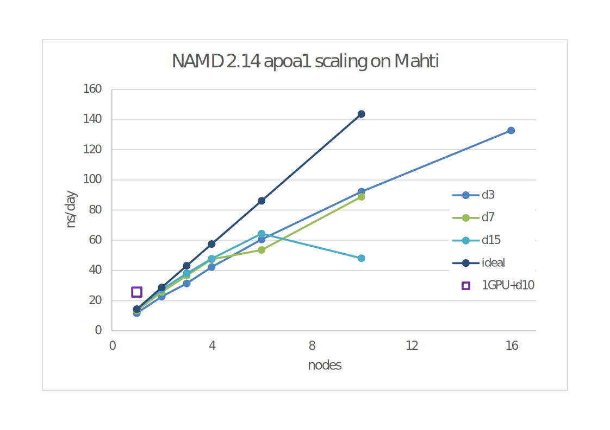

# NAMD

NAMD is a parallel molecular dynamics code designed for high-performance
simulation of large biomolecular systems. The software is developed and
distributed by the Theoretical and Computational Biophysics Group at the
Beckman Institute of the University of Illinois.

## Available

* Puhti: version 2.13, 2.14-cuda
* Mahti-rhel7:: version 2.14

## License

CSC has obtained a Computing Centre [license](https://www.ks.uiuc.edu/Research/namd/license.html),
which allows usage for non-commercial research. For commercial use, contact 
(namd@ks.uiuc.edu) See also acknowledging usage below.

## Usage

NAMD can be run either with CPUs or with a GPU + CPUs.

### Performance considerations

NAMD developers recommend to use one core per task for communication for CPU.
Please test with your input. Make sure the "number tasks per node" times 
"cpus per task" equals 40 (Puhti) or 128 (Mahti-rhel7), i.e. all cores in a node.
Try different ratios and select the optimal one. Tests show that leaving
one core for communication for each task is beneficial i.e. `namd_threads=$SLURM_CPUS_PER_TASK-1`

The data below shows the apoa1 benchmark on Mahti-rhel7 (ns/day as a function
of allocated nodes, each line with a certain number of `namd_threads`
as set in the [Mahti-rhel7 script below](#batch-script-example-for-mahti)).
Apoa1 system has 92k atoms.



The data also shows the following things:

* optimal settings depend on the amount of resources in addition to system and run parameters
* for this system, upto 6 nodes, it's best to use 15 threads per task, but beyond that 3 threads scales better
* 1GPU+10 CPUs (on Puhti) gives 25.6 ns/day vs. 27.4 ns/day for 2 full nodes on Mahti-rhel7,
  or 92.2 ns/day with 10 nodes. The corresponding costs (via BUs) are 1.4, 4.2, and 
  6.2 EUR, respectively, i.e. getting the results more quickly is also more expensive.
* to test your own system, run e.g. 500 steps of dynamics and look at the Benchmark line on the output

### Batch script example for Puhti

This script would use 2 tasks per node, 20 cores per task,
and one of them for communication, using two full nodes, i.e. 80 cores.

```
#!/bin/bash 
#SBATCH --partition=test
#SBATCH --nodes=2             
#SBATCH --time=0:06:00        
#SBATCH --account=<project>
#SBATCH --ntasks-per-node=2  # test to find the optimum number, 2-20
#SBATCH --cpus-per-task=20   # 40/(ntasks-per-node)

module load namd

(( namd_threads = SLURM_CPUS_PER_TASK - 1))

# one core per task for communication
srun -n ${SLURM_NTASKS} namd2 +ppn $namd_threads +isomalloc_sync apoa1.namd  > apo1.out

# While NAMD suggests using 1 thread per task for communication (as above)
# all cores for computing can be tested by
#srun -n ${SLURM_NTASKS} namd2 +ppn ${SLURM_CPUS_PER_TASK} +isomalloc_sync apoa1.namd  > apo1.out
```
### Batch script example for Puhti using GPU

Note, namd runs most efficiently with one GPU, and at least for small systems
is much more cost efficient than running with multiple CPU-only nodes.

```
#SBATCH --partition=gputest
#SBATCH --ntasks=1         
#SBATCH --cpus-per-task=10  
#SBATCH --time=0:10:00     
#SBATCH --account=<project>
#SBATCH --gres=gpu:v100:1

export OMP_NUM_THREADS=$SLURM_CPUS_PER_TASK
export SLURM_CPU_BIND=none

module load namd/2.14-cuda

namd2 +p${SLURM_CPUS_PER_TASK} +setcpuaffinity +devices ${GPU_DEVICE_ORDINAL} apoa1.namd  > apoa1.out
```

### Batch script example for Mahti-rhel7

```
#!/bin/bash -l
#SBATCH --partition=test
#SBATCH --ntasks-per-node=8  # test to find the optimum number, 2-64
#SBATCH --cpus-per-task=16   # 128/(ntasks-per-node)
#SBATCH --nodes=2
#SBATCH --time=0:10:00        # time as hh:mm:ss
#SBATCH --account=<project>

module load gcc/9.3.0 openmpi/4.0.3 namd/2.14

(( namd_threads = SLURM_CPUS_PER_TASK - 1))

# one core per task for communication
srun -n ${SLURM_NTASKS} namd2 +ppn $namd_threads +isomalloc_sync apoa1.namd  > apo1.out
```

Submit the batch job with:

```
sbatch namd_job.bash
```

## References

The NAMD License Agreement specifies that any reports or published
results obtained with NAMD shall acknowledge its use and credit the
developers as:

-   "NAMD was developed by the Theoretical and Computational Biophysics
    Group in the Beckman Institute for Advanced Science and Technology
    at the University of Illinois at Urbana-Champaign."

James C. Phillips, Rosemary Braun, Wei Wang, James Gumbart, Emad
Tajkhorshid, Elizabeth Villa, Christophe Chipot, Robert D. Skeel,
Laxmikant Kale, and Klaus Schulten. Scalable molecular dynamics with
NAMD. *Journal of Computational Chemistry*, 26:1781-1802, 2005.
[abstract], [journal]  
  
In addition, electronic documents should include the following link:
<http://www.ks.uiuc.edu/Research/namd/>

## More information

[NAMD manual]

[NAMD home page.]


  [abstract]: http://www.ks.uiuc.edu/Publications/Papers/abstract.cgi?tbcode=PHIL2005
  [journal]: http://www3.interscience.wiley.com/cgi-bin/abstract/112102010/ABSTRACT
  [NAMD manual]: http://www.ks.uiuc.edu/Research/namd/current/ug/
  [NAMD home page.]: http://www.ks.uiuc.edu/Research/namd/
