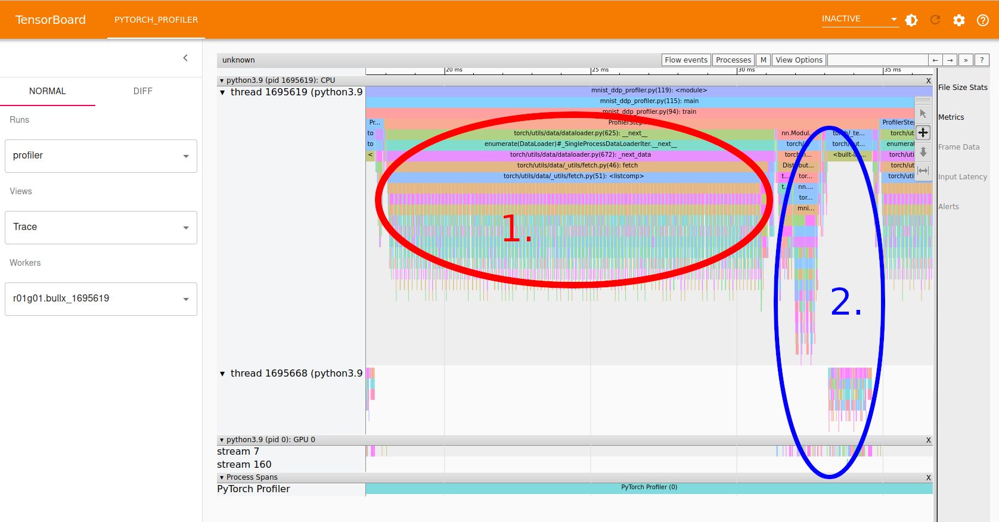

---
tags:
  - Free
catalog:
  name: PyTorch
  description: Machine learning framework for Python
  description_fi: Koneoppimisen kehys Pythonille
  license_type: Free
  disciplines:
    - Data Analytics and Machine Learning
  available_on:
    - LUMI
    - Puhti
    - Mahti
---

# PyTorch { #pytorch }

Koneoppimisen kehys Pythonille.

!!! info "Uutiset" 

    **8.7.2025** PyTorch 2.7.1 asennettu Puhtiin ja Mahtiin ja asetettu
    oletusversioksi. Tämä versio sisältää
    [SGLangin](https://docs.sglang.ai/); huomaa kuitenkin, että SGLang
    toimii vain Mahtissa Puhtin vanhemman GPU-arkkitehtuurin vuoksi.
    
    **26.6.2025** PyTorch 2.7.1 asennettu LUMIin ja asetettu oletusversioksi. 

    **10.4.2025** PyTorch 2.6.0 asennettu Puhtiin ja Mahtiin ja asetettu
    oletusversioksi. Sisältää uusimmat versiot suosituista paketeista,
    kuten Hugging Face transformers, vLLM ja FAISS. PyTorch Geometric
    ja siihen liittyvät paketit eivät enää ole mukana, koska ne eivät
    tue uudempia PyTorch-versioita.

    **20.1.2025** PyTorch 2.5.1 asetettu oletusversioksi kaikilla supertietokoneilla.

    **20.12.2024** PyTorch 2.5.1 ROCm 6.2:lla lisätty LUMIin. Sisältää kaikki
    tavanomaiset paketit sekä kokeellisen tuen FAISSille.
    
    **17.12.2024** PyTorch 2.5.1 lisätty Puhtiin ja Mahtiin. Mukana vLLM
    ja FAISS monien muiden päivitysten ohella.

    **19.9.2024** PyTorch 2.4.1 ROCm 6.1:llä lisätty LUMIin. LUMIn
    PyTorch-moduuli sisältää nyt [vLLM-version
    0.5.5](https://docs.vllm.ai/en/latest/) sekä lisäksi
    FlashAttention-2:n, bitsandbytesin ja monia muita usein pyydettyjä
    paketteja, jotka on lisätty jo aiempiin asennuksiin. LUMIn moduuli
    käyttää edelleen vanhan mallisia wrappereita (ei tykky-pohjaisia
    wrappereita kuten Puhtissa ja Mahtissa).

    **21.8.2024** PyTorch 2.4 lisätty Puhtiin ja Mahtiin. LUMIn asennus
    viivästyy nykyisen huoltokatkon jälkeiseen aikaan. torchtext-paketti
    ei ole enää mukana, koska se on poistettu käytöstä eikä toimi
    PyTorch 2.4:n kanssa.

    **13.6.2024** PyTorch 2.3 lisätty Puhtiin ja Mahtiin. LUMIn asennus
    viivästyy alkusyksyyn epäyhteensopivan ROCm-ajuriversion vuoksi.
    Tässä versiossa on myös päivitetty Python-komentojen wrappaus,
    mikä ratkaisee useita ongelmia virtuaaliympäristöjen ja Jupyter
    Notebookien käytössä. Tämän vuoksi `apptainer`- ja
    `apptainer_wrapper`-komennot eivät enää toimi, mutta muilta osin
    muutos on käyttäjille näkymätön.

    **1.3.2024** PyTorch 2.2 lisätty Puhtiin, Mahtiin ja LUMIin. LUMIn
    moduuli sisältää ROCm-versiot
    [FlashAttention-2:sta](https://github.com/ROCm/flash-attention) 
    ja [bitsandbytesista](https://github.com/ROCm/bitsandbytes), koska
    näiden lisääminen itse on hankalaa. 
    [xFormers](https://github.com/facebookresearch/xformers) on lisätty
    kaikkiin kolmeen järjestelmään.

    **17.11.2023** PyTorch 2.1 lisätty Puhtiin, Mahtiin ja LUMIin. Horovod on
    poistettu; suosittelemme käyttämään [PyTorch DDP:tä](../support/tutorials/ml-multi.md) 
    sen sijaan. [PyTorch Geometric](https://pytorch-geometric.readthedocs.io/) 
    lisättiin Puhti- ja Mahti-versioihin.
    
    **5.10.2022** Puhtin päivityksen Red Hat Enterprise Linux 8:aan
    (RHEL8) vuoksi **täysin tuettujen PyTorch-versioiden määrä on
    vähentynyt. Aiemmin vanhentuneet conda-pohjaiset versiot on
    poistettu.** Ota tarvittaessa [yhteyttä palvelupisteeseemme](../support/contact.md),
    jos todella tarvitset pääsyn vanhempiin versioihin.

    **5.5.2022** Mahtin päivityksen Red Hat Enterprise Linux 8:aan (RHEL8)
    vuoksi täysin tuettujen PyTorch-versioiden määrä on vähentynyt. Ota tarvittaessa
    [yhteyttä palvelupisteeseemme](../support/contact.md), jos todella tarvitset muita versioita.

    **4.2.2022** Kaikki vanhat PyTorch-versiot, jotka perustuivat suoriin
    Conda-asennuksiin, on merkitty vanhentuneiksi, ja kannustamme käyttäjiä
    siirtymään uudempiin versioihin. Lue lisää erilliseltä
    [Conda-käytöstäpoistosivulta](../support/tutorials/conda.md).


## Saatavilla { #available }

Tällä hetkellä tuetut PyTorch-versiot:

| Version | Module         | Puhti | Mahti | LUMI | Notes                      |
|:--------|----------------|:-----:|:-----:|------|:---------------------------|
| 2.7.1   | `pytorch/2.7`  | X     | X     | X    | Oletus                     |
| 2.6.0   | `pytorch/2.6`  | X     | X     | -    |                            |
| 2.5.1   | `pytorch/2.5`  | X     | X     | X    |                            |
| 2.4.1   | `pytorch/2.4`  | -     | -     | X    |                            |
| 2.4.0   | `pytorch/2.4`  | X     | X     | -    | Uudet tykky-pohjaiset wrapperit |
| 2.3.1   | `pytorch/2.3`  | X     | X     | -    | Uudet tykky-pohjaiset wrapperit |
| 2.2.2   | `pytorch/2.2`  | -     | -     | X    |                            |
| 2.2.1   | `pytorch/2.2`  | X     | X     | -    |                            |
| 2.1.2   | `pytorch/2.1`  | -     | -     | X    |                            |
| 2.1.0   | `pytorch/2.1`  | X     | X     | -    |                            |
| 2.0.1   | `pytorch/2.0`  | -     | -     | X    |                            |
| 2.0.0   | `pytorch/2.0`  | X     | X     | -    |                            |
| 1.13.1  | `pytorch/1.13` | -     | -     | X    | rajoitettu monisolmutuki   |
| 1.13.0  | `pytorch/1.13` | X     | X     | -    |                            |
| 1.12.0  | `pytorch/1.12` | X     | X     | -    |                            |
| 1.11.0  | `pytorch/1.11` | X     | X     | -    |                            |
| 1.10.0  | `pytorch/1.10` | (x)   | (x)   | -    |                            |
| 1.9.0   | `pytorch/1.9`  | (x)   | (x)   | -    |                            |
| 1.8.1   | `pytorch/1.8`  | (x)   | (x)   | -    |                            |
| 1.7.1   | `pytorch/1.7`  | (x)   | -     | -    |                            |

Sisältää [PyTorchin](https://pytorch.org/) ja siihen liittyvät kirjastot
GPU-tuen kanssa CUDA/ROCm:in kautta.

Merkinnällä "(x)" varustetut versiot perustuvat vanhoihin Red Hat Enterprise
Linux 7 (RHEL7) -imageihin, eikä niitä enää tueta täysimääräisesti. Erityisesti
MPI:n ja Horovodin ei odoteta enää toimivan näiden moduulien kanssa. Jos
haluat silti käyttää näitä versioita, sinun täytyy ottaa käyttöön vanhat RHEL7
moduulit komennolla `module use /appl/soft/ai/rhel7/modulefiles/`.

Jos huomaat, että jokin paketti puuttuu, voit usein asentaa sen itse komennolla
`pip install`. Suosittelemme Pythonin virtuaaliympäristöjä. Katso [Python-
dokumentaatiostamme lisätietoja pakettien
omatoimisesta asennuksesta](../support/tutorials/python-usage-guide.md#installing-python-packages-to-existing-modules).
Jos mielestäsi jokin olennainen paketti pitäisi sisällyttää CSC:n tarjoamaan
moduuliin, ole hyvä ja [ota yhteyttä
palvelupisteeseemme](../support/contact.md).

Kaikki moduulit perustuvat Apptainer-kontteihin (aiemmin tunnettu nimellä
Singularity). Wrapper-skriptit on tarjottu, jotta yleiset komennot kuten
`python`, `python3`, `pip` ja `pip3` toimivat normaalisti. 

**PyTorch-versiossa 2.2 ja vanhemmissa** muut komennot täytyy suorittaa
etuliitteellä `apptainer_wrapper exec`, esimerkiksi `apptainer_wrapper
exec huggingface-cli`. Lisätietoja: [CSC:n yleiset ohjeet Apptainer-
konttien ajamiseen](../computing/containers/overview.md#running-containers). 

**PyTorch-versiossa 2.3 ja uudemmissa Puhtissa tai Mahtissa** olemme
käyttäneet [tykky-työkalulla](../computing/containers/tykky.md) luotuja
wrappereita, ja kaikki esiasennettujen Python-pakettien tarjoamat komennot
on wrapattu ja niitä voi käyttää suoraan. Jos todella tarvitset jotain
ajettavaksi kontin sisällä, voit käyttää etuliitettä `_debug_exec` tai
avaa shell-istunto komennolla `_debug_shell`.


!!! info "Uudet käyttäjät"

    Jos olet uusi koneoppimisen käyttäjä CSC:n supertietokoneilla, lue
    uusi tutoriaalimme [Koneoppimisen aloitus CSC:llä](../support/tutorials/ml-starting.md),
    jossa käydään läpi yksinkertaisen PyTorch-projektin ajaminen Puhtissa
    verkkokäyttöliittymän kautta.


## Lisenssi { #license }

PyTorch on BSD-tyylisesti lisensoitu, katso [LICENSE-tiedosto](https://github.com/pytorch/pytorch/blob/master/LICENSE).

## Käyttö { #usage }

Oletusversion käyttämiseksi Puhtissa tai Mahtissa, alusta moduuli komennolla:

```text
module load pytorch
```

PyTorchin käyttö LUMIssa:

```text
module use /appl/local/csc/modulefiles/
module load pytorch
```

Jos tarvitset tietyn version ([katso saatavilla olevat versiot yllä](#available)),
käytä:

```text
module load pytorch/2.7
```

Huomaa, että moduuli sisältää jo CUDA- ja cuDNN-kirjastot, joten
**cuda- ja cudnn-moduuleja ei tarvitse ladata erikseen!**

Tämä komento näyttää myös kaikki saatavilla olevat versiot:

```text
module avail pytorch
```

Tarkistaaksesi ladattuun moduuliin sisältyvät paketit ja niiden versiot,
aja:

```text
list-packages
```


!!! warning 

    Huomaa, että kirjautumissolmut eivät ole tarkoitettu raskaaseen laskentaan;
    käytä sen sijaan Slurm-eräajoja. Katso [ohjeemme eräajojärjestelmän
    käytöstä](../computing/running/getting-started.md).

### Esimerkki batch-skriptistä { #example-batch-script }

Esimerkkieräskripti yhden GPU:n ja vastaavan osuuden solmun CPU-ytimistä
varaamiseksi:

=== "Puhti"
    ```bash
    #!/bin/bash
    #SBATCH --account=<project>
    #SBATCH --partition=gpu
    #SBATCH --ntasks=1
    #SBATCH --cpus-per-task=10
    #SBATCH --mem=80G
    #SBATCH --time=1:00:00
    #SBATCH --gres=gpu:v100:1
        
    module load pytorch/2.7
    srun python3 myprog.py <options>
    ```

=== "Mahti"
    ```bash
    #!/bin/bash
    #SBATCH --account=<project>
    #SBATCH --partition=gpusmall
    #SBATCH --ntasks=1
    #SBATCH --cpus-per-task=32
    #SBATCH --time=1:00:00
    #SBATCH --gres=gpu:a100:1
    
    module load pytorch/2.7
    srun python3 myprog.py <options>
    ```

=== "LUMI"
    ```bash
    #!/bin/bash
    #SBATCH --account=<project>
    #SBATCH --partition=small-g
    #SBATCH --ntasks=1
    #SBATCH --cpus-per-task=7
    #SBATCH --gpus-per-node=1
    #SBATCH --mem=60G
    #SBATCH --time=1:00:00
    
    module use /appl/local/csc/modulefiles/
    module load pytorch/2.7
    srun python3 myprog.py <options>
    ```

Lue Machine learning -oppaamme osio [GPU:n tehokas käyttö](../support/tutorials/gpu-ml.md),
jotta opit käyttämään GPU:ta tehokkaasti.


### Suuret datasetit, multi-GPU- ja monisolmutyöt { #big-datasets-multi-gpu-and-multi-node-jobs }

Jos työskentelet suurten datasetien tai hyvin monista tiedostoista koostuvien
datasetien kanssa, lue [Machine learning -oppaan data-osio](../support/tutorials/ml-data.md).
Erityisesti, **älä lue valtavaa määrää tiedostoja jaetusta tiedostojärjestelmästä**,
vaan käytä nopeaa paikallislevyä tai pakkaa datasi suurempiin tiedostoihin!

Multi-GPU- ja monisolmutöihin suosittelemme PyTorchin Distributed Data-Parallel
-kehystä. Voit lukea siitä lisää ja löytää esimerkkejä PyTorch DDP:n käytöstä
CSC:n supertietokoneilla [Machine learning -oppaan multi-GPU- ja
monisolmu -osiosta](../support/tutorials/ml-multi.md)


### PyTorch-profileri { #pytorch-profiler }

Jos PyTorch-ohjelmasi on hidas tai huomaat sillä olevan [alhainen GPU:n
käyttöaste](../support/tutorials/gpu-ml.md#gpu-utilization), voit käyttää
[PyTorch-profileria](https://pytorch.org/tutorials/intermediate/tensorboard_profiler_tutorial.html)
ohjelmasi ajan- ja muistinkulutuksen analysointiin.

PyTorch-profileri voidaan ottaa käyttöön lisäämällä muutama rivi koodia
olemassa olevaan PyTorch-ohjelmaasi:

```python
from torch.profiler import profile, ProfilerActivity

prof = profile(
    schedule=torch.profiler.schedule(
        skip_first=10,
        wait=5,
        warmup=1,
        active=3, 
        repeat=1)
    on_trace_ready=torch.profiler.tensorboard_trace_handler('./logs/profiler'),
    activities=[ProfilerActivity.CPU, ProfilerActivity.CUDA],
    record_shapes=True,   # record shapes of operator inputs
    profile_memory=True,  # track tensor memory allocation/deallocation
    with_stack=True       # record source code information
)
```

Tässä esimerkissä ohitamme ensimmäiset 10 erää ja tallennamme vain
muutaman erän profilointia varten. Profiloinnin jälki tallennetaan
TensorBoard-muodossa hakemistoon `logs/profiler`. Kaikki vaihtoehdot
löytyvät [PyTorchin profiler-API-dokumentaatiosta](https://pytorch.org/docs/stable/profiler.html#torch.profiler.profile).

Seuraavaksi sinun tulee käynnistää ja pysäyttää profiler sekä kirjata
yksittäiset askeleet (tyypillisesti erät). Tämä sijoittuu yleensä
opetuslenkkisi ympärille:

```python
prof.start()

for batch in train_loader:
    # normal forward and backprop stuff here
    prof.step()

prof.stop()
```

[GitHub-repositoriossamme](https://github.com/CSCfi/pytorch-ddp-examples/)
on täydellinen esimerkki profiloinnista:
[`mnist_ddp_profiler.py`](https://github.com/CSCfi/pytorch-ddp-examples/blob/master/mnist_ddp_profiler.py)
sekä vastaava [Slurm-eräajon skripti](https://github.com/CSCfi/pytorch-ddp-examples/blob/master/run-ddp-gpu1-profiler.sh).

Ajettuasi työn voit tarkastella profilerin tuloksia TensorBoardilla.
Käynnistä TensorBoard-istunto käyttämäsi supertietokoneen
[verkkokäyttöliittymässä](../computing/webinterface/apps.md). Jos
PyTorch-profileri ei aukea automaattisesti, se saattaa löytyä
välilehtipalkista nimellä PYTORCH_PROFILER. Jollei välilehti näy
oletuksena, sen löytää käyttöliittymän oikean reunan pudotusvalikosta.

Erityisen hyödyllinen näkymä on Trace-näkymä (valitse "Trace"
"Views"-pudotusvalikosta). Alla on esimerkkikuvakaappaus yllä
linkatusta esimerkistä.



Trace-näkymää voi zoomata ja pannata oikean yläkulman pienestä
työkalupalkista, tai näppäimillä 'a' ja 'd' pannaukseen sekä 'w' ja 's'
zoomaamiseen sisään ja ulos.

Kuvakaappauksessa nähdään:

- Alue 1, merkitty punaisella, näyttää datan latauksen (näkyy
  zoomaamalla sisään ja lukemalla esitettyjä funktioiden nimiä). Tämä
  ajetaan kokonaan CPU:lla, kuten värit näyttävät vain ruudun yläosassa
  Pythonin CPU-säikeiden alla.
- Alue 2, merkitty sinisellä, näyttää eteenpäin- ja taaksepäinleviämisen
  vaiheet. Osa tästä tehdään GPU:lla, mikä näkyy väreinä ruudun
  alaosassa "GPU 0" -alueella.
  
Tämä työ ei selvästikään hyödynnä GPU:ta hyvin, koska suurin osa ajasta
kuluu CPU-laskentaan. Yleisesti voi kokeilla lisätä CPU-ytimiä
tehostamaan datan latausta sekä kasvattaa batch-kokoa GPU-kuorman
lisäämiseksi. Tässä erityistapauksessa ongelmana on kuitenkin se, että
verkko on niin pieni, ettei se pysty täysimääräisesti hyödyntämään
GPU:ta.

Lisää vinkkejä profilerin tulosten tarkasteluun ja tulkintaan löytyy
[PyTorch profiler + TensorBoard -tutoriaalista](https://pytorch.org/tutorials/intermediate/tensorboard_profiler_tutorial.html#use-tensorboard-to-view-results-and-analyze-model-performance).


## Lisätietoja { #more-information }

- [CSC:n Machine learning -opas](../support/tutorials/ml-guide.md)
- [PyTorch-dokumentaatio](https://pytorch.org/docs/stable/index.html)
- [LUMI AI Guide](https://github.com/Lumi-supercomputer/LUMI-AI-Guide)