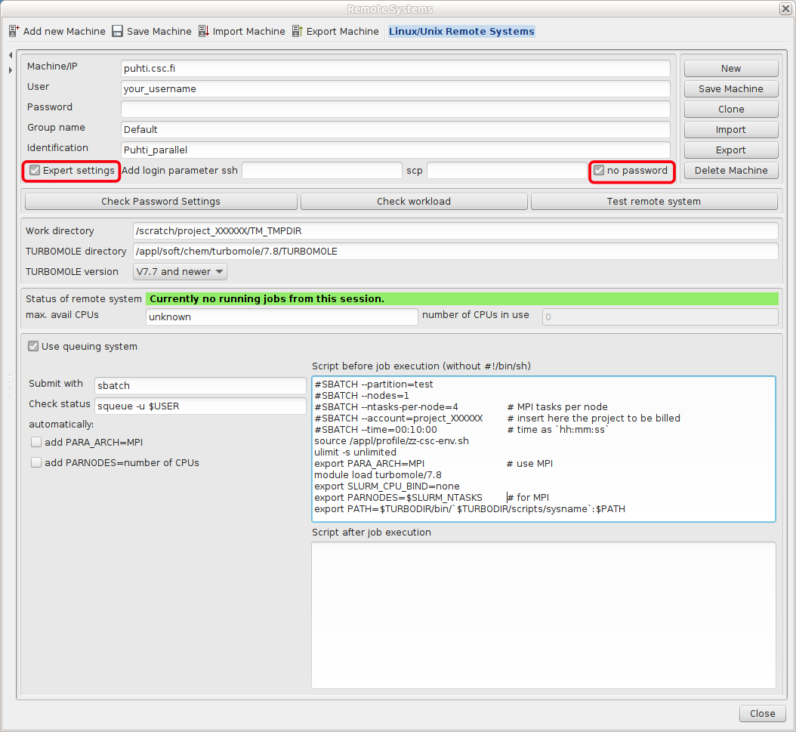

---
tags:
  - Academic
catalog:
  name: TmoleX
  description: GUI for setting up and analyzing TURBOMOLE jobs
  description_fi: Graafinen käyttöliittymä TURBOMOLE-ajojen valmisteluun ja analysointiin
  license_type: Academic
  disciplines:
    - Chemistry
  available_on:
    - Puhti
---

# TmoleX { #tmolex }

TmoleX on helppokäyttöinen graafinen käyttöliittymä
[TURBOMOLE](turbomole.md)-laskentojen käsittelyyn. TmoleX sisältää
rakenne-editorin sekä työkalut [TURBOMOLE](turbomole.md)-ajojen
valmisteluun ja tulosten analysointiin. TmoleX:ää voidaan käyttää myös
[TURBOMOLE](turbomole.md)-ajojen lähettämiseen ja valvomiseen CSC:n
supertietokoneilla.
  
Ilmaista TmoleX Client -versiota voi käyttää omalta Windows-, Linux- tai
macOS-työpöydältä [TURBOMOLE](turbomole.md)-ajojen suorittamiseen CSC:llä.

## Saatavilla { #available }

- Vapaasti ladattavissa (vaatii rekisteröitymisen) 
  [Dassault Systèmesin sivustolta](https://discover.3ds.com/free-download-biovia-turbomole-demo-version).
  Tämä on demoversio, joka sisältää myös rajoitetun version TURBOMOLEsta.

## Lisenssi { #license }

TmoleX on ladattavissa ilmaiseksi, mutta [TURBOMOLE](turbomole.md)-ohjelman
käyttö on rajattu akateemisiin (tutkintoja myöntäviin) organisaatioihin
kuuluvien käyttäjien voittoa tavoittelemattomiin tutkimustarkoituksiin.

## Käyttö { #usage }

### Käyttö selaimen kautta { #use-via-your-browser }

Siirry selaimella osoitteeseen [puhti.csc.fi](https://puhti.csc.fi/) ja
kirjaudu CSC/Haka-käyttäjätililläsi.

1. Käynnistä sieltä [työpöytä](../computing/webinterface/desktop.md#launching). 
2. Avaa `Terminal` ja lataa TURBOMOLE-moduuli `module load turbomole/7.8`.
3. Käynnistä TmoleX komennolla `TmoleX24`.
4. Valitse `New Project` ja määritä sopiva projektin sijainti kenttään
   `File Name` (esim. `/scratch/<yourproject>/my_tmolex_project`).
5. Määritä järjestelmäsi ja laskennan tyyppi. 
6. Pienet ajot voi ajaa interaktiivisesti: Start Job -> Run (local)
7. Suuremmat ajot kannattaa ajaa eräajoina: Start Job -> Run (network).
   Esimerkkiasetukset ovat alla. Huomaa, että salasanaton yhteys ei toimi
   selaimen kautta. Muista tallentaa asetukset komennolla `Save Machine`.
 
### Asenna oma TmoleX { #install-your-own-tmolex }

Asenna TmoleX-asiakas paikalliselle työasemallesi. Lisätiedot löytyvät
rekisteröinti- ja lataussivulta:
[Dassault Systèmes -sivusto](https://discover.3ds.com/free-download-biovia-turbomole-demo-version).
Omalla TmoleX-versiollasi voit rakentaa varsinaisen ajon paikallisesti ja
lähettää työn Puhtiin. Asiakasohjelmalla voit seurata ajon etenemistä.
Kun ajo on valmis, voit noutaa tulosteen ja analysoida tulokset
paikallisella asiakkaalla.

Alla on esimerkkejä jonon asetuksista, joita voidaan käyttää TmoleXissa:



Kenttään "Script before job execution" lisättävä täydellinen skripti on
esimerkiksi seuraavanlainen (muokkaa tarpeidesi mukaan):

```bash
#SBATCH --partition=test
#SBATCH --nodes=1
#SBATCH --ntasks-per-node=4             # MPI tasks per node
#SBATCH --account=project_XXXXXX        # insert here the project to be billed 
#SBATCH --time=00:10:00                 # time as `hh:mm:ss`
source /appl/profile/zz-csc-env.sh
ulimit -s unlimited
export PARA_ARCH=MPI                    # use MPI
module load turbomole/7.8
export SLURM_CPU_BIND=none
export PARNODES=$SLURM_NTASKS           # for MPI
export PATH=$TURBODIR/bin/`$TURBODIR/scripts/sysname`:$PATH
```

Muista tallentaa asetukset komennolla `Save Machine`. 

## Lisätietoja { #more-information }

- [TURBOMOLE-dokumentaatio ja ohjeet](https://www.turbomole.org/turbomole/turbomole-documentation)
- [TmoleX-opetusohjelma](https://www.turbomole.org/wp-content/uploads/2019/10/Tutorial-tmolex-4-4.pdf)
- [TmoleX-opetusvideo](https://www.youtube.com/watch?v=EKH_m1IGb20)