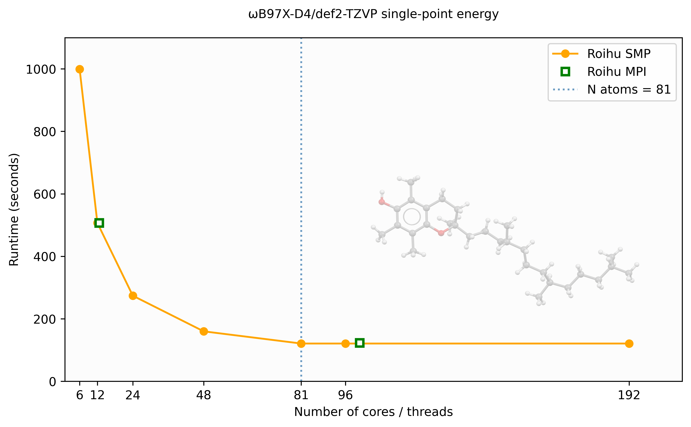

---
tags:
  - Academic
catalog:
  name: TURBOMOLE
  description: Fast and robust quantum chemistry program package
  license_type: Academic
  disciplines:
    - Chemistry
  available_on:
    - Puhti
    - Mahti
    - Roihu
---

# TURBOMOLE

[TURBOMOLE](https://www.turbomole.org/turbomole/turbomole-features/) is a fast
and robust quantum chemistry program package with very efficient
implementations of various computational methods (HF/DFT/MP2/CC). Properties
both for ground and excited states can be obtained. TURBOMOLE has been designed
for efficient study of large systems.

## Available

- Puhti: 7.5.1, 7.6, 7.7, 7.8
- Mahti: 7.5.1, 7.6, 7.7, 7.8
- Roihu-CPU: 8.0

## License

- You may use the Software exclusively for non-profit research purposes.
- Only users from academic (i.e. degree-granting) institutes are allowed to
  use the Software.

## Usage

Initialise TURBOMOLE environment:

=== "Puhti and Mahti"

    ```bash
    module load turbomole/7.8
    ```

=== "Roihu"

    ```bash
    module load turbomole/8.0
    ```

    On Roihu, jobs must be submitted from the **CPU login node** (`roihu-cpu`).
    The module sets `I_MPI_FABRICS=shm:ofi` and `MPI_USESRUN=1` automatically.
    No manual PATH or MPI setup is needed beyond what is shown in the batch
    scripts below. For a full list of available partitions see the
    [Roihu batch job partitions](../computing/running/batch-job-partitions.md)
    page.

### Batch scripts

=== "Puhti, MPI"

    ```bash
    #!/bin/bash
    #SBATCH --partition=test
    #SBATCH --nodes=2
    #SBATCH --ntasks-per-node=40      # MPI tasks per node
    #SBATCH --account=<project>       # insert here the project to be billed
    #SBATCH --time=00:10:00           # time as hh:mm:ss
    export PARA_ARCH=MPI
    module load turbomole/7.8
    export SLURM_CPU_BIND=none
    export TURBOTMPDIR=`echo $PWD |cut -d'/' -f1-3`"/TM_TMPDIR/"$SLURM_JOB_ID
    mkdir -p $TURBOTMPDIR
    export PARNODES=$SLURM_NTASKS
    export PATH=$TURBODIR/bin/`$TURBODIR/scripts/sysname`:$PATH
    jobex -ri -c 300 > jobex.out
    ```

=== "Puhti, SMP"

    ```bash
    #!/bin/bash
    #SBATCH --partition=test
    #SBATCH --nodes=1
    #SBATCH --cpus-per-task=40        # SMP threads
    #SBATCH --account=<project>       # insert here the project to be billed
    #SBATCH --time=00:10:00           # time as hh:mm:ss
    export PARA_ARCH=SMP
    module load turbomole/7.8
    export TURBOTMPDIR=`echo $PWD |cut -d'/' -f1-3`"/TM_TMPDIR/"$SLURM_JOB_ID
    mkdir -p $TURBOTMPDIR
    export PARNODES=$SLURM_CPUS_PER_TASK
    export OMP_NUM_THREADS=$SLURM_CPUS_PER_TASK
    export PATH=$TURBODIR/bin/`$TURBODIR/scripts/sysname`:$PATH
    jobex -ri -c 300 > jobex.out
    ```

=== "Puhti, MPI, local disk"

    ```bash
    #!/bin/bash
    #SBATCH --partition=small
    #SBATCH --nodes=1
    #SBATCH --ntasks-per-node=40      # MPI tasks per node
    #SBATCH --account=<project>       # insert here the project to be billed
    #SBATCH --time=00:10:00           # time as hh:mm:ss
    #SBATCH --gres=nvme:100           # requested local disk in GB
    export PARA_ARCH=MPI
    module load turbomole/7.8
    export SLURM_CPU_BIND=none
    export TURBOTMPDIR=$LOCAL_SCRATCH/$SLURM_JOBID
    mkdir -p $TURBOTMPDIR
    export PARNODES=$SLURM_NTASKS
    export PATH=$TURBODIR/bin/`$TURBODIR/scripts/sysname`:$PATH
    dscf > dscf.out
    ccsdf12 > ccsdt.out
    ```

=== "Mahti, MPI"

    ```bash
    #!/bin/bash
    #SBATCH --partition=medium
    #SBATCH --nodes=2
    #SBATCH --ntasks-per-node=128     # MPI tasks per node
    #SBATCH --account=<project>       # insert here the project to be billed
    #SBATCH --time=00:60:00           # time as hh:mm:ss
    export PARA_ARCH=MPI
    module load turbomole/7.8
    export SLURM_CPU_BIND=none
    export TURBOTMPDIR=`echo $PWD |cut -d'/' -f1-3`"/TM_TMPDIR/"$SLURM_JOB_ID
    mkdir -p $TURBOTMPDIR
    export PARNODES=$SLURM_NTASKS
    export PATH=$TURBODIR/bin/`$TURBODIR/scripts/sysname`:$PATH
    jobex -ri -c 300 > jobex.out
    ```

=== "Roihu, MPI"

    On Roihu the module sets `MPI_USESRUN=1` so TURBOMOLE launches tasks via
    `srun` automatically. No wrapper script is needed.

    !!! note
        Local NVMe disk is not yet available for standard M-node jobs on Roihu.
        Scratch I/O goes to Lustre. NVMe support will be enabled in a future
        update.

    ```bash
    #!/bin/bash
    #SBATCH --partition=small         # see batch-job-partitions for all options
    #SBATCH --nodes=1
    #SBATCH --ntasks-per-node=12      # MPI tasks per node
    #SBATCH --mem-per-cpu=2000        # MB per CPU core
    #SBATCH --account=<project>       # insert here the project to be billed
    #SBATCH --time=01:00:00           # time as hh:mm:ss
    export PARA_ARCH=MPI
    module load turbomole/8.0
    export SLURM_CPU_BIND=none
    export PATH=$TURBODIR/bin/$(sysname):$PATH
    export TURBOTMPDIR=/scratch/<project>/<user>/TM_TMPDIR/$SLURM_JOB_ID
    mkdir -p $TURBOTMPDIR
    export PARNODES=$SLURM_NTASKS
    jobex -ri -c 300 > jobex.out
    ```

=== "Roihu, SMP"

    ```bash
    #!/bin/bash
    #SBATCH --partition=small         # see batch-job-partitions for all options
    #SBATCH --nodes=1
    #SBATCH --cpus-per-task=12        # SMP threads
    #SBATCH --mem-per-cpu=2000        # MB per CPU core
    #SBATCH --account=<project>       # insert here the project to be billed
    #SBATCH --time=01:00:00           # time as hh:mm:ss
    export PARA_ARCH=SMP
    module load turbomole/8.0
    export PATH=$TURBODIR/bin/$(sysname):$PATH
    export TURBOTMPDIR=/scratch/<project>/<user>/TM_TMPDIR/$SLURM_JOB_ID
    mkdir -p $TURBOTMPDIR
    export PARNODES=$SLURM_CPUS_PER_TASK
    export OMP_NUM_THREADS=$SLURM_CPUS_PER_TASK
    jobex -ri -c 300 > jobex.out
    ```

!!! note
    Occasionally `mpshift` calculations are terminated due to the local `/tmp`
    becoming full. The problem can be circumvented by redefining `$TMPDIR`:

    ```bash
    export TMPDIR=$TURBOTMPDIR
    ```

!!! note
    Particularly some of the wavefunction-based electron correlation methods
    can be very disk I/O intensive. Such jobs benefit from using the fast local
    storage on Puhti. Using local disk for such jobs will also reduce the load
    on the Lustre parallel file system. On Roihu, local NVMe is not yet
    available for standard M-node jobs.

### Performance example

Here we provide a brief example of how different resource allocations affect
TURBOMOLE's performance. We use
[α-Tocopherol](https://en.wikipedia.org/wiki/%CE%91-Tocopherol) (vitamin E,
C29H50O2, 81 atoms) as the input structure. The geometry is available at
[vite_wb97x_d4_roihu.sh](https://a3s.fi/project_2001659-turbomole/vite_wb97x_d4_roihu.sh).

The tests were conducted in a production environment where job interference
may introduce performance fluctuations.

The following figure shows the wall time for a ωB97X-D4/def2-TZVP single-point
energy calculation as a function of the number of cores/threads on Roihu, using
both SMP (OpenMP) and MPI parallelism.



SMP (`PARA_ARCH=SMP`) scales well up to approximately 48 threads for this
81-atom system, after which performance levels off. The MPI (`PARA_ARCH=MPI`)
results show similar wall times to SMP but require significantly more memory
— approximately 15× more at 96 processes for this system.

For `ridft` DFT calculations on a single node, SMP is therefore generally
preferred over MPI. The scaling limit is related to the number of atoms —
larger molecules will benefit from more threads before reaching saturation.

After the job completes, check actual memory and wall time usage with:

```bash
sacct -j <jobid> --format=JobID,MaxRSS,Elapsed,State
```

### NumForce calculations

NumForce is a tool that can be used to calculate second derivatives (molecular
Hessian) for all methods for which analytic gradients are available in
TURBOMOLE. A NumForce job spawns `3*N*2` (`N` = number of atoms) independent
gradient calculations. Usually it is most efficient that the single gradient
calculations are run as serial (`unset PARA_ARCH`). Each serial calculation is
expected to take roughly the same time, hence optimally the total number of
gradient calculations should be an integer multiple of the allocated cores.

A NumForce step in a job file:

```bash
unset PARA_ARCH
export HOSTS_FILE=$PWD/turbomole.machines
rm -f $HOSTS_FILE
srun hostname > $HOSTS_FILE
ulimit -s unlimited
kdg tmpdir
NumForce -ri -central -mfile $HOSTS_FILE > NumForce.out
```

## References

Please quote the usage of the program package under consideration of the
version number:

- TURBOMOLE V8.0, a development of University of Karlsruhe and
  Forschungszentrum Karlsruhe GmbH, 1989-2007, TURBOMOLE GmbH, since 2007;
  available from <https://www.turbomole.org>
- A review article should be mentioned, as well:
  <https://doi.org/10.1063/5.0004635>
- Scientific publications require proper citation of methods and procedures
  employed. The output headers of TURBOMOLE modules include the relevant
  papers.

## More information

- [TURBOMOLE GmbH](https://www.turbomole.org/turbomole/turbomole-documentation/)
- [TURBOMOLE: Today and Tomorrow](https://pubs.acs.org/doi/10.1021/acs.jctc.3c00347)
- [TURBOMOLE review](https://aip.scitation.org/doi/10.1063/5.0004635)
- [TURBOMOLE tutorial](https://www.turbomole.org/wp-content/uploads/Tutorial_7-7.pdf)
- [TURBOMOLE Users Forum](https://forum.turbomole.org/index.php)
