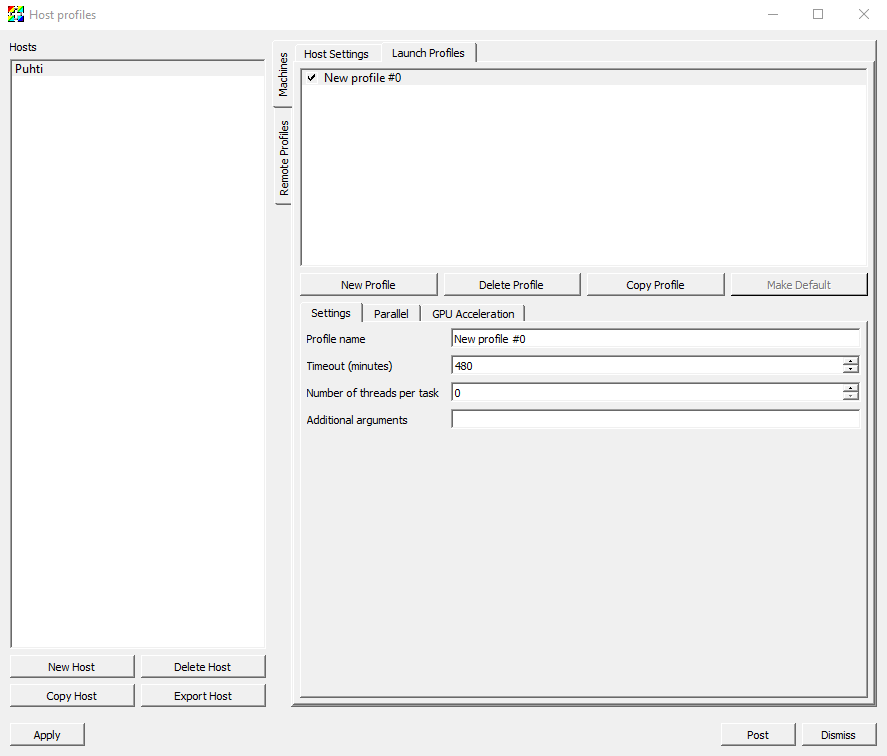

---
tags:
  - Free
system:
  - www-puhti
  - www-lumi
---

# VisIt

VisIt is an open source, versatile software for scientific visualization.
VisIt is available on Puhti, and we recommend
[the Puhti web interface remote desktop](../computing/webinterface/desktop.md)
for running the GUI.

!!! info "Running VisIt with GPU-accelerated graphics on Puhti and LUMI"
    You can now also enable
    [interactive visualization with GPU acceleration](../computing/webinterface/accelerated-visualization.md)
    for much better performance. In this case, select the
    _Accelerated Visualization_ app instead of _Desktop_ in the Puhti web
    interface. On LUMI, select the regular _Desktop_ app and `lumid`
    partition ([mode information](https://docs.lumi-supercomputer.eu/runjobs/webui/desktop/)).

## License

VisIt is free also for commercial use and has been released under
[BSD Open Source License](https://github.com/visit-dav/visit/blob/develop/LICENSE)

## Available

Puhti: 3.1.3, 3.3.3
Mahti: 3.1.3, 3.3.1
LUMI: 3.2.2

## Parallel use

VisIt can be run interactively in parallel configuration using several
processors. Login to Puhti and submit the following to launch VisIt on a
compute node

```bash
module load visit/3.1.3
visit -l srun -np 2 -p test -t 00:10:00 -la --mem-per-cpu=2G -la --account=<your project>
```

The job reservation parameters are:

* `-np <number of cores>`
* `-p <queue>`
* `-t <time>` (hours:minutes:seconds)
* `-la --mem-per-cpu=<memory per processor>` (in GB)
* `-la --account=<the billing project for the job>`
  
Note that running VisIt with many processors does not necessarily bring speed
benefits. It will depend on VisIt's particular data reader if (and to what
extent) the data can be distributed between the processors.

## Using host profile of local VisIt installation

The VisIt client can be run on your local desktop computer while having VisIt
components that process the data remotely on Puhti. Local VisIt host profiles
can be used to launch jobs on Puhti compute nodes. Local and remote VisIt
versions have to match.

An example of a working host profile is screen captured below. Note that job
reservation parameters that are not directly available as profile options
should be given as _Advanced/Launcher arguments_, see the last screen capture.





## More Information

* [VisIt homepage (source code, binaries, manuals and tutorials, example data files)](https://visit-dav.github.io/visit-website/)
* [User community website](http://visitusers.org)
