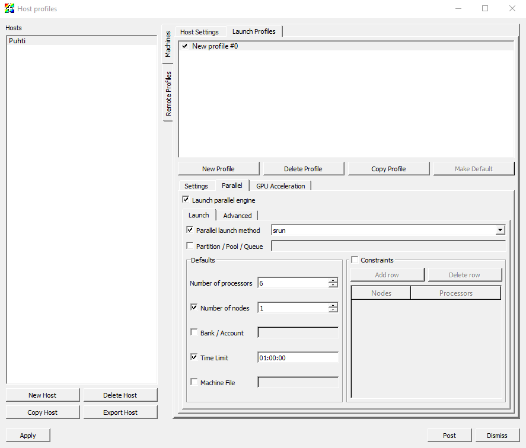

---
tags:
  - Free
catalog:
  name: VisIt
  description: Free open-source visualization application
  description_fi: Ilmainen avoimen lähdekoodin visualisointisovellus
  license_type: Free
  disciplines:
    - Miscellaneous
  available_on:
    - web_interfaces:
        - LUMI
        - Puhti
    - LUMI
    - Puhti
    - Mahti
---

# VisIt { #visit }

VisIt on avoimen lähdekoodin, monipuolinen ohjelmisto tieteelliseen visualisointiin.
VisIt on saatavilla Puhtissa, ja suosittelemme
[Puhtin selainkäyttöliittymän etätyöpöytää](../computing/webinterface/desktop.md)
GUI:n ajamiseen.

!!! info "VisItin ajaminen GPU-kiihdytetyllä grafiikalla Puhtissa ja LUMIssa"
    Voit nyt myös ottaa käyttöön
    [interaktiivisen GPU-kiihdytetyn visualisoinnin](../computing/webinterface/accelerated-visualization.md)
    huomattavasti parempaa suorituskykyä varten. Valitse tällöin Puhtin
    selainkäyttöliittymästä _Accelerated Visualization_ -sovellus _Desktop_-sovelluksen
    sijaan. LUMIssa valitse tavallinen _Desktop_-sovellus ja `lumid`-osio
    ([lisätietoja](https://docs.lumi-supercomputer.eu/runjobs/webui/desktop/)).

## Lisenssi { #license }

VisIt on maksuton myös kaupalliseen käyttöön ja se on julkaistu
[BSD Open Source License](https://github.com/visit-dav/visit/blob/develop/LICENSE) -lisenssillä.

## Saatavilla { #available }

Puhti: 3.1.3, 3.3.3
Mahti: 3.1.3, 3.3.1
LUMI: 3.2.2

## Rinnakkaiskäyttö { #parallel-use }

VisIt voidaan ajaa interaktiivisesti rinnakkaiskokoonpanossa useilla
prosessoriytimillä. Kirjaudu Puhtiin ja käynnistä VisIt laskentasolmulle
seuraavasti:

```bash
module load visit/3.1.3
visit -l srun -np 2 -p test -t 00:10:00 -la --mem-per-cpu=2G -la --account=<your project>
```

Työvarausta koskevat parametrit ovat:

* `-np <number of cores>`
* `-p <queue>`
* `-t <time>` (tunnit:minuutit:sekunnit)
* `-la --mem-per-cpu=<memory per processor>` (GB)
* `-la --account=<the billing project for the job>`
  
Huomaa, että VisItin ajaminen monella prosessorilla ei välttämättä tuo
nopeusetua. Se riippuu VisItin käyttämästä datalukijasta, voiko dataa
jakaa prosessorien kesken (ja missä määrin).

## Paikallisen VisIt-asennuksen isäntäprofiilin käyttäminen { #using-host-profile-of-local-visit-installation }

VisIt-asiakasohjelmaa voidaan ajaa paikallisella työpöytäkoneellasi, kun taas
datan käsittelevät VisIt-komponentit toimivat etänä Puhtissa. Paikallisia VisItin
isäntäprofiileja voidaan käyttää Puhtin laskentasolmuille lähetettävien töiden
käynnistämiseen. Paikallisen ja etäjärjestelmän VisIt-versioiden on oltava samat.

Alla on esimerkki toimivasta isäntäprofiilista kuvakaappauksina. Huomaa, että
työvarausten parametrit, joita ei voi asettaa suoraan profiilivalinnoista, tulee
antaa kohtaan _Advanced/Launcher arguments_; katso viimeinen kuvakaappaus.





## Lisätietoja { #more-information }

* [VisIt-kotisivu (lähdekoodi, binäärit, ohjeet ja oppaat, esimerkkiaineistot)](https://visit-dav.github.io/visit-website/)
* [Käyttäjäyhteisön sivusto](http://visitusers.org)