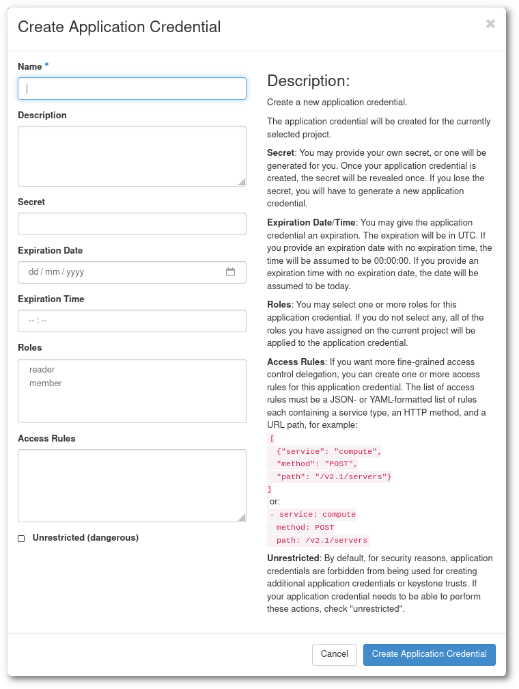

# Application credentials

You will need to use application credentials if you are planning on using the service API or using
the [OpenStack command-line tools](cli.md). If you are not planning on using the API or command-line
tools then you probably won't need any application credentials.

Application credentials are also very useful to create credentials with limited permissions. You can
create credentials that are only allowed to get data of your project. You can also create
credentials that can only modify a specific instance or create new instances. It is also possible
to create credentials that can do everything that you can.

It is important to remember that the application credentials are personal, which
means that the application credentials are owned by a user account and all operations that the
credentials do is on behalf of the user that created the credentials. This means that if a user
is removed from the project the user's credentials will stop working.

## Creating application credentials

1. Go to [Pukki's web-interface](https://pukki.dbaas.csc.fi/).
2. Choose which project you want to use. (You will only see the projects that have DBaaS activated in [my.csc.fi](https://my.csc.fi).)
3. Go to `Identitiy` -> `Application Credentials`.
4. Press `Create Application Credential`. A dialog will open.

    

5. It is a good idea to choose a descriptive `name` and `description`. Otherwise you might get confused
in the future why the application credentials exist. It might be a good idea to name your first 
credentials `Testing application credentials $TODAYS_DATE`.
6. `Secret` should be a long random string that you should keep secret. If you leave this empty the
service will create a secret for you, this is probably the preferred method.
7. It is a good idea to put an `expiration date` especially if you are testing the credentials only
for today.
8. There are two roles, `reader` and `member`. Usually you want to use the `member` role. You can find
out more in the [Using roles sections](#using-roles).
9. `Access rules` are useful when you want to make credentials with fine-grained permissions.
This is particularly useful if you want to build a lot of automation around your databases. For example,
you can make a script that is only allowed to modify the users of a specific database or
credentials that are only allowed to create new instances. You can find more information about the
options in the [Using access rules section](#using-access-rules).
10. The `Unrestricted (dangerous)` check-box will allow your application credentials to
create new application credentials. This might be useful if you are a power-user of the CLI, but you
should probably not give an application or automation credentials that have this permission.
11.  Once you have created the application credentials you can either download the credentials as a 
file that you can source or `.yaml` file, or alternatively add the secret to your secret manager. The
secret key will not be possible to be read once you have completed the credential creation process.
    If you download the application credentials you will get a file that contains something like this:

    ```bash
    #!/usr/bin/env bash

    export OS_AUTH_TYPE=v3applicationcredential
    export OS_AUTH_URL=https://pukki.dbaas.csc.fi:5000/v3
    export OS_IDENTITY_API_VERSION=3
    export OS_REGION_NAME="pukki_dbaas"
    export OS_INTERFACE=public
    export OS_APPLICATION_CREDENTIAL_ID=xxxxxxxxxxxxxxxxxxxxxx
    export OS_APPLICATION_CREDENTIAL_SECRET=xxxxxxxxxxxxxxxxxxx
    ```

    If you source the file you can use it together with with [OpenStack command-line tools](cli.md).

14. It is a good idea to test that the application credentials are allowed to do what you expect them
to be able to do. It is also a good idea to verify that they are **NOT** allowed to do what you expect them
not to be allowed to do.

<!-- 8. Choosing a role, you should choose `member`. The `reader` role does not work as one would expect
at the point of writing there is no difference between reader and member role when it comes to
managing your databases at the moment. In the future the reader role might become a read-only user
role. -->

## Using roles

There are two roles available; `reader` and `member`. The reader role is a read-only role while the
member role is allowed to make changes to your project.

* `reader` role can only collect data from your project but not make any changes. This is good if you
want to create a script that checks the state of your services. Sometimes it is nice to have a default
reader account that you use for day-to-day operations when you collect information so that you can be
sure that you can't do any destructive commands.
* `member` role is the normal user role. It can do everything that the `reader` role can, but it can
also make changes to the system. When you login into the web-interface you have the `member` role
enabled.

## Using access rules 

It is possible to create application credentials that are limited to only do selected API-calls.
To find out which API-calls are available, you can take a look at
[OpenStack Database API](https://docs.openstack.org/api-ref/database/).

For example, if you want to create application credentials that only have permission to list
your instances, you can add the permission:

```
- service: database
  method: GET
  path: /v1.0/*/instances
```
!!! info "Note"
    The wildcard `*` can, if you like, be changed to your project-id.

With this permission, you are only allowed to do `openstack database instance list`.
An application credential can have as many permissions as you like.
If you would like to be able to "create", "list", "show" and "delete" database instances, you
would need to do an application credential like:

```
# Create instance
- service: database
  method: POST
  path: /v1.0/*/instances
# List instance
- service: database
  method: GET
  path: /v1.0/*/instances
# Show instances
- service: database
  method: GET
  path: /v1.0/*/instances/*
# Delete instances
- service: database
  method: DELETE
  path: /v1.0/*/instances/*
```

There are several other permissions that might be interesting to you, see:
[OpenStack Database API](https://docs.openstack.org/api-ref/database/).
