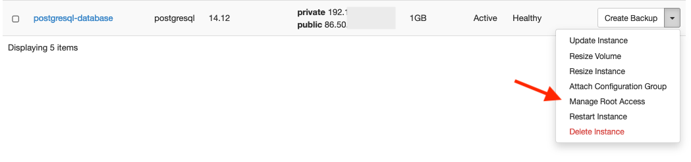

# Database operations

## Minor version database upgrades

Pukki DBaaS provides tools for you to upgrade your database yourself.
Before you do an upgrade you need to be aware of the risks and implications.
Upgrading the database will cause a short downtime, the length of which depends
on the datastore versions involved and the size of the database.
It's advisable to create a new database instance from a recent backup to test the upgrade on first.

When you do a minor database upgrade,

1. Your database instance will pull the new database version.
2. Your database instance will stop your database.
3. Your database instance will start the new database version.

The commands to use:

1. Figure out which database you want to upgrade, take note of the `Datastore` and `Datastore Version`:

    ```
    openstack database instance list
    ```

2. With your preferred tool make sure that your database is working as expected. Take note of what command you used so that you can use the same command/process to verify that everything works after the upgrade.
3. Find out what datastore versions are available:

    ```
    openstack datastore version list $Datastore
    ```

4. You most likely want to choose the latest version:

    ```
    openstack database instance upgrade $Instance $Datastore_version
    ```

5. Verify with your preferred tool that your database is working as expected.

!!! warning "Certain PostgreSQL upgrades will cause databases to be reindexed"
    The libraries used by PostgreSQL internally for collation
    (sorting, comparing, and ordering data) might change between datastore versions.
    When this happens, a full reindex of all databases is required to prevent issues with data consistency.
    This reindexing can take a considerable amount of time, especially with large databases containing complex indexes.
    Currently upgrading from 17.5 or earlier to 17.6 or newer triggers the reindexing. Upgrading between
    minor versions of PostgreSQL 14 also triggers the reindexing, as does upgrading from major version 14 to 17.
    Please plan your database upgrades accordingly.

## Major database upgrades

Major version upgrades are no different from the user's point of view,
but there's a bit more happening in the background, which creates more possible points of failure.

Our recommended procedure for major version upgrades:

0. Reserve plenty of time for the upgrade process and familiarize yourself with any changes between the database versions
1. Create a new backup of the database instance (or use the most recent automatic backup)
2. Restore the freshly created backup into a new database instance
3. Upgrade the new database instance to your target datastore version (we recommend using the most recent version available)
4. Test that connections to the new instance work as expected and that your data looks correct

After this, you can either move to use the new instance and delete the original one, or continue with
upgrading the original instance and deleting the new one.
Drawbacks with changing to the new instance include having to switch to use the new IP address
for connections, and any changes made to the original database instance after the backup was taken
will be lost.

### Information regarding major database version EOLs

Major database versions in Pukki will be made unavailable to create new database instances with
half a year before their end-of-life date, and beginning on the end-of-life date any database
instances remaining on the versions affected will be upgraded to a newer version by Pukki admins.
Reminder emails will be sent to users with instances on the affected versions before this happens,
and we highly recommend upgrading your database instances yourself in order to have more control
over the resulting downtime.

For information about PostgreSQL 14 EOL in Pukki, see [this page](postgres-14-eol.md).

## Deleting a database in your database instance

By default, your database user account does not have permissions to delete databases.
If you want to delete a database in your database instance you need to use the web-GUI or the OpenStack CLI:

```
openstack database db delete $INSTANCE_UUID $DATABASE_NAME
```


## Enable root

Some changes, such as enabling extensions or modifying more advanced user permissions,
aren't accessible via the web interface or the OpenStack command line tools.
It's worth keeping in mind that with the root credentials enabled you can make
breaking changes to your database. It's recommended to only use the root user when
you need to make changes that actually require it.

Keep in mind that when you create a new database instance by restoring from a backup,
any parameter changes done with root access via `ALTER SYSTEM` commands in the original
instance are discarded.

### How to enable root from the Web interface

1. Log in to the web interface where you can see all your existing instances.
2. Find the 'Actions' dropdown in the rightmost column, and choose `Manage Root Access`. 
3. On the Manage Root Access page, press the `Enable Root` button in the rightmost column of the instances table.
4. The root password is now visible on that same Manage Root Access page. You can access the database with the password shown, and with `root` as username.
5. Once you no longer need root access, press `Disable Root` on the Manage Root Access page.

### How to enable root from the CLI


1. Enable root
    ```
    openstack database root enable $INSTANCE_ID
    ```

2. Use the password shown with the username `root` to access the database.

3. Once you no longer need root access, run the following command to disable it:

    ```
    openstack database root disable $INSTANCE_ID
    ```
