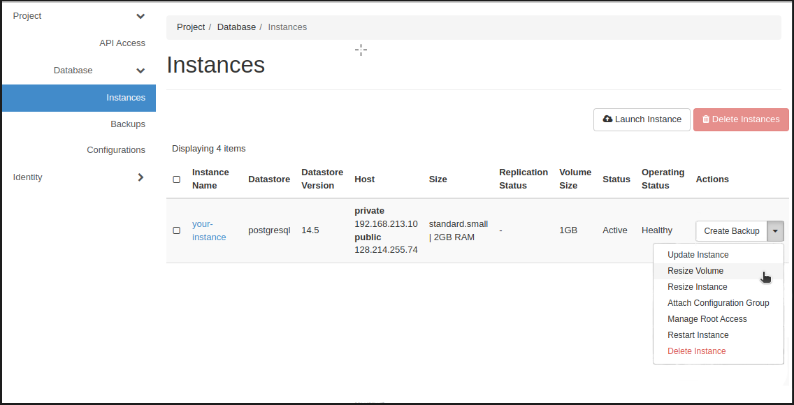
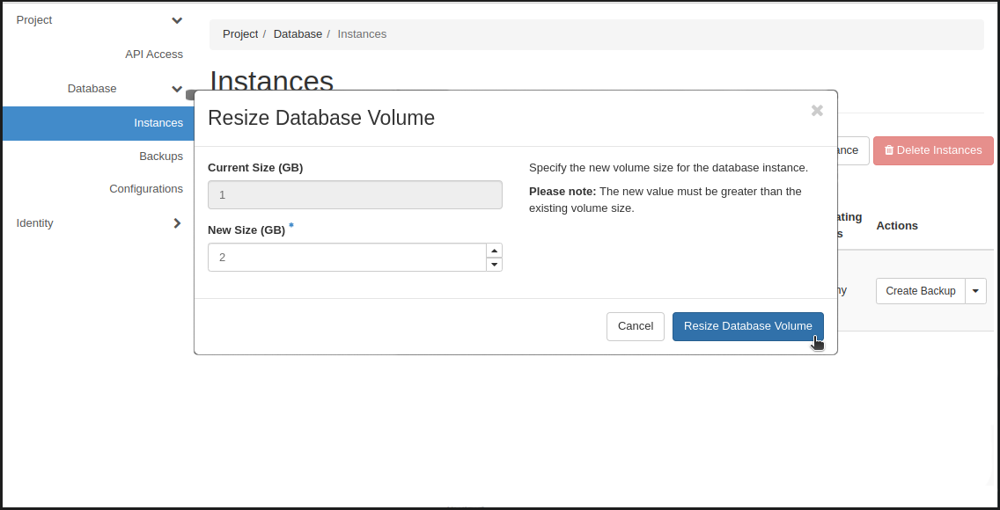

# Resize database instance volume

When you first create a database instance, you specify the size of the volume the instance has in use. If you later on notice that the size is not enough, you can resize the volume either from the web interface or from the CLI. Note that you can only increase the size of the volume, not decrease.  

## Precautions  

Resizing the volume should not affect your data, but you can make a backup of your instance manually before resizing to prevent any data loss.

See the steps to make `manual backups` in [Backups](backups.md).

## Resize volume from the Web interface

1. In the column on the left hand side you can go to `Database` -> `Instances` and locate the instance you want to resize the volume of.  

2. On the right hand side of the select row, next to Create Backup -button, press the `arrow icon` to open up a drop-down list, and select `Resize Volume`.

    


3. From there you can specify the `new size` for the database instance in GB.  
Note that the new value must be greater than the existing volume size.

4. Confirm the change with `Resize Database Volume`.

    

5. The change should take 1-2 minutes. If the web interface does not automatically update the status from `Resizing` to `Active`, try to reload the page.  

    If the status is `Resizing` for over 5 minutes, check `I'm having problems with resizing the volume` below.  

## Resize volume from the CLI

1. Locate the `instance ID` for the instance you want to resize the volume of:

    ```sh
    openstack database instance list
    ```

2. `Resize the volume` of the instance:

    ```sh
    openstack database instance resize volume $INSTANCE_ID $NEW_VOLUME_SIZE
    ```

    for example:  
    openstack database instance resize volume `f37a8ea6-5ed7-4982-8a71-9131756f04ae` `5`

3. After 1-2 minutes, the `status` of the instance should be `ACTIVE`:  

    ```sh
        openstack database instance show $INSTANCE_ID
    ```  

    If the status is `Resizing` for over 5 minutes, check `I'm having problems with resizing the volume` below.  

## I'm having problems with resizing the volume  

### Status stuck on RESIZING  

Make sure you have tried to `reload the web interface page` or ran `openstack database instance show $INSTANCE_ID` command after 5 minutes of resizing the volume.
If the status of instance is `RESIZING` after 5 minutes, please [contact us](../../support/contact.md).  
