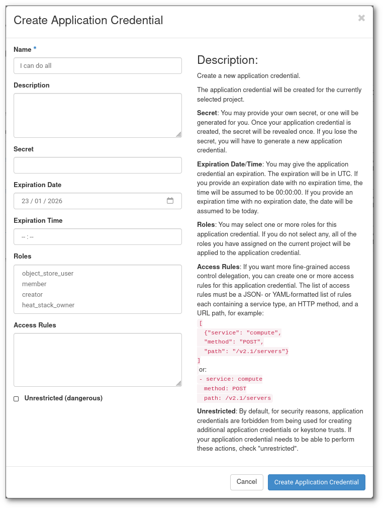
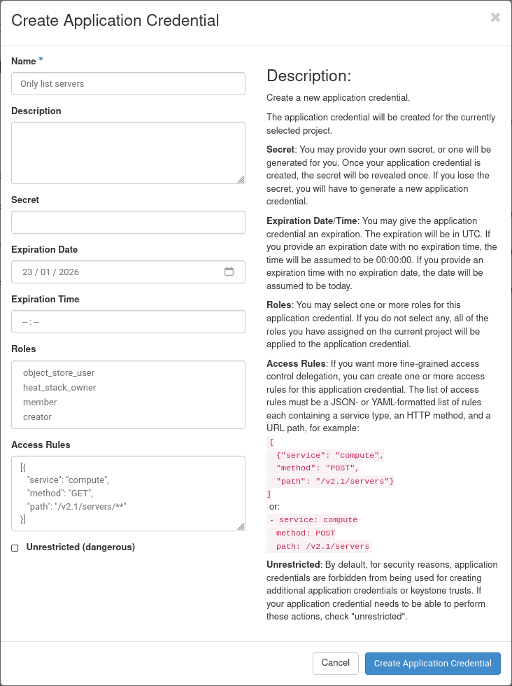
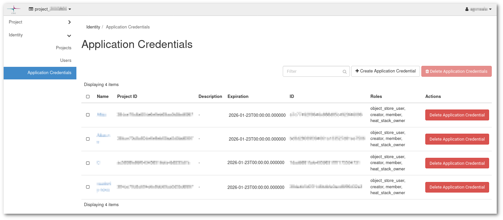
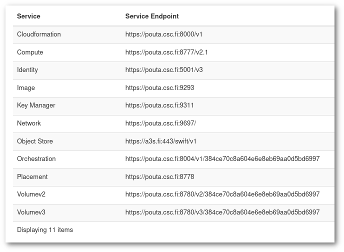

# Application credentials

Application credentials allow you to interact with Pouta via the [OpenStack command-line tools](command-line-tools.md) or directly via the API, by allowing you to create, for a given **project**, a **role specific** and **time limited** _TOKEN_ that can be revoked at any time. The most immediate advantage is that you no longer need to use or write your CSC password while using Pouta's API.

* It will allow you access only to a given **project**.

* **Role specific** means that the credentials can be created with limited permissions. You can create credentials that are only allowed to get data of your project, but not modify it. You can also create credentials that can only modify a specific resource. It is also possible to create credentials that can do everything that you can.

* **Time limited** means that the credentials can have a much shorter life than the password of the account that created it. This is useful to limit the repercussion of a credential leak.

* Other advantages are that credentials can be revoked at any time from Poutas's web interface, and that you cannot change or obtain the password if you have only the application credential that created it.

!!! info "Application credentials are linked to the personal account"

    It is important to remember that the application credentials are personal, which means that the application credentials are owned by a user account and all operations that the credentials do is on behalf of the user that created the credentials. This means that if a user is removed from the project the user's credentials will stop working.

In general Application credentials give the power and flexibility to allow a safer interaction with Pouta's API.

## Creating application credential

1. Go to [Pouta's web-interface](https://pouta.csc.fi/).
2. Choose which project you want to use. (You will only see the projects that have cPouta activated in [my.csc.fi](https://my.csc.fi).)
3. Go to `Identity` -> `Application Credentials`.
4. Press `Create Application Credential`. A dialog will open.

    

5. It is a good idea to choose a descriptive `name` and `description`. Otherwise you might get confused
in the future why the application credentials exist. It might be a good idea to name your first 
credentials `Testing application credentials $TODAYS_DATE`.
6. `Secret` should be a long random string that you should keep secret. If you leave this empty the
service will create a secret for you, this is probably the preferred method.
7. It is a good idea to put an `expiration date` especially if you are testing the credentials only
for today.

    !!! warning "Temporary Unavailability of Role Restrictions for Application Credentials"
        The usage of role restrictions for Application Credentials is temporarily unavailable.

8. <del>There are four roles in cPouta, `member`, `heat_stack_owner`, `object_store_user` and `creator`. Usually you want to use the `member` role:</del>

    * <del> `member` role is the normal user role. It can make changes to the system. When you login into the web-interface you have the member role enabled.</del>

    * <del> `heat_stack_owner` can operate over Heat stacks, that is create, modify and delete infrastructure. This is useful for using it in a IaC setup.</del>

    * <del> `object_store_user` can operate over Allas and Objects Store.</del>

    * <del> `creator` can create secrets such as passwords, encryption keys.</del>

    <del> If you are using Applications credentials in ePouta, it's slightly different. There are two roles available: `member` and `heat_stack_owner`.</del>

1. `Access Rules` allows you to fine tune permissions. You can add one or more rules in either _JSON_ or _YAML_ format. Each rule needs to specify the `service`, `method` and `path`. This example allows you to list servers:

    ```yaml
    - service: compute
      method: GET
      path: /v2.1/servers/**
    ```

    This one allows to list volumes:

    ```yaml
    - method: GET
      path: /v3/*/volumes/**
      service: volumev3
    ```

    See the [Access rules](https://docs.openstack.org/keystone/victoria/user/application_credentials.html#access-rules) upstream documentation for more examples and help. Access Rules have a lot of granularity and it can be complex to craft the exact rules you need. See [Troubleshooting tips](#troubleshooting-tips) below for more information.

9. The `Unrestricted (dangerous)` check-box will allow your application credentials to
create new application credentials. You should never give an application or automation any credentials that have this permission.

## Using Application Credentials

Once you have created the application credentials you can either download the credentials as a
file that you can source, a YAML file that can be used directly by the CLI, or alternatively add the secret to your secret manager. This is the **first and last time** that you will be able to get access to this secret. If you lose it, you will need to revoke it and create a new one.

If you downloaded the `openrc file` you will get a file that contains something like this:

```bash
#!/usr/bin/env bash

export OS_AUTH_TYPE=v3applicationcredential
export OS_AUTH_URL=https://pouta.csc.fi:5001/v3
export OS_IDENTITY_API_VERSION=3
export OS_REGION_NAME="regionOne" # Depends if you are using cPouta or ePouta
export OS_INTERFACE=public
export OS_APPLICATION_CREDENTIAL_ID=xxxxxxxxxxxxxxxxxxxxxx
export OS_APPLICATION_CREDENTIAL_SECRET=xxxxxxxxxxxxxxxxxxx
```

If you source that file, you can use it together with with [OpenStack command-line tools](command-line-tools.md).

You can also download the `cloud.yaml` file that will look like this:

```yaml
# This is a clouds.yaml file, which can be used by OpenStack tools as a source
# of configuration on how to connect to a cloud. If this is your only cloud,
# just put this file in ~/.config/openstack/clouds.yaml and tools like
# python-openstackclient will just work with no further config. (You will need
# to add your password to the auth section)
# If you have more than one cloud account, add the cloud entry to the clouds
# section of your existing file and you can refer to them by name with
# OS_CLOUD=openstack or --os-cloud=openstack
clouds:
  openstack:
    
    auth:
      
      auth_url: https://pouta.csc.fi:5001/v3
      
      application_credential_id: xxxxxxxxxxxxxxxxxxxxxxxxxxxxxxx 
      application_credential_secret: xxxxxxxxxxxxxxxxxxxxxxxxxxxxxxxx 
    
      
    regions:
        
    - regionOne # Depends if you are using cPouta or ePouta
        
      
    interface: "public"
    identity_api_version: 3
    auth_type: "v3applicationcredential"
```

See the comment on the file itself on how to use it.

!!! info "Verify the credentials"

    It is a good idea to test that the application credentials are allowed to do what you expect them to be able to do. It is also a good idea to verify that they are **NOT** allowed to do what you expect them not to be allowed to do.

### Examples

#### Credentials that can do every action

This is the simplest possible example, but also the one that offers the least advantages versus just using your password. We are going to create application credentials that allow every action that a your user can do (but creating other application credentials or keystone trusts). The main advantage is that you do not need to use your password anymore to use Openstack command line of API operations, less exposure of your password is a good step for security.



To do this you simply create an application credential leaving every field empty but the name and (for tests) the expiration date. Set any name that is descriptive and input a date not very far in the future.

#### Credentials that only allow to list servers

This is the opposite than the previous example, we want to only be able to list servers and their information. For this we only need to add to **Access Rules** this JSON:

```json
[
  {
   "service": "compute",
   "method": "GET",
   "path": "/v2.1/servers/**"
  }
]
```

So it looks like:



Click in create, and download and source the YAML file with the credentials. After that you can try to run few commands.

* These commands will work:

  - openstack server list
  - openstack server show <ID>
  - openstack server event list <ID>

* These commands will not:

  - openstack server reboot <ID>
  - openstack volume list
  - ...

  You can try to run these and other command and see what happens. A good learning technique is to run the command with the option `--debug`, so you can see all the API calls and you can add more methods to it.

#### Credentials to create and delete servers

This one could be more useful on a more realistic and useful scenario. The application credential we will create will allow to create and delete servers. One possible use is for an automatic system that manages a website and is prepares to create and delete VMs based on load. For such system to work, we need something that runs on a server and it is monitoring the load on the servers and based on some logic (mantain the total CPU load below 80%) connect to OpeStack's API and create or delete VMs. For anything that resides on a server, we always have to be aware that there is the possibility that credentials leak, and if this happens we do not want that to happen to an account password. We are not going to explain how such system can be deployed, only the application credentials part of it.

The `JSON` we will use is:

```json
[
  {
    "service": "compute",
    "method": "POST",
    "path": "/v2.1/servers"
  },
  {
    "service": "compute",
    "method": "DELETE",
    "path": "/v2.1/servers/*"
  },
  {
    "service": "compute",
    "method": "GET",
    "path": "/v2.1/servers*"
  },
  {
    "service": "image",
    "method": "GET",
    "path": "/v2/*"
  },
  {
    "service": "network",
    "method": "GET",
    "path": "/v2.0/*"
  },
  {
    "service": "network",
    "method": "POST",
    "path": "/v2.0/ports"
  },
  {
    "service": "network",
    "method": "DELETE",
    "path": "/v2.0/ports/*"
  },
  {
    "service": "placement",
    "method": "GET",
    "path": "/"
  }
]
```

The command we will run later to test the application credenials is:

```sh
openstack server create test-app-credentials --flavor standard.large --image Ubuntu-24.04
```

### Troubleshooting tips

  1. First list the credentials that are active on the system by running:

    ```sh
    openstack application credential list
    ```

    For example:

    ```sh
    $ openstack application credential list              
    +----------------------------------+----------+----------------------------------+----------------+----------------------------+
    | ID                               | Name     | Project ID                       | Description    | Expires At                 |
    +----------------------------------+----------+----------------------------------+----------------+----------------------------+
    | aaaaaaaaaaaaaaaaaaaaaaaaaaaaaaaa | Test     | bbbbbbbbbbbbbbbbbbbbbbbbbbbbbbbb | Test for docs  | 2026-02-01t00:00:00.000000 |
    | cccccccccccccccccccccccccccccccc | Test2    | bbbbbbbbbbbbbbbbbbbbbbbbbbbbbbbb | Test2 for docs | 2026-02-02t00:00:00.000000 |
    | dddddddddddddddddddddddddddddddd | Test3    | bbbbbbbbbbbbbbbbbbbbbbbbbbbbbbbb | Test3 for docs | 2026-02-03t00:00:00.000000 |
    +----------------------------------+----------+----------------------------------+----------------+----------------------------+
    ```

    Review that the name and the ID correspond and that they are not expired.  

  1. In order to see a single application credential:

    ```sh
    openstack application credential show <name>
    ```

    For example:

    ```
    $ openstack application credential show Test
    +--------------+---------------------------------------------------+
    | Field        | Value                                             |
    +--------------+---------------------------------------------------+
    | description  | Test for docs                                     |
    | expires_at   | 2026-02-01t00:00:00.000000                        |
    | id           | aaaaaaaaaaaaaaaaaaaaaaaaaaaaaaaa                  |
    | name         | Test                                              |
    | project_id   | bbbbbbbbbbbbbbbbbbbbbbbbbbbbbbbb                  |
    | roles        | object_store_user creator member heat_stack_owner |
    | system       | None                                              |
    | unrestricted | False                                             |
    | user_id      | exampleuser                                       |
    +--------------+---------------------------------------------------+
    ```
  
    It is also possible to see the rules on the [Application Credentials](https://pouta.csc.fi/dashboard/identity/application_credentials/) page by clicking on the name of the specific credential:

     

    !!! Info "See API calls" 
        If you add `--debug` to any command you run, you will see a much more detailed output including API calls.

  1. Before sourcing the application credentials file, make sure you do not have any other OpenStack variables (`env | grep OS`). Otherwise you will get this failure:

    ```sh
    $ openstack server list
    Error authenticating with application credential: Application credentials cannot request a scope. (HTTP 401) (Request-ID: req-23dac9b0-5fd5-4f67-a23f-129b4ca55444)
    ```

    Please try again (the sourcing and the command) in a _clean_ terminal.

  1. In order to fine tune the Access Rules, you can see the [Access rules](https://docs.openstack.org/keystone/victoria/user/application_credentials.html#access-rules) upstream documentation for more examples and help. Access Rules have a lot of granularity and it can be complex to craft the exact rules you need.

  1. You can see the current list of API endpoints and its version in the [API Access](https://pouta.csc.fi/dashboard/project/api_access/) page. You will be asked to authenticate.

    

    !!! Error "Allas not supported by Application credentials"
        The `Object Store` API is not within `Pouta`, but `Allas`. This means that Allas does not support `Access Rules`. If `Access Rules` are used, no access to Allas will be possible using them, no matter the configuration used.
