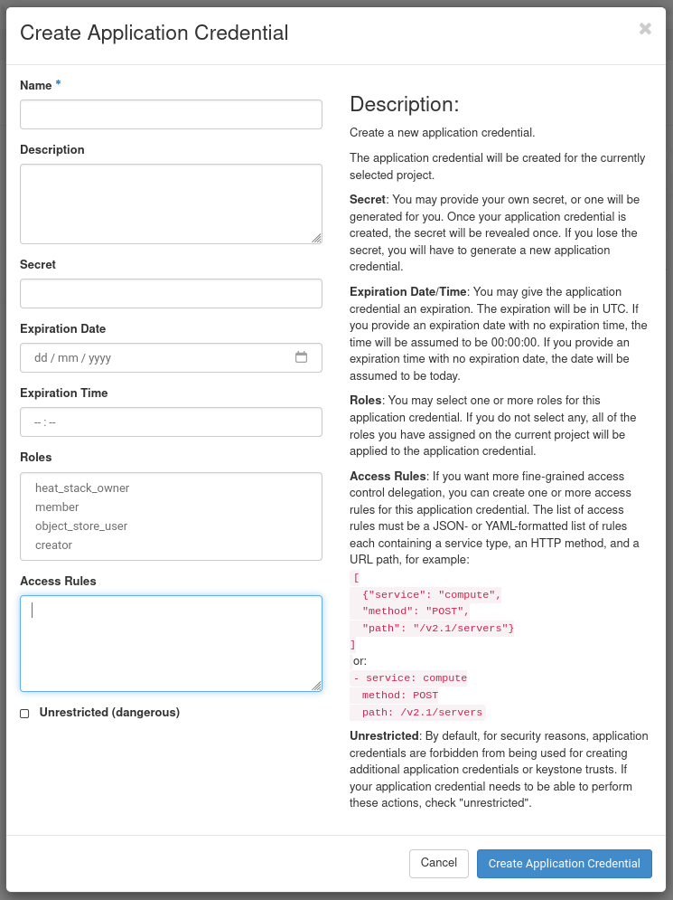

# Application credentials

Application credentials allow you to interact with Pouta via the [OpenStack command-line tools](../command-line-tools) or directly via the API, by allowing you to create a **role specific** and **time limited** _TOKEN_ that can be revoked at any time. The most immediate advantage is that you no longer need to use or write your CSC password while using Pouta's API.

* **Role specific** means that the credentials can be created with limited permissions. You can create credentials that are only allowed to get data of your project, but not modify it. You can also create credentials that can only modify a specific resource. It is also possible to create credentials that can do everything that you can.

* **Time limited** means that the credentials can have a much shorter life than the password of the account that created it. This is useful to limit the repercussion of a credential leak.

* Other advantages are that credentials can be revoked at any time, and that you cannot change or obtain the password if you have only the application credential that created it.

!!! info "Application credentials are linked to the personal account"

    It is important to remember that the application credentials are personal, which means that the application credentials are owned by a user account and all operations that the credentials do is on behalf of the user that created the credentials. This means that if a user is removed from the project the user's credentials will stop working.

In general Application credentials give the power and flexibility to allow a safer interaction with Pouta's API.

## Creating application credential

1. Go to [Pouta's web-interface](https://pouta.csc.fi/).
2. Choose which project you want to use. (You will only see the projects that have cPouta activated in [my.csc.fi](https://my.csc.fi).)
3. Go to `Identitiy` -> `Application Credentials`.
4. Press `Create Application Credential`. A dialog will open.

    

5. It is a good idea to choose a descriptive `name` and `description`. Otherwise you might get confused
in the future why the application credentials exist. It might be a good idea to name your first 
credentials `Testing application credentials $TODAYS_DATE`.
6. `Secret` should be a long random string that you should keep secret. If you leave this empty the
service will create a secret for you, this is probably the preferred method.
7. It is a good idea to put an `expiration date` especially if you are testing the credentials only
for today.
8. There are four roles in cPouta, `member`, `heat_stack_owner`, `object_store_user` and `creator`. Usually you want to use the `member` role. You can find
out more in the [Using roles sections](#using-roles).
9. The `Unrestricted (dangerous)` check-box will allow your application credentials to
create new application credentials. You should never give an application or automation any credentials that have this permission.
10.  Once you have created the application credentials you can either download the credentials as a
file that you can source, a YAML file that can be used directly by the CLI, or alternatively add the secret to your secret manager. This is the **first and last time** that you will be able to get access to this secret. If you lose it, you will need to revoke it and create a new one.

    If you downloaded the `openrc file` you will get a file that contains something like this:

    ```bash
    #!/usr/bin/env bash

    export OS_AUTH_TYPE=v3applicationcredential
    export OS_AUTH_URL=https://pouta.csc.fi:5001/v3
    export OS_IDENTITY_API_VERSION=3
    export OS_REGION_NAME="regionOne" # Depends if you are using cPouta or ePouta
    export OS_INTERFACE=public
    export OS_APPLICATION_CREDENTIAL_ID=xxxxxxxxxxxxxxxxxxxxxx
    export OS_APPLICATION_CREDENTIAL_SECRET=xxxxxxxxxxxxxxxxxxx
    ```

    If you source that file, you can use it together with with [OpenStack command-line tools](../command-line-tools).

    You can also download the `cloud.yaml` file that will look like this:

    ```yaml
    # This is a clouds.yaml file, which can be used by OpenStack tools as a source
    # of configuration on how to connect to a cloud. If this is your only cloud,
    # just put this file in ~/.config/openstack/clouds.yaml and tools like
    # python-openstackclient will just work with no further config. (You will need
    # to add your password to the auth section)
    # If you have more than one cloud account, add the cloud entry to the clouds
    # section of your existing file and you can refer to them by name with
    # OS_CLOUD=openstack or --os-cloud=openstack
    clouds:
      openstack:
        
        auth:
          
          auth_url: https://pouta.csc.fi:5001/v3
          
          application_credential_id: xxxxxxxxxxxxxxxxxxxxxxxxxxxxxxx 
          application_credential_secret: xxxxxxxxxxxxxxxxxxxxxxxxxxxxxxxx 
        
          
        regions:
            
        - regionOne # Depends if you are using cPouta or ePouta
            
          
        interface: "public"
        identity_api_version: 3
        auth_type: "v3applicationcredential"
    ```

    See the comment on the file itself on how to use it.

!!! info "Verify the credentials"

    It is a good idea to test that the application credentials are allowed to do what you expect them to be able to do. It is also a good idea to verify that they are **NOT** allowed to do what you expect them not to be allowed to do.

## Using roles

In cPouta, there are four roles available: `member`, `heat_stack_owner`, `object_store_user` and `creator`.

* `member` role is the normal user role. It can make changes to the system. When you login into the web-interface you have the `member` role
enabled.

* `heat_stack_owner` can operate over Heat stacks, that is create, modify and delete infrastructure. This is useful for using it in a `IaC` setup. 

* `object_store_user` can operate over Allas and Objects Store.

* `creator` can create secrets such as passwords, encryption keys.

If you are using Applications credentials in ePouta, it's slightly different. There are two roles available: `member` and `heat_stack_owner`.

* `member` role is the normal user role. When you login into the web-interface you have the `member` role enabled.

* `heat_stack_owner` can operate over Heat stacks, that is create, modify and delete infrastructure. This is useful for using it in a `IaC` setup. 

