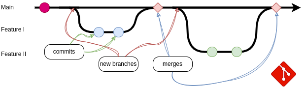

# Sovelluksen kehityskäytännöt (Poutassa) {#application-development-practices-in-pouta}

Tässä artikkelissa käsitellään parhaita käytäntöjä, joita kehittäjien kannattaa noudattaa luodessaan tai ottaessaan sovelluksiaan käyttöön Poutassa, ja kuinka Pouta voi auttaa näiden käytäntöjen noudattamisessa. Pouta-pilvet ([cPouta] ja [ePouta]) tarjoavat muiden IaaS-pilvien tapaan enemmän joustavuutta kuin perinteiset paljasmetalli-käyttöympäristöt, mahdollistaen uusia ja parempia suunnitelmia.

Alla luetellut suositukset keskittyvät siihen, mitä Pouta tarjoaa ja miten sovellukset voivat hyötyä siitä. Tämä ei ole tyhjentävä lista kaikista parhaista käytännöistä. Voit lisäksi noudattaa laajempaa joukkoa [käytäntöjä], kuten [Cloud Native Computing Foundation], erilaista OpenStack-kirjallisuutta, kuten teknisiä blogeja, käyttöoppaita, käyttäjätarinoita jne. Todellisissa tilanteissa jotkin näistä käytännöistä eivät ehkä sovellu sovellukseesi, mutta soveltuvien käytäntöjen käyttöönotto on tämän artikkelin tärkein anti.

## Tilattomat ja hävitettävät virtuaalikoneet {#stateless-and-disposable-virtual-machine-nodes}

Mikäli mahdollista, pyri kehittämään sovelluksesi hajautettujen tilattomien _mikropalveluiden_ muotoon, jotka vastaavat itsenäisistä laskennallisista alitehtävistä ja kommunikoivat keskenään hyvin määritetyn rajapinnan kautta. Tämä on mahdollista suurilta osin siksi, että voit luoda uusia virtuaalikoneita ja varata tallennustilaa muutamassa minuutissa.

Tieto, joka useimmissa tilanteissa on korvaamatonta, tulee tallentaa erillisiin tietovarastopalveluihin, jotka ovat luonteeltaan pysyviä, eikä virtuaalikoneeseen itseensä. Pouta-pilvissä tarjoamme _objektitallennusta_ ([Allas]) ja _levytallennusta_ ([Cinder]).

Sovellus on tällöin **kestävämpi**. Ajamalla tilattomia virtuaalikoneita, joissa tiedot tallennetaan redundantteihin palveluihin kuten [Cinder] tai [Allas] (ammattilaistiimien hallinnoimina), minimoidaan vikojen vaikutus. Jos virtuaalikonetta ajava laitteisto yhtäkkiä hajoaa, tiedot eivät katoa. Tämä poistaa yksittäiset vikaantumispisteet (SPoF).

<center>

*Tilattomat virtuaalikoneet*</center>

## Helposti skaalattavissa (vaakasuora vs pystysuora) {#readily-scalable-horizontal-vs-vertical}

Jos sovellus noudattaa _mikropalvelu_ lähestymistapaa (kuten edellisessä aiheessa mainittiin), se mahdollistaa helpon **vaakasuoran** skaalaamisen, ts. saman virtuaalikoneen replikoiden lisäämisen tai poistamisen. Tämä lähestymistapa on joskus monimutkaisempi, koska sinun on käytettävä sopivaa suunnitelmaa, joka mahdollistaa hajautetun laskennan. Tarvitaan myös jonkinlainen kuormantasain jakamaan työtä virtuaalikoneiden kesken.

Kun tämä haaste on ratkaistu, on sitten vähemmän monimutkaista vaakasuoran **skaalauksen lisääminen ja vähentäminen** sovelluksessa. Jos laskenta ja tiedot eivät ole tiukasti sidoksissa, suunnittelu mahdollistaa virtuaalikone-replikoiden lisäämisen tai poistamisen. Enemmän replikoita mahdollistaa myös laskentasolmujen jakautumisen tietokeskuksen läpi ja minimoi (vieläkin) yksittäisten vikojen vaikutukset, jälleen vähentäen yksittäisten vikaantumispisteiden määrää. Kuten jo mainittu, skaalauksen lisääminen ja vähentäminen tehdään muutamassa minuutissa Poutan luonteen ansiosta.

Sovelluksille, jotka eivät salli _mikropalvelu_-lähestymistapaa, Pouta mahdollistaa helpon **pystysuoran** skaalaamisen, ts. *virtuaalikoneen koon muuttaminen* muuttaaksesi virtuaalikoneen [makuprofiilia] ja lisätäksesi tai poistaaksesi laskentaresursseja (prosessorit, RAM, levy jne.). Se on erittäin nopeaa, sillä se vaatii vain lyhyen uudelleenkäynnistyksen. Virtuaalikoneessa ajettava ohjelmisto näkee lisää resursseja uudelleenkäynnistyksen jälkeen läpinäkyvästi. Ohjelmistoa ei tarvitse asentaa uudelleen. Tämä täydentää (tai vaihtoehtoisesti) vaakasuuntaista skaalausta (replikointi).

<center>

*Vaakasuorassa vs pystysuorassa skaalaaminen*</center>

!!! info "automaattinen skaalaus"

    Pouta-pilvissä voit myös ohjelmoida automaattisesti skaalaamaan Heat-pinoa käyttämällä [OpenStack Heat resursseja], kuten *OS::Heat::ResourceGroup*, *OS::Heat::AutoScalingGroup* ja *OS::Heat::ScalingPolicy*.

## Erilliset käyttöönottotestit ja -tuotantoa {#isolated-deployments-for-testing-and-production}

Sinun **on pakko** olla useita erillisiä käyttöönottoympäristöjä, vähintään **testaus** ja **tuotanto**. Vaikka nimet voivat vaihdella ja useammat ympäristöt saattavat olla sopivia. On oltava **testaus** ympäristö, jossa sinä ja tiimisi kokeilette muutoksia ja varmistatte, että ne toimivat suunnitellusti. Ja **tuotanto** ympäristö, joka on omistettu käyttäjillesi. Ongelmat tulisi löytyä ja ratkaista **testauksessa** ennen kuin ne pääsevät **tuotantoon**. Pouta mahdollistaa useiden laskentaprojektien pyytämisen, jotka ovat alusta alkaen eristettyjä toisistaan.

!!! info "Yleinen sanonta"

    Jokaisella on testausympäristö. Osa ihmisistä on tarpeeksi onnekkaita omistamaan täysin erillisen ympäristön tuotannolle.

Muita yleisiä käyttöönotto-tyyppejä ovat:

* **Esituotanto**, joka on testin ja tuotannon välillä, jossa pidetään vakaa kopio tuotannosta, mutta käyttäjillä ei ole pääsyä siihen. Muutokset kulkevat esituotannon kautta ennen kuin ne tulevat tuotantoon. Tämä on hyödyllistä tehdä viimeinen ja integroitu testi useille yksittäisille muutoksille yhdessä. Ympäristö jäädytetään yleensä jonkin aikaa ennen kuin muutokset viedään tuotantoon. On yleistä, että ystävällisten käyttäjien alayhteisö (kuten kehitystiimi) saattaa käyttää tätä ympäristöä, jotta todellinen elämän testi voidaan tehdä (syö omaa koiranruokaasi).

* **Kehitys**, missä jokaisella tiimillä tai kehittäjällä on oma leikkikenttä yksittäisten muutosten murentamiselle ja testaamiselle. Yleensä näitä ympäristöjä on useita ja ne ovat hävitettäviä.

## Varmuuskopiot {#backups}

Varmuuskopiot ovat kriittisiä mille tahansa sovellukselle. Ne suojaavat tietoja _tahattomalta poistamiselta_, _laitteistovialta_, _korruptiolta_, _kiristyshaittaohjelmilta_ ja muulta. On olemassa useita tietojen varmuuskopiointistrategioita. Riippuen sovelluksesta ja sen sisältämistä tiedoista, varmuuskopiointistrategia voi vaihdella. Tekijät kuten kustannukset, asennuksen monimutkaisuus ja tietojen toistettavuus vaikuttavat seurattavaan strategiaan. Pouta-pilvet eivät tarjoa varmuuskopiointiratkaisua, mutta auttavat määrittämään sellaisen tarjoamalla edistyneitä tallennusratkaisuja, kuten [Cinder] ja [Allas].

Yleinen varmuuskopiointistrategia on 3-2-1 -sääntö. 3 kopiota tiedoista (mukaan lukien alkuperäinen tuotantokopio), 2 erilaista tiedontallennusmediaa ja 1 etävarmuuskopio. Toinen perustavanlaatuinen varmuuskopiointiperiaate on, että kopioita ei voida poistaa tai korruptoida alkuperäisestä lähteestä (tämä on estämään onnettomuuksia ja kiristyshaittaohjelmia). Erityisen varmuuskopiotyökalun käyttäminen on suositeltavaa, nämä työkalut mahdollistavat helposti muuttumattomien kopioiden luomisen, jotka ovat asianmukaisesti päivitettyjä ja aikataulutettuja. Ne helpottavat myös muita toissijaisia näkökohtia, kuten salakirjoitusta ja vanhempien varmuuskopioiden poistamista. On myös erittäin tärkeää varmistaa, että varmuuskopiot ovat todellakin voimassa ja että tietojen voi palauttaa tarkoitetulla tavalla.

<center>

*3-2-1 strategia*</center>

## Käytä jatkuvaa integraatiota ja jatkuvaa toimintaa {#use-continuous-integration-and-continuous-delivery}

Kehittämäsi sovellus, siihen liittyvä infrastruktuurin käyttöönoton koodaus sekä sitä konfiguroiva hallintakoodi tulisi seurata versionhallintajärjestelmällä, valitsemasi versionhallintajärjestelmä, suosituin ja de facto standardi on [GIT]. Kun sovelluksen koodi on versionhallinnassa, seuraava vaihe on käyttää jatkuvaa integraatiota (CI) ja jatkuvaa toimintaa (CD).

<center>

*Git-kehitys ja yhteistyö*</center>

Kun sovelluksen koodi on versionhallinnassa, seuraava vaihe on käyttää jatkuvaa integraatiota (CI) ja jatkuvaa toimintaa (CD).

Jatkuva integrointi (CI) tarkoittaa, että jokainen muutos, joka sitoudutaan koodipohjaasi, rakennetaan automaattisesti ja testataan. Tämä mahdollistaa ongelmien löytämisen aikaisemmin ja järjestelmällisesti. Lisättävien testien tyyppi voi olla yleinen, kuten koodianalyysityökalut tai tarkoituksenmukaiset testit, jotka tarkistavat koodin toiminnallisuuden, estäen virheiden taantumia jne. Lopuksi on myös yleistä, että on sisäisiä menettelytarkastuksia, kuten varmistetaan, että jokaisella uudella haaralla on siihen liittyvä lippu. Kokemukset näistä käytännöistä osoittavat, että aika ja vaivannäkö säästyy tiimeiltä, kun käytetään CI:tä. On muutamia tunnettuja CI-palveluita verkossa, kuten [Travis CI], [Circle CI] ja [Github actions], joilla on erittäin matala kynnyskäyrä ja jotka antavat heti lisäarvoa.

Jatkuva toimitus (CD) tarkoittaa, että tiettyjen ohjelmistoversioiden julkaisua tehdään automaattisesti. Ja mikä tärkeämpää, näiden validoitujen versioiden jakelu on myös automaattista. Joten, jos muutos läpäisee sekä kaikki automaattiset testit että muiden koodaustiimin jäsenten tarkastelun, muutos otetaan käyttöön automaattisesti. Tämä automaatiotaso vaatii myös vankan jakeluprosessin, joka ei edellytä seisokkeja ja luottamusta koko prosessiin. Uudet käyttöönotetut versiot seurataan, tämä tieto johtaa todennäköisesti uusien versioiden suunnitteluun.

<center></center>

## Käytä Devops-työkaluja {#use-devops-tools}

### Infrastruktuuri koodina -työkalut {#infrastructure-as-code-tools}

Infrastruktuuri koodina (IaC) -työkalut ovat erittäin hyödyllisiä, koska ne mahdollistavat monimutkaisten sovellusinfrastruktuurien (virtuaalikoneet, verkosto, tallennus, ...) määrittämisen tekstimuotoisilla tiedostoilla (koodi), joita kutsutaan malleiksi. Sitten työkalu käyttää pilvipalveluntarjoajan rajapintaa luodakseen/määrittääkseen/poistaakseen vastaavan infrastruktuurin automaattisesti. Joitakin IaC-työkaluja, jotka ovat vakaita ja laajalti käytössä, ovat:

* **Terraform** on hyvin tunnettu IaC-työkalu. Se on omistettu olemaan vain IaC-työkalu. Se on pilvisidonta-agnostinen "toimittajien" käytön ansiosta, kuten [OpenStack provider]. Katso esimerkki [terraform-openstack-example].
* **Heat** on OpenStackiin integroitu työkalu. Katso esimerkki [heat-openstack-example].
* **Ansible** sisältää joitain moduuleja, jotka tarjoavat IaC-toiminnallisuutta. Katso esimerkki [ansible-openstack-example].

Kuten yllä oleva kolmesta esimerkistä kullekin työkalulle näkyy, ne kaikki tähtäävät samaan tulokseen: Yksi tai useampi virtuaalikone nginx-installoitu ja muutamia paikallisia tiedostoja otettuna käyttöön. Valitaksesi minkä työkalun käytät, sinun tulee tarkastella työkalujen ylä- ja alamäkiä ja käyttää sitä, joka parhaiten sopii tapausesi. Esimerkiksi, jos ajattelet tukea. Sekä Heat että Ansible ovat OpenStack-tiimin kehittämiä ja Terraform Provider on yhteisön kirjoittama ohjelmisto. Lisäksi Heat toimitetaan OpenStackin mukana ja sitä voi käyttää komentorivillä tai verkkokäyttöliittymällä. Lopuksi Heat on ainoa, jota Pouta-tiimi tukee täysin. Toisaalta Terraform on laajemmin käytetty ja esimerkkien ja avun löytäminen on siitä helpompaa kuin kahdesta muusta työkalusta.

!!! Info "Terraform-licenssi"

    Terraform on muuttanut lisenssiään (kesä 2023), [OpenTofu](https://opentofu.org/) on vaihtoehtoinen asiakasohjelma, joka on luotu välttämään mahdollisia lisensointiongelmia. Tällä hetkellä Tofu on suoraan vaihtokelpoinen, mutta sen odotetaan eriytyvän ajan myötä. Tällä hetkellä ei ole Ansible-moduulia Tofulle.


<center>
*Heat web-käyttöliittymä*
</center>

!!! varoitus "Työkalut kehittyvät"

    Muista, että näiden (ja useimpien) työkalujen tilanne kehittyy ajan myötä, tuki voi parantua tai loppua kokonaan, ominaisuuksia ja virheitä voi korjata jne.

### Konfiguraationhallintatyökalut {#configuration-management-tools}

Jokaisella rakentamallasi sovelluksella on joitain riippuvuuksia ohjelmakirjastojen ja niiden tiettyjen versioiden muodossa. Jotta sovellus toimisi, nämä riippuvuudet tulee määritellä selvästi ja asentaa automaattisesti. Konfiguraationhallintatyökalu, kuten **Ansible** tai **Puppet**, on paras tapa saavuttaa tämä. Käyttämällä konfiguraationhallintatyökalua määrittelemään ja asentamaan riippuvuudet automaattisesti tekee käyttöönotosta toistettavaa ja ennustettavaa. Ansible-esimerkissä alla, tehtävä nimeltä "Asenna riippuvuudet" asentaa muutaman työkalun:

```yaml
- name: Asenna riippuvuudet
  become: yes
  package:
   name:
     - gzip
     - git
     - curl
   state: present
```

Kun kaikki riippuvuudet on määritelty, Ansible varmistaa, että ne on asennettu käyttöönottoympäristöön ennen varsinaisen sovelluksen käyttöönottoa. Sinun ei koskaan tule asentaa mitään riippuvuuksia manuaalisesti, sen sijaan automatisoi niiden asennus. Tämä auttaa toistettavuudessa (kaikki järjestelmät asennetaan samalla tavalla) ja järjestelmä itse dokumentoituu (on selvää, mitä pitää asentaa). On myös mahdollista määrittää ohjelmistoversioita, mikä tekee asennuksesta paljon vakaampaa.

Nämä periaatteet koskevat myös asetuksia. Mahdollisuuksien mukaan sinun tulisi käyttää ylätason moduuleja hallinnoimaan asennetun ohjelmiston asetuksia. Moduulit usein eristävät sinut alusta- ja versioeroista, ts. kirjoitat saman konfiguraatiojulistuksen eri ohjelmistoversioille ja eri käyttöjärjestelmän makuille ja moduuli kääntää sen puolestasi.

Konfiguraationhallintatyökalut integroituvat hyvin Pouta-pilviin. Koska ne osaavat lukea ja käyttää tiettyjä käyttöönottoarvoja virtuaalikoneista, kuten IP-osoitteet, isäntänimet jne., näitä muuttujia ei tarvitse kovakoodata järjestelmään ja ne säilyttävät ajantasaisen tilan. Esimerkiksi, meillä on kuormantasain ja muutamia työsolmuja, kuormantasaajan täytyy sisältää lista työsolmujen IP-osoitteista. Konfiguraationhallintatyökalu voi automaattisesti luoda kuormantasaajan konfiguraation käyttämällä tietoa, jonka se saa OpenStackin API:sta. Lopputulos on täysi-naruriippumaton asennus- ja päivitysprosessi, jossa konfiguraationhallinta tekee kaiken työn eikä manuaalista työtä tarvita.

## Tutki vaihtoehtoja ennen kuin kehität ja otat käyttöön {#research-alternatives-before-you-develop-and-deploy}

Ennen kuin alat kehittämään ja ottamaan käyttöön uutta palvelua, on suositeltavaa tutkia, kattaako olemassa olevat palvelut ja ohjelmistot jo käyttötapauksesi. Sinun tulisi yrittää välttää joutumasta "[ei kehitetty täällä -syndroomaan](https://en.wikipedia.org/wiki/Not_invented_here)", missä sisäisesti kehitettyjä palveluita ja tuotteita suositaan kohtuuttomasti. Tilanne vaihtelee tapauskohtaisesti, sillä toisinaan projektiin liittyviä tarpeita ei voida kattaa olemassa olevilla ratkaisuilla. CSC tarjoaa muutamia palveluratkaisuja, joista sinun tulisi olla tietoinen:

### Noppe {#noppe}

Jos tarvitset Jupyter- tai RStudio-muistikirjan, CSC tarjoaa [noppe palvelun](../noppe/index.md). Se on kypsä palvelu, joka on ammattitaitoisen tiimin tarjoama.

### Rahti {#rahti}

Jos sinun tarvitsee ottaa käyttöön Docker-säilöjä Kubernetes-tyyppisessä klusterissa, CSC tarjoaa [Rahti](../rahti/index.md). Rahti on RedHatin kehittämä OpenShift okd.

### Pukki {#pukki}

Jos tarvitset tietokannan, sinun kannattaa katsoa [Pukki](../dbaas/what-is-dbaas.md), CSC:n Database as a Service -tarjonta (**tällä hetkellä suljetussa betassa**).


!!! info "ota meihin yhteyttä"

    Jos jokin näistä palveluista kiinnostaa sinua, mutta ne eivät kata 100% tarpeistasi, ota yhteyttä meihin osoitteessa <servicedesk@csc.fi> ja tutkimme tapaustasi.

## Yhteenveto {#summary}

Pouta tarjoaa muutamia hyödyllisiä työkaluja ja resursseja, jotka helpottavat luomaan luotettavampia sovelluksia. Pilvikäyttöönotot toimivat erittäin hyvin, kun sovellus noudattaa tilattomien mikropalveluiden ajatusta, jotka on suunniteltu skaalautumaan ylös ja alas läpinäkyvästi ja vastaamaan hyvin odottamattomiin vikoihin. Pouta antaa mahdollisuuden helposti ottaa käyttöön eristettyjä kehitysympäristöjä. Lisäksi API antaa sinulle kaiken automaation vallan, ja Devops työkalujen ansiosta tätä valtaa on yksinkertaista hyödyntää. Ja tietenkin älä koskaan unohda varmuuskopioida tietojasi.

  [käytännöt]: https://12factor.net/
  [koodivarastot]: https://github.com/CSCfi
  [koodivarasto]: http://https://github.com/CSCfi/etherpad-deployment-demo
  [Etherpad-koodiesimerkki]: https://github.com/CSCfi/etherpad-deployment-demo
  [OpenStack Heat -resurssit]: https://docs.openstack.org/heat/stein/template_guide/openstack.html
  [Ansible-playbookit]: https://github.com/CSCfi/spark-openstack
  [Travis CI]: https://travis-ci.org
  [Circle CI]: https://circleci.com/
  [Github toiminnot]: https://github.com/features/actions
  [cPouta]: https://pouta.csc.fi
  [ePouta]: http://epouta.csc.fi
  [Allas]: ../../data/Allas/index.md
  [Cinder]: persistent-volumes.md
  [ansible-openstack-esimerkki]: https://github.com/cscfi/ansible-openstack-example
  [heat-openstack-esimerkki]: https://github.com/cscfi/heat-openstack-example
  [terraform-openstack-esimerkki]: https://github.com/cscfi/terraform-openstack-example
  [makuprofiili]: vm-flavors-and-billing.md
  [OpenStack provider]: https://registry.terraform.io/providers/terraform-provider-openstack/openstack/latest/docs
  [Cisa]: https://www.cisa.gov/sites/default/files/publications/data_backup_options.pdf
  [Cloud Native Computing Foundation]: https://www.cncf.io/
  [GIT]: https://git-scm.com/
