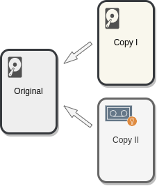

# Application development practices (in Pouta)

This article discusses some best practices for developers
to follow while creating or deploying their application in
Pouta, and how Pouta can help on following them. Pouta clouds ([cPouta] and [ePouta]), like other IaaS clouds, offer more flexibility than traditional bare metal computing environments do, allowing new and better designs.

The recommendations listed below are focused on what Pouta provides to you and how your applications can profit from it. Is not an exhaustive list of all best practices. You can additionally follow a larger set of [practices] as mentioned by the [Cloud Native Computing Foundation], various online literature on
OpenStack such as its technical blogs, user guides, user stories etc. In real scenarios, some of these practices may not be applicable to your application, but applying practices that are suitable is the key takeaway of this article.

## Stateless and disposable Virtual Machine nodes

If possible, try to develop your application in the form of distributed
stateless _microservices_ that are responsible for independent computational sub-tasks and communicate among each other through a well defined interface. This is largely possible by the fact that you can create new VMs and reserve storage in a matter of a couple of minutes.

Data, which in most situations is irreplaceable, needs to be stored in separate data storage services that are persistent in nature, and not in the VM itself. In Pouta clouds, we
offer _Object storage_ ([Allas]) and _Volume storage_ ([Cinder]).

The application will be more **resilient**. Running stateless VMs where the data is stored in redundant services like [Cinder] or [Allas] (managed by a dedicated teams of professionals), minimizes the impact of failures. If the hardware that runs the VM suddenly fails, data will not be lost. This removes single points of failure (SPoF).

<center>

*Stateless VMs*</center>

## Readily scalable (horizontal vs vertical)

If an application follows the _microservice_ approach (mentioned in the previous topic), it will allow easy **horizontal** scaling, i.e. add or remove replicas of the same VM. This approach is sometimes more complex, as you will need to use a suitable design that allows distributed computing. A load balancer of some kind will also be needed to distribute work among the VMs.

After that hurdle is passed, it will be then less complex to horizontally **scale up and down** the application. If the computing and the data are not hardly coupled, the design will allow adding or removing Virtual machine replicas. Having more replicas also allows to spread the computation nodes across the computer center and minimizes (even more) the impact of individual failures, again lowering the number of SPoF. As already mentioned, the scale up and down is done in a matter of minutes thanks to the nature of Pouta.

For applications that do not allow the _microservice_ approach, Pouta allows easy **vertical** scaling, i.e. *VM resize* to change the VM [flavor] and add or remove compute resources (CPUs, RAM, disk etc.). It is very fast as it requires only a short reboot. The software running in the VM will transparently see more resources after the reboot. It is not necessary to reinstall the software. This is a complement (or alternative) to horizontal scaling (replication).

<center>

*Horizontal vs Vertical scaling*</center>

!!! info "auto scale"

    In Pouta clouds, you could also programmatically scale your Heat stack using [OpenStack Heat resources] like *OS::Heat::ResourceGroup*,*OS::Heat::AutoScalingGroup* and *OS::Heat::ScalingPolicy*.

## Isolated deployments for testing and production

You **must** have several isolated deployment environments, at least **testing** and **production**. Even though the names might vary, and more environments might be suitable. There must be a **testing** environment where you and your teammates will experiment with changes and validate that they work as designed. And a **Production** environment which is dedicated to your users. Issues should be found and solved in **testing** before they can get to **production**. Pouta allows you to request several computing projects that will be isolated among themselves by construction. 

!!! info "Common saying"

    Everybody has a testing environment. Some people are lucky enough enough to have a totally separate environment to run production in.

Other common deployment types include:

* **Pre-production**, which is in between test and production where a stable copy of production is kept but no users have access to it. Changes will go through pre-production before they arrive to production. This is useful to make a last and integrated test of a bunch of individual changes together. The environment will normally be frozen for some time before the changes are applied to production. It is common that a sub-community of friendly users (like the development team) might be using this environment so a real life test can be done (eat your own dog food).

* **Development**, where each team or developer will have its own playground to break and test individual changes. There are normally several of these environments and they are disposable.

## Backups

Backups are critical to any application. They protect data against _accidental deletion_, _hardware failure_, _corruption_, _ransomware_ and more. There are several data backup strategies. Depending on the application and the data it contains, the backup strategy might vary. Factors like cost, complication to setup, and reproducibility of the data, affect the strategy to follow. Pouta clouds do not provide a backup solution, but help setting up one by providing advanced storage solutions like [Cinder] and [Allas].

One common backup strategy is the 3-2-1 rule. 3 copies of the data (including the original production one), 2 different media of storage and 1 offsite backup. Other basic backup principle is that copies cannot be deleted or corrupted from the original source (this is to prevent accidents and ransomware). Using a dedicated backup tool is recommended, these tools allow to easily create immutable copies that are properly dated and scheduled. They also facilitate other secondary aspects like encryption and older backups deletion. It is also very important to validate that the backups are indeed valid and that it is possible to recover the data as intended.

<center>

*3-2-1 strategy*</center>

## Use Continuous Integration and Continuous Delivery

The application you develop, the IaC code that deploys its infrastructure, and the configuration management code that configures it, should be tracked by a version control system of your choice, the most popular and de facto standard is [GIT]. Once the code of the application is in Version control, the next step is to use Continuous Integration (CI) and Continuous Delivery (CD).

<center>

*Git development and collaboration*</center>

Once the code of the application is in Version control, the next step is to use Continuous Integration (CI) and Continuous Delivery (CD).

CI is when each change committed to your **codebase** is automatically **built** and **tested**. This allows to find issues sooner and systematically. The kind of tests that can be added could be generic, like code analysis tools, or purpose written tests that check the functionality of the code, preventing bug regressions and so. Finally it is also common, to have internal procedure checks, like make sure every new branch has a ticket associated with it. Experience with these kind of practices show that time and effort is saved by teams when using CI. There are some well known CI services online such as [Travis CI], [Circle CI] and [Github actions], that have a very low barrier of entry and give right away added value.

CD is when the **release** of specific versions of the software is done automatically. And more importantly, the **deployment** of those validated versions is also automatic. So if a change passes both all the automatic tests and the review of other members of the coding team, the change is deployed automatically. This degree of automation also requires a solid deployment process that does not require downtime and confident in the whole process. New deployed versions will be **monitored**, this information will probably lead to **planning** of new versions. 

<center></center>

## Use Devops tools

### Infrastructure as Code tools

Infrastructure as Code (IaC) tools are very useful, as they allow to specify complex application infrastructures (VM, networking, storage, ...) using text files (code) known as templates. Then the tool will use the API of the cloud provider to automatically create/configure/delete the corresponding infrastructure. Some IaC tools which are stable and widely used are:

* **Terraform** is a very known IaC tool. It is dedicated to only being an IaC tool. It is cloud agnostic thanks to the use of "providers", like the [OpenStack provider]. See the example [terraform-openstack-example].
* **Heat** is the tool integrated by OpenStack. See the example [heat-openstack-example].
* **Ansible** has some modules that provide IaC functionality. See the example [ansible-openstack-example].

You can see above three examples, one for for each tool. All of them aim to get the same result: One or more VMs with nginx installed and few local files deployed. In order to choose which one to use, you will need to consider the up and downs of the tools and use the one that fits more your use case. For example, if you think about support. Both Heat and Ansible are developed by the OpenStack team and the Terraform provider is a community written software. In addition, Heat is provided together with OpenStack and can  be used via command line or the web interface. Finally Heat is the only one that the Pouta team fully supports. On the other hand, Terraform is more widely used and will be easier to find examples and help than the other two tools.

!!! Info "Terraform license"

    Terraform has changed its license (Summer 2023), [OpenTofu](https://opentofu.org/) is an alternative client created to avoid licensing issues that might be created. At this time Tofu is a drop in replacement, but it is expected to diverge with time. At this time there is no ansible module for Tofu.


<center>
*Heat web UI*
</center>

!!! warning "Tools evolve"

    Keep in mind that the situations for these (and most) tools evolve over time, support may get better or dropped altogether, features and bugs may be fixed, ...

### Configuration management tools

Every application you build has some dependencies in the form of software libraries and their specific versions.
In order for your application to work, these dependencies should be explicitly defined and installed automatically. A configuration management tool like **Ansible** or **Puppet** is the best way to achieve this. Using a configuration management tool to define and install dependencies automatically makes the deployments more reproducible and predictable. In the Ansible example below, a task called "Install dependencies" will install few tools:

```yaml
- name: Install dependencies
  become: yes
  package:
   name:
     - gzip
     - git
     - curl
   state: present
```

When all dependencies are declared, Ansible will make sure that they are installed in the deployment environment before the actual application is
deployed. You should never install any dependencies
manually, instead automate their installation. This helps reproducibility (all systems will be installed in the same way) and the system will be self-documented (it will be clear what needs to be installed). It is also possible to specify versions of software to make the installation much more stable.

These principles also apply to configuration. When possible, you should use upstream modules to handle the configuration of the software installed. Modules often isolate you from platform and version differences, i.e. you will write the same configuration definition for different versions of the software and different flavors of the operating systems and the module will translate that for you.

Configuration management tools integrate very well with Pouta clouds. As they are able to read and use specific deployment values of the VMs, like IP addresses, host names, etc...  This means that these variables do not need to be hardwired into the system and will always be kept up to date. For example, we have a load balancer and few worker nodes, the load balancer needs to have a list of worker node IPs. A configuration management tool will be able to generate automatically the load balancer configuration using the information it gets from OpenStack's API. The final product is hands-off installation and upgrade process, where the configuration management does all the work and no manual work is necessary.

## Research alternatives before you develop and deploy

Before you start to develop and deploy a new service, it is advisable to explore if existing services and software already cover your use case. You should try to avoid falling into the "[not invented here syndrome](https://en.wikipedia.org/wiki/Not_invented_here)", where internally developed services and products are unfairly favored. It changes from case to case, as sometimes the project needs cannot be covered by existing solutions. CSC provides some service solutions that you should be aware of:

### Noppe

If you need Jupyter or RStudio notebook, CSC provides a [noppe service](../noppe/index.md). It is a mature service provided by a dedicated team of professionals.

### Rahti

If you need to deploy Docker containers on a cluster like Kubernetes, CSS provides [Rahti](../rahti/index.md). Rahti is a OpenShift okd developed by RedHat.

### Pukki

If you need a database, you should take a look to [Pukki](../dbaas/what-is-dbaas.md), CSC's Database as a Service offering (**currently in a closed beta**).


!!! info "contact us"

    If any of these services interest you, but they do not cover 100% your needs, please contact us at <servicedesk@csc.fi> and we will study your case.

## Summary

Pouta offers few useful tools and resources that will make it easier to develop more reliable applications. Cloud deployments work very well when the application follow the idea of disposable microservices that are prepared to scale up and down transparently and are designed to respond well to unexpected failures. Pouta gives the flexibility of easily deploying isolated development environments. In addition, the API gives all the power of automation to you, and thanks to Devops tools it is simple to use that power. And of course never forget to backup your data.

  [practices]: https://12factor.net/
  [code repositories]: https://github.com/CSCfi
  [code repository]: http://https://github.com/CSCfi/etherpad-deployment-demo
  [Etherpad code example]: https://github.com/CSCfi/etherpad-deployment-demo
  [OpenStack Heat resources]: https://docs.openstack.org/heat/stein/template_guide/openstack.html
  [Ansible playbooks]: https://github.com/CSCfi/spark-openstack
  [Travis CI]: https://travis-ci.org
  [Circle CI]: https://circleci.com/
  [Github actions]: https://github.com/features/actions
  [cPouta]: https://pouta.csc.fi
  [ePouta]: http://epouta.csc.fi
  [Allas]: ../../data/Allas/index.md
  [Cinder]: persistent-volumes.md
  [ansible-openstack-example]: https://github.com/cscfi/ansible-openstack-example
  [heat-openstack-example]: https://github.com/cscfi/heat-openstack-example
  [terraform-openstack-example]: https://github.com/cscfi/terraform-openstack-example
  [flavor]: vm-flavors-and-billing.md
  [OpenStack provider]: https://registry.terraform.io/providers/terraform-provider-openstack/openstack/latest/docs
  [Cisa]: https://www.cisa.gov/sites/default/files/publications/data_backup_options.pdf
  [Cloud Native Computing Foundation]: https://www.cncf.io/
  [GIT]: https://git-scm.com/
