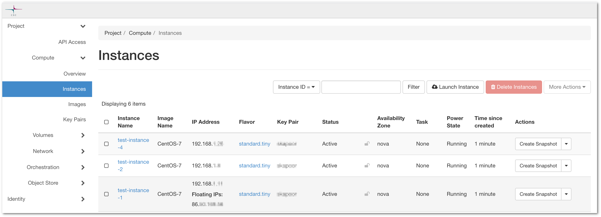
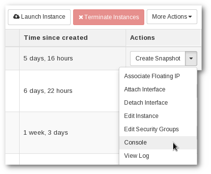
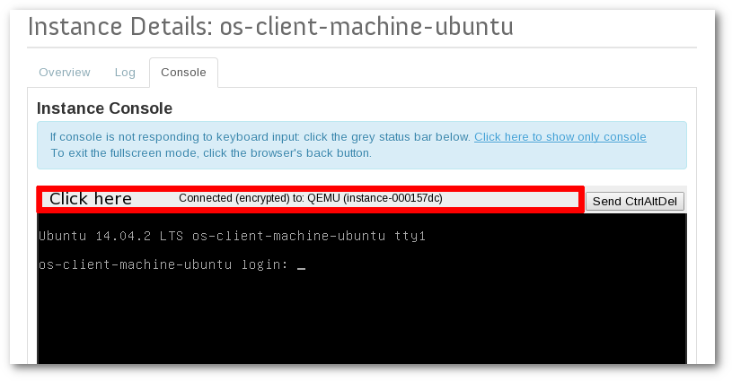

# Connecting to your virtual machine

This article describes several ways to connect to a running virtual machine. In order to create a Virtual Machine, check out [Creating a virtual machine in Pouta](launch-vm-from-web-gui.md).

!!! info "Password access disabled"

    None of the accounts in the default images provided by Pouta CSC have password login enabled by default. Only SSH keypair access is possible by default. This is done to improve security.

## Keypair-based SSH connection

First, you need to check the Virtual Machine status in the **Compute > Instances** view of the Pouta web interface.



**Figure** The Instances view of the cPouta web interface.

Find, under **Instance name**, the Virtual Machine that you want to connect to.

* The **Power State** must be `Running`

* It must have a `Floating IP` attached, write it down.

!!! info
    To access an ePouta instance, you can ssh on the private IP (ssh cloud-user@private-ip).

* Check the name of the key under **Key Pair**. You will need the corresponding SSH secret key installed in your computer.

    !!! Info "Generate SSH public key from a SSH private key"

        If you have access to a SSH private key, it is possible to generate the corresponding public key by:

        `ssh-keygen -y -f ~/.ssh/id_rsa`

        This is useful to be sure which private key corresponds to which public one configured in Pouta.

* Click in the machine name and check that there is a security group that allow SSH connections from your current IP. See the [security group](launch-vm-from-web-gui.md#firewalls-and-security-groups) article for more information on how to create a SSH security group.

* Now you need to know which user name is configured in the Virtual Machine to let your SSH keypair to log in. **Different distributions/images have different user names** (for example in Ubuntu images, the user is `ubuntu`). Third-party images can use any user name, please check the respective documentation. For the default images provided by Pouta CSC, the default upstream username is kept,as we try to provide images as similar as possible to the upstream official ones.

!!! Info "List of usernames and images"
    For an updated list of users and images, please have a look to the [Images](./images.md#images) documentation article. 

!!! Info

    It is a common practise for images, when you try to login as `root`, to get a message back telling you which username to use instead.

    ```sh
    $ ssh root@86.xxx.xxx.xxx
    Please login as the user "cloud-user" rather than the user "root".
    ```

With all the information ready you can now connect to the instance.

### Linux, Mac and PowerShell

In Linux, Mac and most modern Windows, it is possible to use `ssh`:

```sh
ssh <user_name>@<floating-ip> -i <secretkey>
```

#### ssh_config

Instead of specifying the path, IP and user name each time you want to connect to the same Virtual Machine, you can write this formation in your ssh config file. Edit (or create if it is not there) the `~/.ssh/config` file, and add this content:

```ini
Host <machine_name>
Hostname <floating ip>
User <user_name>
IdentityFile <private_key_with_path>
```

* In **Host** you should write the machine name (to later use it to connect using `ssh machine_name`).

* In **Hostname** write the floating of the Virtual Machine.

* In **User** the user name must be specified.

* In **IdentityFile** the full path to the private key must be written, for example `IdentityFile ~/.ssh/id_rsa`.

Check the manual page of [ssh_config](https://linux.die.net/man/5/ssh_config) for more information.

!!! Info "Agent forwarding"
    You can enable *agent forwarding* when connecting through SSH to a virtual machine by using the *-A* flag.

        ssh -A cloud-user@public-ip

By enabling agent forwarding, you enable the ssh agent running on the remote Virtual Machine to make use of the keys which are loaded in the ssh agent of your local workstation. You can use this feature to use the "Bastion host model", where only one single machine, the bastion host, in the cluster has Floating IP and outside access, and the rest of the machines are accessed through the bastion.

    1. Assign a floating IP to one of your instances
    1. ssh to the instance enabling agent forwarding
    1. ssh from this instance to the other instances in the network using their private IP

    Using these steps, you need only a single public IP instead of one public IP for each of the instances.

    **Warning**: using agent forwarding has some [security implications](https://wizardsoftheweb.pro/ssh-agent-forwarding-vulnerability-and-alternative/#the-vulnerability)

### Putty

Open Putty, after following the instructions at [windows-putty](./launch-vm-from-web-gui.md#windows-putty) you should have a saved session with the private key stored on it.

* Load the saved session.

* Under **Host Name (or IP address)**, write the user name an `@` symbol and the floating IP of the instance like: `cloud@89.14.89.14`

* Write a new name (like the machine name) under **Saved Sessions** and click save.

* Click **Open**, a new window to the instance will be opened

Next time you need to use Putty to connect this instance, you will just need to **Load** the corresponding saved session and click **Open**.

## `root` administrator access on a virtual machine

If you are using an image provided by Pouta, and logged in using the default user account, you will be able to run commands as root with `sudo` with no password. If other accounts are created, they will not have `root` administrator access by default.

```sh
sudo <some command>
```

You can also get an interactive root shell:

```sh
sudo -i
```

## Connect to a machine using the Pouta virtual console

It is possible to access a machine using the Pouta Virtual console. This is only advisable **when SSH access is impossible**, for example when the network access of the Virtual Machine is broken.

In order to be able to use the console, **you need to set up a password-based user account first**:

* Connected through SSH to your Virtual Machine instance
* You can use [useradd](https://linux.die.net/man/8/useradd) and or [passwd](https://linux.die.net/man/1/passwd) to set up the account.
* As indicated in our [security guidelines](security.md#be-mindful-about-the-user-accounts-in-the-vm), please **do not enable remote login** for this **password-based account**, but rather use it only in case you need to access the instance though the console.

Once there is a password based account, with no remote login allowed:

* From the instance page at **Compute > Instances**, open a console session by clicking **Console** in the instance dropdown menu:



* To input text in the console, click the grey bar:



* Log in with the user account and password you have created.

!!! warning "Non ASCII characters problems"
    *Umlaut* characters, such as *ä* or *ö*, do not work in the virtual
    console for most keymaps.


## Troubleshooting

If you have any issue connecting to your new Pouta Virtual Machine, please check out our [Why can't I connect to my virtual machine in Pouta?](../../support/faq/why-cant-i-connect-to-my-vm-in-pouta.md) article.


