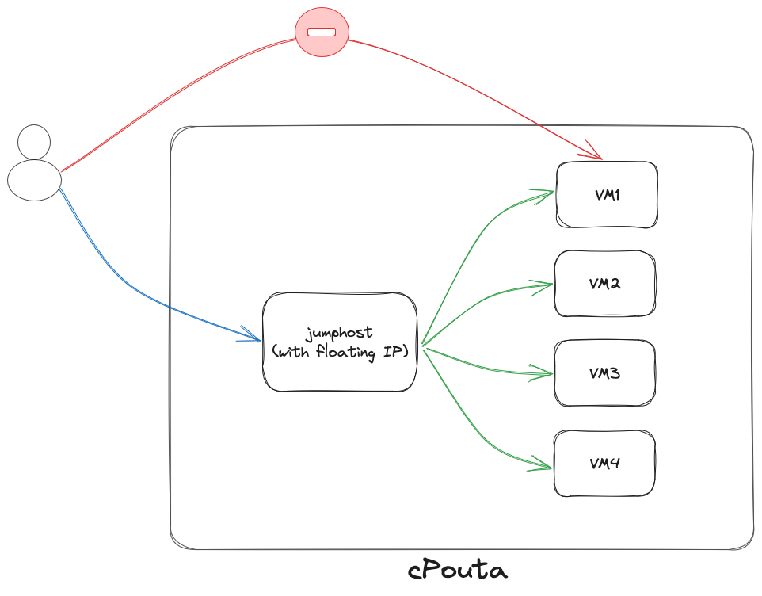

# Jumphost in cPouta
## Introduction
The purpose of a jumphost in an infrastructure is to allow access from the external to several machines without giving them a public IP (Floating IP).  
You can configure one machine with a public IP and access the other machines from the jumphost. This unique machine with a public IP is a gateway to the internal network.  

Here is a schema:  



## How to create a jumphost?
You can find a template in our GitHub repo: [jumphost CSC](https://github.com/CSCfi/openshift-jumphost-example). Read carefully the instructions provided in the repo.  
Keep in mind that we provide a basic template. You can clone and edit it for fulfilling your needs.

## Explanations  
Two extra folders need to be created: `files` and `keys`.  

In the `files` folder, you need to copy your public key used to connect to the instances. It can be the public key you use every time in cPouta or it can be a new key. Don't forget to upload it to your cPouta project.  

In the `keys` folder, you need to copy all the public keys of the users you want to authorize to connect to the different instances. Ansible will look to the `keys` folder.  

Here is the part of the code:  
```yaml
- name: Set authorized key taken from files
  authorized_key:
    user: "ubuntu"
    state: present
    key: "{{ lookup('file', item) }}"
  with_fileglob: "keys/*"
  tags:
    - keys
```

It means to deploy `Ubuntu` images. If you want to use it with `CentOS` machines, don't forget to edit the file `all.yaml` and the values of `os_image` and `user`.  

To run the playbook, type this command:  
```sh
ansible-playbook main.yaml
```
It will prompt you to enter the name of the network you want to use.  

Look at the `README.md` file in the GitHub repository for more details.