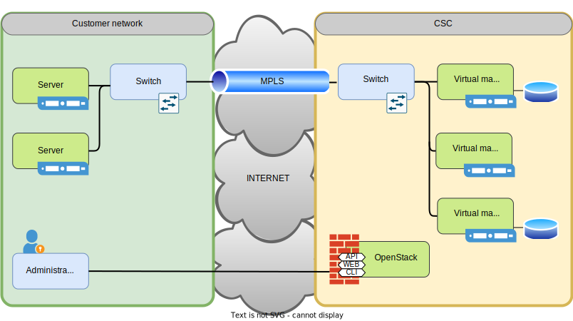

# Applying for ePouta access

Applying for **ePouta** access is not a self service process, it might require manual intervention and some **weeks of wait**. This is different from the cPouta, which is self-service and you should be able to get your new project in a matter of minutes. 

ePouta is a IaaS cloud designed to hold and process **sensitive data**. Because of this, the design focuses on the security of the platform and the data contained in it. It requires a [MPLS](https://en.wikipedia.org/wiki/Multiprotocol_Label_Switching) VPN connection between ePouta and the local network of the user of the VM. In other words, before using ePouta it is necessary to have a [MPLS](https://en.wikipedia.org/wiki/Multiprotocol_Label_Switching) VPN configured. This network setup is a manual step that involves several teams from CSC and the institution of the user of the VMs.

The end result will be a "virtual private data center", as the servers on the customer network, will be in the same network as the VMs in CSC.

1. The first step is to be sure that ePouta is the suitable service for the use case. ePouta is designed to store and process **sensitive data**. If the use case does not deal with sensitive data, cPouta might be a better service for the use case.

1. Once the suitability of ePouta has been validated, it is necessary to check if there is already a project created in ePouta that can hold this use case. Some institutions have what is called an "umbrella project", or other kind of pre-created or pre-allocated pool of network connections. Please contact your institution's IT team to check this.

1. If no suitable project or network connection is already available, you must then make a request by sending an email to <servicedesk@csc.fi> explaining you use case. Please make sure to mention this information:

    * Use case description and why it needs to be hosted in ePouta.
    * Mention that no existing resource can be used and a new one must be created.
    * Estimation of resources needed, and for how long these resources will be used. You can check the [VM flavors and billing](vm-flavors-and-billing.md#epouta-flavors) page to see what VMs are available and stimate the number of Billing units needed.
    * IPs of the administration machines that will need to create, modify and delete VMs.

1. Once the ticket has been created, it is necessary to wait. CSC will contact the necessary network teams to setup the infrastructure. You will be only contacted upon completion, or if any question arises.

1. You might be contacted by your institution's IT team asking for clarifications in regards to network configurations.
