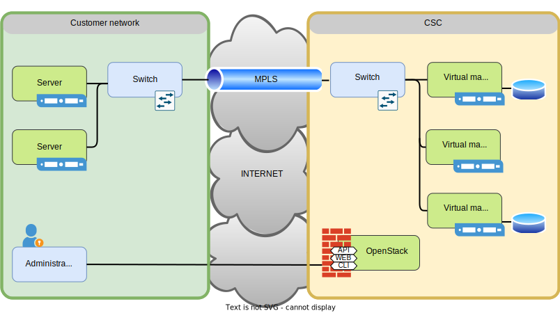

# ePouta-käyttöoikeuden hakeminen { #applying-for-epouta-access }

**ePouta**-käyttöoikeuden hakeminen ei ole itsepalveluprosessi; se voi vaatia manuaalisia toimenpiteitä ja kestää useita viikkoja. Tämä poikkeaa cPoudasta, joka on itsepalvelu ja jossa sinun pitäisi saada uusi projektisi käyttöön muutamassa minuutissa.

ePouta on IaaS-pilvi, joka on suunniteltu säilyttämään ja käsittelemään **arkaluonteista dataa**. Tämän vuoksi suunnittelussa painotetaan alustan ja sen sisältämien tietojen turvallisuutta. Se edellyttää [MPLS](https://en.wikipedia.org/wiki/Multiprotocol_Label_Switching) VPN -yhteyttä ePoutan ja VM:n käyttäjän paikallisverkon välille. Toisin sanoen ennen ePoudan käyttöä on oltava määritetty [MPLS](https://en.wikipedia.org/wiki/Multiprotocol_Label_Switching) VPN. Tämä verkon käyttöönotto on manuaalinen vaihe, johon osallistuu useita tiimejä sekä CSC:ltä että VM:ien käyttäjän organisaatiosta.

Lopputuloksena on ”virtuaalinen yksityinen konesali”, sillä asiakkaan verkon palvelimet ovat samassa verkossa CSC:n VM:ien kanssa.

1. Ensimmäinen vaihe on varmistaa, että ePouta on kyseiseen käyttötapaukseen sopiva palvelu. ePouta on suunniteltu **arkaluonteisen datan** tallentamiseen ja käsittelyyn. Jos käyttötapauksessa ei käsitellä arkaluonteista dataa, cPouta voi olla parempi palvelu.

1. Kun ePoutan soveltuvuus on varmistettu, on tarkistettava, onko ePoutassa jo olemassa projekti, johon tämä käyttötapaus voidaan sijoittaa. Joillakin organisaatioilla on niin sanottu ”sateenvarjoprojekti” (umbrella project) tai muu etukäteen luotu tai varattu verkko­yhteyspooli. Ota yhteyttä organisaatiosi IT-tiimiin tarkistaaksesi tämän.

1. Jos sopivaa projektia tai verkkoyhteyttä ei ole jo olemassa, tee pyyntö lähettämällä sähköposti osoitteeseen <servicedesk@csc.fi> ja kuvaa käyttötapauksesi. Muista mainita seuraavat tiedot:

    * Kuvaus käyttötapauksesta ja miksi se on tarpeen toteuttaa ePoudassa.
    * Maininta siitä, ettei olemassa olevaa resurssia voida käyttää ja että on luotava uusi.
    * Arvio tarvittavista resursseista sekä siitä, kuinka pitkään näitä resursseja käytetään. Voit tarkistaa sivulta [VM-tyypit ja laskutus](vm-flavors-and-billing.md#epouta-flavors), mitkä VM-tyypit ovat saatavilla ja arvioida tarvittavien Billing Units -yksiköiden määrän.
    * Hallintakoneiden IP-osoitteet, joilla luodaan, muokataan ja poistetaan VM:iä.

1. Kun tiketti on luotu, on odotettava. CSC on yhteydessä tarvittaviin verkkotiimeihin infrastruktuurin pystyttämiseksi. Sinuun otetaan yhteyttä vasta, kun työ on valmis, tai jos ilmenee kysymyksiä.

1. Organisaatiosi IT-tiimi saattaa olla sinuun yhteydessä ja pyytää tarkennuksia verkkoasetuksiin liittyen.