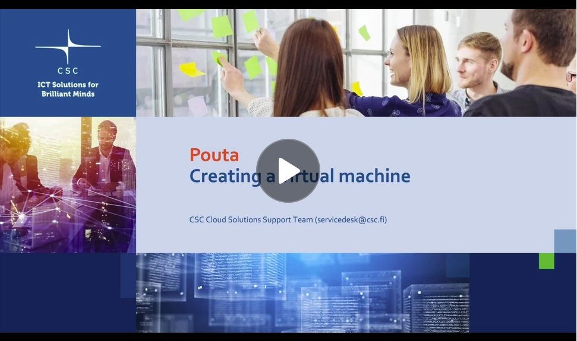

# Overview

Here is a short video explaining how to run a virtual machine with the Pouta service.

[{ width=400px }](https://video.csc.fi/id/0_qilcsiyp?width=608&height=402&playerId=14971191){ target="_blank" }

Please visit also [Creating a virtual machine](launch-vm-from-web-gui.md) and [Connecting the virtual machine](connecting-to-vm.md) for more detailed instructions.

It is also worth to check out this 21 minute video from our specialist [Webinar: Creating a Virtual Machine in cPouta](https://www.youtube.com/watch?v=CIO8KRbgDoI){ target="_blank" }.

Once the virtual machine is up and running, continue with [the configuration](configuration.md).
