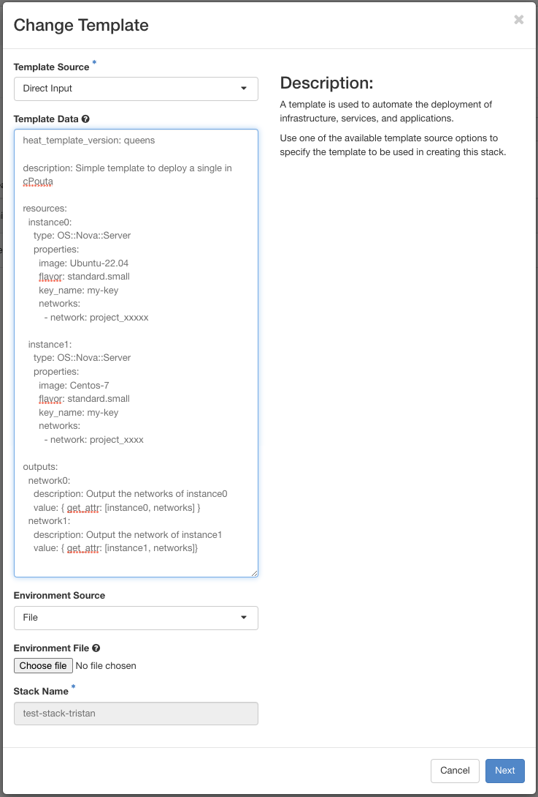

# Orchestration with Heat

This article introduces the virtual machine service orchestration using OpenStack Heat available for Pouta.

You can access this feature in the web user interface's left hand panel or using the OpenStack or Heat command line client. Orchestration provides an easy way to create the entire infrastructure based on a reusable and human-readable template file. The template can describe many components of the infrastructure, such as servers, volumes and floating IPs. In the same file, it can attach the volumes and IPs to specific instances. A template can also define multiple instances connected to specific networks, some of which have floating IPs and some a volume attached. The file can also be used to modify the existing infrastructure.

### Orchestration via the web user interface

!!! info

    You should use "2018-08-31" ("rocky") or older as the [Heat template
    version](https://docs.openstack.org/heat/latest/template_guide/hot_spec.html#rocky). Features in newer template versions may not be supported. 


These instructions provide a simple example on how to set up a stack via the web user interface. To create a Heat stack, click the "Stacks" link in the _Orchestration_ menu. The opened view displays all existing stacks and provides the button "Launch Stack" to launch a new stack. In the window which was opened after clicking the "Launch  Stack" button, you can upload an existing template that you created or you can start configuring your stack. Selecting a template is mandatory, and the template data can also be provided as direct input, as depicted in the picture below. Note that this picture contains a valid, yet simple example of a template which builds two instances and displays the IP address of the first instance.

  

Here is the example:  
```yaml
heat_template_version: rocky # As mentioned above, you can either use the date or the name

description: Simple template to deploy a single instance in cPouta

resources:
  instance0:
    type: OS::Nova::Server
    properties:
      image: Ubuntu-22.04
      flavor: standard.small
      key_name: my-key
      networks:
        - network: project_xxxxx

  instance1:
    type: OS::Nova::Server
    properties:
      image: Centos-7
      flavor: standard.small
      key_name: my-key
      networks:
        - network: project_xxxx

outputs:
  network0:
    description: Output the networks of instance0
    value: { get_attr: [instance0, networks] }
  network1:
    description: Output the network of instance1
    value: { get_attr: [instance1, networks]}
```

After choosing "Next", the web user interface asks for a stack name and your password. After this, you can launch the stack. When the stack is built, it can be managed from the orchestration's _Stacks_ view. The items which were built as a part of the stack can be found in their corresponding menus. In this case, the two instances can be seen and managed in the instances menu. In the stack's Overview tab (Orchestration -&gt; Stacks -&gt; click the stack), you can also see the output defined by the "outputs" section in the picture's example. To delete all components created by the stack template, simply press "Delete Stack" on the Stacks page.

### Using orchestration with the command line client

!!! info

    Be sure that `python-heatclient` is installed. You can install it by typing the command `pip install python-heatclient` (https://pypi.org/project/python-heatclient/)

Heat can be operated with the OpenStack command line client, but currently you can still use the deprecated Heat command line client as well. Create a stack on the command line:

```sh
openstack stack create -t /path/to/my/stack.yml my-heat-stack
```

Show the details of the newly created stack among other existing stacks, type the command `openstack stack list`:

    openstack stack list
    +--------------------------------------+---------------+-----------------+----------------------+--------------+
    | ID                                   | Stack Name    | Stack Status    | Creation Time        | Updated Time |
    +--------------------------------------+---------------+-----------------+----------------------+--------------+
    | 98077bd5-9d69-47c3-98db-b0e19a60b1fa | my-heat-stack | CREATE_COMPLETE | 2016-06-08T07:34:46Z | None         |
    +--------------------------------------+---------------+-----------------+----------------------+--------------+

### Explanations
A template is composed of two major sections:  
- The version used (`heat_template_version`)  
- The resource(s) (`resources`)  

There are also optional sections like:  
- The description (`description`)  
- The parameter group(s) (`parameter_groups`)  
- The parameter(s) (`parameters`)  
- The output(s) (`outputs`)  
- The condition(s) (`conditions`)  

Here is a detail of each sections:  

`heat_template_version`  
&nbsp;&nbsp;&nbsp;&nbsp; Indicates that the YAML document is a HOT (Heat Orchestration Template) template of the specified version.

`description`  
&nbsp;&nbsp;&nbsp;&nbsp; Allows for giving a description of the template.

`parameter_groups`  
&nbsp;&nbsp;&nbsp;&nbsp; Allows for specifying how the input parameter should be grouped and the order to provide the parameters.

`parameters`  
&nbsp;&nbsp;&nbsp;&nbsp; Allows for specifying input parameters that have to be provided when instantiating the template.

`resources`  
&nbsp;&nbsp;&nbsp;&nbsp; Contains the declaration of the single resources of the template.

`outputs`  
&nbsp;&nbsp;&nbsp;&nbsp; Allows for specifying output parameters available once the template has been instantiated.

`conditions`  
&nbsp;&nbsp;&nbsp;&nbsp; Includes statements which can be used to restrict when a resource is created or when a property is defined


### Advanced example: create a template to build one or more instances
The plan here is:  
- Create a parameter file for Openstack Heat.  
- Create two Openstack Heat templates: one for the number of instance(s) (OS::Heat::ResourceGroup) and the other for the specification of the deployment.  
- Create an ansible script to automate the deployment.  

!!! info

    The following tools must be installed:  
    - [Ansible](https://docs.ansible.com/ansible/latest/installation_guide/intro_installation.html)  
    - python-openstackclient (`pip install python-openstackclient`)  
    - python-heatclient (`pip install python-heatclient`)  

First, you can create a `heat_params.yaml` that will contains different variables use for your instance. Use your own value:  

```yaml
parameter_defaults:
  ssh_key_name:
  vm_flavor:
  vm_image:
  vm_network:
  count:
```

Second, two Openstack Heat templates. For the first one, we'll take our previous examples with some modifications. We call it `heat_stack_vm.yaml`:  

```yaml
heat_template_version: rocky # As mentioned above, you can either use the date or the name

description: Simple template to deploy a single or several instance(s) in cPouta

parameters: # Since we created a heat_params.yaml, they will be retrieved from this file
  ssh_key_name:
    description: SSH key name
    type: string
  vm_name:
    description: Name for the VM
    type: string
  vm_flavor:
    description: Flavor for the VM
    type: string
  vm_image:
    description: Image for the VM
    type: string
  vm_network:
    description: Network for the VM
    type: string

resources:
  instance:
    type: OS::Nova::Server
    properties:
      name: { get_param: vm_name } # This value will be retrieved from servers_group.yaml file. See after.
      image: { get_param: vm_image }
      flavor: { get_param: vm_flavor }
      key_name: { get_param: ssh_key_name }
      networks:
        - network: { get_param: vm_network }

outputs:
  network:
    description: Output the networks of instance
    value: { get_attr: [instance, networks] }
```

Third, we'll create a file called `servers_group.yaml`, a [ResourceGroup](https://docs.openstack.org/heat/latest/template_guide/openstack.html#OS::Heat::ResourceGroup), which allows us to scale our instances:  

```yaml
heat_template_version: rocky

description: Resource Group to deploy one or several instance(s)

parameters: # Parameter retrieves from heat_params.yaml file.
  count:
    description: Number of resources
    type: string

resources:
  instances_group:
    type: OS::Heat::ResourceGroup
    properties:
      count: { get_param: count }
      resource_def:
        type: heat_stack_vm.yaml # We defined our previous template.
        properties:
          vm_name: test-stack-%index% # Value %index% will be increased if more than one vm is created.

outputs:
  print_out:
    value: { get_attr: [instances_group, network] }
```

And finally, we'll create an ansible script that will build and deploy our vm(s). Let's call it `build-heat-stack.yaml`:  

```yaml
- hosts: localhost
  gather_facts: false
  vars:
    heat_environment_file: "heat_params.yaml" # Be sure that the file is located at the same level as build-heat-stack.yaml

  tasks:
    - name: Build a Heat stack VM
      register: heat_stack
      os_stack:
        name: "{{ stack_name }}"
        state: present
        template: "servers_group.yaml" # Be sure that the file is located at the same level as build-heat-stack.yaml
        environment: 
          - "{{ heat_environment_file }}"

    - name: Print out network
      debug:
        var: heat_stack
```

Source your cPouta project (`source project_xxxxx.sh`) and run the command:   
```sh
ansible-playbook -e stack_name="test-stack" build-heat-stack.yaml`
```

If everything went well, you can check that the stack was created, either using the web interface of cPouta or typing the command: `openstack stack list`.  
You can also check the instance(s) created: `openstack server list`.  

If you delete the stack, all the resources created from it will be deleted as well.

### Heat guidelines and command references

For more information, visit the OpenStack [Heat wiki](https://wiki.openstack.org/wiki/Heat). For a full reference to the OpenStack command line client, see the [command line reference](http://docs.openstack.org/cli-reference/openstack.html).  
Here is an example on our GitHub to deploy one or several instances with nginx [Read more about the GitHub repo](https://github.com/CSCfi/heat-openstack-example){ target="_blank" }
