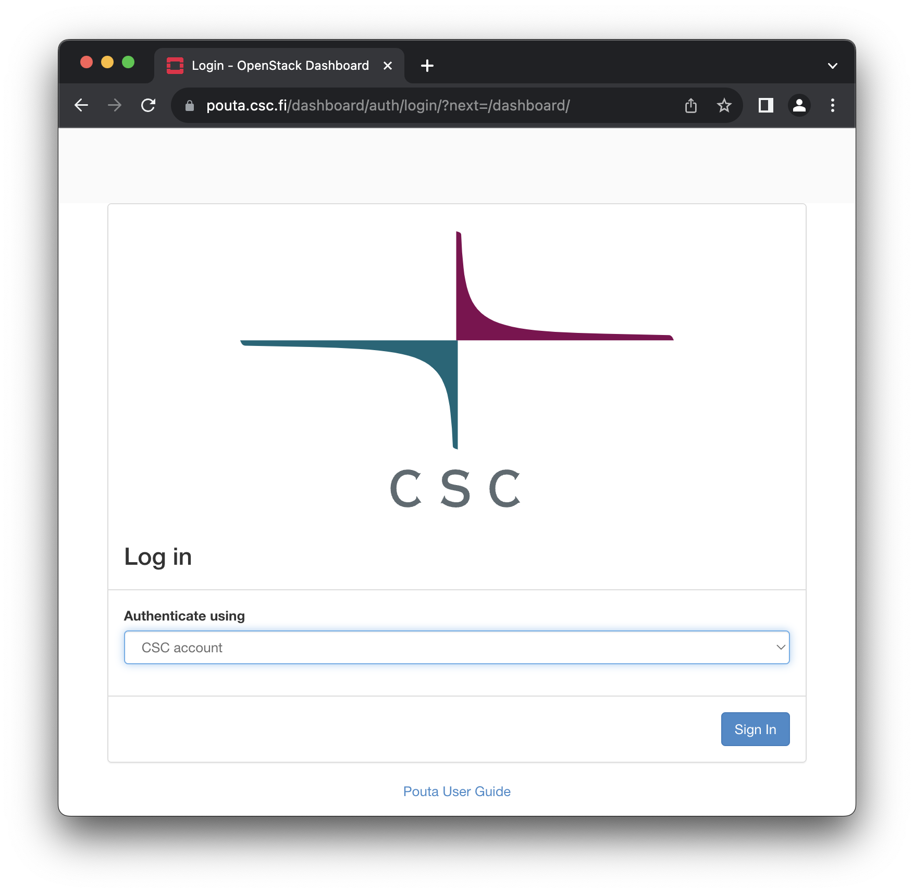

# Overview

Pouta is an umbrella term for cPouta and ePouta services, which are the 
IaaS cloud services at CSC. The cPouta cloud is the public cloud which 
is easily accessible via the internet. The ePouta cloud is a virtual 
private cloud designed to meet the security requirements of handling 
sensitive data. Both the cPouta and ePouta clouds run on the OpenStack 
cloud software. The Pouta cloud services are suitable for most kinds of 
computational workloads and any other supporting services these workloads 
might need.

The cPouta virtual machines can be connected to external IP addresses,
and in this case they can be directly accessed on the internet. This
helps customers run widely available services, but the customers must
also take care to secure their machines. The virtual machines do not
have access to any other part of CSC's infrastructure, other than what
is already visible on the internet. Application data and software must
be uploaded either via the internet or copied from CSC's existing
shared storage services.
 
The ePouta cloud services are well suited for computational workloads
involving sensitive data as well as extending a customer's existing IT
infrastructure. The ePouta cloud services are attached to the customer's
infrastructure and can be used to analyse sensitive data which may
require large amounts of memory or clustered I/O performance, a remote
desktop for processing sensitive data etc. The virtual machines in the
ePouta cloud may optionally have network access to specific sensitive
data repositories at CSC.

## Accessing the Pouta services

Due to the nature of ePouta, it is not available as a self-service. Questions regarding ePouta should be directed to our helpdesk (<servicedesk@csc.fi>).

cPouta is self-service and you can find more information on how to get access here: [Applying for cPouta access](../../accounts/how-to-add-service-access-for-project.md).

 ePouta access is **not** self-service. The process is described in [Applying for ePouta access](ePouta-access.md).

The web interfaces of the Pouta clouds are available at following addresses:

| URL | Service name | Access |
| :-------------| :-------------| :-----|
| [https://pouta.csc.fi](https://pouta.csc.fi) | cPouta web interface | Accessible on the internet using Haka, Virtu, etc. |
| [https://epouta.csc.fi](https://epouta.csc.fi) | ePouta web interface | Accessible only from IPs provided for accessing the management interfaces of ePouta using CSC account. |

Login is available for [supported account types](../../accounts/how-to-create-new-user-account.md) like Haka and Virtu.

Once you have successfully logged in, you can continue with the [Getting Started Guide](getting-started.md). Pay also attention to the  [Security guidelines for Pouta](security.md) and the [Pouta accounting principles and quotas](accounting.md).

If you are already familiar with the basics of OpenStack, please go directly to the [Configuration](configuration.md) and [Advanced](advanced.md) sections of the Pouta documentation.

Other useful links are:

## Using Pouta

* [Virtual machine flavors and billing unit rates](vm-flavors-and-billing.md)
* [Launching a virtual machine with the cPouta web interface](launch-vm-from-web-gui.md)
* [DNS names for virtual machines](additional-services.md#dns-services-in-cpouta)
* [Connecting to your virtual machine](connecting-to-vm.md)
* [Command line client tools](command-line-tools.md)
    * [Installing command line tools](install-client.md)
* [Virtual machine lifecycle and saving billing units](vm-lifecycle.md)
* [Orchestration with Heat](heat-orchestration.md)
* [Application development practises in Pouta](application-dev.md)
* [Creating and uploading virtual machine images](adding-images.md)
* [Additional services in Pouta (email, DNS)](additional-services.md)

## Storage in Pouta

* [Introduction](storage.md)
* [Ephemeral storage](ephemeral-storage.md)
* [Persistent volumes](persistent-volumes.md)
* [Snapshots](snapshots.md)

## Self study and troubleshooting

* [Pouta videos](pouta-videos.md)
* [Known problems and limitations](known-problems.md)
* [Pouta FAQ](../../support/faq/index.md#pouta)
