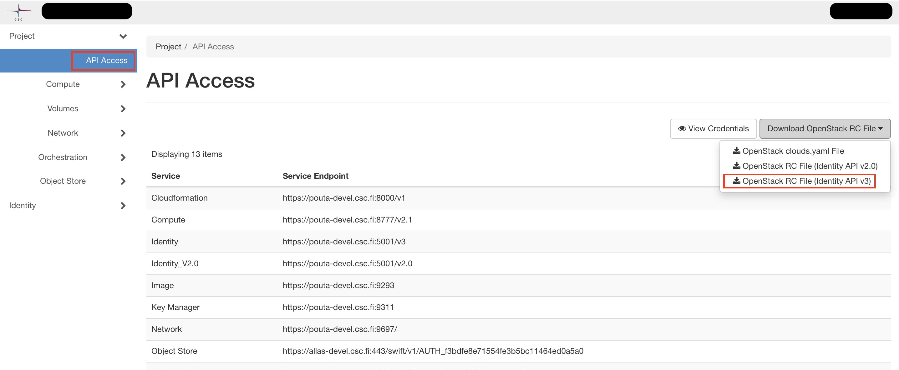

# OpenStack command line tool installation using package manager tools

This article describes how to install the OpenStack command line tools on
Ubuntu, Red Hat and OS X based systems
to efficiently manage various features of OpenStack.
The installation instructions are based on Python's _pip_ package. Once pip is
in place, the steps are the same for all systems.

!!! info

    If you do not have root/administrator access
    to the system on which you want to run the command line clients,
    see the instructions about [virtual environments](#optional-installation-in-a-python-virtual-environment).

Installing in Windows is also possible, but it is beyond the scope
of this guide. Rackspace maintains a guide for [installing the python-novaclient on Windows](https://docs.rackspace.com/support/how-to/install-python-novaclient-on-windows/).

We recommend first familiarizing yourself with the [Pouta web GUI](launch-vm-from-web-gui.md) and the main concepts.

## Overview of the OpenStack command line tools

There is a generic command line tool called "openstack"
that can be used to manage most things in OpenStack. There are
individual tools for managing only some specific functionalities of
OpenStack such as "neutron" for managing networks and "glance" for
managing virtual machine images. In most cases, the common openstack
tool should be used. The other tools are deprecated by the OpenStack
project and are generally only necessary if you have scripts that
depend on them or you need to run certain administrative
commands.

| Tool name | Package name | Used for |
|-----------|------------------------|------------------------------------------------------------------------------------------------|
| openstack | python-openstackclient | Managing the entire OpenStack                                                                  |
| nova      | python-novaclient      | Managing virtual machines and some limited functionality for managing e.g. volumes and images. |
| neutron   | python-neutronclient   | Managing virtual networks and routers.                                                         |
| glance    | python-glanceclient    | Managing virtual machine images.                                                               |
| cinder    | python-cinderclient    | Managing volumes that can be attached to virtual machines.                                     |
| swift     | python-swiftclient     | Managing objects with the Swift API                                                            |

### Preparation

To prepare for the installation of the actual command line tools, we will
install the pip and Python development packages.

!!! info

    We assume here that you already have Python installed. This is
    most likely the case if you are running any of the operating systems
    for which we have instructions here.

Find out if Python is installed and which version it is:

~~~~
python --version
~~~~

You will need Python 3 or newer in order to install the command line
client tools. If you are running even a relatively recent version of
your operating system, this should not be an issue. However, if you
have a Red Hat based system that is older than version 7, you will not be
able to install Python 3 the normal way. See the note for
RHEL/CentOS 6 users under the corresponding subheading below.

If for some reason you do not have Python installed, please [install it
first].

#### Preparation: Ubuntu-based systems

If running Ubuntu 16.04 or newer:

~~~~
sudo apt install python3-pip python3-dev
~~~~

For versions older than 16.04:

    sudo apt-get install python3-pip python3-dev

#### Preparation: Red Hat based systems

If running version 7 or newer:

    sudo yum install python3-pip python3-devel

!!! warning

    If you are running RHEL/CentOS 6, the latest version of Python
    available by default is 2.6. This is too old to run recent versions of
    the OpenStack client tools. It is possible to install Python 3 for
    these operating systems as well, but that is out of the scope of this
    guide. You can find information on how to install Python 3 at
    [SoftwareCollections.org]. Once you have done that, you should
    be able to follow the instructions for newer Red Hat based systems
    above.

#### Preparation: OS X systems

Download the latest [Python setuptools](https://pypi.python.org/pypi/setuptools)"

Install the tools and pip:

    sudo python ez_setup.py
    sudo /usr/local/bin/easy_install pip

### Installing the openstack tool (all operating systems)

From this point onwards, the installation instructions are the same for
all operating systems.

#### Optional: installation in a Python virtual environment

If you also run other Python
software besides the OpenStack command line tools on your computer, we
recommend using Python's virtual environments. Python's virtual
environments are a way to create an isolated set of Python packages
that are only available in that virtual environment. They are very
convenient for keeping your Python installation clean and
manageable. You will also need to use them if you wish to install the
command line client tools on a computer where you do not have root
access. In that case, your administrator will need to install Python,
pip and the virtualenv Python package for you. For more information
about virtual environments, see [The Hitchhiker's Guide to Python].

Here we give basic instructions on setting up a simple virtual
environment for installing the client tools. If you do not want to use
virtual environments, you can skip these steps and move directly to
the installation instructions using pip.

First install the python3-venv package. On Ubuntu:

    sudo apt install python3-venv

Note that on Red Hat based systems there is no need of installing a 
dedicated package. 

Create a directory for your virtual environments. We give it a
specific name but you can call it something else as well:

    mkdir python_virtualenvs

Go to the directory and create a new virtual environment:

    cd python_virtualenvs
    python3 -m venv osclient

This creates a new directory called "osclient" in the
"python\_virtualenvs" directory. This directory will contain
everything you install within the virtual environment. It also
contains a script for activating the environment that you need to run
next:

    source osclient/bin/activate

After activation, further Python or
pip commands will run in the context of the virtual environment. If
you now proceed with the installation instructions below, all packages
will be installed in your newly created virtual environment. You will
know that the "osclient" virtual environment is activated when you see
the text "(osclient)" before your prompt in the shell you are
using. If you install the command line clients inside a virtual
environment, they will only be available within that virtual
environment.

After installation, if you want to deactivate the virtual environment,
you can simply type:

    deactivate

Note that doing this will also mean that any of the command line tools
you install will not be available for use until you reactivate the
virtual environment.

#### Installing the client tools using pip

OpenStack provides a set of Python tools for managing various aspects
of its operation. Each subcomponent of OpenStack has its own tool. It
also provides the common shared tool
*python-openstackclient*. The easiest way to install most of the
command line tools is to install python-openstackclient. It should
pull several other clients as dependencies. If a tool you need is
missing even after installing python-openstackclient, please refer to
the table at the beginning of this page for a list of packages to
install.

!!! info

    If you followed the instructions for setting up a virtual
    environment, remove the "sudo" from the beginning of the commands
    below. As you are installing in your own virtual environment, you do
    not want to run the commands as root.

Install python-openstackclient with pip:

    sudo pip install python-openstackclient

If you also want to install all the service-specific tools listed at
the beginning of this page:

    sudo pip install python-keystoneclient python-novaclient python-glanceclient python-neutronclient

Depending on your computer's setup, some dependencies might be
missing. The error message `ImportError: No module named
<module>` can usually be fixed by installing the missing module
with pip and then repeating the previous, failed command. For some
errors during installation, updating setuptools or pip might help.
Upgrade a package:

    sudo pip install -U python_module_to_be_upgraded

### Configure your terminal environment for OpenStack

The environment variables need to be set before you can use the
client. You can set them using a script provided in the OpenStack
web interface. You can download this script at the following URL
after logging in:

> <a
> href="https://pouta.csc.fi/dashboard/project/api_access/"
> class="external-link">https://pouta.csc.fi/dashboard/project/api_access/</a>

To download this in the web interface, navigate to the
*API Access* section, and press *Download OpenStack RC File v3.*

Once you have the openrc script from the web UI, you can add the
environment variables:

    source <project_name_here>-openrc.sh

You will be asked to type in a password. *Please use the password of your CSC
account* because the command line interface does not support yet the usage of
credentials from linked accounts, such as Haka or Virtu. After doing this, the
current terminal session will have the proper environment variables for using
the command line tools. You need to do this again if you open a new terminal.

  [install it first]: http://docs.python-guide.org/en/latest/starting/installation/
  [SoftwareCollections.org]: https://www.softwarecollections.org/en/
  [The Hitchhiker's Guide to Python]: http://docs.python-guide.org/en/latest/dev/virtualenvs/
