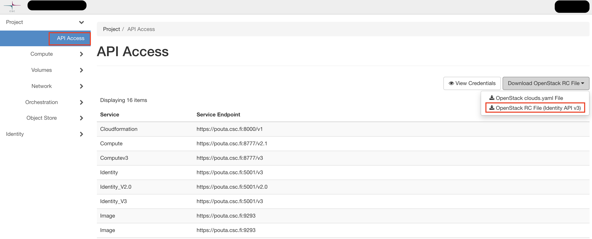

# OpenStackin komentorivityökalujen asennus pakettienhallintatyökalujen avulla

Tämä artikkeli kuvaa, kuinka asentaa OpenStackin komentorivityökalut Ubuntu-, Red Hat- ja OS X -pohjaisiin järjestelmiin hallitaksesi tehokkaasti OpenStackin eri ominaisuuksia. Asennusohjeet perustuvat Pythonin _pip_-pakettiin. Kun pip on asennettu, vaiheet ovat samat kaikille järjestelmille.

!!! info

    Jos sinulla ei ole pääkäyttäjän/ylläpitäjän oikeuksia siihen järjestelmään, jossa haluat käyttää komentorivin asiakasohjelmia, katso [virtuaaliympäristöihin liittyvät ohjeet](#optional-installation-in-a-python-virtual-environment).

Asennus Windowsiin on myös mahdollista, mutta se ei kuulu tämän oppaan piiriin. Rackspace ylläpitää [opasta python-novaclientin asentamiseen Windowsiin](https://docs.rackspace.com/support/how-to/install-python-novaclient-on-windows/).

Suosittelemme ensin tutustumaan [Poutan web-käyttöliittymään](launch-vm-from-web-gui.md) ja keskeisiin käsitteisiin.

## OpenStackin komentorivityökalujen yleiskatsaus {#overview-of-the-openstack-command-line-tools}

On olemassa yleinen komentorivityökalu nimeltä "openstack", jota voi käyttää useimpien OpenStackin asioiden hallintaan. OpenStackin tiettyjen toiminnallisuuksien, kuten verkkojen hallintaan tarkoitetun "neutronin" ja virtuaalikonekuvien hallintaan tarkoitetun "glancen", hallintaan on myös yksittäisiä työkaluja. Useimmissa tapauksissa yleistä openstack-työkalua tulisi käyttää. Muut työkalut ovat OpenStack-projektin hylkäämiä, ja niitä tarvitaan yleensä vain, jos sinulla on skriptejä, jotka ovat niistä riippuvaisia, tai jos sinun täytyy suorittaa tiettyjä hallinnollisia komentoja.

| Työkalun nimi | Paketin nimi | Käyttötarkoitus |
|-----------|------------------------|------------------------------------------------------------------------------------------------|
| openstack | python-openstackclient | Koko OpenStackin hallinta                                                                    |
| nova      | python-novaclient      | Virtuaalikoneiden hallinta ja rajallinen toiminnallisuus, kuten volyymeiden ja kuvien hallinta. |
| neutron   | python-neutronclient   | Virtuaaliverkkojen ja reitittimien hallinta.                                                 |
| glance    | python-glanceclient    | Virtuaalikonekuvien hallinta.                                                               |
| cinder    | python-cinderclient    | Virtuaalikoneisiin liitettävien volyymeiden hallinta.                                       |
| swift     | python-swiftclient     | Objektien hallinta Swift-API:n avulla                                                       |

### Valmistelu {#preparation}

Valmistellaksesi varsinaisten komentorivityökalujen asennusta, asennamme pipin ja Pythonin kehityspaketit.

!!! info

    Oletamme tässä, että sinulla on jo Python asennettuna. Tämä on todennäköistä, jos käytät jotain käyttöjärjestelmistä, joista meillä on ohjeet täällä.

Ota selvää, onko Python asennettu ja mikä versio:

~~~~
python --version
~~~~

Tarvitset Python 3:n tai uudemman version, jotta voit asentaa komentorivityökalut. Jos käytät edes suhteellisen tuoretta käyttöjärjestelmäversiota, tämän ei pitäisi olla ongelma. Jos kuitenkin käytät vanhempaa kuin version 7 Red Hat -pohjaista järjestelmää, et pysty asentamaan Python 3:sta normaalisti. Katso alla oleva huomautus RHEL/CentOS 6 -käyttäjille.

Jos syystä tai toisesta Pythonia ei ole asennettu, asenna se [ensiksi].

#### Valmistelu: Ubuntu-pohjaiset järjestelmät {#preparation-ubuntu-based-systems}

Jos käytät Ubuntu 16.04:ää tai uudempaa:

~~~~
sudo apt install python3-pip python3-dev
~~~~

Versioille, jotka ovat vanhempia kuin 16.04:

    sudo apt-get install python3-pip python3-dev

#### Valmistelu: Red Hat -pohjaiset järjestelmät {#preparation-red-hat-based-systems}

Jos käytät versiota 7 tai uudempaa:

    sudo yum install python3-pip python3-devel

!!! warning

    Jos käytät RHEL/CentOS 6:ta, uusin oletuksena saatavilla oleva Python-versio on 2.6. Tämä on liian vanha uusimpien OpenStack-asiakasohjelmien käyttöön. On mahdollista asentaa Python 3 myös näihin käyttöjärjestelmiin, mutta se ei kuulu tämän oppaan piiriin. Lisätietoja Python 3:n asentamisesta löytyy [SoftwareCollections.orgista]. Kun olet tehnyt tämän, voit noudattaa yllä olevia ohjeita uudemmille Red Hat -pohjaisille järjestelmille.

#### Valmistelu: OS X -järjestelmät {#preparation-os-x-systems}

Lataa uusin [Python setuptools](https://pypi.python.org/pypi/setuptools)"

Asenna työkalut ja pip:

    sudo python ez_setup.py
    sudo /usr/local/bin/easy_install pip

### Openstack-työkalun asentaminen (kaikki käyttöjärjestelmät) {#installing-the-openstack-tool-all-operating-systems}

Tästä eteenpäin asennusohjeet ovat samat kaikille käyttöjärjestelmille.

#### Vaihtoehtoinen: Asennus Pythonin virtuaaliympäristössä {#optional-installation-in-a-python-virtual-environment}

Jos ajat tietokoneellasi myös muita Python-ohjelmistoja kuin OpenStackin komentorivityökaluja, suosittelemme käyttämään Pythonin virtuaaliympäristöjä. Pythonin virtuaaliympäristöt ovat tapa luoda eristetty joukko Python-paketteja, jotka ovat saatavilla vain kyseisessä virtuaaliympäristössä. Ne ovat erittäin käteviä Python-asennuksen pitämiseksi siistinä ja hallittavana. Tarvitset niitä myös, jos haluat asentaa komentorivityökalut tietokoneelle, johon sinulla ei ole pääkäyttäjän oikeuksia. Siinä tapauksessa ylläpitäjäsi täytyy asentaa sinulle Python, pip ja virtualenv Python-paketti. Lisätietoa virtuaaliympäristöistä löytyy [The Hitchhiker's Guide to Pythonista].

Tässä annamme perusohjeet yksinkertaisen virtuaaliympäristön perustamiseksi asiakasohjelmien asentamista varten. Jos et halua käyttää virtuaaliympäristöjä, voit ohittaa nämä vaiheet ja siirtyä suoraan pip-asennusohjeisiin.

Asenna ensin python3-venv-paketti. Ubuntussa:

    sudo apt install python3-venv

Huomaa, että Red Hat -pohjaisissa järjestelmissä ei tarvitse asentaa erillistä pakettia.

Luo hakemisto virtuaaliympäristöille. Annamme sille tietyn nimen, mutta voit myös antaa sille jonkin muun nimen:

    mkdir python_virtualenvs

Mene hakemistoon ja luo uusi virtuaaliympäristö:

    cd python_virtualenvs
    python3 -m venv osclient

Tämä luo uuden hakemiston nimeltä "osclient" "python_virtualenvs"-hakemistoon. Tämä hakemisto sisältää kaiken, mitä asennat virtuaaliympäristön sisään. Se sisältää myös skriptin ympäristön aktivointia varten, joka sinun täytyy suorittaa seuraavaksi:

    source osclient/bin/activate

Aktivoinnin jälkeen kaikki Python- tai
pip-komennot suoritetaan virtuaaliympäristön kontekstissa. Jos jatkat nyt alla olevien asennusohjeiden kanssa, kaikki paketit asennetaan vasta luomaasi virtuaaliympäristöön. Tiedät, että "osclient"-virtuaaliympäristö on aktivoitu, kun näet tekstin "(osclient)" kehotteesi edessä käyttämässäsi komentorivissä. Jos asennat komentorivityökalut virtuaaliympäristössä, ne ovat käytettävissä ainoastaan kyseisessä virtuaaliympäristössä.

Asennuksen jälkeen, jos haluat poistaa virtuaaliympäristön käytöstä, voit yksinkertaisesti kirjoittaa:

    deactivate

Huomaa, että tämä tekee myös sen, että mitkään asentamistasi komentorivityökaluista eivät ole käytettävissä ennen kuin aktivoit virtuaaliympäristön uudelleen.

#### Asiakasohjelmien asentaminen pipin avulla {#installing-the-client-tools-using-pip}

OpenStack tarjoaa joukon Python-työkaluja eri toimintojen hallintaan. Jokaisella OpenStackin alakomponentilla on oma työkalunsa. OpenStack tarjoaa myös yhteisen työkalun *python-openstackclient*. Helpoin tapa asentaa useimmat komentorivityökalut on asentaa python-openstackclient. Sen tulisi vetää useita muita asiakasohjelmia riippuvuuksina. Jos tarvitsem

asiakasohjelman, joka puuttuu jopa sen jälkeen, kun olet asentanut python-openstackclientin, katso tämän sivun alussa olevaa taulukkoa nähdäksesi asennettavien pakettien listan.

!!! info

    Jos seurasit ohjeita virtuaaliympäristön perustamiseksi, poista alla olevista komennoista "sudo". Koska asennat omaan virtuaaliympäristöösi, et halua suorittaa komentoja pääkäyttäjänä.

Asenna python-openstackclient pipin avulla:

    sudo pip install python-openstackclient

Jos haluat myös asentaa kaikki tämän sivun alussa luetellut palvelukohtaiset työkalut:

    sudo pip install python-keystoneclient python-novaclient python-glanceclient python-neutronclient

Riippuen tietokoneesi kokoonpanosta, jotkut riippuvuudet saattavat puuttua. Virheilmoitus `ImportError: No module named <module>` voidaan yleensä korjata asentamalla puuttuva moduuli pipin avulla ja toistamalla edellinen epäonnistunut komento. Joissakin asennuksen aikana esiintyvissä virheissä setuptoolsin tai pipin päivittäminen saattaa auttaa. Päivitä paketti:

    sudo pip install -U python_module_to_be_upgraded

### Määritä terminaaliympäristösi OpenStackia varten {#configure-your-terminal-environment-for-openstack}

Ympäristömuuttujat on asetettava ennen kuin voit käyttää asiakasohjelmaa. Voit asettaa ne OpenStackin web-käyttöliittymän tarjoaman skriptin avulla. Voit ladata tämän skriptin seuraavasta URL-osoitteesta kirjautumisen jälkeen:

> <a
> href="https://pouta.csc.fi/dashboard/project/api_access/"
> class="external-link">https://pouta.csc.fi/dashboard/project/api_access/</a>

Voit ladata tämän web-käyttöliittymässä siirtymällä API Access -osioon ja painamalla Download OpenStack RC File v3.

Kun sinulla on openrc-skripti verkkokäyttöliittymästä, voit lisätä ympäristömuuttujat:

    source <project_name_here>-openrc.sh

Sinulta kysytään salasanaa. *Käytäthän CSC-tilisi salasanaa*, sillä komentoriviliittymä ei vielä tue yhdistettyjen tilien, kuten Haka tai Virtu, tunnistetietojen käyttöä. Tämän jälkeen nykyisessä terminaalisessiossa on oikeat ympäristömuuttujat komentorivityökalujen käyttöä varten. Sinun täytyy tehdä tämä uudelleen, jos avaat uuden terminaalin.

  [ensiksi]: http://docs.python-guide.org/en/latest/starting/installation/
  [SoftwareCollections.org]: https://www.softwarecollections.org/en/
  [The Hitchhiker's Guide to Python]: http://docs.python-guide.org/en/latest/dev/virtualenvs/