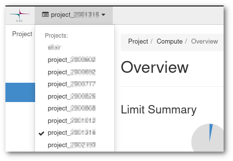
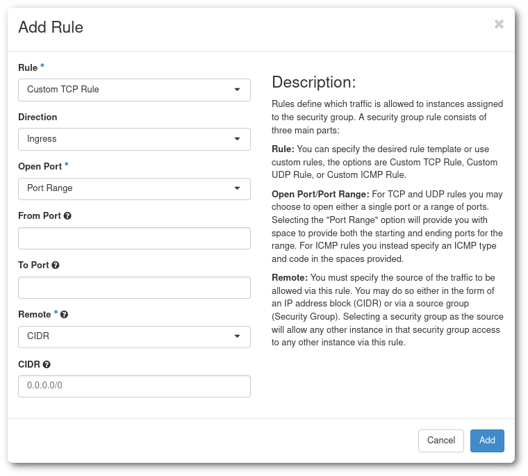
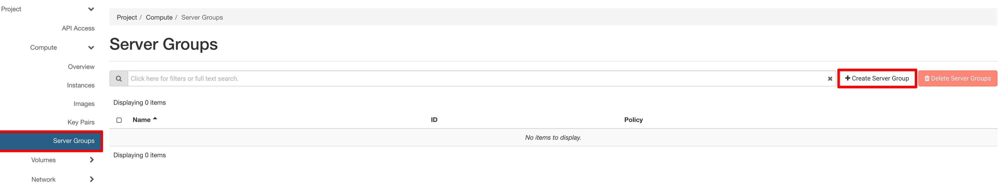
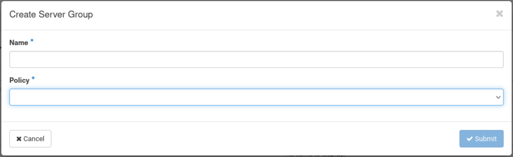

# Creating a virtual machine in Pouta

!!! Warning

    You should familiarize yourself with the [security guidelines](security.md) and
    terms of Pouta accounting before launching your first virtual
    machine.


You might also want to take a look at the [webinar](https://www.youtube.com/watch?v=CIO8KRbgDoI).

The web interfaces of the Pouta clouds are available at following addresses:

| URL           | Service name           | Access |
| :------------- |:-------------| :-----|
| [https://pouta.csc.fi](https://pouta.csc.fi)       | cPouta web interface | Accessible on the internet |
| [https://epouta.csc.fi](https://epouta.csc.fi)     | ePouta web interface      |  Accessible only from IPs provided for accessing the management interfaces of ePouta |

This _OpenStack Horizon_ based interface allows you do basic cloud computing management operations such as launch a new virtual machine and manage security settings.

To use this service, you need a CSC account and a cPouta/ePouta project at CSC. Accounts can be linked at [MyCSC](https://my.csc.fi/).

You can log in to ePouta only using your CSC account.

## Prerequisites

Before creating a Virtual Machine you need these two prerequisites:

1. A **CSC account**. Accounts can be created following [How to create new CSC user account](../../accounts/how-to-create-new-user-account.md).

1. A **CSC project** with the **cPouta** or the **ePouta** service enabled. You can [Create a new project](../../accounts/how-to-create-new-project.md), or ask to be added to an existing one. The project needs to have the suitable service enabled. You can follow [Applying for cPouta access](../../accounts/how-to-add-service-access-for-project.md). **But** If you need to store or process **sensitive data**, you must use ePouta instead and [Apply for ePouta access](ePouta-access.md).

## Selecting the CSC project

{ align=left }

You may have more than one CSC project with access to Pouta. You can check this from [my.csc.fi](https://my.csc.fi){:target="_blank"}, where you will be able to see all the projects you have access and which ones have cPouta (or ePouta) activated as a service.

Back in [Pouta's web interface](https://pouta.csc.fi), make sure that you select the correct project. There are two considerations here:

* A project is a sandbox which contains resources like Virtual Machines and networks, and **anyone with access** to that project will be able to **see**, **modify** and **delete** all these resources. They may not be able to access a Virtual Machine, as this is determined by the SSH keys configured in the machine.
* Projects are used to determinate billing. Make sure that the costs will go to the correct billing project.

## Setting up SSH keys

To open a connection to your virtual machines in cPouta/ePouta, you first need to prove your identity to the Virtual and for that need SSH keys. It is commonly called a SSH key pair because it consist on two files, the private key and the public key. This is the default (and more secure) way to access Virtual Machines. You only need to set up your SSH keys once per project.

!!! info "Import public keys"
    If you are already familiar with SSH keys, you can use your existing SSH keys to access the virtual machines. In the web interface, go to the **Compute > Key Pairs** section, and select **Import Public Key**. You need to name your key, keep in mind you will need to use this name when creating Virtual Machines, so the recomendation is to keep it short and informative of the intended use. Secondly paste your public key, it must be in a single line and be in the form of `key-type hash comment`, for example a RSA key from `person@domain.name`:

    `ssh-rsa AAAAB3NzaC1yc2EAAAADAQABAAAAQQCo9+BpMRYQ/dL3DS2CyJxRF+j6ctbT3/Qp84+KeFhnii7NT7fELilKUSnxS30WAvQCCo2yU1orfgqr41mM70MB person@domain.name`

If you have not used SSH keypairs before, you need to create one. The web interface can take care of this for you:

1. Go to the **Compute > Key Pairs** section, and select **Create Key Pair**.

    

    **Figure** The _Access & Security_ subpage in the cPouta web interface

1. Give your key a name and click in **Create Key Pair**. You will get a "_keyname.pem_" to save. Save it in your home directory. This will be the last time you will be able to download this **private key**, Pouta does not keep a copy in its servers.

    

#### Linux and Mac

In order to install the key you downloaded in the previous step (_keyname.pem_ or _keyname.cer_), you must run this commands:

!!! info "For MacOS"
    If you are using Chrome browser in Mac OS X Monterey, you will get keyname.cer instead of keyname.pem. The following procedure will remain same.

```bash
mkdir -p ~/.ssh
chmod 700 .ssh
mv keyname.pem ~/.ssh
chmod 400 ~/.ssh/keyname.pem
```

!!! info "400 = Only owner can read"
    When a file in Unix has 400 permissions, it translates to:
    `r-- --- ---`

    which means, only the owner can read the file. This is the recommended value for SSH, but in case you need to overwrite the file, you will need to give also write permissions: `chmod 600 ~/.ssh/keyname.pem`.


Before using the newly created key, you should protect it with a passphrase:

```bash
chmod 600 ~/.ssh/keyname.pem
ssh-keygen -p -f .ssh/keyname.pem
chmod 400 ~/.ssh/keyname.pem
```

#### Windows (PowerShell)

In **Windows** environments it is recommended to use PowerShell. The process is very similar

```PowerShell
mkdir ~/.ssh
mv yourkey.pem ~/.ssh/
```

Before using the newly created key, you should protect it with a passphrase:

```PowerShell
ssh-keygen.exe -p -f yourkey.pem
```

Then, still from PowerShell, you can use the `ssh` command to connect to your machine, in the same way it is done from Linux or Mac.

#### Windows (Putty)

If your copy of Windows does not have the _ssh_ command installed, it is also possible to use _Putty_.

This is done by using the _puttygen_ tool to load your private key (.pem) and save it in the (password protected) .ppk format which Putty can use.

1. Download _Putty_ and _puttygen_, which are available at <http://www.chiark.greenend.org.uk/~sgtatham/putty/download.html>.

1. Run _puttygen_ and load the key you downloaded (it should be in the Downloads page).

    

1. Set a password to the key. This is not compulsory, but advised.

1. Save the key in _ppk_ format, this is the default Putty format for keys.

    

Now we can use this new in Putty to connect to a Virtual Machine.

1. Run _putty_ and load the ssh key. Go to **Connection > SSH > Auth > Credentials** and under **Private key file for authentication**, use the **Browse...** button to select the proper .ppk file.

    

1. Once the key is loaded, you will save the session. Go to the **Session** section and under **Saved Sessions** write the name of the new session and click save.

### Firewalls and security groups

Security groups are sets of firewall rules which limit access to your machines. A virtual machine can use one or more security groups. These firewall rules are made on the _OpenStack_ layer and you may have additional firewall rules within your virtual machine. In case of connectivity problems, you should make sure both the security group and the virtual machine's internal firewall are correctly configured. The "Default" security group comes with rules that allow internal communication between virtual machines that are members of the security group.

A security group can be edited or created in any moment of the Virtual Machine life-cycle. Any change applied to a security group assigned to a Virtual Machine, will be applied instantly to the Virtual Machine.

!!! warning "Do not edit the default security group"
    As a good practice, we discourage changing the "Default" security group. We recommend instead that you create specific security groups for specific purposes and name them accordingly. For example create a security group called "SSH-VPN" to allow computers from the VPN to SSH/22 to the machines on that security group.

In order to create a new security group:

1. Go to **Network > Security Groups**, and click in **Create Security Group**, name it and add a description.

1. Then click in **Manage Rules**, and in the view that is displayed, click **Add Rule**.

    

    There is a lot customization available, but in this case it is recommended to use the `SSH` rule that only requires one parameter: `CIDR`. The **Classless Inter-Domain Routing** or **CIDR** allows you to specify a subnet (`88.44.55.0/24`) or an specific IP (`88.44.55.77/32`).

1. In order to find out your IP you can use services like <https://apps.csc.fi/myip>.

!!! warning
    Your network situation might more complicated than that. You may be behind a proxy. In that case, consult with your network support.

!!! error
    You can also open ports to all possible IP addresses by using `0.0.0.0/0` as CIDR, but doing this is a bad security practise.

!!! Tip
    **Please note:**

    *   **Deleting the default egress rules (allow any protocol to 0.0.0.0/0 and ::/0) in cPouta will cause disruption in the metadata service responsible for SSH key injections. If you want to limit egress traffic, you should at least allow outbound traffic to IP 169.254.169.254, TCP port 80, for SSH key injections to work.**
    *   **Even though the ePouta virtual machines are only accessible via the customer's network, they also need to have security groups configured for them. Otherwise they can not be accessed.**
    *   **It is possible to add and remove security groups on a running instance. This is done from the instances page.**

### Server Groups

If you want a policy that allows your instances to run (or not) on the same host, you can set up server groups.



!!! Warning  
    You can only add an instance to a server group at instance creation time. Not afterwards!

After clicking on **Create Server Group**, a windows will open:  



Give a name to your server group and select a policy. You will have the choice between **Affinity**, **Anti Affinity**, **Soft Affinity** and **Soft Anti Affinity**.  

- **Affinity**: Instances within a server group with an affinity policy are scheduled to run on the same host whenever possible. The affinity policy aims to keep instances together on the same physical server, which can be beneficial for applications or services that require low-latency communication between instances.

- **Anti Affinity**: Instances within a server group with an anti-affinity policy are scheduled to run on different hosts whenever possible. The anti-affinity policy enhances fault tolerance and availability by spreading instances across multiple physical servers. This helps minimize the impact of hardware failures on a single server.

- **Soft Affinity**: Soft affinity is a variation of the affinity policy. In a server group with a soft affinity policy, the scheduler attempts to keep instances on the same host, but it is not a strict requirement. If constraints prevent the co-location of instances on the same host, the scheduler can still place them on different hosts. Soft affinity provides a more flexible approach compared to the strict affinity policy.

- **Soft Anti-Affinity:** Soft anti-affinity is a variation of the anti-affinity policy. In a server group with a soft anti-affinity policy, the scheduler attempts to place instances on different hosts, but it is not a strict requirement. If constraints prevent the spread of instances across different hosts, the scheduler can still place them on the same host. Soft anti-affinity provides a more flexible approach compared to the strict anti-affinity policy.  

To check if your instances are running on the same (or different) hosts, you can type this command:
```sh
openstack server show [INSTANCE_NAME | INSTANCE_ID] | grep HostId
```

!!! Note  
    The "soft" variants allow for more flexibility in instance placement.  
    Affinity or anti-affinity policies may not always be possible due to resource constraints or other scheduling limitations.

## Launching a virtual machine

Once the SSH keys and security groups are set, you can launch a new virtual machine using the Pouta web interfaces:

!!! info
    * [https://pouta.csc.fi](https://pouta.csc.fi) (for cPouta)
    * or [https://epouta.csc.fi](https://epouta.csc.fi) (for ePouta)

1. In the main page of the Pouta web interface, open the **Compute > Instances** view.
1. Click in **Launch Instance** on the top right. This opens a _launch instance_ screen where you define the properties of the new virtual machine.

    

    **Figure** Launch the instance view

1. On the **Details** tab of the _launch instance_ view, first write the **Instance Name** and select the number of instances you want to create ( _-x_ will be automatically added to the end of the name of the instance if you decide to set the **Count** > 1).

1. Click **Next** and select your **Instance Boot Source**. Select "Image" in the drop down menu and click on the up arrow next to the available images.

    

    **Figure** Select the instance source

    !!! Info "Cloud-native"

        In case you want to be more cloud-native, you can select the "Image" and set "Create a New Volume" to "Yes". This option creates a new persistent volume for your instance. In the event you accidentally delete your instance or it enters an unrecoverable state, the file system of your instance will be saved in this volume. You can later use this volume to boot up a new instance with the same filesystem state as the previous instance.

    !!! Warning "Please note"

        The option "Create New Volume" set to "Yes" creates an additional volume which is billed normally as mentioned on our [pricing](https://research.csc.fi/billing-units) page.

        If the flavour type has an ephemeral disk (for example, [I/O flavours](./vm-flavors-and-billing.md#io-flavors)), a new volume is only created for the root disk. [Ephemeral disks](./ephemeral-storage.md) are removed when the VM is deleted.


1. Select the **Flavour**, which is the "size" of the Virtual Machine that you will create, from the available flavours and by clicking the up arrow. See [Virtual machine flavors and billing unit rates](vm-flavors-and-billing.md) for a complete list and descriptions. You can also expand the flavour to check the impact on your quota.

    

    **Figure** Select the instance flavour


    !!! Info "Warning quota usage"

        Pay attention that you can have a warning sign indicating if your quota is sufficient to run a specific flavour. If your quota is not enough, you can send a request to our [Service Desk](mailto:servicedesk@csc.fi) by specifying the amount you want.

        

1. The **Networks** section, make sure that your own network (your project name) is selected.

    

1. In the next section [**Security Groups**](#firewalls-and-security-groups), you can assign the security group previously created. You can expand the security group to check the rules you set.

    

1. In [**Key Pair**](#setting-up-ssh-keys), you select the name of the _Key Pair_ you have created in the [**Preparatory Steps**](#setting-up-ssh-keys).

    

    !!! Warning "Key pairs cannot be added after creation"
        A public key is only added to the VM if it has been specified in this step.
        After clicking on **Launch Instance**, the VM will be created, and the configured key pairs cannot be changed. If no key pair is configured, the recommended solution is to delete the VM and start from scratch.

1. **Configuration** section allows you to add a custom script to customize your instance after it has been launched.

1. **Server Groups** tab allows you to select a [**Server Group**](#server-groups)

You can click **Launch Instance** to start the Virtual Machine creation.

## Post creation step

When a virtual machine is launched, it only gets a **private IP** (`192.168.XXX.XXX`). This means that meanwhile the machine can access the internet and other virtual machines in the same project, it can not be accessed from outside the project. To be able to access your virtual machine, you need to attach a **public IP address** to it.  

!!! info
    Associate a floating IP is only available for cPouta instances.

1. Go to **Compute > Instances**, you should see your Virtual machine listed.

1. On the right of your new machine's entry, under **Actions**, click in the drop down menu, and select **Associate Floating IP**.

    

    **Figure** Floating IP association options

1. Select an IP address under **IP Address**. If "No floating IP addresses allocated" show up, click in the plus to allocate a new IP to you project, you will need to add a description.

1. Under **Port to be associated** select the virtual machine.

1. Click in **Associate**.


**Figure** Floating IP association dialog

!!! warning "IP billing"

    Allocated floating IPs are billed at the rate of 0,2 BU/hr. See the [Virtual machine flavors and billing unit rates](./vm-flavors-and-billing.md) for more information.

Now we can go to the [Connecting to your virtual machine](connecting-to-vm.md) section and log in to the new Virtual Machine.
