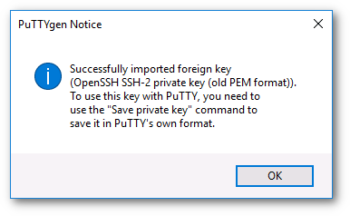
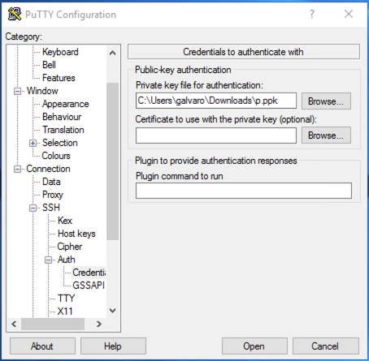

# Virtuaalikoneen luominen Poutassa { #creating-a-virtual-machine-in-pouta }

!!! Warning

    Tutustu [tietoturvaohjeisiin](security.md) ja Poutan laskutusehtoihin ennen ensimmäisen virtuaalikoneesi käynnistämistä.

Voit halutessasi katsoa myös [webinaarin](https://www.youtube.com/watch?v=CIO8KRbgDoI).

Pouta-pilvien verkkokäyttöliittymät ovat saatavilla seuraavissa osoitteissa:

| URL           | Palvelun nimi           | Käyttö |
| :------------- |:-------------| :-----|
| [https://pouta.csc.fi](https://pouta.csc.fi)       | cPoutan web-käyttöliittymä | Käytettävissä internetistä |
| [https://epouta.csc.fi](https://epouta.csc.fi)     | ePoutan web-käyttöliittymä      |  Käytettävissä vain niistä IP-osoitteista, jotka on määritetty ePoutan hallintaliittymien käyttöön |

Tämä _OpenStack Horizon_ -pohjainen käyttöliittymä mahdollistaa pilvipalvelun perushallintatoiminnot, kuten uuden virtuaalikoneen käynnistämisen ja suojausasetusten hallinnan.

Palvelun käyttö edellyttää CSC-tunnusta ja CSC:ssä luotua cPouta/ePouta-projektia. Tunnukset voi linkittää [MyCSC:ssä](https://my.csc.fi/).

ePoutaan voi kirjautua vain CSC-tunnuksilla.

## Edellytykset { #prerequisites }

Ennen virtuaalikoneen luomista tarvitset nämä kaksi edellytystä:

1. **CSC-tunnus**. Tunnuksen voi luoda ohjeen [How to create new CSC user account](../../accounts/how-to-create-new-user-account.md) mukaisesti.

1. **CSC-projekti**, jossa **cPouta**- tai **ePouta**-palvelu on kytkettynä. Voit [luoda uuden projektin](../../accounts/how-to-create-new-project.md) tai pyytää liittämistä olemassa olevaan. Projektissa on oltava sopiva palvelu käytössä. Noudata ohjetta [Applying for cPouta access](../../accounts/how-to-add-service-access-for-project.md). **Mutta** jos sinun täytyy tallentaa tai käsitellä **arkaluonteisia tietoja**, käytä sen sijaan ePoutaa ja [hae ePouta-käyttöoikeutta](ePouta-access.md).

## CSC-projektin valitseminen { #selecting-the-csc-project }

{ align=left }

Sinulla voi olla useampi CSC-projekti, jossa on pääsy Poutaan. Voit tarkistaa tämän osoitteesta [my.csc.fi](https://my.csc.fi){:target="_blank"}, jossa näet kaikki projektit, joihin sinulla on pääsy, ja mitkä niistä ovat aktivoineet cPoutan (tai ePoutan) palveluksi.

[Poutan web-käyttöliittymässä](https://pouta.csc.fi) varmista, että valitset oikean projektin. Huomioi kaksi seikkaa:

* Projekti on hiekkalaatikko, joka sisältää resursseja kuten virtuaalikoneita ja verkkoja, ja **kaikki projektiin pääsyn omaavat** voivat **nähdä**, **muokata** ja **poistaa** näitä resursseja. He eivät välttämättä pääse sisään virtuaalikoneeseen, sillä pääsy määräytyy koneeseen konfiguroitujen SSH-avaimien perusteella.
* Projekteja käytetään laskutuksen kohdistamiseen. Varmista, että kustannukset kohdistuvat oikeaan laskutusprojektiin.

## SSH-avainten määrittäminen { #setting-up-ssh-keys }

Jotta voit muodostaa yhteyden virtuaalikoneisiisi cPoudassa/ePoudassa, sinun on ensin todistettava henkilöllisyytesi virtuaalikoneelle, mihin käytetään SSH-avaimia. Näitä kutsutaan yleisesti SSH-avainpariksi, koska ne koostuvat kahdesta tiedostosta: yksityisestä ja julkisesta avaimesta. Tämä on oletus- (ja turvallisin) tapa käyttää virtuaalikoneita. SSH-avaimet tarvitsee määrittää vain kerran projektia kohden.

!!! info "Tuo julkiset avaimet"
    Jos olet jo tuttu SSH-avainten kanssa, voit käyttää olemassa olevia SSH-avaimiasi virtuaalikoneille kirjautumiseen. Web-käyttöliittymässä siirry kohtaan **Compute > Key Pairs** ja valitse **Import Public Key**. Sinun on nimettävä avaimesi; tarvitset tätä nimeä virtuaalikoneita luodessasi, joten suositus on pitää se lyhyenä ja käyttötarkoitusta kuvaavana. Tämän jälkeen liitä julkinen avaimesi; sen tulee olla yhdellä rivillä ja muodossa `key-type hash comment`, esimerkiksi RSA-avain käyttäjältä `person@domain.name`:

    `ssh-rsa AAAAB3NzaC1yc2EAAAADAQABAAAAQQCo9+BpMRYQ/dL3DS2CyJxRF+j6ctbT3/Qp84+KeFhnii7NT7fELilKUSnxS30WAvQCCo2yU1orfgqr41mM70MB person@domain.name`

Jos et ole aiemmin käyttänyt SSH-avainpareja, voit luoda sellaisen. Web-käyttöliittymä voi hoitaa tämän puolestasi:

1. Siirry kohtaan **Compute > Key Pairs** ja valitse **Create Key Pair**.

    

    **Kuva** _Access & Security_ -alasivu cPoutan web-käyttöliittymässä

1. Anna avaimellesi nimi ja napsauta **Create Key Pair**. Saat tallennettavaksi tiedoston "_keyname.pem_". Tallenna se kotihakemistoosi. Tämä on viimeinen kerta, kun voit ladata tämän **yksityisen avaimen**; Pouta ei säilytä siitä kopiota palvelimillaan.

    

#### Linux ja Mac { #linux-and-mac }

Jotta voit asentaa edellisessä vaiheessa lataamasi avaimen (_keyname.pem_ tai _keyname.cer_), suorita nämä komennot:

!!! info "MacOS:lle"
    Jos käytät Chrome-selainta macOS Montereyssä, saat tiedoston keyname.cer tiedoston keyname.pem sijaan. Menettely on silti sama.

```bash
mkdir -p ~/.ssh
chmod 700 .ssh
mv keyname.pem ~/.ssh
chmod 400 ~/.ssh/keyname.pem
```

!!! info "400 = Vain omistaja voi lukea"
    Unixissa tiedoston oikeus 400 tarkoittaa:
    `r-- --- ---`

    eli vain omistaja voi lukea tiedoston. Tämä on suositeltu arvo SSH:lle, mutta jos sinun tarvitsee ylikirjoittaa tiedosto, sinun on annettava myös kirjoitusoikeus: `chmod 600 ~/.ssh/keyname.pem`.

Ennen kuin käytät uutta avainta, suojaa se salalauseella:

```bash
chmod 600 ~/.ssh/keyname.pem
ssh-keygen -p -f .ssh/keyname.pem
chmod 400 ~/.ssh/keyname.pem
```

#### Windows (PowerShell) { #windows-powershell }

**Windows**-ympäristöissä suositellaan PowerShellin käyttöä. Prosessi on hyvin samanlainen.

```PowerShell
mkdir ~/.ssh
mv yourkey.pem ~/.ssh/
```

Ennen kuin käytät uutta avainta, suojaa se salalauseella:

```PowerShell
ssh-keygen.exe -p -f yourkey.pem
```

Tämän jälkeen voit PowerShellistä käsin käyttää `ssh`-komentoa koneeseesi yhdistämiseen samalla tavalla kuin Linuxissa tai Macissa.

#### Windows (Putty) { #windows-putty }

Jos Windows-versiossasi ei ole asennettuna _ssh_-komentoa, voit käyttää myös _Puttya_.

Tämä tehdään käyttämällä _puttygen_-työkalua, jolla ladataan yksityinen avaimesi (.pem) ja tallennetaan se (salasanalla suojattuun) .ppk-muotoon, jota Putty osaa käyttää.

1. Lataa _Putty_ ja _puttygen_ osoitteesta <http://www.chiark.greenend.org.uk/~sgtatham/putty/download.html>.

1. Aja _puttygen_ ja lataa aiemmin lataamasi avain (sen pitäisi olla Lataukset-kansiossa).

    

1. Aseta avaimelle salasana. Tämä ei ole pakollista, mutta suositeltavaa.

1. Tallenna avain _ppk_-muotoon; tämä on Puttyn oletusmuoto avaimille.

    

Nyt voit käyttää tätä uutta avainta Puttyssa yhdistääksesi virtuaalikoneeseen.

1. Käynnistä _putty_ ja lataa ssh-avain. Siirry kohtaan **Connection > SSH > Auth > Credentials** ja kentässä **Private key file for authentication** valitse **Browse...**-painikkeella oikea .ppk-tiedosto.

    

1. Kun avain on ladattu, tallenna istunto. Siirry **Session**-osioon ja kirjoita **Saved Sessions** -kohtaan uuden istunnon nimi ja napsauta save.

### Palomuurit ja turvaryhmät { #firewalls-and-security-groups }

Turvaryhmät ovat palomuurisääntöjen joukkoja, jotka rajoittavat pääsyä koneillesi. Virtuaalikone voi käyttää yhtä tai useampaa turvaryhmää. Nämä palomuurisäännöt ovat _OpenStack_-tasolla, ja lisäksi virtuaalikoneen sisällä voi olla omia palomuurisääntöjä. Yhteysongelmissa varmista, että sekä turvaryhmä että virtuaalikoneen sisäinen palomuuri on oikein asetettu. "Default"-turvaryhmässä on säännöt, jotka sallivat sisäisen viestinnän turvaryhmän jäsenten välillä.

Turvaryhmää voi muokata tai luoda milloin tahansa virtuaalikoneen elinkaaren aikana. Kaikki turvaryhmään tehdyt muutokset päivittyvät välittömästi sitä käyttävään virtuaalikoneeseen.

!!! warning "Älä muokkaa oletusturvaryhmää"
    Hyvänä käytäntönä emme suosittele muuttamaan "Default"-turvaryhmää. Suosittelemme sen sijaan luomaan tarkoituskohtaisia turvaryhmiä ja nimeämään ne sen mukaisesti. Esimerkiksi luo "SSH-VPN"-niminen turvaryhmä salliaksesi VPN-verkosta SSH/22-yhteydet kyseisen turvaryhmän koneisiin.

Uuden turvaryhmän luominen:

1. Siirry kohtaan **Network > Security Groups** ja napsauta **Create Security Group**, nimeä ryhmä ja lisää kuvaus.

1. Napsauta sitten **Manage Rules** ja avautuvassa näkymässä **Add Rule**.

    

    Käytettävissä on runsaasti räätälöintivaihtoehtoja, mutta tässä tapauksessa suositellaan `SSH`-sääntöä, joka vaatii vain yhden parametrin: `CIDR`. **Classless Inter-Domain Routing** eli **CIDR** mahdollistaa aliverkon (`88.44.55.0/24`) tai tietyn IP-osoitteen (`88.44.55.77/32`) määrittämisen.

1. Oman IP-osoitteesi selvittämiseen voit käyttää palvelua <https://apps.csc.fi/myip>.

!!! warning
    Verkkotilanteesi voi olla monimutkaisempi. Saatat olla välityspalvelimen takana. Kysy siinä tapauksessa neuvoa organisaatiosi verkon tuelta.

!!! error
    Voit myös avata portteja kaikkiin mahdollisiin IP-osoitteisiin käyttämällä `0.0.0.0/0` CIDR-arvona, mutta tämä on huono tietoturvakäytäntö.

!!! Tip
    **Huomio:**

    *   **cPoudassa oletuslähtösääntöjen (salli mikä tahansa protokolla kohteisiin 0.0.0.0/0 ja ::/0) poistaminen aiheuttaa häiriön SSH-avainten injektoinnista vastaavassa metatietopalvelussa. Jos haluat rajoittaa lähtevää liikennettä, salli vähintään ulospäin liikenne IP-osoitteeseen 169.254.169.254, TCP-porttiin 80, jotta SSH-avainten injektointi toimii.**
    *   **Vaikka ePoutan virtuaalikoneisiin pääsee vain asiakkaan verkon kautta, niille on silti määritettävä turvaryhmät. Muuten niihin ei päästä käsiksi.**
    *   **Turvaryhmiä on mahdollista lisätä ja poistaa käynnissä olevalta instanssilta. Tämä tehdään instanssien sivulta.**

### Palveluryhmät { #server-groups }

Jos haluat käytännön, joka sallii instanssien ajamisen samassa (tai eri) isäntäkoneessa, voit ottaa käyttöön palveluryhmät.


!!! Warning  
    Instanssi voidaan lisätä palveluryhmään vain instanssin luontivaiheessa. Ei jälkikäteen!

Kun napsautat **Create Server Group**, avautuu ikkuna:  


Anna palveluryhmälle nimi ja valitse käytäntö. Vaihtoehtoina ovat **Affinity**, **Anti Affinity**, **Soft Affinity** ja **Soft Anti Affinity**.  

- **Affinity**: Affinity-käytännön palveluryhmän instanssit ajoitetaan mahdollisuuksien mukaan samalle isäntäkoneelle. Tämä pyrkii pitämään instanssit yhdessä samalla fyysisellä palvelimella, mistä on hyötyä sovelluksille tai palveluille, jotka vaativat pienen viiveen välistä kommunikointia.

- **Anti Affinity**: Anti-affinity-käytännön palveluryhmän instanssit ajoitetaan mahdollisuuksien mukaan eri isäntäkoneille. Tämä parantaa vikasietoisuutta ja saatavuutta jakamalla instanssit useille fyysisille palvelimille, mikä vähentää yksittäisen palvelimen laiterikon vaikutusta.

- **Soft Affinity**: Soft affinity on affinity-käytännön joustavampi muoto. Ajoitin pyrkii pitämään instanssit samalla isäntäkoneella, mutta tämä ei ole ehdoton vaatimus. Jos rajoitteet estävät yhteissijoittelun, instanssit voidaan sijoittaa eri isäntäkoneille.

- **Soft Anti-Affinity:** Soft anti-affinity on anti-affinity-käytännön joustavampi muoto. Ajoitin pyrkii sijoittamaan instanssit eri isäntäkoneille, mutta tämä ei ole ehdoton vaatimus. Jos rajoitteet estävät jakamisen eri isäntäkoneille, instanssit voidaan sijoittaa samalle isännälle.

Tarkistaaksesi ajetaanko instanssejasi samalla (tai eri) isäntäkoneella, voit käyttää komentoa:
```sh
openstack server show [INSTANCE_NAME | INSTANCE_ID] | grep HostId
```

!!! Note  
    "Soft"-variantit sallivat joustavamman sijoittelun.  
    Affinity- tai anti-affinity-käytäntö ei aina ole mahdollinen resurssi- tai muiden ajoitusrajoitteiden vuoksi.

## Virtuaalikoneen käynnistäminen { #launching-a-virtual-machine }

Kun SSH-avaimet ja turvaryhmät on määritetty, voit käynnistää uuden virtuaalikoneen Poudan web-käyttöliittymistä:

!!! info
    * [https://pouta.csc.fi](https://pouta.csc.fi) (cPouta)
    * tai [https://epouta.csc.fi](https://epouta.csc.fi) (ePouta)

1. Poudan web-käyttöliittymän etusivulla avaa näkymä **Compute > Instances**.
1. Napsauta oikeasta yläkulmasta **Launch Instance**. Tämä avaa _launch instance_ -näkymän, jossa määritellään uuden virtuaalikoneen ominaisuudet.

    

    **Kuva** Instanssin käynnistysnäkymä

1. _Launch instance_ -näkymän **Details**-välilehdellä anna ensin **Instance Name** ja valitse luotavien instanssien määrä (jos asetat **Count** > 1, nimen loppuun lisätään automaattisesti _-x_).

1. Napsauta **Next** ja valitse **Instance Boot Source**. Valitse avattavasta valikosta "Image" ja napsauta ylänuolta käytettävissä olevien levykuvien vieressä.

    

    **Kuva** Valitse instanssin lähde

    !!! Info "Pilvinatiivi"

        Jos haluat toimia pilvinatiivimmin, voit valita "Image" ja asettaa "Create a New Volume" arvoon "Yes". Tämä luo instanssillesi uuden pysyvän levyn. Jos poistat instanssin vahingossa tai se joutuu korjaamattomaan tilaan, instanssin tiedostojärjestelmä säilyy tällä levyllä. Voit myöhemmin käynnistää uuden instanssin tästä levystä samalla tiedostojärjestelmän tilalla kuin aiemmassa instanssissa.

    !!! Warning "Huomaa"

        Kun "Create New Volume" on asetettu "Yes", luodaan lisävolyymi, josta laskutetaan normaalisti [hinnoittelusivun](https://research.csc.fi/billing-units) mukaisesti.

        Jos flavour-tyypillä on ephemeeri-levy (esim. [I/O-flavours](./vm-flavors-and-billing.md#io-flavors)), uusi volyymi luodaan vain juurilevylle. [Ephemeeriset levyt](./ephemeral-storage.md) poistetaan, kun VM poistetaan.

1. Valitse **Flavour**, joka on luotavan virtuaalikoneen "koko", käytettävissä olevista vaihtoehdoista napsauttamalla ylänuolta. Katso täydellinen lista ja kuvaukset kohdasta [Virtual machine flavors and Billing Unit rates](vm-flavors-and-billing.md). Voit myös laajentaa flavourin nähdäksesi vaikutuksen kiintiöösi.

    

    **Kuva** Valitse instanssin flavour

    !!! Info "Varoitus: kiintiön käyttö"

        Huomaa varoituskuvake, joka ilmaisee, riittääkö kiintiösi tietyn flavourin ajamiseen. Jos kiintiö ei riitä, voit lähettää pyynnön [Service Deskille](mailto:servicedesk@csc.fi) ja ilmoittaa haluamasi määrän.

        

1. **Networks**-osiossa varmista, että oma verkkosi (projektisi nimi) on valittuna.

    

1. Seuraavassa [**Security Groups**](#firewalls-and-security-groups) -osiossa voit liittää aiemmin luodun turvaryhmän. Voit laajentaa turvaryhmän nähdäksesi määrittämäsi säännöt.

    

1. [**Key Pair**](#setting-up-ssh-keys) -osiossa valitset luomasi _Key Pair_ -avaimen nimen kohdassa [**SSH-avainten määrittäminen**](#setting-up-ssh-keys).

    

    !!! Warning "Avaimia ei voi lisätä luomisen jälkeen"
        Julkinen avain lisätään VM:ään vain, jos se on määritetty tässä vaiheessa.
        Kun napsautat **Launch Instance**, VM luodaan, eikä määritettyjä avainpareja voi enää muuttaa. Jos avainparia ei ole määritetty, suositeltu ratkaisu on poistaa VM ja aloittaa alusta.

1. **Configuration**-osiossa voit lisätä oman skriptin, joka mukauttaa instanssisi käynnistyksen jälkeen.

1. **Server Groups** -välilehdellä voit valita [**palveluryhmän**](#server-groups).

Voit käynnistää virtuaalikoneen napsauttamalla **Launch Instance**.

## Luomisen jälkeinen vaihe { #post-creation-step }

Kun virtuaalikone käynnistetään, se saa vain **yksityisen IP-osoitteen** (`192.168.XXX.XXX`). Tämä tarkoittaa, että vaikka kone pääsee internetiin ja saman projektin muihin virtuaalikoneisiin, siihen ei voi ottaa yhteyttä projektin ulkopuolelta. Jotta pääset käsiksi virtuaalikoneeseesi, sinun on liitettävä siihen **julkinen IP-osoite**.  

!!! info
    Kelluvan IP-osoitteen liittäminen (Associate Floating IP) on mahdollista vain cPoudan instansseille.

1. Siirry kohtaan **Compute > Instances**; näet virtuaalikoneesi listalla.

1. Uuden koneesi rivillä, **Actions**-kohdassa, avaa pudotusvalikko ja valitse **Associate Floating IP**.

    

    **Kuva** Kelluvan IP:n liittämisen vaihtoehdot

1. Valitse IP-osoite kohdasta **IP Address**. Jos näkyy "No floating IP addresses allocated", napsauta plus-ikonia varataksesi projektille uuden IP-osoitteen; sinun on lisättävä kuvaus.

1. Kohdassa **Port to be associated** valitse virtuaalikone.

1. Napsauta **Associate**.


**Kuva** Kelluvan IP:n liittämisen dialogi

!!! warning "IP-laskutus"

    Varatut kelluvat IP-osoitteet laskutetaan hinnalla 0,2 Cloud BU/tunti. Katso lisätietoja kohdasta [Virtual machine flavors and Billing Unit rates](./vm-flavors-and-billing.md).

Seuraavaksi voit siirtyä kohtaan [Connecting to your virtual machine](connecting-to-vm.md) ja kirjautua uuteen virtuaalikoneeseen.

!!! info "\* **Cloud BU**: Cloud Billing Units"