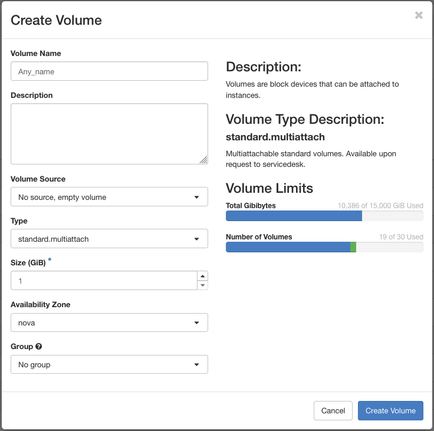

# Multi-attach Cinder volumes

!!! warning  
    Only available for cPouta now.  
    By default the quota is set to 0, you must request it by sending an email to servicedesk@csc.fi

It is possible to attach and mount the same _cinder_ volume into more that one VM at the same time. This means that each of the VMs will be able to read and write to the same block device. This is similar to what a SAN will allow you to achieve.


This feature has several advantages and disadvantages. On one side it allows to share files among VMs without any kind of intermediary server that you will need with solutions like `NFS` or `GlusterFS`. This reduces the number of VMs needed, thus less maintenance and less single points of failure. On the other hand, it is necessary to run what is called a [clustered file system](https://en.wikipedia.org/wiki/Clustered_file_system#SHARED-DISK) like [Oracle Cluster File System 2 (ocfs2)](https://en.wikipedia.org/wiki/OCFS2), or Red Hat [Global File System (GFS2)](https://en.wikipedia.org/wiki/GFS2). These systems need a cluster of connected daemons that will coordinate the read and write operations of the files. Each VM runs a copy of the daemon and there is no master, but a quorum based system. The choice between the two file systems depends on the use case and preferences based on vendors. In our tests GFS2 seems to be more suitable to Redhat based systems and OCFS2 to Debian ones, but your mileage might vary.

!!! Warning
    The configuration, maintenance and operations of these file systems are **not a trivial task**. The guides below are as a **starting point** and do not cover all possibilities, for more comprehensive information, please check the upstream documentation.

## Create and attach a volume

!!! Info "quota"
    Make sure that you have available quota for this kind of Volume

### WebUI

1. Go to the [Volume page](https://pouta.csc.fi/dashboard/project/volumes/) of Pouta.

1. Click in "+Create Volume"

1. Create a volume as you would do for any other **Type** of volume. Set the **Volume Name** and **Size (GiB)** as desired.

1. Change the **Type** to `standard.multiattach`.

1. Click in "Create Volume".



!!! Warning "not supported"
    You cannot attach a volume to multiple VMs from the WebUI, only see its status. You can only attach a volume to multiple VMs using the CLI.

### CLI

Before doing this, you need to [install the openstack client](../install-client/):

1. Create a multi attach volume:

    ```sh
    openstack volume create --size <size_in_GB> --type standard.multiattach <volume_name>
    ```
    You need to replace `<volume_name>` by the name you want to give to the volume, and the `<size_in_GB>` by the size in Gigabytes you want the volume to have.

1. Attach the volume to a VM node:

    ```sh
    openstack --os-compute-api-version 2.60 server add volume "<VM_name>" <volume_name>
    ```
    You need to replace the `<volume_name>` by the name of the volume you created in the previous step, and the `<VM_name>` by the name of the VM node. When doing this for a cluster of VMs, you need to run the command once per VM.

## GFS as an example

The Global file system or (GFS2 in short) is a file system currently developed by Red Hat. It uses [dlm](https://en.wikipedia.org/wiki/Distributed_lock_manager) to coordinate file system operations among the nodes in the cluster. The actual data is read and written directly to the shared block device.

!!! Warning
    GFS2 supports up to 16 nodes connected to the same volume. 


### GFS2 ansible install

We have written a small ansible [cinder-multiattach](https://github.com/lvarin/cinder-multiattach/) playbook, that installs a cluster of nodes and installs a shared GFS2 file system on them. The playbook is intended as a guide and demo, it is not production ready. For example, there is a manual step, attach the volume in each node. The Ansible playbook will create a cluster of VMs and install the requested file system on them. The end result will be the same volume mounted in every VM. The quick start commands are these:  

```sh
$ source ~/Downloads/project_XXXXXXX-openrc.sh
Please enter your OpenStack Password for project project_XXXXXXX as user YYYYYYYY: 

$ ansible-playbook main.yml -e fs='gfs2'

$ for i in $(seq 1 16);
do
    openstack --os-compute-api-version 2.60 server add volume "cinder-gfs2-$i" multi-attach-test-gfs2
done

$ ansible-playbook main.yml -e fs='gfs2'
```

You need to run Ansible twice due to a bug in the `openstack.cloud.server_volume` which can only attach the volume to a single VM and fails with the other ones.

If you already have a cluster of VMs, or want to manually create them, it is still possible to use the `gfs2` Ansible role. The steps are simple:

1. Create and attach the volume. See the manual [Create and attach a volume](#create-and-attach-a-volume) from above.

1. Create a standard Ansible inventory like this one:

    ```ini
    [all]
    <VM_name> ansible_host=192.168.1.XXX ansible_user=<user>
    # ...
    [all:vars]
    ansible_ssh_common_args='-J <jumphost>'
    ```

    In the example above you need to replace `<VM_name>` by the name of the VM, the IP `192.168.1.XXX` must be the correct IP of the VM, and finally the `<user>` has to also be replaced by the corresponding one. You need to have a line per VM node that you want to include in the cluster. Finally, if you are using a Jump Host, you need to replace `<jumphost>` by its connection information, like `ubuntu@177.51.170.99` 

1. Create a playbook like this one:

    ```yaml
    ---

    - name: Configure VMs
      hosts: all
      gather_facts: true
      become: true
      roles:
        - role: hosts
        - role: gfs2
    ```

    This will run two roles, the `hosts` one if to create a `/etc/hosts` file in every VM with the IPs and names of every VM. The `gfs2` role installs and configures the cluster.

1. And run it:

    ```sh
    $ ansible-playbook main-gfs2.yml -i inventory.ini
    ```

### GFS2 manual install

In order to install GFS2, you need to follow few steps:

1. Install the VM nodes. There is no special consideration on this step, other than making sure the nodes can see each other in the Network (it is the default behaviour of VM nodes created in the same Pouta project), and that they are installed with the same distribution version. We have tested this with `Ubuntu v22.04` and `AlmaLinux-9`, other distributions and versions might also work, but we have not tested them.

1. Create and attach the volume. See the manual [Create and attach a volume](#create-and-attach-a-volume) from above.

1. Install the GFS2 software. This step is distribution dependent.

    1. For AlmaLinux and other RedHat based distributions you just need enable two collections and install few packages:

    ```sh
    sudo dnf config-manager --enable  highavailability resilientstorage
    sudo dnf install pacemaker corosync pcs dlm gfs2-utils
    ```

    1. For Ubuntu and other Debian based distributions you just need to install 3 packages:

    ```sh
    apt install gfs2-utils dlm-controld linux-modules-extra-$(uname -r)
    ```

1. Make sure that every node **domain name** can be resolved in every other node. In Pouta, the simplest way is to use [/etc/hosts](https://en.wikipedia.org/wiki/Hosts_(file)), where each host has a line similar to:

    ```sh
    <ip> <vm_name>
    ```

1. You need to create a `corosync.conf` file that lists every host in the cluster. Check the [corosync.conf manual page](https://linux.die.net/man/5/corosync.conf) for a complete guide of the file. A minimal working example would follow this template:

    ```json
    totem {
      version: 2
      cluster_name: gfs_cluster
      secauth: off
      transport: udpu
    }

    nodelist {
      
      node {
        ring0_addr: {{ host }}
        nodeid: {{ groups['all'].index(host)+1 }}
      }
      
    }

    quorum {
      provider: corosync_votequorum
    }

    logging {
      to_logfile: yes
      logfile: /var/log/cluster/corosync.log
      to_syslog: yes
    }
    ``` 

    As you can see, for every node, you need to provide its name (the same that it was used in `/etc/hosts`) and a node id number. The node id number has to be unique for every node, ideally consecutive numbers.

1. Create the file system. You need to do this in **only one** of the VM nodes.

    ```sh
    mkfs.gfs2 -p lock_dlm -t gfs_cluster:mygfs2 -j <number_instances> /dev/vdb
    ```
    Replace `<number_instances>` by the number of VM nodes in the cluster. Pay also attention and double check that `/dev/vdb` is the proper volume name. In principle `vdb` is going to be the first attached volume to a VM, but this might not be true in all cases.

1. You now need to enable and start the `dlm` service.

    ```sh
    sudo systemctl enable dlm
    sudo systemctl start dlm
    ```

1. Finally mount the volume in each node:

    ```sh
    sudo mount -L gfs_cluster:mygfs2 /mnt
    ```

    This command uses the label and not the volume device to mount it, this is because the label is warranted to not change upon reboots. The label will be the same that you used in the `mkfs.gfs2` command in the `-t` option. You can also provide the UUID with the `-u` option.

    !!! Info "blkid"
        In order to see the label and uuid of every volume and device attached to the VM node, you can use `blkid`:

        ```sh
        $ blkid
        /dev/vdb: LABEL="gfs_cluster:mygfs2" UUID="e957d002-bd85-4645-9c0d-a929603849b7" BLOCK_SIZE="4096" TYPE="gfs2"
        /dev/vda15: LABEL_FATBOOT="UEFI" LABEL="UEFI" UUID="B027-A52A" BLOCK_SIZE="512" TYPE="vfat" PARTUUID="416111ff-1583-491f-856d-410d48caa103"
        /dev/vda1: LABEL="cloudimg-rootfs" UUID="caa1508a-4bb6-4126-a072-7d5db157c351" BLOCK_SIZE="4096" TYPE="ext4" PARTUUID="2ff71b36-d15b-4310-a7ed-5258e990345d"
        ```

    It is recommended to add an entry to `/etc/fstab` so the volume is mounted automatcally when rebooted. For example adding a line like this:

    ```fstab
    LABEL=gfs_cluster:mygfs2 /mnt gfs2 defaults 0 0
    ```

### GFS2 FAQ

* **How to add more nodes?**

    It is possible to add new nodes to a GFS2 cluster. The supported **limit** is **16** nodes.

    First you need to make sure there are enough journal entries. Use `gfs2_edit` to get the total number of journals:

    ```sh
    sudo gfs2_edit -p jindex /dev/vdb | grep journal
    ```

    If it is not enough, you can easily add more with `gfs2_jadd`: 

    ```sh
    $ sudo gfs2_jadd -j 1 /mnt
    Filesystem: /mnt
    Old journals: 15
    New journals: 16
    ```

    Secondly, create the new node, install the required software and attach the volume using openstack API. The process is described above.

    Then you need to edit the file `/etc/corosync/corosync.conf` in every node and add an entry for the new one:

    ```json
    node {
     ring0_addr: cinder-gfs2-16
     nodeid: 16
    }
    ```

    Once the file is updated, you need to stop the mount and restart the dlm and corosync daemons in every node in the cluster.

    Finally, you just need to mount the volume:

    ```sh
    sudo mount -L gfs_cluster:mygfs2 /mnt
    ```

    It is recommended to add an entry to `/etc/fstab` so the volume is mounted automatcally when rebooted. For example adding a line like this:

    ```fstab
    LABEL=gfs_cluster:mygfs2 /mnt/ gfs2 defaults 0 0
    ```

* **What happens if a VM gets disconnected?**

    This covers two different use cases, a temporal and/or unexpected disconnection, and a permanent one.

    For a temporal and unexpected disconnection, the cluster should be able to deal with this kind of issues automatically. After the node is back, you need to check that all came back to normal. In some cases the automatic mount of the volume can fail, if so mount the volume as explained above.

    If it is temporal but expected, like to update the kernel version. Umount the volume in the node (`sudo umount /mnt`) before rebooting the node. It is not required, but recommended.

    For a permanent disconnection of a VM, one need to do the inverse process of adding a new node. Umount the volume (`sudo umount /mnt`), remove the entry for this VM in the `/etc/corosyncecorosync.conf` file of every node, and finally restart the daemons in every node. This needs to be done as it affects the quorum count for the cluster.

* **Is it possible to mount a node as read-only?**

    Yes, GFS2 has the "spectator mode":

    ```
    spectator
       Mount  this filesystem using a special form of read-only mount.  The mount does not
       use one of the filesystem's journals. The node is unable to  recover  journals  for
       other nodes.

    norecovery
       A synonym for spectator
    ```

    So, just run this command:

    ```sh
    sudo mount /dev/vdb /mnt -t gfs2 -o spectator
    ```
    `-t gfs2` is not strictly necessary, as mount can detect the file system tpye, but it is recommended to avoid mounting the wrong file system.
    Then double check that the mount went as expected by:

    ```sh
    $ mount | grep /mnt
    /dev/vdb on /mnt type gfs2 (ro,relatime,spectator,rgrplvb)
    ```

### GFS2 Links

- <https://access.redhat.com/documentation/en-us/red_hat_enterprise_linux/7/html/global_file_system_2/s1-manage-addjournalfs>

## OCFS2 as a second example

The [Oracle Cluster File System](https://en.wikipedia.org/wiki/OCFS2) version 2 is a shared disk file system developed by Oracle Corporation and released under the GNU General Public License. Meanwhile it is a different code base developed by a different vendor. The approach is the same as GFS2:


A single volume attached to a cluster of VM nodes, allowing the data reads and writes to be done directly, and a daemon running in each VM node that coordinates the read and write operations.

### OCFS2 ansible install

Like with GFS2, the Ansible playbook will create a cluster of VMs and install the requested file system on them. The end result will be the same volume mounted in every VM. It is very similar than the instructions for GFS2. The quick start commands are these:

```sh
$ source ~/Downloads/project_XXXXXXX-openrc.sh
Please enter your OpenStack Password for project project_XXXXXXX as user YYYYYYYY: 

$ ansible-playbook main.yml -e fs='ocfs2'

$ for i in $(seq 1 16);
do
    openstack --os-compute-api-version 2.60 server add volume "cinder-ocfs2-$i" multi-attach-test-ocfs2
done

$ ansible-playbook main.yml -e fs='ocfs2'
```

You need to run Ansible twice due to a bug in the `openstack.cloud.server_volume` which can only attach the volume to a single VM and fails with the other ones.

If you already have a cluster of VMs, or want to manually create them, it is still possible to use the ocfs2 Ansible role. The steps are simple:

1. Create and attach the volume. See the manual [Create and attach a volume](#create-and-attach-a-volume) from above.

1. Create a standard Ansible inventory like this one:

    ```ini
    [all]
    <VM_name> ansible_host=192.168.1.XXX ansible_user=<user>
    # ...
    [all:vars]
    ansible_ssh_common_args='-J <jumphost>'
    ```

    In the example above you need to replace `<VM_name>` by the name of the VM, the IP `192.168.1.XXX` must be the correct IP of the VM, and finally the `<user>` has to also be replaced by the corresponding one. You need to have a line per VM node that you want to include in the cluster. Finally, if you are using a Jump Host, you need to replace `<jumphost>` by its connection information, like `ubuntu@177.51.170.99`

1. Create a playbook (`main-ocfs2.yml` in this example) like this one:

    ```yaml
    ---

    - name: Configure VMs
      hosts: all
      gather_facts: true
      become: true
      roles:
        - role: hosts
        - role: ocfs2
    ```

    This will run two roles, the hosts one if to create a `/etc/hosts` file in every VM with the IPs and names of every VM. The `ocfs2` role installs and configures the cluster.

1. And run it:

    ```sh
    $ ansible-playbook main-ocfs2.yml -i inventory.ini

    ```

### OCFS2 manual install

In order to install OCFS2, you need to follow few steps:

1. Install the VM nodes. There is no special consideration on this step, other than making sure the nodes can see each other in the Network (it is the default behaviour of VM nodes created in the same Pouta project), and that they are installed with the same distribution version. We have tested this with `Ubuntu v22.04` and `AlmaLinux-9`, other distributions and versions might also work, but we have not tested them. This guide will use **Ubuntu** as an example. AlmaLinux requires to install an specific [Oracle kernel](https://support.oracle.com/knowledge/Oracle%20Linux%20and%20Virtualization/1253272_1.html).

1. Create and attach the volume. See the manual [Create and attach a volume](#create-and-attach-a-volume) from above.

1. Install the OCFS2 software:

    ```sh
    ocfs2-tools linux-modules-extra-<kernel_version> linux-image-$(uname -r)
    ```
    We have tested this with `<kernel_version>` == `6.5.0-21-generic`, but newer versions should work as well or better.

1. Make sure that every node domain name can be resolved in every other node. In Pouta, the simplest way is to use [/etc/hosts](https://en.wikipedia.org/wiki/Hosts_(file)), where each host has a line similar to:

    ```sh
    <ip> <vm_name>
    ```

1. Enable ocfs2 in every node using:

    ```sh
    sudo dpkg-reconfigure ocfs2-tools
    ```

1. Create the file system. You need to do this in **only one** of the VM nodes.

    ```sh
    mkfs.ocfs2 -N <number_instances> /dev/vdb
    ```

    Replace `<number_instances>` by the number of VM nodes in the cluster. Pay also attention and double check that `/dev/vdb` is the proper volume name. In principle `vdb` is going to be the first attached volume to a VM, but this might not be true in all cases.

1. Generate the file `/etc/ocfs2/cluster.conf`. A minimal working example would follow this template:

    ```
    
    node:
      ip_port = 7777
      ip_address = {{ hostvars[host]['ansible_host'] }}
      number = {{ groups['all'].index(host)+1 }}
      name = {{ host }}
      cluster = ocfs2
    
    cluster:
      node_count = {{ number_instances }}
      name = ocfs2
    ```

1. Reboot so the kernel you installed is taken into use. Make sure that the `ocfs2` service is up and running (`systemctl status ocfs2`).

1. Finally mount the volume in each node:

    ```sh
    sudo mount /dev/vdb /mnt
    ```
    As the device may change in any moment, it is recommended to use the `UUID` for any serious deployment. You can get the `UUID` by using the command `blkid`:

    ```sh
    $ sudo blkid /dev/vdb
    /dev/vdb: UUID="785134b8-4782-4a1f-8f2a-40bbe7b7b5d2" BLOCK_SIZE="4096" TYPE="ocfs2"
    ```
    In this case the command will be `sudo mount -U 785134b8-4782-4a1f-8f2a-40bbe7b7b5d2 /mnt`


### OCFS2 FAQ

- **How to add more nodes?**

    It is possible to add more nodes to a ocfs2 cluster, but it requires a downtime.

    First you need to increase the number of slots, using `tunefs.ocfs2`. Before that, you need to umount the volume in every VM node. These are the two commands you need to run. The second one only needs to be executed in a single node:

    ```sh
    sudo umount /mnt
    sudo tunefs.ocfs2 -N 25 /dev/vdb
    ```

    Secondly, create the new node, install the required software and attach the volume using openstack API. The process is described above.

    Then you need to edit the file `/etc/ocfs2/cluster.conf` in every node and add an entry for the new one:

    ```yaml
    node:
      ip_port = 7777
      ip_address = <ip_address>
      number = <number>
      name = <vm_name>
      cluster = ocfs2
    ```

    Replace `<ip_address>` by the address of the new server, `<vm_name>` by its name, and finally `<number>` is the node id number. It has to be unique for every node, ideally consecutive numbers.

    Once the file is updated, you need to stop the mount and restart the `ocfs2` in every node in the cluster. Lastly, remount the volume in every VM node.

* **What happens if a VM gets disconnected?**

    This covers two different use cases, a temporal and/or unexpected disconnection, and a permanent one. It is very similar to the GFS2 situation.

    For a temporal and unexpected disconnection, the cluster should be able to deal with this kind of issues automatically. After the node is back, you need to check that all came back to normal. In some cases the automatic mount of the volume can fail, if so mount the volume as explained above.

    If it is temporal but expected, like to update the kernel version. Umount the volume in the node (`sudo umount /mnt`) before rebooting the node. It is not required, but recommended.

    For a permanent disconnection of a VM, one need to do the inverse process of adding a new node. Umount the volume (`sudo umount /mnt`), remove the entry for this VM in the `/etc/ocfs2/cluster.conf` file of every node, and finally restart the daemons in every node. This needs to be done as it affects the quorum count for the cluster.

* **Is it possible to mount a node as read-only?**

    Yes, it is possible to mount the volume as read-only. It is as simple as:

    ```sh
    sudo mount /dev/vdb /mnt -o ro
    ```

    After that, you can check that it was indeed mounted as read-only by:

    ```sh
    mount | grep /mnt
    /dev/vdb on /mnt type ocfs2 (ro,relatime,_netdev,heartbeat=local,nointr,data=ordered,errors=remount-ro,atime_quantum=60,coherency=full,user_xattr,acl)
    ```
    Also, as you can see in the output above, the default behaviour is that when any error occurs, to remount it as read only (`errors-remount-ro`). See `mount.ocfs2` for more options.


## Upstream documentation

- GFS2: 
    - <https://docs.redhat.com/en/documentation/red_hat_enterprise_linux/9/html/configuring_gfs2_file_systems/index>
- OCFS2: 
    - <https://ocfs2.wiki.kernel.org/>
    - <https://public-yum.oracle.com/>
