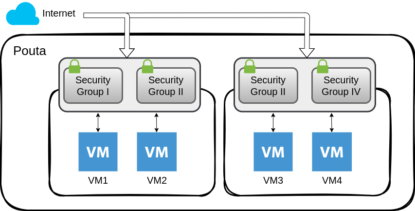
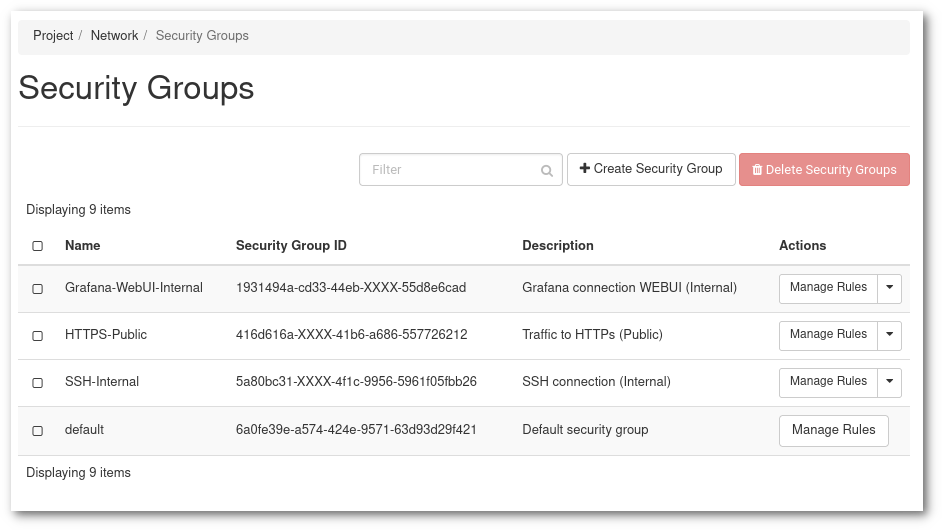
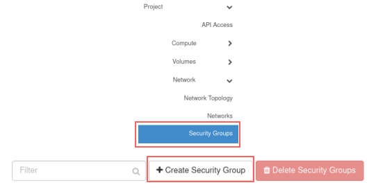
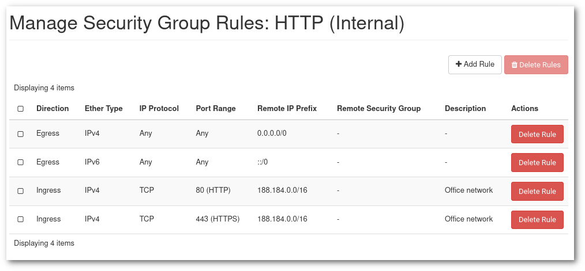

# Networking in Pouta
Every cPouta project comes with a default network and router configuration enough for most purposes. Most often, you don't need to worry about the network or router configuration and you can create virtual machines using the defaults.

In the situation that your project is missing a default network you will not be able to create a virtual machine. And if you are missing a router, you will not be able to assign ports* in your machine for example to a floating IP.

If you find you in the need of creating a network and or router, you can recreate the default settings via the web interface with the following instructions.

*A port is a connection point for attaching a single device to a network.*

## Create a network

1. Open [cPouta](https://pouta.csc.fi) and navigate to **Network > Networks**. Click on **Create Network** button on the upper right. A new window will open.

    

    - **Network Name** - Specify a name for your network.
    - **Enable Admin State** - Enable the network.
    - **Create Subnet** - Leave check if you want to create a subnet.
    - **Availabity Zone Hints** - Leave "nova" by default.

1. When done, click on **Next**. It will open the next tab regarding the subnet.

    

    - **Subnet Name** - Specify a name for your subnet
    - **Network Address** - Specify a network in CIDR format. Here a [link](https://www.calculator.net/ip-subnet-calculator.html) that could help you to calculate the network address.
    - **IP Version** - You can leave IPv4
    - **Gateway IP** - Optionally you can choose the gateway IP. If it's not filled in, one will be chosen automatically.

1. You can click on **Next**.

    

    By default, **Enable DHCP** is activated.

    - **Allocation Pools** - Choose the IP range that will deliver the IP for the DHCP
    - **DNS Name Server** - Enter 193.166.4.24 and 193.166.4.25 (See screenshot above)

1. In the end, you can click **Create** and you should see your network in the list.

## Create a router
A router will bridge the connection from **external** to the **private network**

1. Navigate to **Network > Routers**. Click on **Create Router** on the upper right. A new window will open.

    

    - **Router Name** - Specify a name for your router
    - **Enable Admin State** - Enable the router
    - **External Network** - Choose which external you want to use for the router
    - **Availability Zone Hints** - Select your availability zone.

1. After filling in the necessary fields, you can click on **Create Router**

1. Now that you have the **router** created, you need to attach it to your internal network to allow communication with the external. Click on your router newly created and go to the tab **Interfaces**.
Click on **Add Interface**

    

    - **Subnet** - Select the network you want to attach.
    - **IP Address** - This option is not mandatory, if you don't add an IP address, the gateway IP will be selected.

1. Now you attached your interface to the router and able to connect to the external network. You can see a graph by clicking on **Network > Network Topology** and select the tab **Graph**


!!! info

    If you want to access your instances from an external network, you need to associate a [floating IP](launch-vm-from-web-gui.md#post-creation-step).  
    A floating IP sticks with your instance until you decide to release it.


* If you want to use the CLI command:


```sh
$ openstack network create test-network
$ openstack subnet create --dns-nameserver 193.166.4.24 --dns-nameserver 193.166.4.25 \
    --network $(openstack network list -f value -c ID -c Name|grep -v public|cut -d " " -f1) \
    --subnet-range 192.168.0.1/24 --allocation-pool start=192.168.0.10,end=192.168.0.30 test-network
$ openstack router create test-router
$ openstack router set --external-gateway public test-router
$ openstack router add subnet test-router test-network
```


## Security groups

Security groups are sets of firewall rules which limit access to your machines. A virtual machine can use one or more security groups. And one security group can be assigned to one or more Virtual Machines. A security group can hold one or more Rules. These firewall rules are made on the OpenStack layer and you may have additional firewall rules within your virtual machine. In case of connectivity problems, you should make sure both the security group and the virtual machine's internal firewall are correctly configured.



A security group can be edited or created in any moment of the Virtual Machine life-cycle. Any change applied to a security group assigned to a Virtual Machine, will be applied instantly to the Virtual Machine. There is no cost associated to security groups.

* The **recommendation** is to aim for a set of Groups and Rules that are _organized_ in a way that helps understanding the objective of each of them. Each service should have its own security group and both the name and description should be clear of what this Group provides and opens access to (destination ports) and from (source IPs).

    

    In the example above we have 3 security groups other than the  `default` one, two internal for monitoring and management, and one public for the service we offer to our users.

    !!! Info "Instance view"
        The instance view shows all the configurations of a VM, including all the securitity groups added to it, and the configuration of each of them. It is very useful to debug network connections issues and confirm the security of a VM.

* The `Default` security group comes with rules that allow internal communication between virtual machines that are members of the security group:

    

    !!! Warning "Do not modify the default security group"
        Meanwhile it is allowed to edit the default security group, it is not advisable. Some of the initialization procedures rely on the default security group configuration.

    In the `default` security group, the first two rules allow for traffic to exit (`Egress`) to Any `IP` or `Port`. The last two rules, allow communications among any member of the `default` security group also for any `IP` or `Port`. This means that by default any VM is able to contact anywhere in the public internet and among themselves. This can be restricted for more secure than average environments, but it should be done with the understanding of the requirements.

### Create a security group

1.First go to the [Security Groups](https://pouta.csc.fi/dashboard/project/security_groups/) management page in Pouta. For a new empty project, only the default security group will be there.

1. Click in **+ Create Security Group**

    

1. The "Create Security Group" page will appear. Provide a **Name** and a **Description**.

1. Then click in **Manage Rules**, and in the view that is displayed, click **Add Rule**.

    

    - **Rule** has several options:
        - There is a list of protocols (DNS, HTTP, IMAP, ...), they provide an somewhat simpler way to create a rule. For example the `SSH` protocol only requires to input the CIDR that will be allowed by this rule.
        - The 3 more generic and configurable options are **Custom TCP Rule**, **Custom UDP Rule** and **Custom ICMP Rule**, they are the ones that allow the most fine tuning of the firewall options.
        - Finally the **All ICMP/TCP/UDP** open all ports for a given protocol to a given CIDR. They are only advisable for tests and when the list of allowed IPs is restricted and controlled.
    - **Description** is not compulsory, but advisable for complex Security Groups with several Rules. For example, when adding several IP ranges, the description should state what are these IPs associated with (office network, VPN, ...).
    - **Direction** can be Ingress or Egress. In principle , most rules will be Ingress rules as by default Egress is open.
    - **Open Port** can be single **Port**, **Port Range**, or **All ports**.
    - **Port** or **Port Range** is self explanatory. If you do not know which port to open, an alternative option is to use one of the predefined protocols in **Rule**.
    - **CIDR** or Classless Inter-Domain Routing is a way to specify ranges of IPs. You can specify a single IP by adding the `/32` suffix (`188.184.77.250/32`), or a whole Class C subnet with the suffix `/16` (`188.184.77.250/16`).

A security group can hold as many rules as needed.




In the example above we have the opening of ports `80` (http) and `443` (https) to the subnet `188.184.0.0/16` ([`188.184.0.0` to `188.184.255.255`]).
