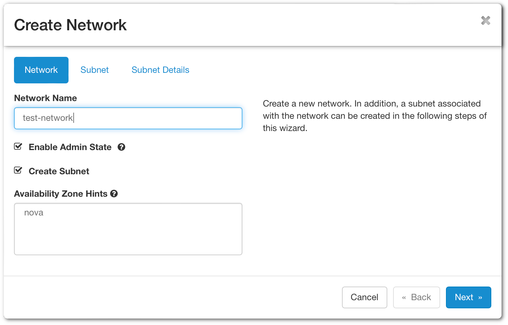
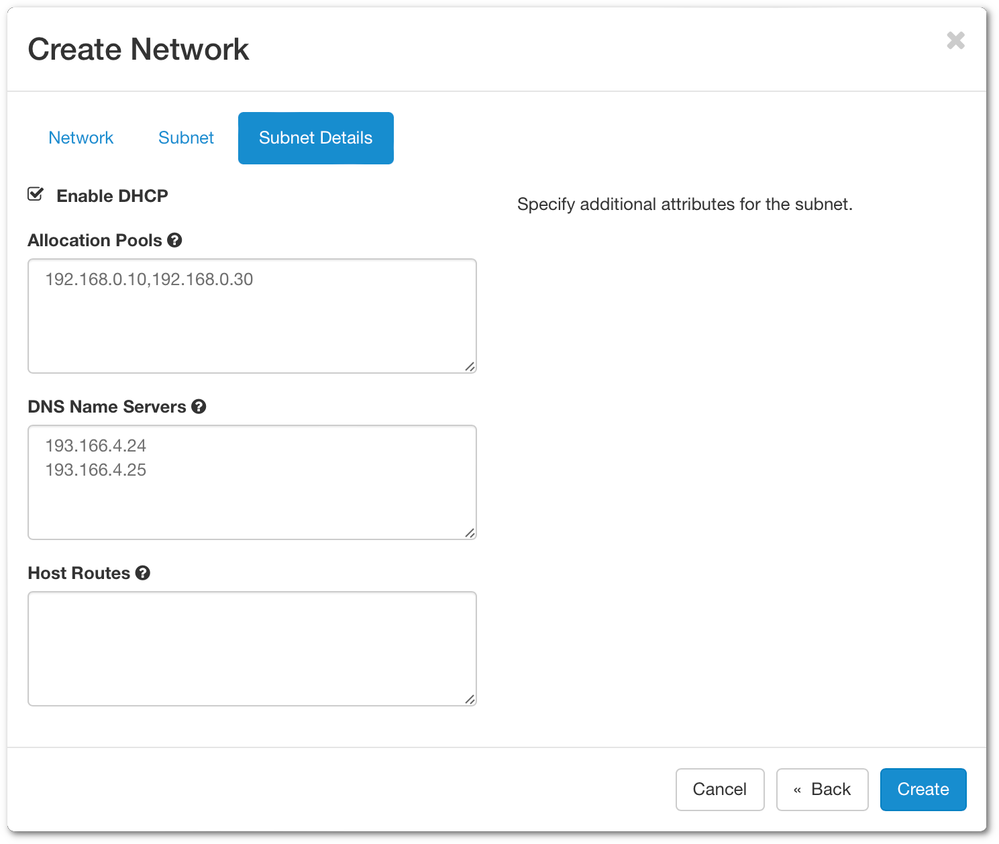
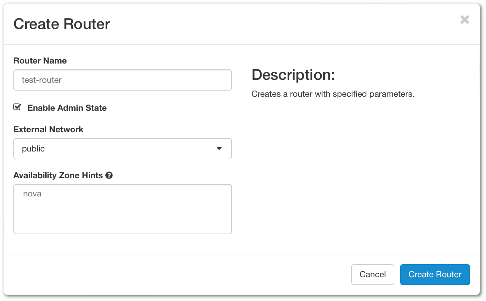
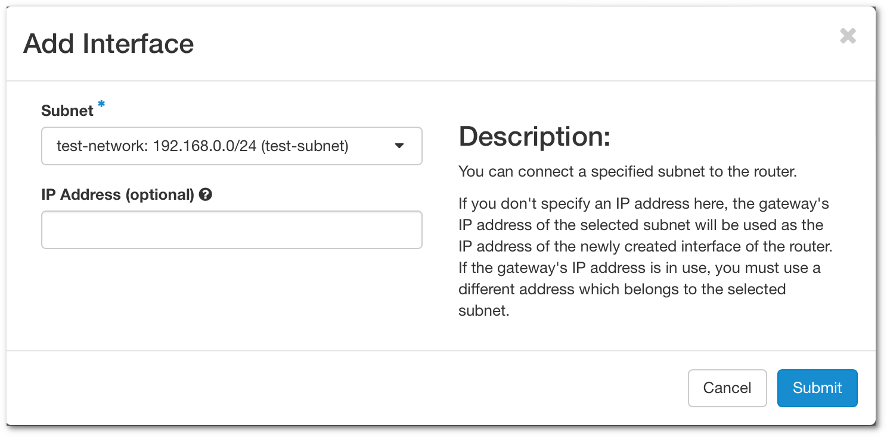
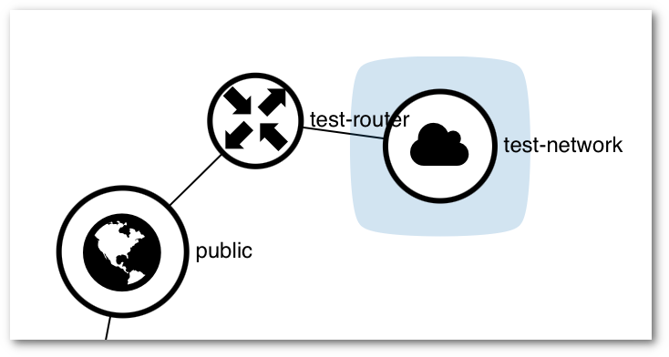

# Networking in Pouta
Every cPouta project comes with a default network and router configuration enough for most purposes. Most often, you don't need to worry about the network or router configuration and you can create virtual machines using the defaults.

In the situation that your project is missing a default network you will not be able to create a virtual machine. And if you are missing a router, you will not be able to assign ports* in your machine for example to a floating IP.

If you find yourself in the need of creating a network and or router, you can recreate the default settings via the web interface with the following instructions.  

*A port is a connection point for attaching a single device to a network.*  

## Create a network

Open [cPouta](https://pouta.csc.fi) and navigate to **Network > Networks**.  
Click on **Create Network** button on the upper right. A new window will open.



**Network Name** - Specify a name for your network.  
**Enable Admin State** - Enable the network.  
**Create Subnet** - Leave check if you want to create a subnet.  
**Availabity Zone Hints** - Leave "nova" by default.  

When done, click on **Next**. It will open the next tab regarding the subnet.


**Subnet Name** - Specify a name for your subnet  
**Network Address** - Specify a network in CIDR format. Here a [link](https://www.calculator.net/ip-subnet-calculator.html) that could help you to calculate the network address.  
**IP Version** - You can leave IPv4  
**Gateway IP** - Optionally you can choose the gateway IP. If it's not filled in, one will be chosen automatically.  

You can click on **Next**.


By default, **Enable DHCP** is activated.  
**Allocation Pools** - Choose the IP range that will deliver the IP for the DHCP  
**DNS Name Server** - Enter 193.166.4.24 and 193.166.4.25 (See screenshot above)  

In the end, you can click **Create** and you should see your network in the list.  

## Create a router
A router will bridge the connection from **external** to the **private network**

Navigate to **Network > Routers**.  
Click on **Create Router** on the upper right. A new window will open.

**Router Name** - Specify a name for your router  
**Enable Admin State** - Enable the router  
**External Network** - Choose which external you want to use for the router  
**Availability Zone Hints** - Select your availability zone.

After filling in the necessary fields, you can click on **Create Router**  

Now that you have the **router** created, you need to attach it to your internal network to allow communication with the external. Click on your router newly created and go to the tab **Interfaces**.  
Click on **Add Interface**

**Subnet** - Select the network you want to attach.  
**IP Address** - This option is not mandatory, if you don't add an IP address, the gateway IP will be selected.

Now you attached your interface to the router and able to connect to the external network. You can see a graph by clicking on **Network > Network Topology** and select the tab **Graph**



!!! info  

    If you want to access your instances from an external network, you need to associate a [floating IP](launch-vm-from-web-gui.md#post-creation-step).  
    A floating IP sticks with your instance until you decide to release it.


If you want to use the CLI command:
```sh
$ openstack network create test-network
$ openstack subnet create --dns-nameserver 193.166.4.24 --dns-nameserver 193.166.4.25 \
    --network $(openstack network list -f value -c ID -c Name|grep -v public|cut -d " " -f1) \
    --subnet-range 192.168.0.1/24 --allocation-pool start=192.168.0.10,end=192.168.0.30 test-network
$ openstack router create test-router
$ openstack router set --external-gateway public test-router
$ openstack router add subnet test-router test-network
```
