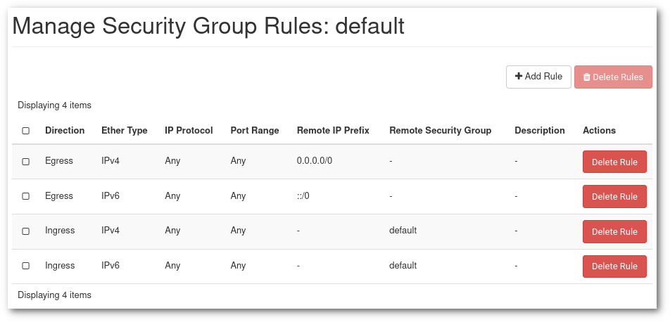

# Verkottuminen Poudassa {#networking-in-pouta}
Jokaisessa cPouta-projektissa on oletusverkon ja reitittimen määritys, joka riittää useimpiin tarkoituksiin. Useimmiten sinun ei tarvitse huolehtia verkon tai reitittimen asetuksista, ja voit luoda virtuaalikoneita oletuksilla.

Mikäli projektistasi puuttuu oletusverkko, et voi luoda virtuaalikonetta. Ja jos sinulta puuttuu reititin, et voi esimerkiksi määrittää portteja koneessasi kelluvaa IP-osoitetta varten.

Jos huomaat, että sinun on luotava verkko tai reititin, voit palauttaa oletusasetukset verkon käyttöliittymän kautta seuraavien ohjeiden avulla.

*Portti on liitäntäpiste, johon voidaan liittää yksi laite verkkoon.*

## Luo verkko {#create-a-network}

1. Avaa [cPouta](https://pouta.csc.fi) ja siirry kohtaan **Verkko > Verkot**. Napsauta oikeassa yläkulmassa olevaa **Luo verkko** -painiketta. Avautuu uusi ikkuna.

    

    - **Verkon nimi** - Määritä verkollesi nimi.
    - **Ota hallintatila käyttöön** - Ota verkko käyttöön.
    - **Luo aliverkko** - Jätä valituksi, jos haluat luoda aliverkon.
    - **Saavutettavuusvyöhykkeen vihjeet** - Jätä oletuksena "nova".

1. Kun olet valmis, napsauta **Seuraava**. Tämä avaa aliverkkoon liittyvän seuraavan välilehden.

    

    - **Aliverkon nimi** - Määritä aliverkkosi nimi
    - **Verkon osoite** - Määritä verkko CIDR-muodossa. Tässä on [linkki](https://www.calculator.net/ip-subnet-calculator.html), joka voi auttaa sinua laskemaan verkon osoitteen.
    - **IP-versio** - Voit jättää IPv4:n
    - **Reitittimen IP-osoite** - Halutessasi voit valita reitittimen IP-osoitteen. Jos sitä ei täytetä, se valitaan automaattisesti.

1. Voit napsauttaa **Seuraava**.

    

    Oletuksena **Ota DHCP käyttöön** on aktivoitu.
    - **Kohdentamisaltaat** - Valitse IP-alue, joka toimittaa IP:n DHCP:lle
    - **DNS-nimipalvelin** - Syötä 193.166.4.24 ja 193.166.4.25 (katso yllä oleva kuvakaappaus)

1. Lopuksi voit napsauttaa **Luo**, ja sinun pitäisi nähdä verkko listalla.

## Luo reititin {#create-a-router}
Reititin yhdistää **ulkoisen** ja **yksityisen verkon**

1. Siirry kohtaan **Verkko > Reitittimet**. Napsauta oikeassa yläkulmassa **Luo reititin** -painiketta. Avautuu uusi ikkuna.

    

    - **Reitittimen nimi** - Määritä reitittimen nimi
    - **Ota hallintatila käyttöön** - Ota reititin käyttöön
    - **Ulkoinen verkko** - Valitse, mitä ulkoista verkkoa haluat käyttää reitittimelle
    - **Saavutettavuusvyöhykkeen vihjeet** - Valitse käytettävyyden vyöhyke.

1. Kun olet täyttänyt tarvittavat kentät, voit napsauttaa **Luo reititin**

1. Nyt kun olet luonut **reitittimen**, sinun täytyy liittää se sisäiseen verkkoon, jotta se voi kommunikoida ulkoisen verkon kanssa. Klikkaa juuri luomaasi reititintä ja siirry välilehdelle **Liitännät**.
Napsauta **Lisää liitäntä**

    

    - **Aliverkko** - Valitse verkko, johon haluat liittää.
    - **IP-osoite** - Tämä vaihtoehto ei ole pakollinen, jos et lisää IP-osoitetta, valitaan reitittimen IP.

1. Nyt olet liittänyt liitännän reitittimeen ja voit muodostaa yhteyden ulkoiseen verkkoon. Voit nähdä kaavion napsauttamalla **Verkko > Verkon topologia** ja valitsemalla välilehden **Kaavio**


!!! info

    Jos haluat käyttää instanssejasi ulkoisesta verkosta, sinun on yhdistettävä siihen [kelluva IP](launch-vm-from-web-gui.md#post-creation-step).  
    Kelluva IP säilyy instanssissasi kunnes päätät vapauttaa sen.

* Jos haluat käyttää CLI-komentoa:

```sh
$ openstack network create test-network
$ openstack subnet create --dns-nameserver 193.166.4.24 --dns-nameserver 193.166.4.25 \
    --network $(openstack network list -f value -c ID -c Name|grep -v public|cut -d " " -f1) \
    --subnet-range 192.168.0.1/24 --allocation-pool start=192.168.0.10,end=192.168.0.30 test-network
$ openstack router create test-router
$ openstack router set --external-gateway public test-router
$ openstack router add subnet test-router test-network
```

## Turvallisuusryhmät {#security-groups}

Turvallisuusryhmät ovat joukko palomuurisääntöjä, jotka rajoittavat pääsyä koneillesi. Virtuaalikone voi käyttää yhtä tai useampaa turvallisuusryhmää. Ja yksi turvallisuusryhmä voidaan määrittää yhdelle tai useammalle virtuaalikoneelle. Turvallisuusryhmä voi sisältää yhden tai useamman säännön. Nämä palomuurisäännöt tehdään OpenStack-tasolla ja sinulla voi olla lisäpalomuurisääntöjä virtuaalikoneessasi. Yhteysongelmien tapauksessa sinun tulee varmistaa, että sekä turvallisuusryhmä että virtuaalikoneen sisäinen palomuuri on konfiguroitu oikein.


Turvallisuusryhmää voidaan muokata tai luoda milloin tahansa virtuaalisen koneen elinkaaren aikana. Kaikki muutokset, jotka tehdään virtuaalikoneeseen määritettyyn turvallisuusryhmään, toteutetaan välittömästi virtuaalikoneelle. Turvallisuusryhmiin ei liity kustannuksia.

* **Suositus** on pyrkiä sarjaan ryhmiä ja sääntöjä, jotka ovat _järjestettyjä_ niin, että niiden tavoite on helposti ymmärrettävissä. Jokaisella palvelulla tulisi olla oma turvallisuusryhmä ja sekä nimen että kuvauksen tulisi selkeästi ilmaista, mitä tämä ryhmä tarjoaa ja mihin se avaa pääsyn (kohdeportit) ja mistä (lähde-IP:t).

    

    Yllä olevassa esimerkissä meillä on 3 turvallisuusryhmää lukuun ottamatta `oletusta`, kaksi sisäistä valvontaa ja hallintaa varten sekä yksi julkinen palvelua varten, jota tarjoamme käyttäjillemme.

    !!! Info "Instanssinäkymä"
        Instanssinäkymä näyttää kaikki VM:n kokoonpanot, mukaan lukien kaikki siihen lisätyt turvallisuusryhmät ja kunkin niiden konfiguraation. Se on erittäin hyödyllinen verkko-ongelmien vianmäärityksessä ja VM:n turvallisuuden varmistamisessa.

* `Oletus` turvallisuusryhmässä on sääntöjä, jotka mahdollistavat sisäisen viestinnän turvallisuusryhmän jäsenten välillä:

    

    !!! Warning "Älä muuta oletus turvallisuusryhmää"
        Vaikka oletus turvallisuusryhmää saa muokata, sitä ei suositella. Jotkin alustusmenetelmät luottavat oletus turvallisuusryhmän kokoonpanoon.

    `Oletus` turvallisuusryhmässä kaksi ensimmäistä sääntöä sallii liikenteen ulos (`Egress`) mihin tahansa `IP` tai `Port`. Kaksi viimeistä sääntöä sallii viestinnän kaikkien `oletus` turvallisuusryhmän jäsenten välillä myös mille tahansa `IP` tai `Port`. Tämä tarkoittaa, että oletuksena jokainen VM voi ottaa yhteyttä mihin tahansa julkiseen Internet-osoitteeseen ja toisiinsa. Tämä voidaan rajoittaa keskimääräistä turvallisemmille ympäristöille, mutta se tulisi tehdä ymmärtäen vaatimukset.

### Luo turvallisuusryhmä {#create-a-security-group}

1. Mene ensin Poudassa [Turvallisuusryhmät](https://pouta.csc.fi/dashboard/project/security_groups/) hallintasivulle. Uudessa tyhjässä projektissa on vain oletus turvallisuusryhmä.

1. Napsauta **+ Luo turvallisuusryhmä**

    

1. "Luo turvallisuusryhmä" sivu ilmestyy. Anna **Nimi** ja **Kuvaus**.

1. Napsauta sitten **Hallinnoi sääntöjä**, ja näytössä, joka näytetään, napsauta **Lisää sääntö**.

    

    - **Sääntö** tarjoaa useita vaihtoehtoja:
        - On olemassa luettelo protokollista (DNS, HTTP, IMAP, ...), ne tarjoavat jonkin verran yksinkertaisuuden luoda sääntö. Esimerkiksi `SSH`-protokollalle tarvitsee vain syöttää CIDR, joka sallitaan tällä säännöllä.
        - Kolme yleisintä ja eniten hallittavaa vaihtoehtoa ovat **Mukautettu TCP-sääntö**, **Mukautettu UDP-sääntö** ja **Mukautettu ICMP-sääntö**, ne ovat niitä, jotka sallivat palomuuri-asetusten hienosäätämisen.
        - Lopuksi **Kaikki ICMP/TCP/UDP** avaavat kaikki portit tietyssä protokollassa tiettyyn CIDR-osoitteeseen. Ne ovat suositeltavia vain testeissä ja kun sallittujen IP-osoitteiden lista on rajoitettu ja hallittu.
    - **Kuvaus** ei ole pakollinen, mutta suositeltava monimutkaille turvallisuusryhmille, joissa on useita sääntöjä. Esimerkiksi kun lisätään useita IP-alueita, kuvauksen tulisi kertoa, mihin nämä IP:t liittyvät (toimistoverkko, VPN, ...).
    - **Suunta** voi olla Saapuva tai Lähtevä. Periaatteessa useimmat säännöt ovat Saapuva-sääntöjä, koska Lähtevä on oletuksena auki.
    - **Avaa portti** voi olla yksittäinen **Portti**, **Porttialue** tai **Kaikki portit**.
    - **Portti** tai **Porttialue** on itsestään selvä. Jos et tiedä, mikä portti avata, vaihtoehtoinen vaihtoehto on käyttää yhtä ennalta määritetyistä protokollista **Sääntö** kohdassa.
    - **CIDR** tai luokaton verkkotunnusreititys on tapa määrittää IP-osoitteiden alueita. Voit määrittää yksittäisen IP:n lisäämällä `/32` loppuliitteen (`188.184.77.250/32`) tai kokonaisen C-luokan aliverkon loppuliitteellä `/16` (`188.184.77.250/16`).

Turvallisuusryhmä voi sisältää niin monta sääntöä kuin tarvitaan.


Yllä olevassa esimerkissä olemme avanneet portit `80` (http) ja `443` (https) aliverkossa `188.184.0.0/16` ([`188.184.0.0` - `188.184.255.255`]).