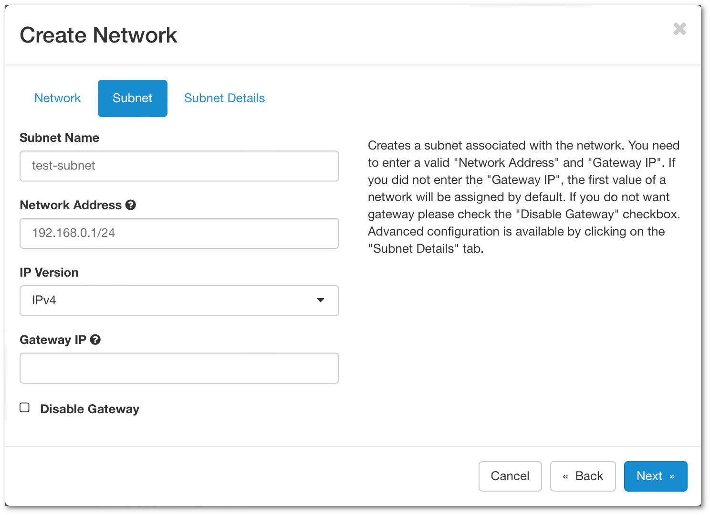
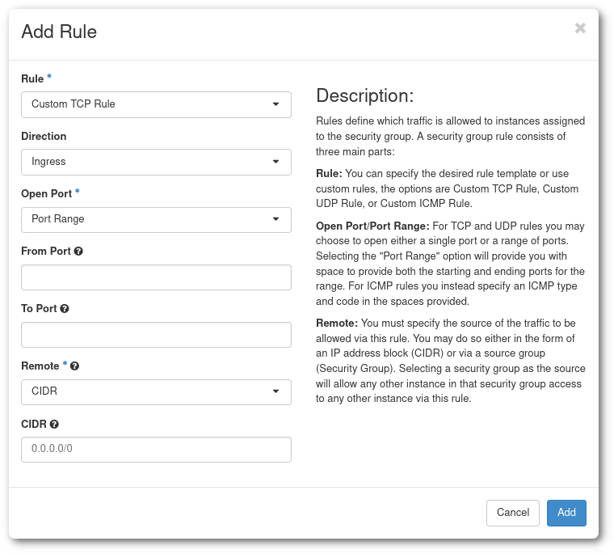

# Verkot Poutassa { #networking-in-pouta }
Jokaisen cPouta-projektin mukana tulee oletusverkon ja -reitittimen määritykset, jotka riittävät useimpiin tarkoituksiin. Useimmiten sinun ei tarvitse huolehtia verkko- tai reititinmäärityksistä, vaan voit luoda virtuaalikoneita oletusasetuksilla.

Jos projektistasi puuttuu oletusverkko, et voi luoda virtuaalikonetta. Ja jos reititin puuttuu, et pysty liittämään virtuaalikoneesi porttia esimerkiksi kelluvaan IP-osoitteeseen.

Jos sinun täytyy luoda verkko ja/tai reititin, voit luoda oletusasetukset uudelleen web-käyttöliittymän kautta seuraavien ohjeiden avulla.

*Portti on liitäntäpiste, johon yksittäinen laite liitetään verkkoon.*

## Luo verkko { #create-a-network }

1. Avaa [cPouta](https://pouta.csc.fi) ja siirry kohtaan **Network > Networks**. Napsauta oikeassa yläkulmassa **Create Network**. Uusi ikkuna avautuu.

    

    - **Network Name** - Määritä verkon nimi.
    - **Enable Admin State** - Ota verkko käyttöön.
    - **Create Subnet** - Jätä valituksi, jos haluat luoda aliverkon.
    - **Availabity Zone Hints** - Jätä oletukseksi "nova".

1. Kun olet valmis, napsauta **Next**. Se avaa seuraavan välilehden, joka koskee aliverkkoa.

    

    - **Subnet Name** - Määritä aliverkon nimi
    - **Network Address** - Määritä verkko CIDR-muodossa. Tässä on [linkki](https://www.calculator.net/ip-subnet-calculator.html), joka voi auttaa laskemaan verkko-osoitteen.
    - **IP Version** - Voit jättää IPv4:n
    - **Gateway IP** - Voit halutessasi valita yhdyskäytävän IP-osoitteen. Jos kenttä jätetään tyhjäksi, se valitaan automaattisesti.

1. Napsauta **Next**.

    

    Oletuksena **Enable DHCP** on käytössä.

    - **Allocation Pools** - Valitse IP-osoitealue, jolta DHCP jakaa osoitteet
    - **DNS Name Server** - Syötä 193.166.4.24 ja 193.166.4.25 (katso kuvakaappaus yllä)

1. Lopuksi napsauta **Create**, minkä jälkeen verkon pitäisi näkyä listalla.

## Luo reititin { #create-a-router }
Reititin yhdistää yhteyden ulkoisen verkon ja yksityisen verkon välillä.

1. Siirry kohtaan **Network > Routers**. Napsauta oikeassa yläkulmassa **Create Router**. Uusi ikkuna avautuu.

    

    - **Router Name** - Määritä reitittimen nimi
    - **Enable Admin State** - Ota reititin käyttöön
    - **External Network** - Valitse, mitä ulkoista verkkoa käytetään reitittimelle
    - **Availability Zone Hints** - Valitse käytettävyysalueesi.

1. Kun olet täyttänyt tarvittavat kentät, napsauta **Create Router**

1. Kun **reititin** on luotu, liitä se sisäiseen verkkoosi, jotta yhteys ulkoiseen verkkoon toimii. Napsauta äsken luomaasi reititintä ja siirry välilehdelle **Interfaces**.
Napsauta **Add Interface**

    

    - **Subnet** - Valitse verkko, jonka haluat liittää.
    - **IP Address** - Ei pakollinen. Jos et lisää IP-osoitetta, yhdyskäytävän IP valitaan automaattisesti.

1. Nyt olet liittänyt liittymän reitittimeen ja voit muodostaa yhteyden ulkoiseen verkkoon. Näet kaavion valitsemalla **Network > Network Topology** ja välilehden **Graph**


!!! info

    Jos haluat käyttää instansseja ulkoisesta verkosta, sinun on liitettävä niihin [kelluva IP -osoite](launch-vm-from-web-gui.md#post-creation-step).  
    Kelluva IP pysyy instanssissasi, kunnes vapautat sen.


* Jos haluat käyttää CLI-komentoja:


```sh
$ openstack network create test-network
$ openstack subnet create --dns-nameserver 193.166.4.24 --dns-nameserver 193.166.4.25 \
    --network $(openstack network list -f value -c ID -c Name|grep -v public|cut -d " " -f1) \
    --subnet-range 192.168.0.1/24 --allocation-pool start=192.168.0.10,end=192.168.0.30 test-network
$ openstack router create test-router
$ openstack router set --external-gateway public test-router
$ openstack router add subnet test-router test-network
```


## Suojausryhmät { #security-groups }

Suojausryhmät ovat joukko palomuurisääntöjä, jotka rajoittavat pääsyä koneillesi. Virtuaalikoneella voi olla yksi tai useampi suojausryhmä, ja yksi suojausryhmä voidaan liittää yhteen tai useampaan virtuaalikoneeseen. Suojausryhmä voi sisältää yhden tai useamman säännön. Nämä palomuurisäännöt tehdään OpenStack-kerroksessa, ja virtuaalikoneessasi voi olla lisäksi erillisiä palomuurisääntöjä. Yhteysongelmien ilmetessä varmista, että sekä suojausryhmän että virtuaalikoneen sisäisen palomuurin asetukset ovat oikein.


Suojausryhmää voidaan muokata tai luoda missä tahansa virtuaalikoneen elinkaaren vaiheessa. Kaikki suojausryhmään tehdyt muutokset päivittyvät välittömästi siihen liitettyihin virtuaalikoneisiin. Suojausryhmistä ei aiheudu kustannuksia.

* **Suositus** on tähdätä sellaiseen ryhmien ja sääntöjen kokonaisuuteen, joka on järjestetty siten, että kunkin tarkoitus on helppo ymmärtää. Jokaisella palvelulla tulisi olla oma suojausryhmänsä, ja sekä nimen että kuvauksen tulisi selkeästi kertoa, mihin tämä ryhmä antaa pääsyn (kohdeportit) ja mistä (lähde-IP:t).

    

    Yllä olevassa esimerkissä on kolme suojausryhmää `default`-ryhmän lisäksi: kaksi sisäistä valvontaan ja hallintaan sekä yksi julkinen käyttäjille tarjottavaa palvelua varten.

    !!! Info "Instanssin näkymä"
        Instanssin näkymä näyttää VM:n kaikki asetukset, mukaan lukien siihen lisätyt suojausryhmät ja kunkin ryhmän määritykset. Se on erittäin hyödyllinen verkko-ongelmien vianmääritykseen ja VM:n turvallisuuden varmistamiseen.

* `Default`-suojausryhmässä on säännöt, jotka sallivat sisäisen viestinnän sellaisten virtuaalikoneiden välillä, jotka ovat saman suojausryhmän jäseniä:

    

    !!! Warning "Älä muokkaa oletus-suojausryhmää"
        Vaikka oletus-suojausryhmää saa muokata, sitä ei suositella. Osa alustustoimenpiteistä riippuu oletus-suojausryhmän määrityksistä.

    `default`-ryhmässä kaksi ensimmäistä sääntöä sallivat ulospäin lähtevän liikenteen (`Egress`) mihin tahansa `IP`:hen tai `Port`:tiin. Kaksi viimeistä sääntöä sallivat yhteydet minkä tahansa `default`-ryhmän jäsenen välillä ja mihin tahansa `IP`:hen tai `Port`:tiin. Tämä tarkoittaa, että oletuksena mikä tahansa VM voi muodostaa yhteyden minne tahansa julkisessa internetissä sekä toisiinsa. Tätä voidaan rajoittaa keskimääräistä turvallisemmissa ympäristöissä, mutta se tulisi tehdä vaatimukset huomioiden.

### Luo suojausryhmä { #create-a-security-group }

1.First mene Poudassa sivulle [Security Groups](https://pouta.csc.fi/dashboard/project/security_groups/). Uudessa tyhjässä projektissa näkyy vain oletus-suojausryhmä.

1. Napsauta **+ Create Security Group**

    

1. "Create Security Group" -sivu avautuu. Anna **Name** ja **Description**.

1. Napsauta **Manage Rules**, ja avautuvassa näkymässä **Add Rule**.

    

    - **Rule**-kohdassa on useita vaihtoehtoja:
        - Luettelo protokollista (DNS, HTTP, IMAP, ...), jotka tarjoavat hieman yksinkertaisemman tavan luoda sääntö. Esimerkiksi `SSH`-protokollassa tarvitsee antaa vain tämän säännön sallima CIDR.
        - Yleisimmät ja säädettävimmät vaihtoehdot ovat **Custom TCP Rule**, **Custom UDP Rule** ja **Custom ICMP Rule**; näillä voi hienosäätää palomuuriasetuksia eniten.
        - **All ICMP/TCP/UDP** avaa kaikki portit valitulle protokollalle tiettyyn CIDR:ään. Näitä kannattaa käyttää vain testaukseen tai kun sallittujen IP-osoitteiden lista on rajattu ja hallittu.
    - **Description** ei ole pakollinen, mutta suositeltava monimutkaisissa, useita sääntöjä sisältävissä suojausryhmissä. Esimerkiksi lisättäessä useita IP-alueita kuvauksessa kannattaa kertoa, mihin nämä IP:t liittyvät (toimistoverkko, VPN, ...).
    - **Direction** voi olla Ingress tai Egress. Pääsääntöisesti useimmat säännöt ovat Ingress-sääntöjä, koska oletuksena Egress on auki.
    - **Open Port** voi olla yksittäinen **Port**, **Port Range** tai **All ports**.
    - **Port** tai **Port Range** on itseselitteinen. Jos et tiedä mitä porttia avata, vaihtoehtona on käyttää jotakin **Rule**-kohdan esiasetetuista protokollista.
    - **CIDR** (Classless Inter-Domain Routing) on tapa määrittää IP-osoitealueita. Voit määrittää yksittäisen IP-osoitteen lisäämällä päätteeksi `/32` (`188.184.77.250/32`) tai kokonaisen Class C -aliverkon päätteellä `/16` (`188.184.77.250/16`).

Suojausryhmä voi sisältää niin monta sääntöä kuin tarvitaan.


Yllä olevassa esimerkissä on avattu portit `80` (http) ja `443` (https) aliverkkoon `188.184.0.0/16` ([`188.184.0.0` – `188.184.255.255`]).