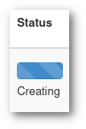

# Pysyvät levyt {#persistent-volumes}

Tässä artikkelissa kuvataan yksi vaihtoehto tallentaa dataa Poutassa, joka säilyy, vaikka virtuaalikone sammutetaan.

Pysyvät levyt, kuten nimi viittaa, säilyvät vaikka instanssit poistettaisiin. Ne voidaan liittää tai irrottaa virtuaalikoneista niiden ollessa käynnissä.

Pysyvät levyt käyttävät CEPH-klusteria. Jos I/O-suorituskyky on kriittistä, älä käytä tämän tyyppistä levyä - tiedot haetaan verkon kautta, mikä aiheuttaa jonkin verran viivettä.

## Levyn luominen ja liittäminen Poutan verkkokäyttöliittymässä {#creating-and-attaching-a-volume-in-the-pouta-web-interface}

Pysyviä levyjä voidaan luoda joko verkkokäyttöliittymässä tai komentorivikäyttöliittymässä.

Verkkokäyttöliittymässä käytä **Luo levy** -painiketta *Levyt* -sivulla luodaksesi uuden levyn. Voit sitten antaa nimen ja koon levylle (1 Gt on vähimmäiskoko). Ainoa pakollinen argumentti on levyn koko.


!!! Varoitus "Vältä muita kuin ASCII-merkkejä nimessä tai kuvauksessa"
    Tämä on tunnettu virhe levysysteemissä. Levyn luonti epäonnistuu, jos nimi tai kuvaus sisältää muita kuin ASCII-merkkejä (esim. ä, ö, å, é, à, ñ, [CJK-merkit](https://en.wikipedia.org/wiki/CJK_characters), ...):

    

    Levy jää tilaan "Luodaan":

    

    Ainoa tapa poistaa levy, joka on luotu muiden kuin ASCII-merkkien avulla, on käyttää komentoriviä (katso alla).

Kun levy on luotu, se voidaan liittää käynnissä olevaan virtuaalikoneeseen. Yksi levy voidaan liittää vain yhteen virtuaalikoneeseen kerrallaan.

Liittääksesi levyn, valitse ensin *Levyt* näkymä Poutan verkkokäyttöliittymässä. Klikkaa nuolisymbolia **Muokkaa levyä** -painikkeen vierestä sen levyn kohdalla, jonka haluat liittää, ja valitse **Hallitse liitoksia**. Valitse instanssi (eli virtuaalikone), johon haluat liittää levyn **Liitä instanssiin** -valikosta.


## Levyn luominen ja liittäminen komentorivillä {#creating-and-attaching-a-volume-with-command-line-interface}

Pysyviä levyjä voidaan myös luoda ja liittää käyttämällä komentorivikäyttöliittymää:

```
openstack volume create --description "<kuvaus>" --size <koko> <nimi>
```

!!! Varoitus "Vältä muita kuin ASCII-merkkejä nimessä tai kuvauksessa"
    Tämä on tunnettu virhe levysysteemissä. Levyn luonti epäonnistuu, jos nimi tai kuvaus sisältää muita kuin ASCII-merkkejä, mukaan lukien ääkköset ja ei-standardit merkit.

    ```sh
    $ openstack volume create --description='Déjà vu' --size 1 matrice
    Virhe pyyntösi purkamisessa. Joko URL tai pyynnön runko sisälsi merkkejä, joita Cinder ei voinut purkaa. (HTTP 400) (Request-ID: req-7dc59e6f-eb29-4a5f-9cdc-4a44b177e3f2)
    ```

    Ainoa tapa poistaa levy, joka on luotu muiden kuin ASCII-merkkin avulla, on käyttää komentoriviä (katso alla).

Listaa olemassa olevat levyt:

```
openstack volume list
```

Listaa olemassa olevat virtuaalikoneet löytääksesi sen, johon haluat liittää levyn:

```
openstack server list
```

Kun levyn tila on "saatavilla", voit liittää sen virtuaalikoneeseen (voit käyttää joko nimiä tai ID:tä viitataksesi VM:ään ja levyyn):

```
openstack server add volume <virtuaalikone> <levy>
```

!!! info

    Useimmat levytyypit voidaan liittää vain yhteen virtuaalikoneeseen kerrallaan.

## Liitettyjen levyjen käyttö {#using-attached-volumes}

Kun liitettyä levyä käytetään ensimmäistä kertaa, se tulee alustaa. **Tämä tulisi tehdä VAIN ensimmäisellä käyttökerralla**, muuten kaikki datasi levyllä ylikirjoitetaan. Selvitä ensin, mikä laite on levysi.

Seuraava on yksinkertainen esimerkki tiedostojärjestelmän luomisesta levylle ja sen automaattisesta liitännästä uudelleenkäynnistyksen jälkeen. Huomaa, että tämä on yksinkertainen esimerkki ja tiedostojärjestelmien hallintaan on monia tehokkaampia tapoja.

Kun olet kirjautunut sisään virtuaalikoneeseesi, voit listata levyt:

    sudo parted -l

Sinun pitäisi pystyä tunnistamaan levy sen koon perusteella. Tässä harjoituksessa oletamme sen olevan `/dev/vdb`. Luodaan ensin tiedostojärjestelmä sille. Käytämme *xfs*:ää, koska tiedämme sen toimivan hyvin Poutassa:

    sudo mkfs.xfs /dev/vdb

Nyt voit alkaa käyttää sitä. Voit esimerkiksi liittää sen polkuun `/media/volume`, varmista ensin, että polku on olemassa:

    sudo mkdir -p /media/volume

Sitten voit liittää sen:

    sudo mount /dev/vdb /media/volume

Lopuksi sinun on muutettava omistajuutta voidaksesi lukea ja kirjoittaa dataa siihen. Oletamme seuraavassa komennossa, että käyttäjänimi on cloud-user.

    sudo chown cloud-user:cloud-user /media/volume

Tämän vaiheen jälkeen sinun pitäisi pystyä käyttämään levyäsi normaalisti. Jos haluat, että levy on käytettävissä virtuaalikoneen uudelleenkäynnistyksen jälkeen, sinun on lisättävä se `/etc/fstab`-konfiguraatiotiedostoon. Voit käyttää aiemmin luomasi osion etikettiä:

    sudo sh -c 'echo "/dev/vdb     /media/volume    xfs    defaults,nofail    0    2" >> /etc/fstab'

## Levyn irrottaminen verkkokäyttöliittymässä {#detaching-the-volume-using-web-interface}

Kun olet valmis toimiesi kanssa ja haluat irrottaa levyn, muista irrottaa levy ennen sen irrottamista!

    sudo umount /dev/vdb

## Levyn irrottaminen komentoriviltä {#detaching-the-volume-using-cli}

Kun et enää tarvitse levyä liitettynä, voit irrottaa sen. **Ennen irrottamista muista irrottaa levyn tiedostojärjestelmä virtuaalikoneessa estääksesi tietojen menetyksen!**

```
openstack server remove volume <palvelin> <levy>
```

Jos haluat poistaa levyn ja siinä olevan datan, voit suorittaa seuraavan komennon:

```
openstack volume delete <levy> # Levyn nimi tai ID
```

**Data poistetaan pysyvästi, eikä sitä voida palauttaa.**

## Volyymien siirtäminen kahden Pouta-projektin välillä verkkokäyttöliittymällä {#transferring-volumes-between-two-pouta-projects-using-web-interface}

Ajoittain saatat tarvita pysyvien volyymiesi siirtämistä kahden Pouta-projektin välillä. Esimerkiksi saatat tarvita suurten tietoaineistojen tai käynnistysvolyymien siirtämistä kollegoille toisessa Pouta-projektissa. Tämä voidaan tehdä volyymisiirroilla. Volyymien siirrot projektien välillä Poutassa ovat nopeita, välttävät tiedon monistamisen ja tarpeettomat tiedonsiirrot verkon kautta. Volyymin siirtäminen toiseen projektiin tarkoittaa, että projektisi ei enää pääse siihen käsiksi. Huomaa, että Poutan volyymisiirrot toimivat saman pilviympäristön sisällä, eli voit siirtää volyymin yhdestä cPouta-projektista toiseen, mutta et cPouta-projektista ePouta-projektiin tai päinvastoin.

Siirtääksesi volyymin, varmista ensin, että sen tila on **Saatavilla**. Voit tehdä näin irrottamalla sen instanssista, johon se oli alun perin liitetty. Kun volyymisi on saatavilla-tilassa, voit aloittaa volyymisiirron joko Pouta Webissä tai komentorivikäyttöliittymässä.

Pouta Web -käyttöliittymässä mene *Levyt* -näkymään ja klikkaa nuolipainiketta **Muokkaa levyä** -painikkeen vieressä siirrettävän volyymin kohdalla ja valitse **Luo siirto.** Nimeä tämä siirtopyyntö ja klikkaa **Luo volyymisiirto.** Saat sitten volyymisiirtotunnistautumistiedot (siirto-ID & valtuutusavain).


Sinun on annettava nämä tunnistustiedot kollegallesi, jolle haluat siirtää tämän volyymin.

Kollegasi voi hyväksyä tämän volyymisiirron hänen projektissaan menemällä omaan *Levyt* -näkymäänsä verkkokäyttöliittymässä ja klikkaamalla **Hyväksy siirto** -painiketta. Hänen tulee sitten antaa siirtotunnistustiedot, jotka loit edellisessä vaiheessa, ja **Hyväksy volyymisiirto.** Tämä siirtää volyymin kollegasi projektille.


## Volyymien siirtäminen kahden Pouta-projektin välillä komentoriviltä {#transferring-volumes-between-two-pouta-projects-using-cli}

Volyymisiirrot voidaan tehdä myös komentorivikäyttöliittymän kautta:

    openstack volume transfer request create <siirrettävän volyymin nimi tai UUID>

Tämän komennon tulos sisältää volyymisiirtotunnistautumistiedot (siirto-ID & valtuutusavain), merkitse nämä muistiin ja anna kollegalle, jolle haluat siirtää volyymin.

Kollegasi voi hyväksyä tämän volyymin siirtopyynnön:

    openstack volume transfer request accept <siirtoID> <valtuutusAvain>

## Liitetyn volyymin koon laajentaminen Poutan verkkokäyttöliittymässä {#expanding-size-of-the-attached-volume-in-the-pouta-web-interface}

Aiemmin olet luonut ja liittänyt volyymin. Tässä osiossa laajennat instanssiin liitetyn volyymin kokoa. Ennen kuin yrität laajentaa volyymiä, sinun on irrotettava se instanssista, muista irrottaa levy ennen sen irrottamista!

    sudo umount /dev/vdb

Laajentaaksesi volyymiä valitse ensin *Levyt* näkymä Poutan verkkokäyttöliittymässä. Klikkaa nuolipainiketta **Muokkaa levyä** -painikkeen vieressä, sen volyymin kohdalla, jonka haluat laajentaa, ja valitse **Laajenna volyymi**. Syötä haluamasi volyymin koko "GiB"-kenttään **Uusi koko (GiB)**. Lopuksi klikkaa **Laajenna volyymi** -painiketta.
Liittääksesi laajennetun volyymin samalla tavalla kuin aiemman pysyvän volyymin, valitse ensin *Levyt* näkymä Poutan verkkokäyttöliittymässä. Klikkaa nuolipainiketta **Muokkaa levyä** -painikkeen vieressä siitä volyymistä, jonka laajensit, ja valitse **Hallitse liitoksia**. Valitse instanssi (eli virtuaalikone), johon haluat liittää volyymin **Liitä instanssiin** -valinnalta.


Kun olet kirjautunut sisään virtuaalikoneeseesi, voit listata levyt:

    sudo parted -l

Samoin kuin edellisessä pysyvässä volyymin luonnissa, voit tunnistaa levyn sen koon perusteella. Kiinnitä levy ensin tavalliseen polkuun:

    sudo mount /dev/vdb /media/volume

Lopuksi meidän on kasvatettava levyn tiedostojärjestelmää, jotta lisätila voidaan käyttää. Oletetaan, että volyymin tiedostojärjestelmä on xfs, voimme kasvattaa tiedostojärjestelmää seuraavalla komennolla:

    sudo xfs_growfs /dev/vdb
    
Vahvistaaksesi, että tiedostojärjestelmän koko on nyt odotetusti, voit käyttää seuraavaa komentoa:

    sudo xfs_info /dev/vdb

Kertomalla lohkojen koko (_bs_) tiedostojärjestelmän lohkojen määrällä (_blocks_), saat tiedostojärjestelmän koon tavuina.

## Liitetyn volyymin koon laajentaminen komentorivillä {#expanding-size-of-the-attached-volume-using-cli}

Laajentaaksesi volyymiäsi, irrota se palvelimesta seuraavalla komennolla:

```
openstack server remove volume <server-id> <volume-id>
```
Tarkista nyt, onko volyymi saatavilla laajentamiseen, listaa levyt:
```
openstack volume list
```
Voit nyt laajentaa volyymiä antamalla volyymin ID:n ja uuden koon:
```
openstack volume set <volume-id> --size <volume-size>
```
```
