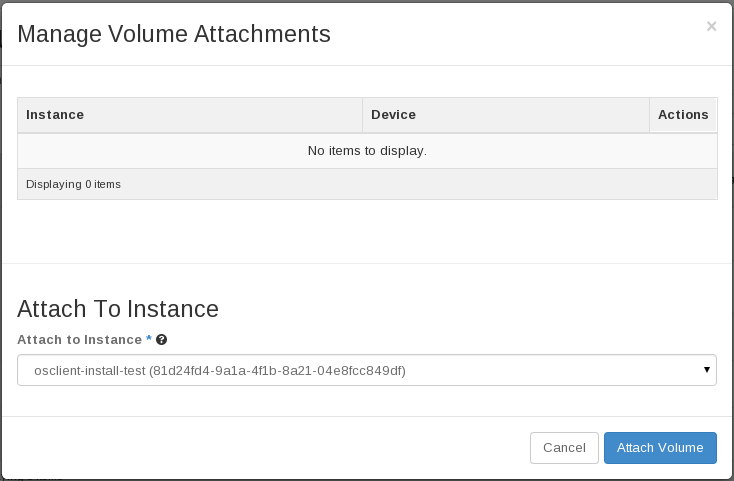
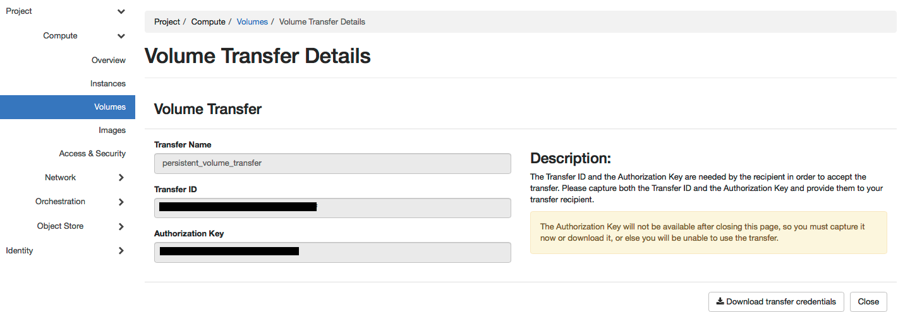
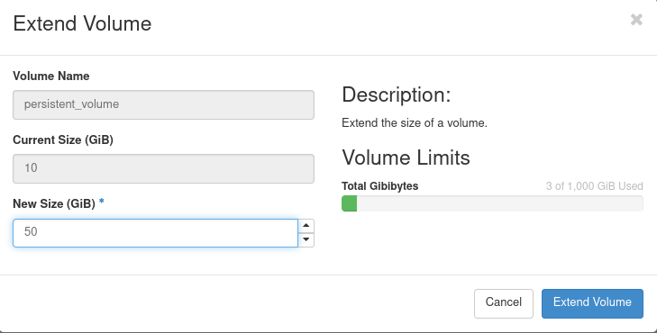
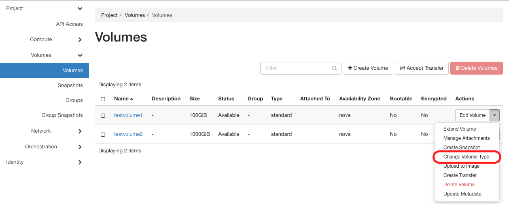

# Persistent volumes

This article describes one of the options to store data in Pouta which
survive turning off the virtual machine.

Persistent volumes remain even when instances are removed. They can be
attached to or detached from virtual machines while they are running.

Persistent volumes use a Ceph cluster. Because data is accessed over the
network, persistent volumes introduce additional latency and are therefore
not recommended for latency‑critical or high‑performance workloads. See
[Ephemeral storage](ephemeral-storage.md)

## Volume Types: Standard vs. Capacity

Pouta provides two persistent volume types: **Standard** and **Capacity**. Both
use the same Ceph backend, but they differ in performance behavior and cost.

### Standard Volumes

Standard volumes offer predictable performance and are suitable for workloads
that require responsive storage.

**Key characteristics:**

- Better I/O performance
- Suitable for most general‑purpose workloads
- More expensive than Capacity volumes

**Best for:**

- Frequently accessed or active data
- Applications needing stable responsiveness
- Moderate database workloads

**Not ideal for:**

- High‑performance or latency‑critical workloads, which perform better on VM
  flavors with [Ephemeral storage](ephemeral-storage.md).
- Large datasets where storage cost dominates

### Capacity Volumes

Capacity volumes are designed for storing **large amounts of data** where access
frequency and performance requirements are low.

**Key characteristics:**

- Lower I/O performance
- Higher latency compared to Standard volumes
- Optimized for bulk and long‑term storage
- Less expensive than Standard volumes

**Best for:**

- Infrequently accessed (“cold”) datasets
- Long‑term archival storage
- Backups, snapshots, research datasets
- Log retention, *as long as the logs are not written actively to the
  volume* (for example, storing rotated or compressed logs after processing)

**Not suitable for:**

- Live databases
- Regularly accessed or performance‑sensitive workloads
- High‑throughput applications
- Storing active log files due to latency and write limits
- Any workload requiring low latency

## Creating and attaching a volume in the Pouta web interface

Persistent volumes can be created using either the web interface or
through the command line interface.

In the web interface, use the **Create volume** button on the
*Volumes* page to create a new volume. You may then give a name and a
size for the volume (1 GB is the minimum). The only mandatory argument
is the size of the volume.


Once the volume has been created, it can be attached to a running
virtual machine. One volume can be attached to only one virtual
machine at a time.

To attach a volume, first select the *Volumes* view in the Pouta web
interface. Click the arrow symbol next to the **Edit Volume** button
for the volume you want to attach and select **Manage
attachments**. Select the instance (i.e. virtual machine) you want to
attach the volume to in the **Attach to Instance** selector.



## Creating and attaching a volume with command line interface

Persistent volumes can also be created and attached using the command
line interface:

```
openstack volume create --description "<description>" --size <size> --type <type> <name>
```

List volume types:
```
openstack volume type list --long
```

List existing volumes:

```
openstack volume list
```

List existing virtual machines to find the one to which you
want to attach a volume:

```
openstack server list
```

When a volume's status is "available", you can attach it to a virtual
machine (you can use either names or IDs to refer to the VM and the
volume):

```
openstack server add volume <virtual machine> <volume>
```

!!! info

    Most volume types can only be attached to one virtual machine at a time.

## Using attached volumes

The first time you use a attached volume it needs to be initialized.
**This should ONLY be done the FIRST time you use it**, otherwise you
overwrite all your data on the volume. First determine which device is
your volume.

The following is a simple usage example for creating a filesystem
on a volume and mounting the filesystem automatically after a
reboot. Note that this is a simple example and there are many
cooler ways to manage your file systems.

Once you have logged in to your virtual machine, you can list the
volumes:

    sudo parted -l

You should be able to identify the volume based on its size. For this
exercise, let us say it is `/dev/vdb`. First, we create a file
system on it. We are going to
use *xfs* because we know it works well in Pouta:

    sudo mkfs.xfs /dev/vdb

Now you can start using it. For example, to mount it under
`/media/volume`, you first need to make sure that the path exists:

    sudo mkdir -p /media/volume

Then you can mount it:

    sudo mount /dev/vdb /media/volume

Finally, you need to change the ownership to be able to read and write data in it.
In the following command, we are assuming the username is cloud-user.

    sudo chown cloud-user:cloud-user /media/volume

After this step, you should be able to use your volume normally. If you want the volume to be available after rebooting the virtual machine, you need to add it in the `/etc/fstab` configuration file.
You can use the label you previously created for the partition:

    sudo sh -c 'echo "/dev/vdb     /media/volume    xfs    defaults,nofail    0    2" >> /etc/fstab'

## Detaching the volume using web interface

Once you are done with your operations and you want to detach the volume, please remember to unmount the volume before detaching it!

    sudo umount /dev/vdb

## Detaching the volume using CLI

When you no longer need the volume to be attached, you can detach
it. **Before detaching, remember to unmount the volume's filesystem on
the virtual machine to avoid data loss!**

```
openstack server remove volume <server> <volume>
```

- When an instance with an attached volume is [shelved](vm-lifecycle.md#shelved), the volume status changes to **Reserved**. Unshelving the instance changes it back to **In-use**, and deleting the instance sets it to **Available**.
- For **multiattach volumes**, the status becomes **Reserved** when all attached instances are shelved, preventing the volume from being attached to another instance. It returns to **In-use** as soon as at least one of the attached instances is **unshelved**.

If you want to delete a volume and the data contained on it, you can execute:

```
openstack volume delete <volume> # Name or ID of volume
```

**The data will be deleted forever, it cannot be recovered**.

## Transferring volumes between two Pouta projects using web interface

Occasionally, you may need to transfer your persistent
volumes between two Pouta projects. For example, you may need to transfer
large data sets or bootable volumes to colleagues in another Pouta
project. This can be done using volume transfers. Volume transfers
between projects in Pouta are fast, avoid data duplication and
unnecessary data transfers over the network. Transferring a volume to
another project means that your project will no longer have access to it.
Please note Pouta volume transfer works within the same cloud environment
i.e. you can transfer a volume from one cPouta project to another but
not between a cPouta project and ePouta project or vice versa.

To transfer a volume, you must first make sure its status
is **Available**. You can do so by detaching it from the instance
to which it was initially attached. Once your volume is in the available
status, you can initiate volume transfer either using Pouta Web or
the command line interface.

For the Pouta Web interface, go to the *Volumes* view and click the arrow symbol
next to the **Edit Volume** button of the volume you want to transfer and
select **Create Transfer.** Name this transfer request and
click on **Create Volume Transfer.** You will then get the volume transfer
credentials (transfer ID & authorization key).



You need to provide these credentials to your colleague to whom you
want to transfer this volume.

Your colleague can accept this volume transfer in his project by going
to his *Volumes* view of the web interface and clicking the **Accept
Transfer** button. They need to then provide the transfer credentials
you generated in the previous step and **Accept Volume Transfer.**
This will transfer the volume to your colleague's project.


## Transferring volumes between two Pouta projects using CLI

Volume transfers can be also done using the command line interface:

    openstack volume transfer request create <name or UUID of volume to transfer>

The output of this command will have the volume transfer credentials
(transfer ID  & Authorization key), note these down and pass these to your
colleague to whom you want to transfer the volume.

Your colleague can accept the transfer request of this volume:

    openstack volume transfer request accept <transferID> <authKey>

## Expanding size of the attached volume in the Pouta web interface

Previously you have created and attached a volume. In this section you are going to enlarge the size of the volume attached to the instance. Before you attempt for volume expansion you have to detach the volume from the instance, please remember to unmount the volume before detaching it!

    sudo umount /dev/vdb

To expand the volume, first select the *Volumes* view in the Pouta web interface. Click the arrow symbol next to the **Edit Volume** button for the volume you want to enlarge and select **Extend Volume**. Input the volume amount you want in "GiB" in the field **New Size (GiB)**. Finally, click the **Extend Volume** button.
To attach an expanded volume similar to the previous attach persistent volume, first select the *Volumes* view in the Pouta web interface. Click the arrow symbol next to the **Edit Volume** button for the volume you expanded and select **Manage attachments**. Select the instance (i.e. virtual machine) you want to attach the volume to in the **Attach to Instance** selector.



Once you have logged in to your virtual machine, you can list the
volumes:

    sudo parted -l

Similar to the previous persistent volume creation you can identify the volume based on its size. First mount the volume at the usual path:

    sudo mount /dev/vdb /media/volume

Finally we need to grow the filesystem of the volume, so that the additional space can be used. Assuming that the filesystem in the volume is xfs, we can grow the filesystem with the following command:

    sudo xfs_growfs /dev/vdb

To verify that the filesystem has now the expected size, you can use the following command:

    sudo xfs_info /dev/vdb

By multiplying the block size (_bs_) by the number of blocks in the filesystem (_blocks_), you will obtain the size of the filesystem in bytes.

## Expanding size of the attached volume using CLI

To expand your volume, detach it from the server with following command:

```
openstack server remove volume <server-id> <volume-id>
```
Now, check if the volume is available to expand, list the volumes:
```
openstack volume list
```
You can now expand the volume by passing the volume ID and the new size:
```
openstack volume set <volume-id> --size <volume-size>
```

## Change your volume type using the Pouta web interface

Log in to the Pouta web interface and navigate to the *Volumes* view. Click the arrow symbol next to the **Edit Volume** button for the volume you want to change the type of and select **Change Volume Type**.



In the **Volume Type** selector, choose either **Standard** or **Capacity** depending on your needs and select **On Demand** for the **Migration Policy**. Finally, click the **Change Volume Type** button.


Depending on the volume size, the type change operation may take some time. You can monitor the progress in the *Volumes* view. Once the volume status changes back to **Available** or **In-use**, the type change has been completed.

For example, a volume of size 2 TB takes about ~15 minutes.

## Change your volume type using CLI

You can realize the volume type change using the command line interface:

1. First, list the type of volumes available in your project:

```sh
openstack volume type list --long
+--------------------------------------+----------------------+-----------+--------------------------------------------------------------------------+-------------------------+
| ID                                   | Name                 | Is Public | Description                                                              | Properties              |
+--------------------------------------+----------------------+-----------+--------------------------------------------------------------------------+-------------------------+
| 2a0e6c60-f717-4f38-ad8b-69faf7bb2b8d | capacity             | True      | Capacity volumes stored on a Ceph backend                                |                         |
| 025a0a92-8485-443f-bd61-d68b87389447 | standard.multiattach | True      | Multiattachable standard volumes. Available upon request to servicedesk. | multiattach='<is> True' |
| a54f3f3b-0b10-477c-a5eb-1ecce0ec082a | standard             | True      | Volumes stored on a Ceph backend                                         |                         |
+--------------------------------------+----------------------+-----------+--------------------------------------------------------------------------+-------------------------+
```

Now, you can change the volume type by executing:

```sh
openstack volume set --type VOLUME_TYPE_NAME_OR_ID --retype-policy on-demand YOUR_VOLUME_NAME_OR_ID
```

